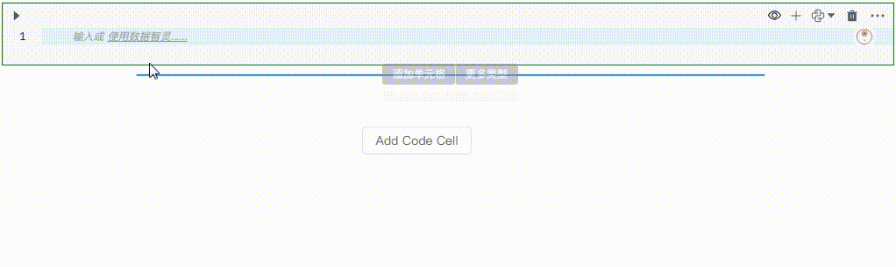
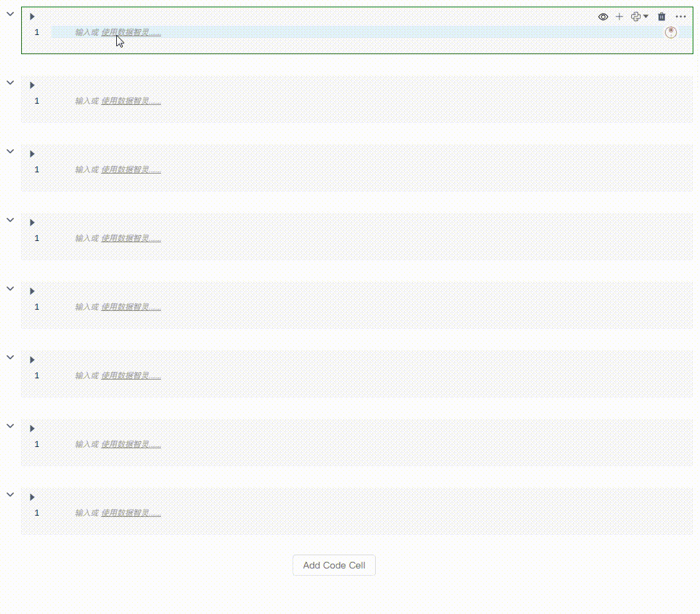
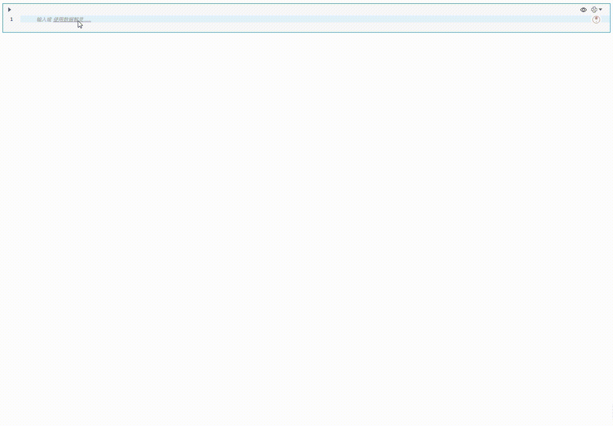
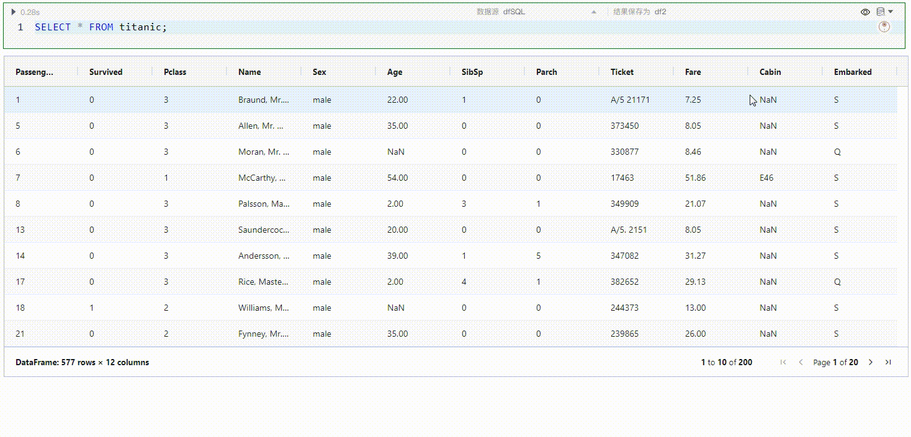
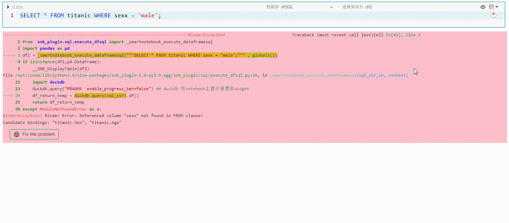
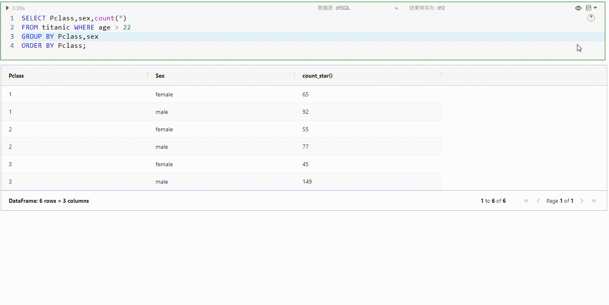
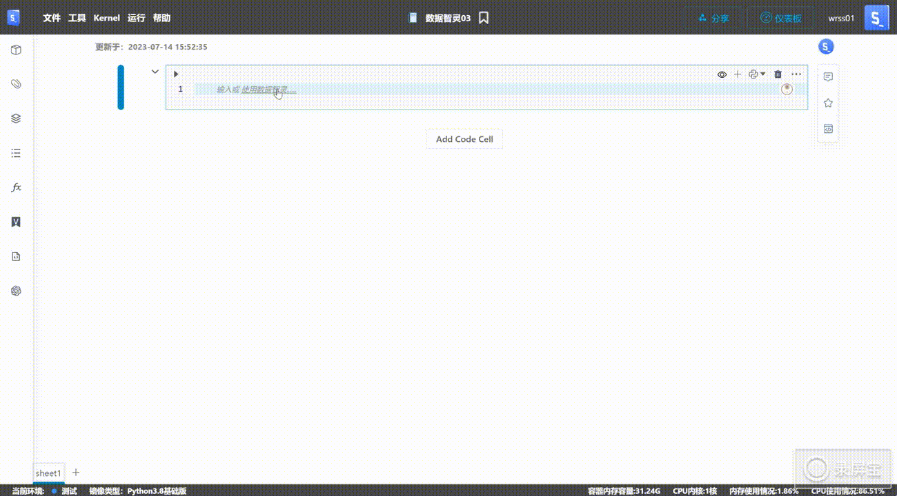
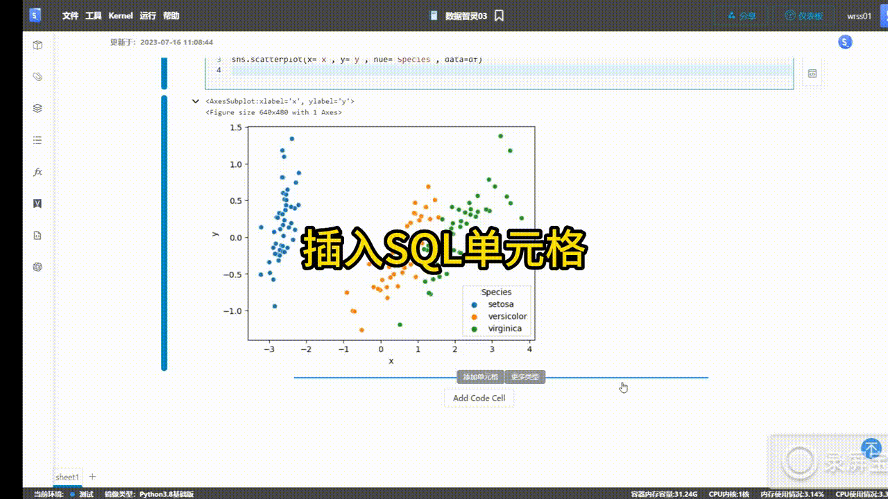

# 数据智灵(AI伴侣)
---

"数据智灵"是一个集成了一系列强大的人工智能驱动功能的工具，专为代码生成和编辑设计。不论您是需要生成Python或SQL代码，还是需要编辑和修复已有的代码，"数据智灵"都能够根据您的自然语言需求提供相应的帮助。

更重要的是，"数据智灵"能够生成详细的代码描述，这对于理解代码的功能和运行机制具有极大的帮助。不论您的编程经验如何，无论是初学者还是资深开发者，"数据智灵"都能有效地协助您完成各类代码任务，提高编程效率和准确性。

> [!warning|style:flat]
> "数据智灵"目前仍处于公开测试阶段，所以可能存在一些小问题和不完善。该功能属于实验性质，您不应该过分依赖人工智能生成的代码的准确性、完整性或无偏性。"数据智灵"的设计初衷是为了提升人类的洞察力和判断力，而非取代它们。因此在使用过程中仍然需要您，作为用户，点击运行按钮。"数据智灵"不会自动运行由AI生成的代码，因此判断所生成代码的正确性完全取决于您。在使用的过程中，请您始终保持谨慎，并结合自身的专业知识和判断力进行决策。

## 如何使用？

新建Python或SQL单元格，然后单击单元格中的文字链接`使用数据智灵...`或单击单元格右上角的数据智灵按钮  开始使用。

  

### 生成代码

单击单元格中的文字链接`使用数据智灵...`或单击单元格右上角的数据智灵按钮  并选择`生成代码`，然后在Prompt输入框中用通俗易懂的语言尽可能具体的描述你想要生成的代码内容，输入完成后，点击回车键。

生成完成后，您可以点击`应用`或`应用并执行`来使用新代码，也可以点击`丢弃`代码。

<!--    -->

例如：帮我用pyecharts生成一个折线图的例子，渲染到NoteBook。

  

### 编辑​代码

单击单元格左上角的`Generate`切换至`Edit`或单击单元格右上角的数据智灵按钮  并选择`编辑代码`，然后在Prompt输入框中用通俗易懂的语言尽可能具体的描述你想要修改的代码内容，输入完成后，点击回车键。

数据智灵生成完成后，您可以点击`应用`或`应用并执行`来使用新代码，也可以点击`丢弃`代码。

例如：筛选Sex为male的数据。

  

### 调试/修复​

当一个单元格返回错误时，您可以点击报错信息下方的  或单击单元格右上角的数据智灵按钮  并选择`调试/修复​`，数据智灵就会开始修复代码。

数据智灵生成修复后的代码完成后，您可以点击`应用`或`应用并执行`来使用新代码，也可以点击`丢弃`代码。

<!--    -->

例如：

  

### 生成注释

单击单元格右上角的数据智灵按钮  并选择`生成注释`。

数据智灵生成注释完成后，您可以点击`应用`或`应用并执行`来使用新代码，也可以点击`丢弃`代码。

  

## 数据隐私​

SNB非常重视您的数据隐私：

- **客户数据保护**：我们深知客户数据的价值和敏感性，数据智灵坚决不会将客户数据用于训练模型。所有数据在处理过程中都将被严格保密，我们不会无授权地使用、共享或出售您的数据。

- **第三方服务使用**：虽然数据智灵的一部分功能依赖于第三方服务（例如OpenAI），但我们保证所有通过第三方服务处理的数据都将符合严格的隐私保护标准。我们与第三方服务提供商的协议明确规定，他们无权使用、访问或保存您的任何数据。

- **数据加密**：为了进一步保护您的数据，所有存储在数据智灵的数据都将进行安全的加密处理，无论数据在传输还是存储过程中，都将受到最高级别的保护。

- **用户控制权**：您对自己的数据有完全的控制权，可以随时查看、修改或删除您的数据。如果您有任何疑问或需要支持，我们的客户服务团队将随时为您提供帮助。

- **法规遵从**：数据智灵严格遵守所有适用的数据保护法规，我们坚决致力于保护客户的数据隐私权益。

## Python示例

- 插入Python单元格

- 打开数据智灵(AI伴侣)，两种方式打开数据智灵，空单元内快速进入模式(`使用数据智灵....`)或单元格内智灵图标打开。

- Prompt输入框输入:使用pandas加载本地iris.csv文件，数据集名称为df. 然后回车提交,思考中...

- 生成的代码后，确认返回代码：然后我们点击应用代码

- 接受生成的代码，并执行

- 接下来依次操作,完成聚类分析: 将{{df}} 数值的四个字段进行降维度，降到2维，合并df数据集上，分别为x、y 列将{{df}}使用seaborn以Species为系列，分别以x,y为x、y轴生成散点图

整个操作过程：

  

## SQL示例

- 插入SQL 单元格

- 选择数据源(生成SQL会依赖部分的元数据：表结构,所以先设定数据源,作为生成SQL的上下文信息)

- 打开数据智灵，输入需求描述：查询表{{language}},并计算学生的总分

- 引用表的元数据,生成SQL

- 应用并执行,得到需要的数据

整个操作过程：

  
