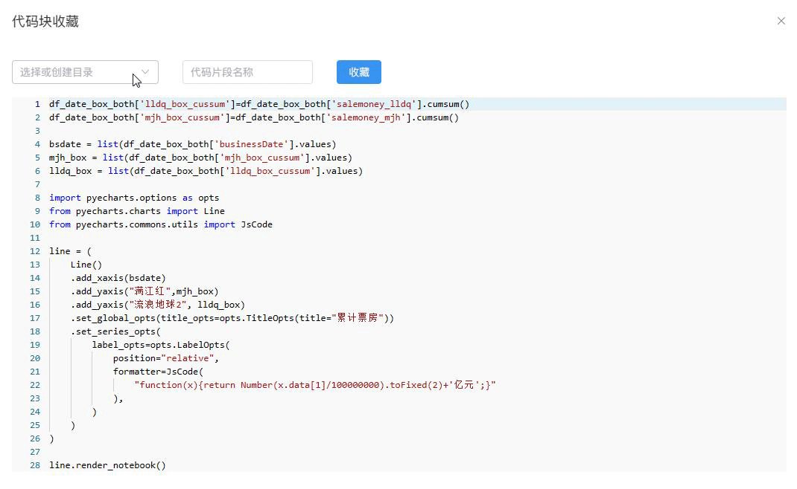
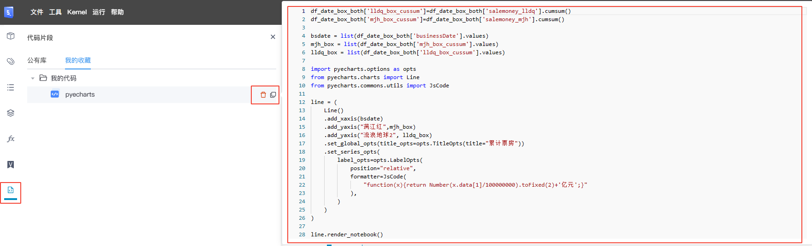

# 代码收藏
---

## 收藏代码

收藏单元格代码至代码片段仓库，以供复用或其他团队成员参考使用。

点击单元格右侧的 按钮。
 

选择代码目录（可在此页面创建新的目录），填写代码段名称和说明后，点击`收藏`

  

> [!Tip]
> 下方代码预览区域用户可对代码编辑和修改。

## 使用代码

收藏后的代码保存在侧边栏的`代码片段`--> `我的收藏`-->用户自己创建的目录下。

鼠标移至代码段列表上方将显示全部代码的预览界面。

可以点击代码片段右侧的操作按钮进行代码复制和删除。

<!--    -->

  
