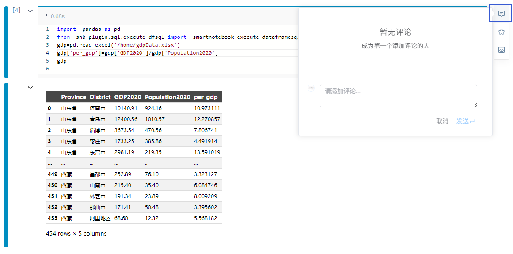
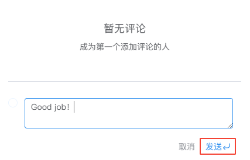
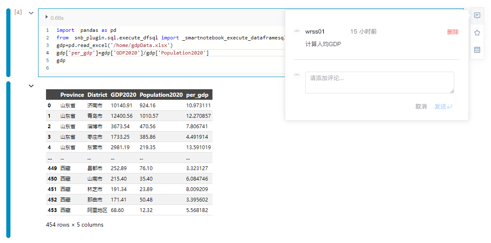

# 评论
---
团队成员在单元格上开展实时评论和协作，促进成员间的交流和合作，加速问题解决、知识分享和代码质量改进。
<!-- 同一WorkSpace下的成员可以在NoteBook单元格上开展评论。 -->

## 发表评论

点击单元格右侧的 按钮。

点击`发送`或回车：

  

> [!Tip]
> 评论按钮颜色 
会提示你在哪个单元格上有小伙伴发表了评论。

## 删除评论

用户可以删除自己发表的评论，鼠标移动到评论的右上角时可以进行`删除`

