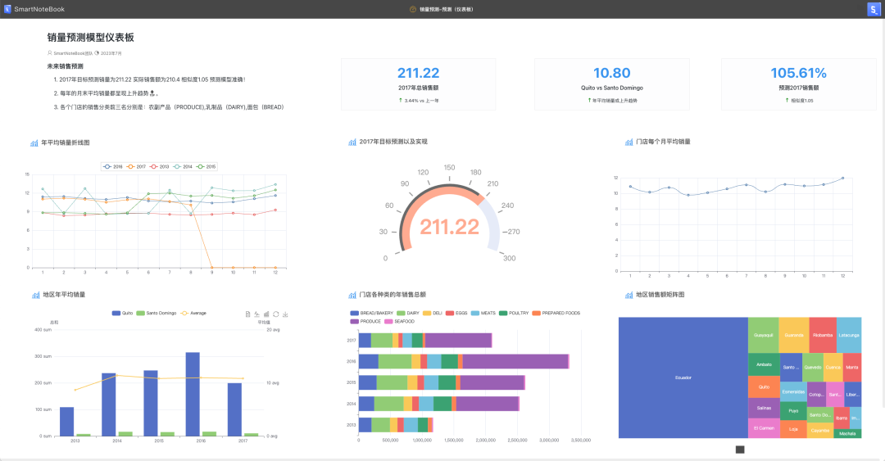

# 仪表板
---

仪表板（Dashboard）允许用户快速轻松地将逻辑视图中的元素组合成任何人都可以使用的交互式、美观的 Web 应用程序。提供一个直观的图形化界面，可以展示和解析大量的数据。它可以将复杂的数据集转化为更易理解的图表和图形，使得业务决策者能够迅速理解数据，并据此做出决策。

通过仪表板我们可以将原始数据转化为可行的见解和战略成果来提升你的决策过程

一个仪表板可以包含多种类型的视图，例如条形图、饼图、折线图、地图、表格等等。这些视图都是由数据驱动的，可以实时或定期更新。仪表板可以展示各种关键性能指标（KPI），比如销售额、客户满意度、员工绩效等。

<!-- 
用户可以通过交互式操作，比如过滤、钻取、切片和切块等来查看不同的数据视角和层级。这使得用户能够深入理解数据，发现数据的趋势和模式。 -->

  

仪表板主要特征如下：

- 支持将NoteBook中各种类型单元格输入、输出添加到仪表板
- 可通过拖拽或属性设置来改变图表的大小、位置甚至角度，实现自由布局
- 灵活的自定义设置功能（例如设置元素大小、背景颜色、背景颜色及水印等）
- 支持预览、分享和嵌入到数据应用或数据门户
- 通过调度计划定期更新仪表板数据
- 支持交互组件的动态刷新、数据下钻（功能开发和测试中）

## 创建/修改仪表板

要创建/修改仪表板，请打开相对应的NoteBook。在右上角点击，弹出仪表板的设计界面。

> [!NOTE]
> 请注意，每个NoteBook只能创建和发布一个仪表板。如果您需要发布多个仪表板，请将您的NoteBook复制多个副本来实现。

## 操作按钮

| 图标 | 操作 | 解释 |
| :-----| :-----| :---- |
|  | 画布设置 | 对画布属性进行配置，如像素大小，背景设置等 |
|  | 小地图 | 打开/关闭画布小地图 |
|   | 上一步 | 回退到上一步的画布状态 |
|   | 下一步 | 前进到下一步的画布状态（用户之前有做上一步的操作） |
|   | 清空画布 | 清空画布中的所有组件 |
|   | 适应屏幕 | 画布自适应调整到合适的大小和位置 |
|   | 隐藏左侧菜单 | 隐藏/显示左侧的操作按钮 |
|   | 隐藏右侧菜单 | 隐藏/显示左侧的操作按钮 |
|   | 保存 | 保存当前画布的状态 |
|   | 预览 | 生成预览链接，预览仪表板内容 | 
|   | 发布/更新发布 | 仪表板设计完成/修改后生成发布链接 |
|   | 关闭 | 关闭仪表板界面（重新打开显示最后保存的画布内容） |

## 画布设置

点击  可以对画布大小、背景及水印进行设置。

  

## 小地图

点击  可开启/关闭小地图显示。

  

## 预览

设计完成后，可以先点击  查看效果。

  

## 发布/更新发布

点击 可以发布正式的仪表板链接。

用户可以直接通过打开链接在网络浏览器中实时查看和互动这个仪表板。此外，这个链接也可以轻松地嵌入到其他应用程序中，为您的业务流程提供即时的数据洞察。如果需要，您也可以将此链接投射到大屏幕上，以便在团队会议或演示中展示数据。这种多元化的展示方式为数据分析带来前所未有的灵活性和方便性，让您可以随时随地获取到最新、最准确的业务洞察。

每当您对仪表板进行更改时，您的仪表板都不会自动重新发布。您需要在更改完之后重新保存并 “更新发布”。

> [!NOTE]
> 已发布的仪表板的 URL 在更新发布后保持不变，因此您不必担心重新共享或在应用中修改URL的问题。

## 拖动/旋转 

<!--   

   -->

选中元素后可以按下鼠标拖动到合适的位置。

点击元素左上角的圆点并按下鼠标可以调整元素的角度。

  

## 元素设置

双击画布中的元素可以对元素的相关属性（像素大小、位置、层级和旋转角度）进行配置。

<!--    -->

  

<!-- 
您可以使用右侧的拖动手柄从左侧的“轮廓”面板中拖放元素。或者，您可以使用每个元素上的“添加到应用程序”按钮。 -->

## 案例展示（销售KPI仪表板）

  
