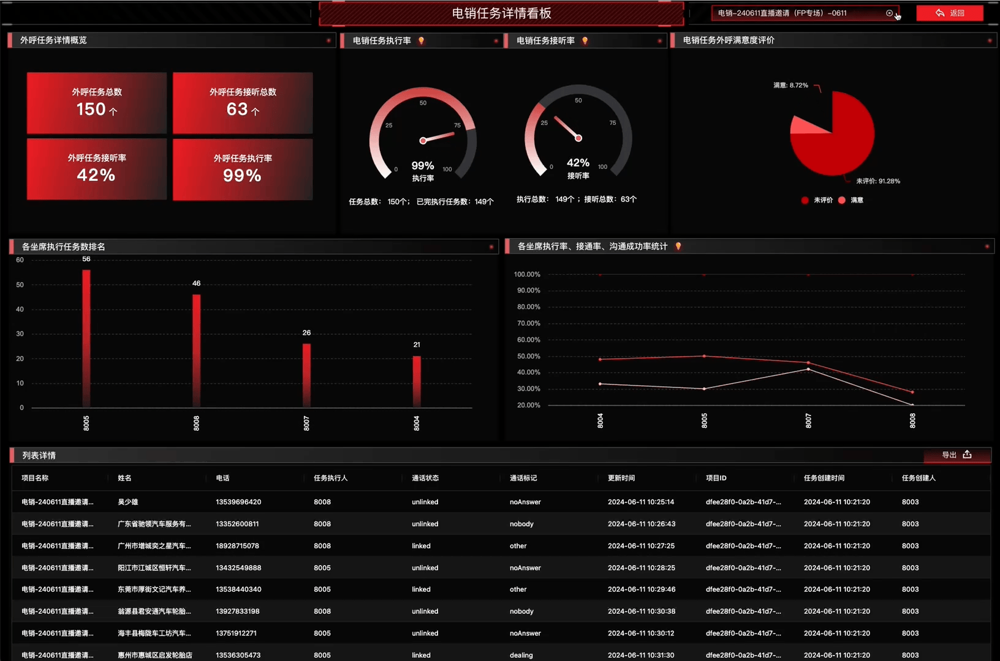
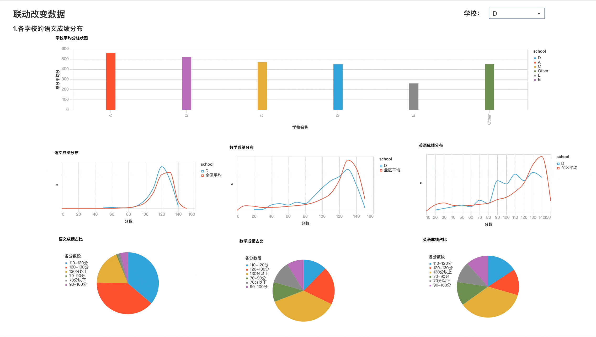
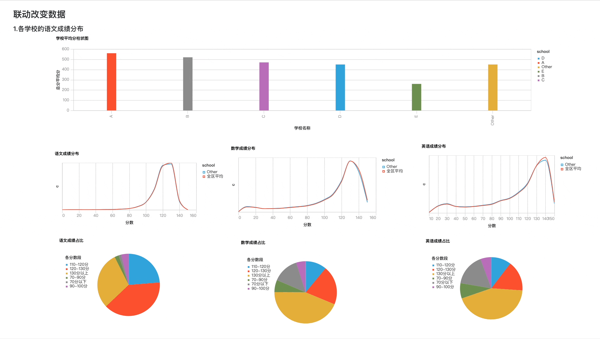
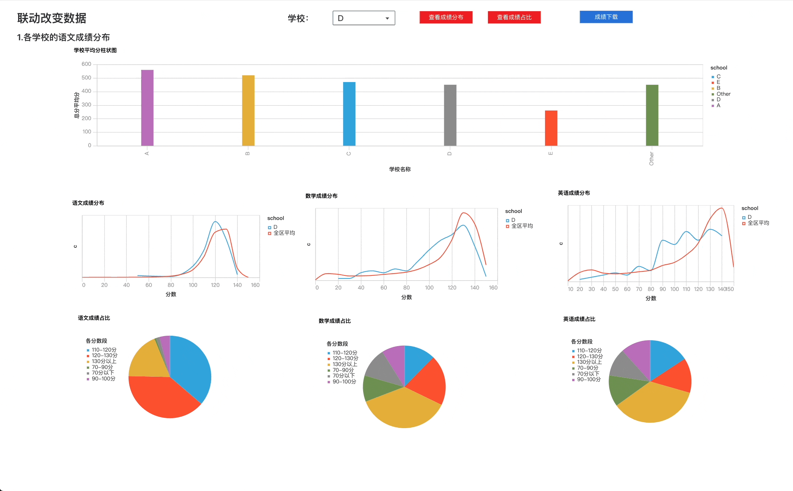

# 高级交互仪表板配置

---

基础仪表板是一种简化的仪表板应用，主要用于定期展示数据图表和文字说明。通过Notebook调度，仪表板可以定期生成和更新，而无需用户进行页面交互。

除了基础功能外，仪表板还可以满足更高级的交互需求：
# 示例
## 1. 条件筛选与时间范围联动
演示示例 通过设置条件筛选和时间范围，可以动态展示数据的变化规律。
<video tabindex="0" controls class="video-stream html5-main-video" controlslist="nodownload" style="width: 1200px; height: 620px; left: 0px; top: 0px;">
  <source src="../assets/dashboard/202406201158.mp4" type="video/mp4">
  Your browser does not support the video tag.
</video>

## 2. 图表联动
演示示例 点击地图的某区域，根据该区域条件联动其他相应的图表，展示在特定条件下的数据变化。
   
<video tabindex="0" controls class="video-stream html5-main-video" controlslist="nodownload" style="width: 1200px; height: 620px; left: 0px; top: 0px;">
  <source src="../assets/dashboard/2024062011581.mp4" type="video/mp4">
  Your browser does not support the video tag.
</video>

## 3. 条件跳转
 演示示例 点击图表后，根据设定的过滤条件跳转到不同的仪表板页面，以展示更加详细的数据和分析。

  ### 3.1 **点击图表跳转**
  <video tabindex="0" controls class="video-stream html5-main-video" controlslist="nodownload" style="width: 1200px; height: 620px; left: 0px; top: 0px;">
    <source src="../assets/dashboard/2024062011582.mp4" type="video/mp4">
    Your browser does not support the video tag.
  </video>

  ### 3.2. **点击按钮跳转**
  
    

---

# 操作
## 1. 条件筛选
- 1.把互动组件添加到 左侧的仪表板中。
- 2.双击要关联互动的单元格。
- 3.弹出右侧抽屉，点击组件交互
- 4.设置关联互动单元格：引用互动组件（引用其它组件的全局变量）；执行单元格（改变当前组件的值，需要执行的单元格）
- 5.保存并预览
- 6.发布
  
   <video tabindex="0" controls class="video-stream html5-main-video" controlslist="nodownload" style="width: 1200px; height: 620px; left: 0px; top: 0px;">
      <source src="../assets/dashboard/2024062011585.mp4" type="video/mp4">
      Your browser does not support the video tag.
    </video>

> [!NOTE]
> 请注意，每个互动组件都关联全局唯一一个python的全局变量。仪表板中互动组件关联的单元格必须有引用该变量，如果没引用即使刷新该组件数据也不起效果。

------------------

## 2. 日期筛选和交互组件联合查询
- 1.把互动组件都添加到 左侧的仪表板中。
- 2.双击要设置关联互动的单元格。
- 3.弹出右侧抽屉，点击组件交互
- 4.设置关联互动单元格：引用互动组件（引用其它组件的全局变量）；执行单元格（改变当前组件的值，需要执行的单元格）
- 5.保存并预览
- 6.发布
  
   <video tabindex="0" controls class="video-stream html5-main-video" controlslist="nodownload" style="width: 1200px; height: 620px; left: 0px; top: 0px;">
      <source src="../assets/dashboard/2024062011586.mp4" type="video/mp4">
      Your browser does not support the video tag.
    </video>

> [!NOTE]
> 请注意，每个互动组件都关联全局唯一一个python的全局变量。仪表板中互动组件关联的单元格必须有引用该变量，如果没引用即使刷新该组件数据也不起效果。

## 3. 当前仪表板图表联动
  交互组件联合查询我们上面图例已经介绍了，如下示例：
    

  当我们需要点击图表，达到我们选择筛选组件的效果：如下图
   

- 1.把互动组件都添加到 左侧的仪表板中。
- 2.双击要设置关联互动的单元格。
- 3.弹出右侧抽屉，点击组件交互
- 4.设置《图表单击关联互动单元格》
- 5.保存并预览
- 6.发布  

<video tabindex="0" controls class="video-stream html5-main-video" controlslist="nodownload" style="width: 1200px; height: 620px; left: 0px; top: 0px;">
  <source src="../assets/dashboard/20240620115899.mp4" type="video/mp4">
    Your browser does not support the video tag.
</video> 

## 4. 按钮跳转链接 => 带查询条件
  按钮跳转带查询条件如下示例：
<video tabindex="0" controls class="video-stream html5-main-video" controlslist="nodownload" style="width: 1200px; height: 620px; left: 0px; top: 0px;">
  <source src="../assets/dashboard/202406241442.mp4" type="video/mp4">
    Your browser does not support the video tag.
</video> 

- 1.把互动组件都添加到 左侧的仪表板中。
- 2.双击要设置关联互动的单元格。
- 3.弹出右侧抽屉，点击组件交互
- 4.设置按钮的交互操作
- 5.保存并预览
- 6.发布 
   
<video tabindex="0" controls class="video-stream html5-main-video" controlslist="nodownload" style="width: 1200px; height: 620px; left: 0px; top: 0px;">
  <source src="../assets/dashboard/202406241525.mp4" type="video/mp4">
    Your browser does not support the video tag.
</video> 

## 5. 图表点击跳转不同报表
 如下示例：
<video tabindex="0" controls class="video-stream html5-main-video" controlslist="nodownload" style="width: 1200px; height: 620px; left: 0px; top: 0px;">
  <source src="../assets/dashboard/202406241735.mp4" type="video/mp4">
    Your browser does not support the video tag.
</video> 

设置操作如下：
<video tabindex="0" controls class="video-stream html5-main-video" controlslist="nodownload" style="width: 1200px; height: 620px; left: 0px; top: 0px;">
  <source src="../assets/dashboard/202406241753.mp4" type="video/mp4">
    Your browser does not support the video tag.
</video> 

## 6. 按钮下载
 按钮点击下载DF 如下示例：
   

设置操作如下：
<video tabindex="0" controls class="video-stream html5-main-video" controlslist="nodownload" style="width: 1200px; height: 620px; left: 0px; top: 0px;">
  <source src="../assets/dashboard/202406241623.mp4" type="video/mp4">
    Your browser does not support the video tag.
</video> 
