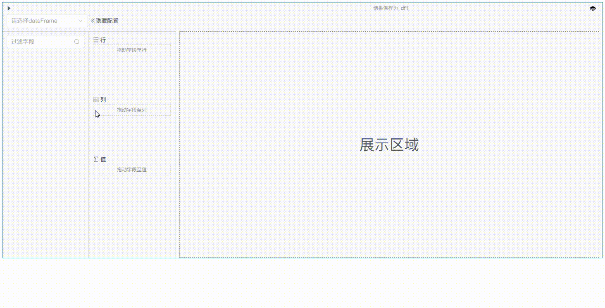
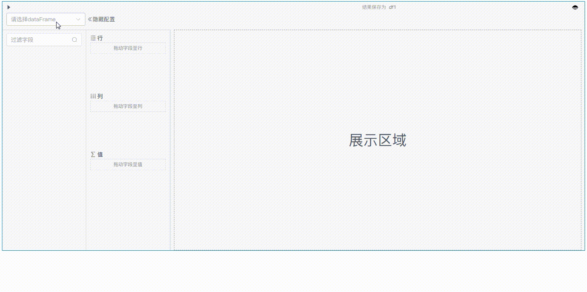
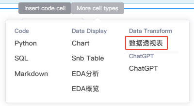
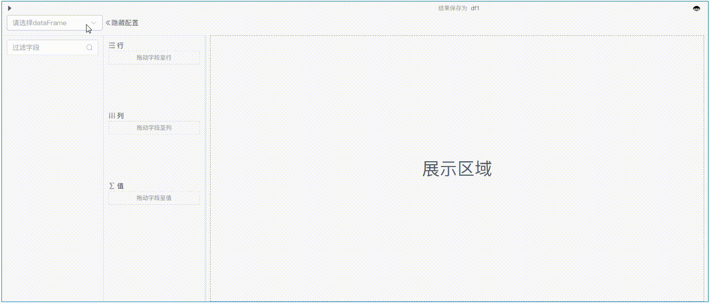
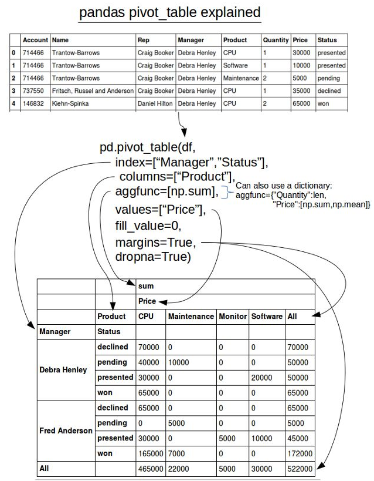

# 数据透视表

<!-- 7101752 -->

---

数据透视表组件允许用户以零代码可视化的方式快速汇总和分析大量数据。使用数据透视表可以按照数据的不同字段从多个角度进行透视，查看数据不同层面的汇总信息、分析结果以及摘要数据。

使用数据透视表可以深入分析数值数据，以帮助用户发现关键数据，并作出有关企业中关键数据的决策。

数据透视表将DataFrame作为输入，根据您的配置对其进行聚合，并返回输出一个DataFrame的数据对象，该数据对象可以在应用中预览和显示或在NoteBook后续单元格中使用。

<!--    -->

  

## 创建数据透视表组件

- 鼠标移动至代码块的下边界，当显示悬浮操作框时，单击`更多类型`，然后选择`数据透视表`：
    
<!--    -->
  

### 基本操作

- 从左上角DataFrame数据源下拉框中选择需要转换的df，其所有列名将显示在左侧的字段选择列表中

- 将字段从选取列表中拖动到对应的配置中
  - 行：作为聚合依据的字段，垂直呈现
  - 列：作为聚合依据的字段，水平呈现
  - 值：选择需要聚合和计算的字段，并设置计算方式
 
  

- 完成配置后，点击左上角的运行单元格，右侧区域可预览处理后的数据对象（如需修改输出的df变量名称，可在运行前进行修改）

> [!Tip]
> 如要聚合的DataFrame包含字段过多，可以利用左侧的`过滤字段`去模糊搜索匹配所需字段后再拖入右侧的配置区域。

## 例子

按销售日期和商品类别统计销售额：

  

## 数据透视表的原理

可参考Pandas中关于pivot_table的解释:

  
    