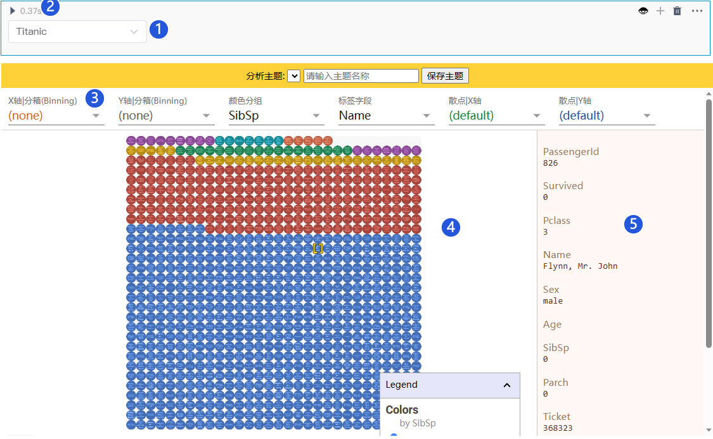
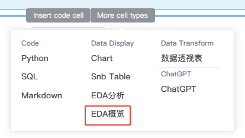

# EDA组件

<!-- 7101752 -->
---

EDA 是 Exploratory Data Analysis（探索性数据分析）的缩写。

EDA 是数据分析过程中的一项重要任务，旨在通过可视化和统计方法来理解数据集的特征、结构和关系，揭示数据中的模式、异常和潜在关联。通过对数据进行探索性分析，可以获取关于数据集的初步认识，为后续的建模、假设检验和预测建立基础。

EDA 通常涉及以下任务：

- 数据质量检查：检查数据集中是否存在缺失值、异常值或错误数据，并进行处理。
- 描述性统计分析：计算数据集的基本统计指标（如均值、中位数、标准差等）以及数据的分布情况。
- 数据可视化：使用图表、图形和图像等可视化工具展示数据的特征，以发现模式、趋势、异常值等。
- 相关性分析：探索数据变量之间的关系，通过计算相关系数或绘制散点图等方法来了解变量之间的相关性。
- 特征工程：识别和构造合适的特征，以提高后续分析或建模的效果。

## EDA分析组件

<!-- EDA分析组件提供用户用可视化的方式理解和分析机器学习数据集。

使用EDA分析组件能够快速探索数据集特征的分布情况，帮助用户以不同粒度查看数据的整体情况。 -->

<!-- EDA分析组件提供了一个交互式界面，用于探索数据集所有不同特征的数据点之间的关系。

可视化交互图表中的每个单元代表一个数据点。用户可通过按特征值在多个维度上对数据点进行分析和探索。 -->

EDA分析组件提供了一个直观的可定制界面，用于探索数据集内不同特征的数据点之间的关系。使用EDA分析组件，您可以根据每个数据点的特征值来控制它的位置、颜色和视觉效果。

  

### 创建EDA分析组件

鼠标移动至单元格的下边界，当显示悬浮操作框时，单击`更多类型`，然后选择`EDA分析`。

<!--    -->

  

### 基本操作

为学习EDA分析组件的基本操作，我们用一个简单的操作案例来体验。

例：通过EDA分析组件从不同维度探索泰坦尼克船上人员的分布情况：

  

可以看到EDA组件有三个主体区域

- 顶部 —— 控制工具栏
- 中间 —— 主可视化区域
- 右侧 —— 数据点信息面板

**EDA分析组件基本的操作流程如下：**

0.创建EDA分析单元格 
1.下拉选择您要探索的DataFrame 
2.点击运行 
3.使用控制工具栏中的控件来驱动探索 
4.观察主可视化区域的分析结果 
5.点击数据点，右侧信息面板显示详细信息 

<!--  -->
  

### 单变量分析
 

这里我们将分别地查看目标变量，即 Survived（是否生还） 和其它的分类特征如sex（性别）、Pclass（船舱等级）、（age）年龄分箱等。当然，你也可以看看其它特征。

  

推论：

- 数据集中的女性生还人数比例较高
- 一等舱和二等舱相比三等舱生还人数比例较高
- 0-10岁儿童的生还比例较高

<!-- Dive有三个区域。顶部的控制工具栏、主可视化和数据点信息面板。
一旦数据被加载到可视化中，用户就可以通过操纵工具栏中的控件来驱动探索。共有四个部分，单击时每个部分都会展开。它们是镶嵌、颜色、显示和定位。
镶嵌面控件
Dive的主要功能是以网格形式排列记录。这被称为镶嵌，有两个方向可以独立控制：垂直（基于行）和水平（基于列）方向。
当您在任一方向上选择要镶嵌的特征时，Dive将根据该特征对项目进行挖掘。对于数值，Dive将数值范围划分为大小相等的数字段。对于字符串值，Dive将共享相同字符串值的项目放在一起，如果太多，则将这些项目放在标记为“其他”的桶中。
此外，包含空格的字符串值可以被视为一个无差别的单词包。当用户选中单词袋框时，Dive会根据最常用的单词将项目放在一起进行排列。这项功能将来可能会被彻底更改或删除。
定位控制装置
默认情况下，Dive将通过堆叠项目来排列网格的每个单元格中的项目。或者，可以将项目放置在散点图中。当“镶嵌面”设置为（无）时，这是最有用的。
具有数值的特征可用于散点图定位。值不是数字的任何项目仍将显示，但该值将强制为零。
颜色控制
使用“颜色控制”可以指定用于为各个项目着色的字段。
如果没有指定精灵图谱，Dive将选择一个特征进行着色。选择算法会优先考虑具有少量唯一值的特征，例如分类特征。
显示控件
使用“显示控制”（Display Controls）可以指定“分段”（Dive）将渲染到每个点上的内容。如果已经指定了精灵图谱，则Dive将默认显示每个点的精灵。如果不是，则Dive将选择其值最唯一的特征，然后将这些字符串渲染为圆形背景顶部的文本。
无论是否使用精灵图集，都可以使用“显示”下拉菜单以交互方式控制渲染到点的功能。 -->

### 双变量分析
 

我们再来找找目标变量和分类自变量（Survived）之间的关系。

  

推论：

- 女性生还希望更大
- 乘坐一等舱的生还希望更大
- 从年龄来看没有太明显的分别，相比较而言0-10岁儿童生还希望较大
  
## EDA概览

对于一个数据分析师来说，项目开始的第一步总是数据探索性分析(EDA)。但我们知道EDA通常都很繁琐和无趣，而EDA概览组件能够轻松生成一份数据分析报告。

这份报告中包含常用的数据分析指标：例如数据的形状、缺失值、各个变量的分布及变量之间的相关性等指标，以一种非常直观的形式反映数据的健康程度，为数据分析师提供大量的时间用于特征工程和建模。

### 创建EDA概览

鼠标移动至单元格的下边界，当显示悬浮操作框时，单击`更多类型`，然后选择`EDA概览`。

<!--    -->
  

### 基本操作

0.创建EDA概览单元格 
1.下拉选择您要探索的DataFrame 
2.点击运行 
3.查看EDA分析报告 

  

<!-- 1. 下拉框选择数据集。
2. 数据集总览。
3. 各特征变量的值分布。
4. 散点分布图。
5. 相关系数。
6. 缺失值统计。
7. 样例记录。 -->

<!--  -->

数据分析报告中总共包含六部分：分别是概要、各个变量的详细信息、变量交互、相关性、缺失值、样本。

#### 概要（Overview）

概要提供对数据集的静态描述：包含特征、数据、缺失值、重复行的数量和占比，总数据及平均每条数据所占用内存的大小，变量的数据类型等信息。

  

`Alerts` 展示数据的警示信息。包含重复行占比、哪些变量具有很高的相关性、数据是否均匀分布等信息。

  

#### 变量信息（Variables）

变量信息集成了pandas 的 info、describe 等基础功能，提供了友好的界面，对每一个变量进行详细的统计，为数据分析师减轻了不少工作量。

变量信息能够统计数据集中所有的变量共有多少个不同的值以及占总数据量的比例，缺失值、无穷、均值、最小最大值、0的个数、每个特征占的内存大小。

  

`More details` 按钮能够切换详细信息，提供了变量的分数位统计信息、直方图、每个值出现的次数、极端值出现的次数等信息。

  

#### 变量交互（Interactions）

变量交互可以绘制变量之间的散点图或者其它图像，可以直观分析变量间的相关性。

  

#### 相关性（Correlations）

相关性通过绘制热力系数图，直观反映变量之间的相关性，集成了pandas 的 corr 和 sns 的heatmap功能，提供了各个方法的计算原理。

  

`Table` 用来显示变量之间的相关性系数。

  

#### 缺失值（Missing values）

缺失值：用图形的方式直观的反映哪些变量含有缺失值，以及缺失值之间的关系。

  

#### 样本（Sample）

展示前十行和后十行的样本

  
