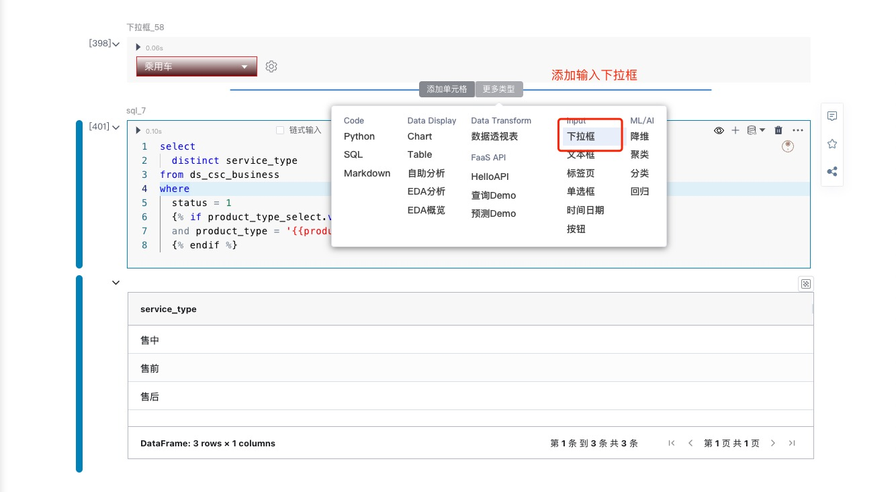
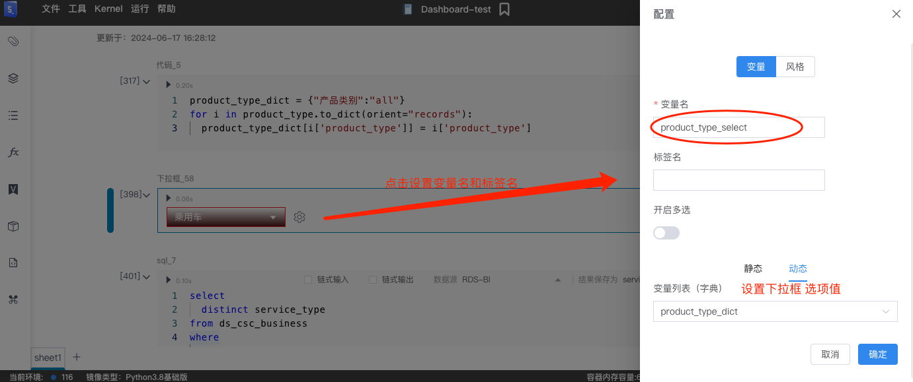

# 输入单元格（交互组件）

---

输入单元格 输入参数是SmartNoteBook的核心独特部分。
  ```
    可以在Notebook视图中创建输入参数，然后根据需要将其添加到仪表板或者报告中。
  ```

---

## 添加输入单元格（Input）
  输入单元格是添加不同用户输入以用作代码和 SQL 块中的变量的好方法。<br />
  添加输入单元格，您可以调整各种设置，例如变量名称和显示名称。探索给定输入类型的更多选项。


## 插入输入组件
  添加输入单元格，选择要插入的输入单元格类型

  
## 设置输入组件的属性
  点击输入组件的设置按钮，右侧弹出抽屉设置属性：<br/>
    一般包含标签名仪表板中要显示的名称和Python变量名称的下文引用参数名。<br />

    变量名: Python变量的名称，以及在项目下游引用输入参数输出的方式。

  

## 设置输入组件的样式显示
  点击输入组件的设置按钮，右侧弹出抽屉风格标签：<br/>

  

## 参考输入
  
  输入存储为 Python 变量，例如，input_1可以在整个项目中引用，就像其他变量一样。

  输入变量不能重新赋值，例如，input_1 = 123不会有效地将参数重新赋值给123。相反，您将创建一个新变量，该变量与输入参数无关，其名称input_1和值为123。

  可以使用Jinja在 SQL 单元格中引用输入，使用类似 的语法{{ input_1 }}。有关此示例，请参阅我们关于参数化 SQL 查询的教程。


  ## 输入单元格
   
   - <a href="/NoteBook/InputParams/selectInput.md">下拉框</a>
   - <a href="/NoteBook/InputParams/textInput.md">文本框</a>
   - <a href="/NoteBook/InputParams/tabInput.md">标签页</a>
   - <a href="/NoteBook/InputParams/radioInput.md">单选框</a>
   - <a href="/NoteBook/InputParams/timeInput.md">时间日期</a>
   - <a href="/NoteBook/InputParams/buttonInput.md">按钮</a>