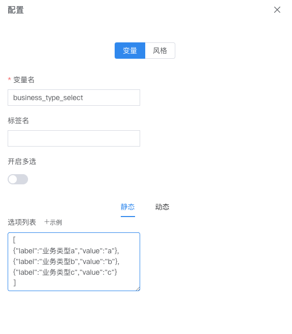
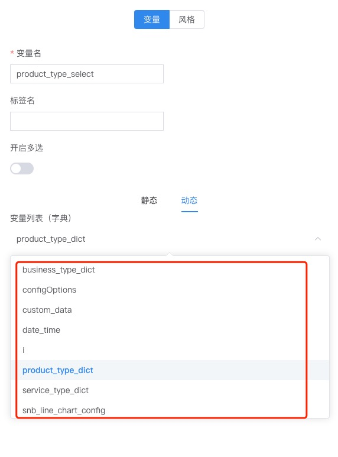
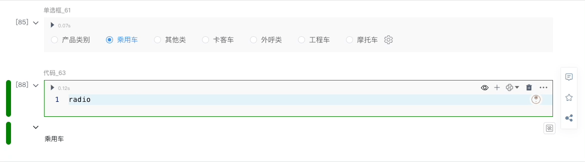

# 单选框输入

---

根据用户从枚举数字或字符串列表中选择的单个值来参数化您的分析。

---

## 静态
  静态值是手动输入的。<br />
  - 数组的集合
  - label是下拉框显示的名称
  - value是下拉框python变量引用的值

   ```
    [{"label":"业务类型a","value":"a"},{"label":"业务类型b","value":"b"},{"label":"业务类型c","value":"c"}]
   ```



## 动态
  动态值允许您将下拉列表的可用选项从代码本身链接到数据框列、列表、numpy 数组或 Pandas 系列。




 示例

