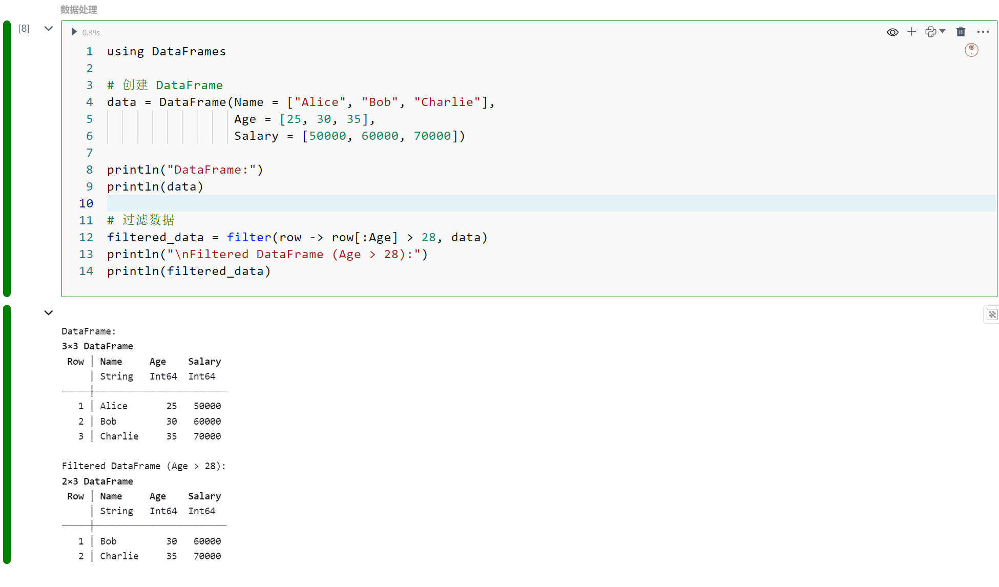

# Julia计算引擎
Julia语言是一种高性能的编程语言，专为数值和科学计算而设计。它于2012年发布，旨在结合C和Fortran的速度与Python和R的易用性。Julia支持并行和分布式计算，拥有丰富的数值函数库和优越的性能，特别适合大规模数据处理、机器学习、模拟和统计计算。其多重派发机制和强大的类型系统使得代码既高效又灵活。Julia语言在科学研究、金融分析、数据科学等领域日益受到青睐。

# Julia计算引擎的安装配置
SmartNotebook默认的部署镜像内没有内置Julia计算引擎，需要Node环境中进行安装Julia和IJulia包。
## 1.安装Julia
```
wget https://julialang-s3.julialang.org/bin/linux/x64/1.10/julia-1.10.4-linux-x86_64.tar.gz
tar -xvf julia-1.10.4-linux-x86_64.tar.gz 
mv julia-1.10.4 /usr/lib/
PATH=$PATH:/usr/lib/julia-1.10.4/bin/
export PATH
```
  
## 2.安装IJulia：进入julia终端，按`]` 进入包管理模式，进入下面的命令
```
add IJulia
```
  

## 3.修改julia kernel 名称为统一为julia，smartnotebook默认为julia，而不是julia-1.10
```
mv /root/.local/share/jupyter/kernels/julia-1.10 /root/.local/share/jupyter/kernels/julia
```
## 4.查看kernel list：
```
jupyter kernelspec list
```
kernel list 参考信息如下：
``` 
Available kernels:
  julia    /root/.local/share/jupyter/kernels/julia-1.10
  ir            /usr/local/share/jupyter/kernels/ir
  python3       /usr/local/share/jupyter/kernels/python3
```


# 创建NoteBook

在`新建NoteBook`对话框中"选择计算引擎(Kernel)类型"为“Julia”的选项。

输入`NoteBook标题`并选择对应的环境，点击提交完成创建。

  
 

> [!warning|style:flat]
> 成功创建NoteBook后，用户无法在不同的kernel语言类型之间切换。


SNB对其他Julia内核的支持仍处于早期阶段，有些功能尚不完善，例如变量资源管理器、SQL单元格、模型视图及低代码插件不支持。


## 当前支持的功能

- MarkDown 单元格
- 收藏
- 评论
- 资源和文件管理
- 大纲目录
- 环境及调度任务
- 版本管理
- 代码仓库
- 单元格的状态
- 代码格式
- 单元格代码补全
- 团队协作编辑
- 终端
- 快捷键支持

## Hello Julia 示例
```
println("Welcome to Julia world of SmartNoteBook \n")
```
  

# Julia的探索
下面是基本5段Julia语言代码示例，分别涵盖基本操作、数据集操作、统计分析、可视化和机器学习。以下是代码示例：

##  1.基本操作
```
# 基本数学运算
a = 10
b = 5

sum = a + b
difference = a - b
product = a * b
quotient = a / b

println("Sum: $sum, Difference: $difference, Product: $product, Quotient: $quotient")

# 创建数组
arr = [1, 2, 3, 4, 5]
println("Array: ", arr)

# 循环与条件语句
for i in arr
    if i % 2 == 0
        println("$i is even")
    else
        println("$i is odd")
    end
end
```
  

## 2.数据处理
```
using DataFrames

# 创建 DataFrame
data = DataFrame(Name = ["Alice", "Bob", "Charlie"],
                 Age = [25, 30, 35],
                 Salary = [50000, 60000, 70000])

println("DataFrame:")
println(data)

# 过滤数据
filtered_data = filter(row -> row[:Age] > 28, data)
println("\nFiltered DataFrame (Age > 28):")
println(filtered_data)
```
  

## 3.可视化
```
using Plots

# 基本绘图
x = 1:10
y = rand(10)

# 散点图
scatter(x, y, title = "Random Scatter Plot", xlabel = "X-axis", ylabel = "Y-axis")

# 折线图
y2 = rand(10)
plot(x, y2, title = "Random Line Plot", xlabel = "X-axis", ylabel = "Y-axis", label = "Line 1")

# 组合图
plot!(x, y, seriestype = :scatter, label = "Scatter 1")
```
  

## 4.安装包示例
```
using Pkg
Pkg.add("DataFrames")
Pkg.add("Plots")
```
  
