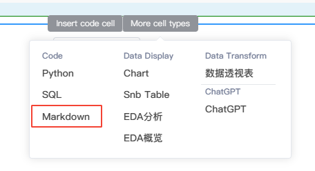
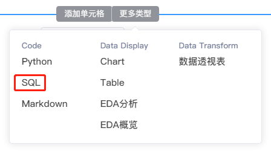
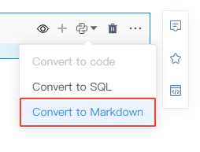
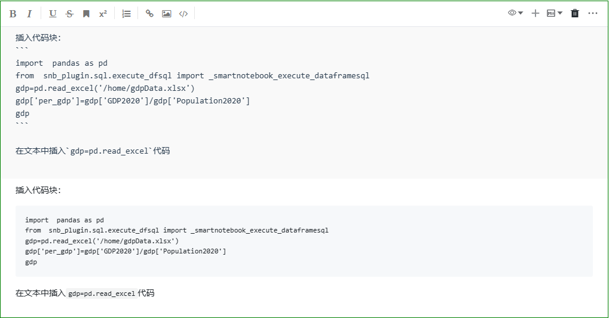
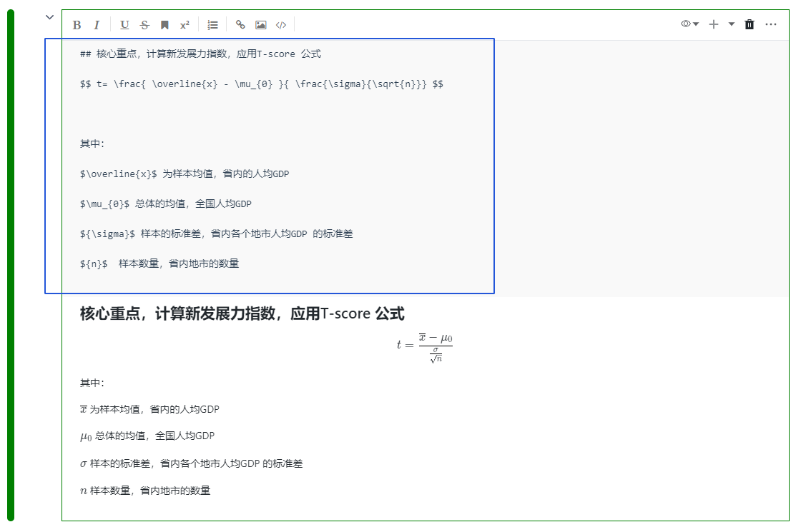
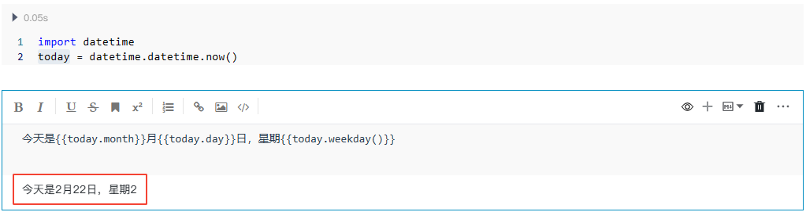
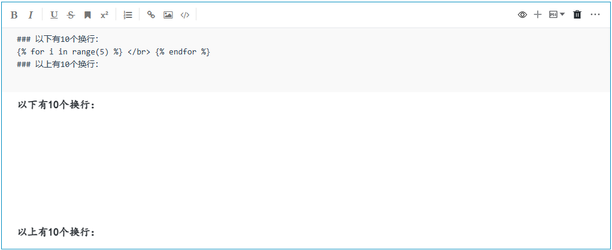
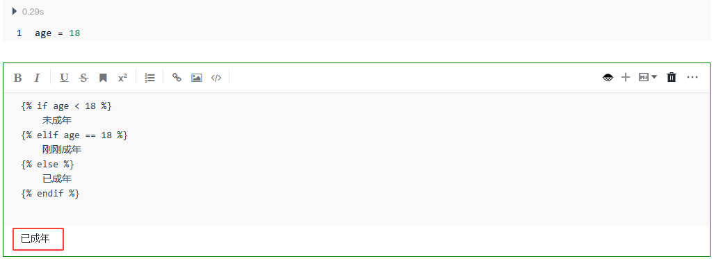
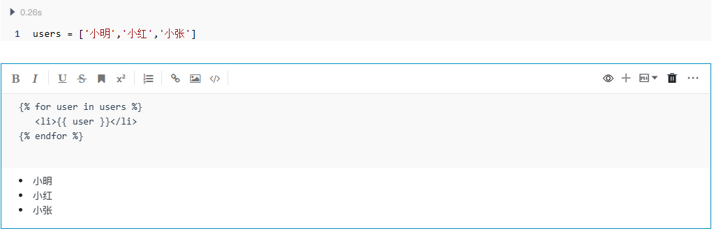
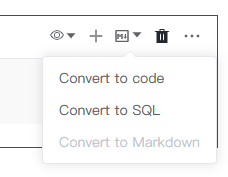

# MarkDown单元格

<!-- 7101752 -->
---
MarkDown单元格为我们提供了一个熟悉的、所见即所得的MarkDown编辑器环境。

Markdown单元格允许用户编写纯文本并使用Markdown语法规则设置格式。此外还支持标准的LaTex数学公式和符号，因此可以非常方便的在文本中插入数学符号。

Markdown单元格通常用作代码的解释性或描述性文本，此外SmartNoteBook还会根据MarkDown的标题结构和层级帮助我们自动生成大纲目录，方便我们快速掌握文档结构。

  

## 创建MarkDown

创建MarkDown的两种方法：

* 鼠标移动到单元格的下方，当显示悬浮操作框时，单击`更多类型`，然后选择`MarkDown`。
<!-- 
   -->

<!--    -->
  


* 直接单击单元格右上角的 `+` 号或者单元格下方的`Add Code Cell`，然后点击右上角的，选择`Convert to Markdown`。

  


## MarkDown的操作

<!-- https://markdown-zh.readthedocs.io/en/latest/spanelements/ -->

* 编写MarkDown

如果熟悉MarkDown的语法规则，您可以直接在编辑框中书写MarkDown代码；如果不太熟悉，也可以借助上方的快捷工具栏来辅助您调整格式、上传图片以及嵌入链接等。下方会提到几个例子帮您熟悉MarkDown的语法。

* 执行单元格

MarkDown编写完成后无需执行，将鼠标移动至单元格以外即可保存和显示。


* 添加标题

Markdown中的标题有六个等级，分别是从一级到六级。

我们通过在标题名字前面加井号`#`，一个`#`表示一级标题、两个`#`号表示二级标记，依次类推，六个`#`号表示六级标题。其中一级标题字体最大，六级标题字体最小，各等级标题的渲染效果如下：


| Markdown | HTML | 渲染输出 | 
| :----- | :-----| :---- | 		
| # 一级标题	 |`<h1>一级标题</h1>`	|<h1>一级标题</h1>|
| ## 二级标题	 |`<h2>二级标题</h2>`	|<h2>二级标题</h2>|
| ### 三级标题	 |`<h3>三级标题</h3>`	|<h3>三级标题</h3>|
| #### 四级标题  |`<h4>四级标题</h4>`	|<h4>四级标题</h4>|
| ##### 五级标题 |`<h5>五级标题</h5>`	|<h5>五级标题</h5>|
| ###### 六级标题|`<h6>六级标题</h6>`   |<h6>六级标题</h6>|


  

* 添加列表

要在MarkDown中创建无序列表，请使用`*`或`-`符号。要创建有序列表，请使用前面跟有数字的`)`或`.`符号。（注意：符号后需跟一个空格后再输入列表内容）

  

* 添加链接

要添加指向网站的链接，您可以将文本括在方括号`[]`中，后跟用括号`()`括起来的URL。

  

* 插入代码

您可以通过将文本换行在反引号中来突出显示文本中的变量，也可以在文本前后使用3个反引号来创建单元格。

  

* 插入引用

要创建块引用，请使用`>`符号加一个空格然后跟文本内容：

  

* 插入图片

直接复制粘贴图片即可将图片插入MarkDown单元格。

  

当然，也可以采用MarkDown单元格提供的快捷工具栏：

  


* 插入LaTeX数学公式
  * 行内公式 `$x`=`1$` 与文字混排
  * 行间公式 `$$ x`=`1 $$` 独立成行
  * 语法和样例可参考[LaTex中文手册](https://1024th.github.io/MathJax_Tutorial_CN/#/)。

  

* 更多Markdown 语法

更多Markdown 语法可参考此[Markdown基本语法](http://markdown.p2hp.com/basic-syntax/)。


## 动态MarkDown（高级用法）

SmartNoteBook的Markdown单元格支持使用Jinja模板语言将变量与文本混合。

比如你可以将Python变量直接插入Markdown单元格中：

像平时一样在MarkDown单元格中写入文本，然后将变量括在两个大括号中，按下`Ctrl+Enter`执行。参考下图的例子：

  

另外，我们也可以利用Jinja模板语言的流程控制配合Python变量或HTML标记实现或简化一些操作：

例如：

- 实现循环换行

  

- 实现if...else判断

  

- 实现for循环

  

> [!Tip]
> 如果您想要在MarkDown单元格中输出显示双左大括号  \`\{\{ \` 或双右大括号 \`\}\}\`  ，需采用这种方式：\{\{ &nbsp;'\{\{'&nbsp; \}\}  →  \{\{   ，  \{\{ &nbsp;'\}\}'&nbsp; \}\}  →  \}\}。 


## 设置MarkDown的标签样式（高级用法）

<span id="mdsecret"></span>

MarkDown的呈现需要解析成HTML, 其支持的HTML标记也只是一部分。从这个角度上讲，Markdown是HTML的一个简化标记形式的子集，因此我们也可以利用CSS定义来重新对Markdown的标签样式进行定义。

例如：

```
<style>

/**一级标题**/
.v-note-show h1 {
    font-family:"方正小标宋GBK";
    font-size: 22pt;
    text-align:center;
    color:black;
    font-weight:bold;
    line-height:150%;
}

/**二级标题**/
.v-note-show h2 {
    font-family:"黑体";
    font-size: 16pt;
    color:black;
}


/**三级标题**/
.v-note-show h3 {
    font-family:"楷体";
    font-size: 16pt;
    font-weight:bold;
}


/**四级标题**/
.v-note-show h4 {
    font-family:"仿宋";
    font-size: 16pt;
    font-weight:bold;
}


/**五级标题**/
.v-note-show h5 {
    font-family:"仿宋";
    font-size: 16pt;
    font-weight:normal;
}


/**正文段落**/
.v-note-show p {
    font-family:"仿宋_GB2312";
    font-size: 16pt;
    font-weight:normal;
    line-height:37.3px;
    text-indent:32pt;
}


/**正文加粗强调**/
.v-note-show strong {
    font-family:"仿宋_GB2312";
    font-size: 16pt;
    font-weight:bold;
    line-height:37.3px;
}


/**无序列表**/
.v-note-show ul li{
    font-family:"仿宋_GB2312";
    font-size: 16pt;
    font-weight:normal;
    line-height:37.3px;
}

/**有序列表**/
.v-note-show ol li{
    font-family:"仿宋_GB2312";
    font-size: 16pt;
    font-weight:normal;
    line-height:37.3px;
}

/**自定义**/
#md_title{
    text-align:center;
    font-weight:bold;
    font-size: 5pt;
} 

</style>

```

  


## 单元格类型转换

您可以点击单元格右上角将单元格从Markdown转换为Python或SQL单元格，反之亦然。

  
 
## MarkDown快捷键操作

MarkDown操作的快捷键详见<a href="./Shortcuts.md" title="快捷键">快捷键</a>
