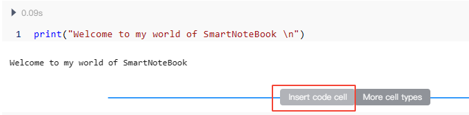
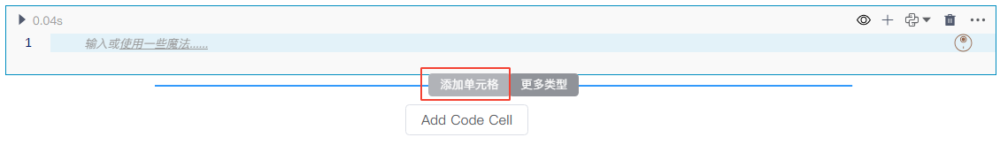
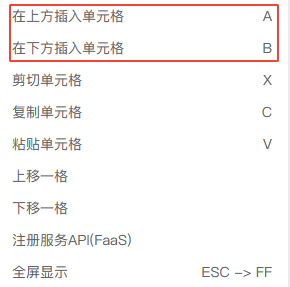

# Python单元格

<!-- 7101752 -->
---
用户可以在Python单元格中编写和执行任何有效的Python代码。

## 创建Python单元格

创建Python单元格有以下几种方式：

* 方式一：单击单元格右上角的 `+` 号
* 方式二：鼠标移动到单元格的下边界，单击悬浮框的菜单`添加单元格`

<!--    -->
  

* 方式三：鼠标移动至代码块的下边界，当显示悬浮操作框时，单击`更多类型`，然后选择`Python`。

  

* 方式四：在单元格右上角的更多`...`操作里选择`在上方插入单元格`或`在下方插入单元格`，也可以创建Python单元格

 <!--    -->
  

* 方式五：当单元格处于命令状态下，可使用以下快捷键创建：
  *  `A`：在当前单元格前插入单元格
  *  `B`：在当前单元格后插入单元格 

## 运行Python单元格

* 编写Python代码
* 点击Cell左上角的运行按钮 开始执行代码，运行完毕后按钮右侧将显示运行时长
* 结果输出
* 折叠/展开输入框
* 行号（运行前为空，运行后显示行号）
* 折叠/展开结果输出

  

当代码运行报错时，报错信息会以红色底显示输出：

  

## 关于显式/隐式打印

在NoteBook中，`显式打印`和`隐式打印`是在输出结果时的两种不同方法。

- "显式打印"：是指使用`print()`函数直接打印出你想要查看的内容。例如，`print("Hello, World!")`会在屏幕上打印出"Hello, World!"

- "隐式打印"：是指在交互式环境中，仅输入变量名或表达式，Python会自动显示其结果。例如，如果你有一个变量`x = 5`，在新的一行只输入`x`，输出区域会显示结果`5`。

<!-- 请注意，在Python脚本中，仅输入变量名并不会显示其结果，必须使用`print()`函数才能打印输出。 -->

任何显式打印（如：print)的值都将显示在输出中，如：

  

隐式打印值的行只有在出现在单元格的最后一行时才会显示在输出中，如：

  

如果单元格中没有显式打印语句，并且最后一行也未显式或隐式打印任何值，此时该单元格不会将任何内容显示为输出。这类情况完全没有问题，这种通常是为了保持内容的可读性，为另外的单元格提供包、函数或数据的支持。比如：

  

## 单元格类型转换

您可以点击单元格右上角将单元格从Python 转换为SQL或Markdown单元格，反之亦然。

  
