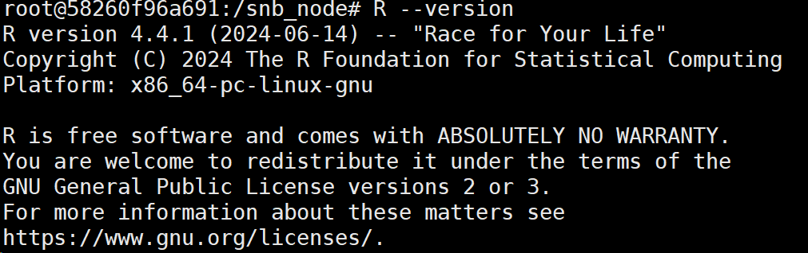
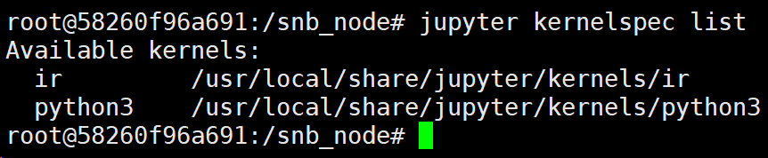
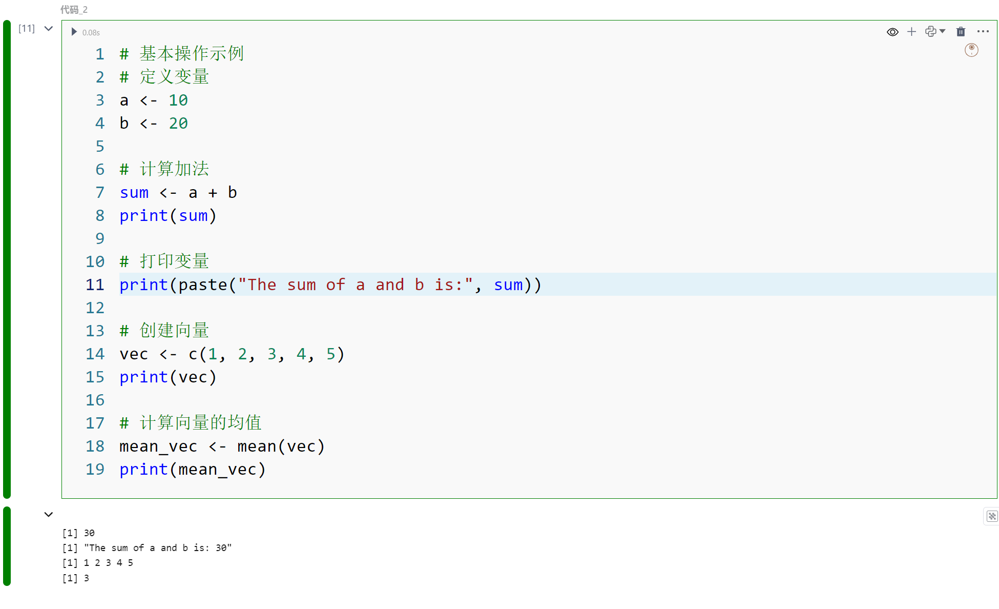
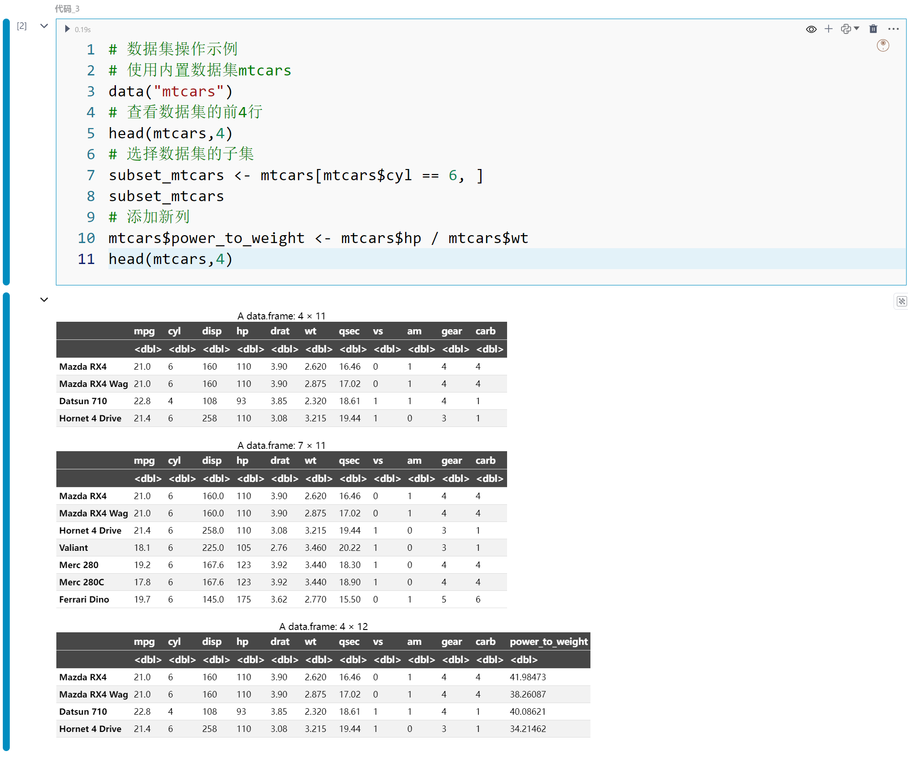
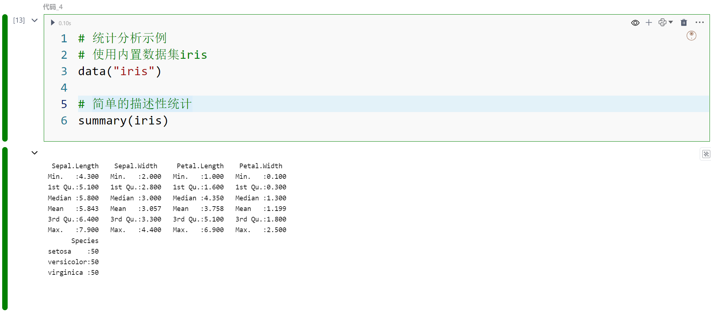
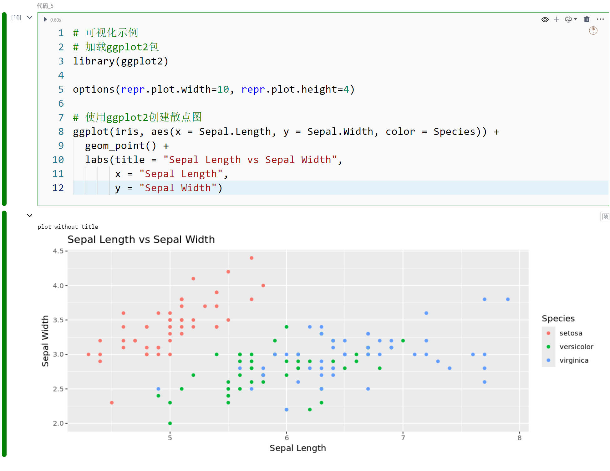
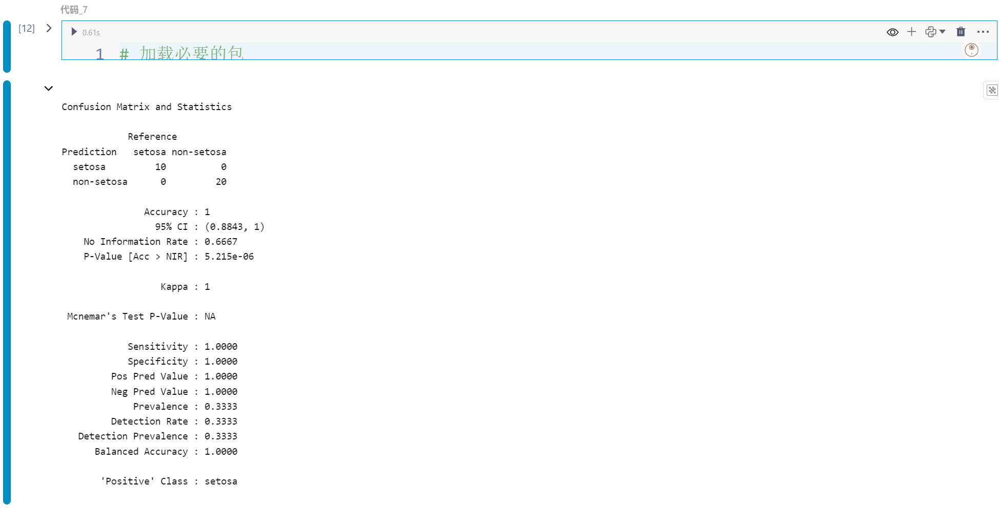

# R语言计算引擎
R语言是一种用于统计计算和数据可视化的编程语言和环境。它由Ross Ihaka和Robert Gentleman在1993年开发，专门为统计分析和图形展示设计。R语言提供了丰富的统计和图形功能，包括线性和非线性建模、经典统计检验、时间序列分析、分类、聚类等。其扩展包系统非常强大，用户可以通过CRAN（Comprehensive R Archive Network）获取各种功能的扩展包。R语言在数据科学、统计学、经济学、生物信息学等领域广泛应用，尤其在数据可视化和数据分析方面表现出色。
# R语言计算引擎的安装配置
SmartNotebook默认的部署镜像内没有内置R语言计算引擎，需要Node环境中进行安装R语言(r-base)和R的kernel包(IRkernel)。
## 1.配置apt安装源
```
echo "deb https://cloud.r-project.org/bin/linux/ubuntu bionic-cran40/"  >> /etc/apt/sources.list
# 根据提示添加 apt update提示 key信息使用apt-key 执行下面一行语句
apt-key adv --keyserver keyserver.ubuntu.com --recv-keys 51716619E084DAB9
apt update
apt list --upgradable
```
## 2.安装R语言(r-base)
```
# 版本列表参考地址：https://cloud.r-project.org/bin/linux/ubuntu/bionic-cran40/
# 最新版本：4.4.1
apt-get install r-base
R --version
```
  
## 3.R终端内安装IRkernel 包
```
install.packages('IRkernel')
IRkernel::installspec(user = FALSE)
```
## 4.查看kernel list：
```
jupyter kernelspec list
```
kernel list 参考信息如下：
``` 
Available kernels:
  python3    /opt/conda/share/jupyter/kernels/python3
  ir         /usr/local/share/jupyter/kernels/ir
```
  


# 创建NoteBook

在`新建NoteBook`对话框中"选择计算引擎(Kernel)类型"为"R"的选项。

输入`NoteBook标题`并选择对应的环境（需满足您购买的产品拥有创建R语言的环境，否则无法创建），最后点击提交。


  


> [!warning|style:flat]
> 成功创建NoteBook后，用户无法在不同的kernel语言类型之间切换。

SNB对其他R语言内核的支持仍处于早期阶段，有些功能尚不完善，例如变量资源管理器、SQL单元格、模型视图及低代码插件不支持。

# 当前支持的功能

- MarkDown 单元格
- 收藏
- 评论
- 资源和文件管理
- 大纲目录
- 环境及调度任务
- 版本管理
- 代码仓库
- 单元格的状态
- 代码格式
- 单元格代码补全
- 团队协作编辑
- 终端
- 快捷键支持

# R语言的探索
下面是基本5段R语言代码示例，分别涵盖基本操作、数据集操作、统计分析、可视化和机器学习。以下是代码示例：

### 1.基本操作
```
# 基本操作示例
# 定义变量
a <- 10
b <- 20

# 计算加法
sum <- a + b
print(sum)

# 打印变量
print(paste("The sum of a and b is:", sum))

# 创建向量
vec <- c(1, 2, 3, 4, 5)
print(vec)

# 计算向量的均值
mean_vec <- mean(vec)
print(mean_vec)
```
  

### 2.数据集操作
```
# 数据集操作示例
# 使用内置数据集mtcars
data("mtcars")
# 查看数据集的前4行
head(mtcars,4)
# 选择数据集的子集
subset_mtcars <- mtcars[mtcars$cyl == 6, ]
subset_mtcars
# 添加新列
mtcars$power_to_weight <- mtcars$hp / mtcars$wt
head(mtcars,4)
```
  

### 3.统计分析
```
# 统计分析示例
# 使用内置数据集iris
data("iris")

# 简单的描述性统计
summary(iris)
```
  

### 4.可视化
```
# 可视化示例
# 加载ggplot2包
library(ggplot2)

options(repr.plot.width=10, repr.plot.height=4)

# 使用ggplot2创建散点图
ggplot(iris, aes(x = Sepal.Length, y = Sepal.Width, color = Species)) +
  geom_point() +
  labs(title = "Sepal Length vs Sepal Width",
       x = "Sepal Length",
       y = "Sepal Width")
```
  

### 5.机器学习
```
# 加载必要的包
library(caret)  # 机器学习
library(datasets)  # 内置数据集

# 使用内置数据集iris
data(iris)

# 将Species转换为二分类问题（假设只关注Setosa和非Setosa）
iris_binary <- iris %>%
  mutate(Species = ifelse(Species == "setosa", "setosa", "non-setosa"))

# 创建训练和测试集
set.seed(123)
train_index <- createDataPartition(iris_binary$Species, p = 0.8, list = FALSE)
train_data <- iris_binary[train_index, ]
test_data <- iris_binary[-train_index, ]

# 确保训练数据中包含所有可能的类别，并设置因子级别
levels <- c("setosa", "non-setosa")
train_data$Species <- factor(train_data$Species, levels = levels)
test_data$Species <- factor(test_data$Species, levels = levels)

# 训练逻辑回归模型
lr_model <- train(Species ~ ., data = train_data, method = "glm", family = "binomial")

# 预测
predictions <- predict(lr_model, newdata = test_data)

# 评估模型
confusion_matrix <- confusionMatrix(predictions, test_data$Species)
print(confusion_matrix)
```
  

### 6.安装包的示例
```
install.packages('ggplot2')
```