# SQL单元格

<!-- 7101752 -->
---

SNB通过SQL单元格提供对SQL的一流支持，每个单元格都是一个成熟的SQL集成开发环境，例如可以选择数据源、代码自动补全、执行SQL查询和保存查询结果等。

每个NoteBook中可以添加无限数量的SQL单元格，它们与文本、代码、图表以及各类数据分析组件交错，从而为用户提供了一个非常灵活的数据分析环境。

<!-- 
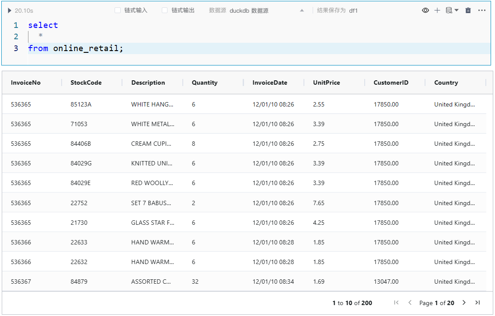 -->

  

## SQL单元格的特性/要点

SNB在SQL应用方面进行了深入的优化和支持，使得SQL数据查询和处理变的非常便捷和高效。

区别于您之前所使用的“常规”SQL查询工具，使用SNB操作SQL有以下几个特性/要点：

1. DBSQL和dfSQL。在SNB中有两种SQL查询方式：DBSQL允许用户通过连接远程数据库或数据仓库运行SQL查询。dfSQL允许用户以SQL语法对DataFrame变量进行查询、变换、统计和过滤等操作。两种查询方式相融合，可以帮助用户编写和执行一些非常强大的数据处理流程。
  
2. 查询结果自动存储为DataFrame变量。DBSQL查询的结果均可以作为DataFrame变量返回，后续可以采用Python代码或dfSQL继续进行数据分析或数据建模。。

3. 用户可以通过dfSQL直接读取csv文件，后续进行统计汇总等分析。

4. 动态SQL：SQL单元格支持[Jinja2](http://docs.jinkan.org/docs/jinja2/templates.html)表达式模板，用户可以在SQL代码中引用Python变量，并且使用流程控制（if...else.../for循环等等），极大程度上扩展了SQL语言的灵活性。

5. 链式SQL：可以将复杂的嵌套查询转化为简单的链式CTE（Common Table Expression）查询SQL，使代码更加简洁、易于调试、复用及高效。


## 何时使用DBSQL VS dfSQL？

很简单，看您的数据存储在哪里或者说看您查询的对象类型是什么：

- 当您需要查询远程数据库或数据仓库时使用DBSQL

- 当您查询的对象是DataFrame变量或csv文件，则选用dfSQL

以下我们整理了一张表格来区别二者的适用场景：

| 目标用途 | DBSQL | dfSQL |
| :-----| :---- | :---- | 
| 查询远程SQL数据库 | √ | × | 
| 使用数据库特定的功能 | √ | × | 
| 查询Pandas DataFrame | ×  |√| 
| 以DataFrame返回结果 | √ | √ | 
| 连接来自不同数据源的数据集 | × | √ | 
| 适合查询超大数据集 | √ | × | 
| 查询中小数据集的速度 | 快 | 极快 | 


通过组合DBSQL和dfSQL，用户能以更流畅的方式构建复杂的数据处理流程。

我们举两个例子来说明：

- 通过DBSQL从远程数据库中获取数据，此时数据从远程数据库表中拷贝至用户定义的DataFrame变量中，然后我们使用Python代码对某一列进行地理信息编码（明显相比SQL，Python更擅长此类操作）。接下来我们如果需要对数据进行分组和排序，可以继续选择使用SQL语言对DataFrame进行处理（dfSQL的功能）。
  
- 当我们用到不同的数据源，并且需要将数据进行关联查询：比如我们从MySQL通过DBSQL获取数据集dfA，从Oracle通过DBSQL获取数据集dfB，此时，我们可以选择使用dfSQL将两个数据集开展关联查询（依然使用SQL的方式。当然，您如果对Pandas熟悉也可以使用Python代码的方式进行关联）。

## 创建SQL单元格


- 方式一：首先点击单元格右上角 `+` 号或单元格下方`Add Code Cell`，新建一个默认的代码单元格，然后点击右上角的转换类型，选择`转换为SQL`。

<!-- 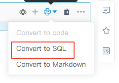  

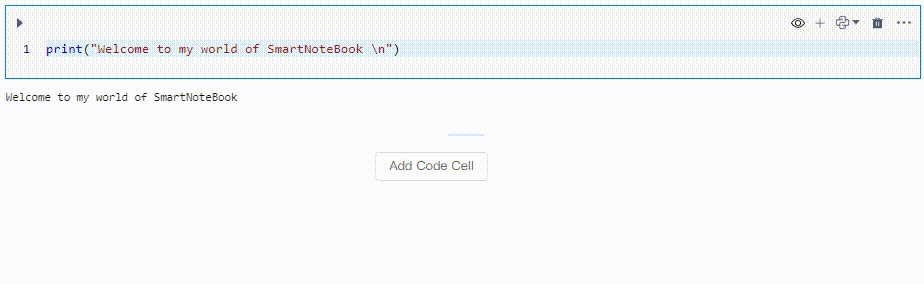   -->

<!-- 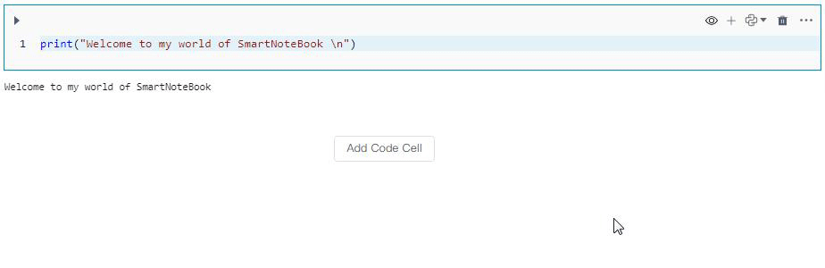   -->
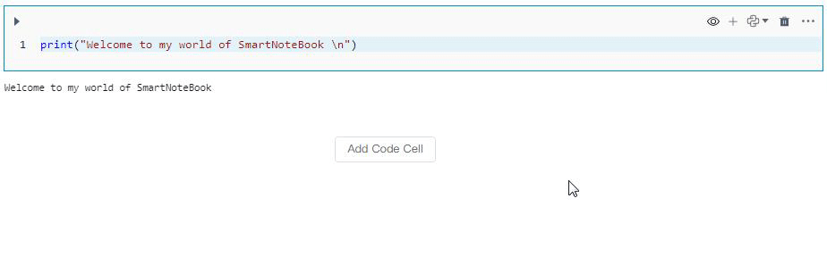  

- 方式二：鼠标移动至单元格的下方，当显示悬浮操作框时，单击`更多类型`，然后选择`SQL`。

<!-- 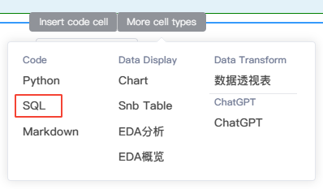   -->
  


## 相关操作

### 1.  DBSQL查询

步骤：

1. 新建SQL单元格
2. 在数据源下拉框中选择DB数据源（连接DB数据源的操作详见<a href="../WorkSpace/DataSource.md" title="数据源">数据源</a>）
3. 在`结果保存为`处填写输出变量名（SNB会默认分配一个变量名，如`df1` 、`df2`等）
4. 编写SQL代码
5. 执行单元格

经以上几步我们执行了一个DBSQL查询，并将结果保存在DataFrame变量。

<!--    -->

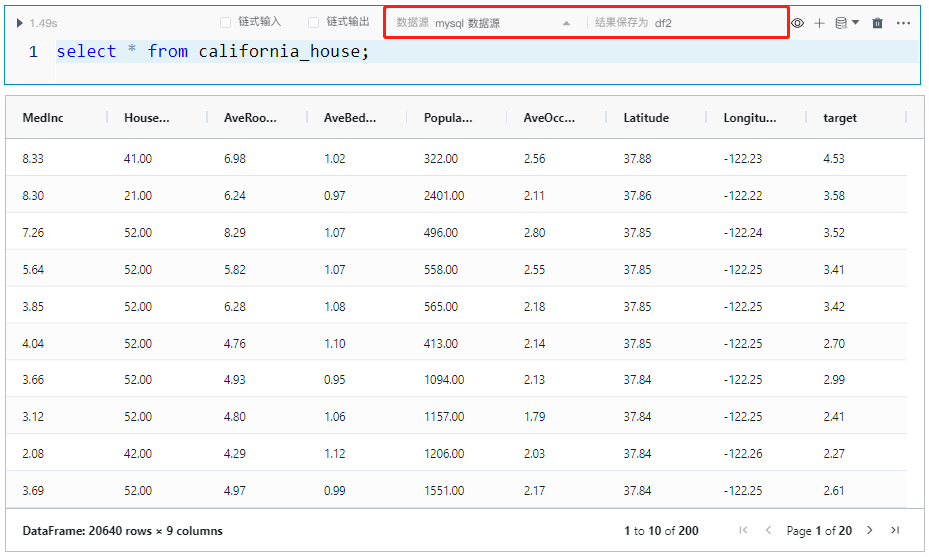  

### 2.  dfSQL查询

步骤：

1. 新建SQL单元格
2. 在数据源下拉框中选择`dfSQL`
3. 在`结果保存为`处填写输出变量名（SNB会默认分配一个变量名，如`df1` 、`df2`等）
4. 编写SQL代码(表名为已存在的DataFrame变量名称)
5. 执行单元格

这样我们就执行了一个dfSQL查询，使用SQL的方式操作DataFrame变量，并将结果保存在新的DataFrame变量。

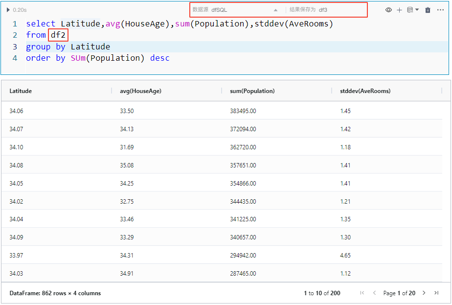  

**dfSQL还可用于读取csv文件**

像这样：

```
select * from '/home/Iris.csv'
```
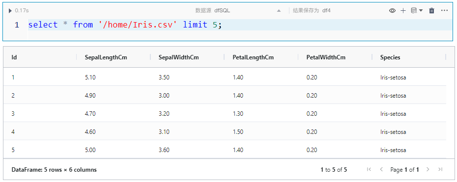  
或者这样：
```
select Id, SepalLengthCm, SepalWidthCm, PetalLengthCm, PetalWidthCm,Species from '/home/Iris.csv'
```

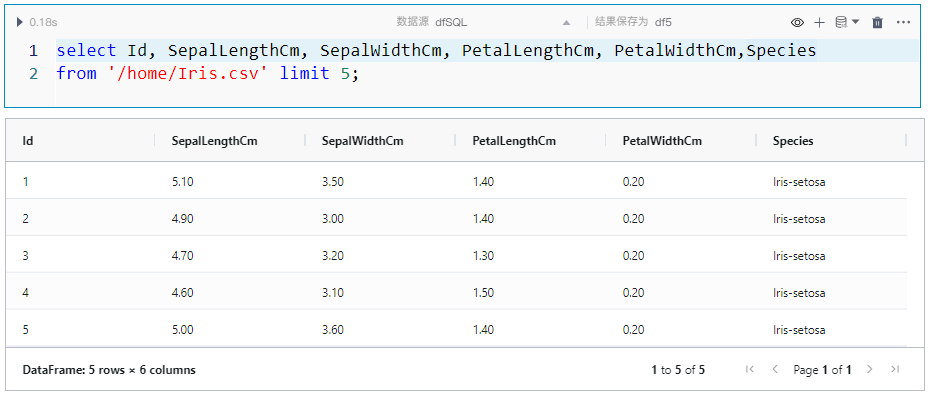  

> [!Tip]
> dfSQL查询必须使用DuckDB的PostgreSQL风格SQL编写，它不兼容某些特定于数据库的函数。关于dfSQL支持的内容可参考[DuckDB Documentation](https://duckdb.org/docs/)。

<!-- 
## 示例

以下通过一个示例展示使用dfSQL进行数据处理：

- 通过Python代码导入数据（经纬度信息）：

```
lat =pd.read_excel('http://172.30.21.57/lat.xlsx')
lat.columns=['Province','d','d','lot','lat']
lat
```

- 通过Python代码导入全国gdp数据：

```
import pandas as pd
gdp=pd.read_excel('http://172.30.21.57/gdpData.xlsx')
gdp['per_gdp']=gdp['GDP2020']/gdp['Population2020']
gdp
```

- 通过Python代码对列计算和精度处理，将结果保存在`df2 `中
  
```
import numpy as np
df2['gdp_all_avg']=sum(df2['gdp_sum'])/sum(df2['popu_sum'])
df2['t_score']=(df2['gdp_avg']-df2['gdp_all_avg'])/(df2['gdp_std']/np.sqrt(df2['dist_count']))
df2['A']='all'
for c in ['gdp_sum','popu_sum','gdp_avg','gdp_std','gdp_all_avg','t_score']:
    df2[c]=round(df2[c],2)
df2
```

- 使用`dfSQL`，对`df2 `进行SQL查询和处理：

```
select Province,sum(GDP2020) as gdp_sum, sum(Population2020) as popu_sum,sum(GDP2020) / sum(Population2020) as gdp_avg,
count(distinct District) as dist_count,stddev(per_gdp) as gdp_std from gdp  group by Province
```

- 使用`dfSQL`，用SQL计算排名：
  
```
select Province,gdp_sum,popu_sum,gdp_avg,gdp_std,t_score as XL_Index,rank() over(partition by A order by gdp_sum desc) as gdp_rank ,
rank() over(partition by A order by popu_sum desc) as popu_rank ,rank() over(partition by A order by gdp_avg desc) as gdp_avg_rank ,
rank() over(partition by A order by t_score desc) as XL_Index_rank
from df2
```

- 使用`dfSQL`，关联gdp和经纬度数据：

```
select df3.*,lat.lat,lat.lot from df3,lat where df3.Province=lat.Province
``` -->

### 3.  动态SQL查询

通过使用[Jinja2](http://docs.jinkan.org/docs/jinja2/templates.html)表达式模板，用户能够在SQL单元格中引用Python变量，并且使用if...else.../for等关键字对SQL语句进行流程控制。

格式如下：
- 变量引用：
  - 引用Python变量：a = 100
  
  ``` 
    {{a}}
  
  ```

  - 引用字典：  data ={"a":100,"b":200}  
  
  ```
  {{data.a}} 
  {{data.b}}
  
  ```

- if else 判断：  
  ```
  
    ,{{a}}  
  
  
  ```

- for 循环：
  ```
    
  , {{i}}
  
  
  ```

> [!Tip]
> 关于动态SQL支持的更多内容可以参考[Jinja2 模板](http://docs.jinkan.org/docs/jinja2/templates.html)。


#### 动态SQL例子

例1：变量引用

我们在Python单元格中定义并运行两个变量：

```
Population = 500
HouseAge = 30
```
在SQL单元格中引用两个变量作为where条件：

```
select * from df2 
where  Population > '{{Population}}' and HouseAge < '{{HouseAge}}'
```

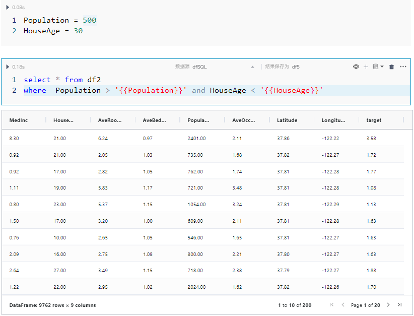  


例2：if..else..：

延续例1：

- 我们先来统计符合条件的房子数量，赋给house_count变量：
  
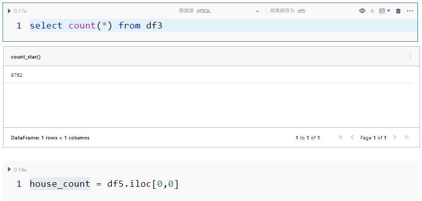  

- 按照估价（target）从低到高排序取前5条；如果不存在，返回“符合条件的房子不存在！”


```

  select * from df3 order by target limit 5;

    select '符合条件的房子不存在！';

```


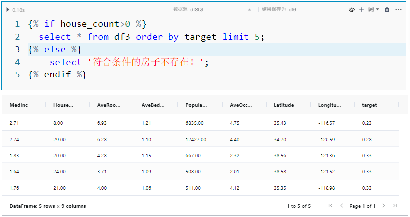  


例3：for循环：

- 我们使用Python代码将我们需要的信息字段放入list变量：

```
columns = ['HouseAge', 'Population', 'target']
```

- 然后把查询日期和需要的字段信息放到SQL语句：

```
select '2023-01-01'
  
  , {{col}}
   
from df2
```

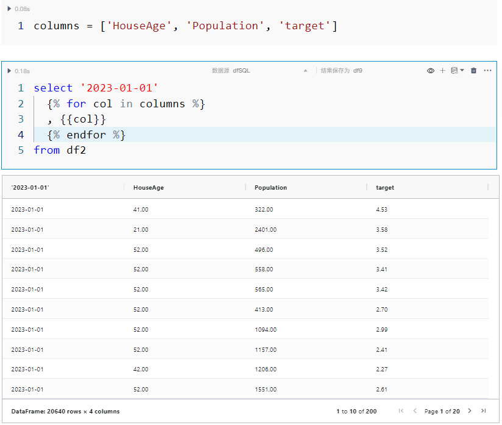  

<!-- 字典的例子：

```
data={"a":100,"b":200}
```

然后新建SQL单元格，数据源设置为dfSQL，编写SQL代码：

```
 select 
 {{data.a}}
,{{data.b}}

``` -->

<!-- 
  
 -->

### 4.  链式SQL查询

链式SQL用于将复杂的查询分解为易于阅读、理解和调试的原子单元，每个单元都可以分别运行、编辑、缓存和调试。

步骤：

1. 新建SQL单元格
2. 在数据源下拉框中选择DB数据源（连接DB数据源的操作详见<a href="../WorkSpace/DataSource.md" title="数据源">数据源</a>）
3. 在`结果保存为`处填写输出变量名（SNB会默认分配一个变量名，如`df1` 、`df2`等）
4. 根据输入输出逻辑勾选`链式输入`、`链式输出`
5. 编写SQL代码
6. 执行单元格

#### 链式SQL例子
<!-- 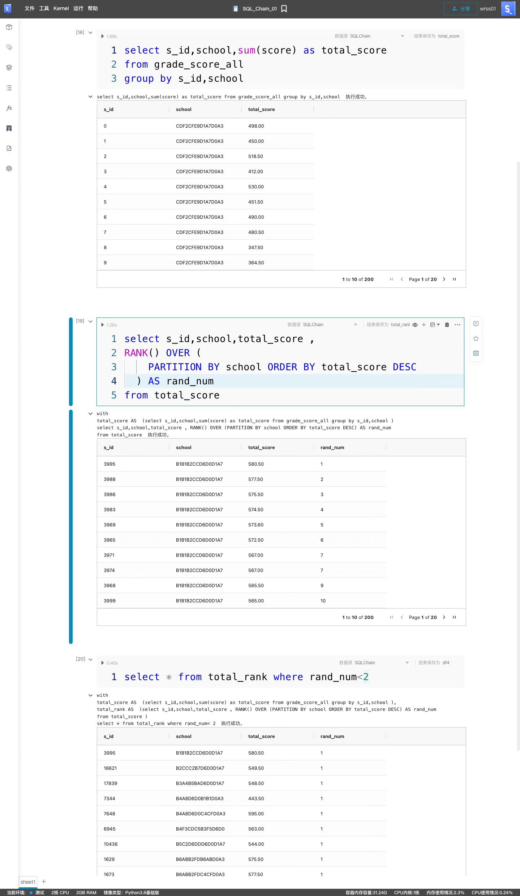   -->

为方便理解链式SQL的原理和过程，我们可以将SNB的DEBUG功能打开（查看每一步的SQL语句）：

<!-- 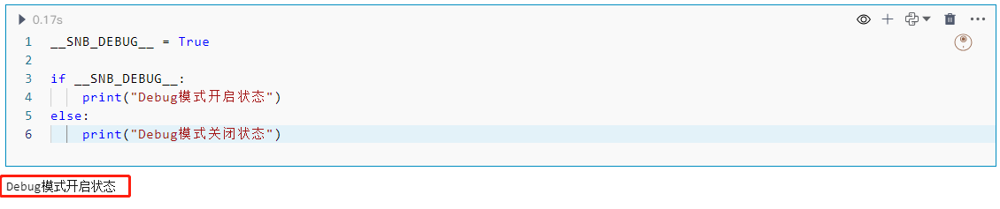   -->

步骤① ：

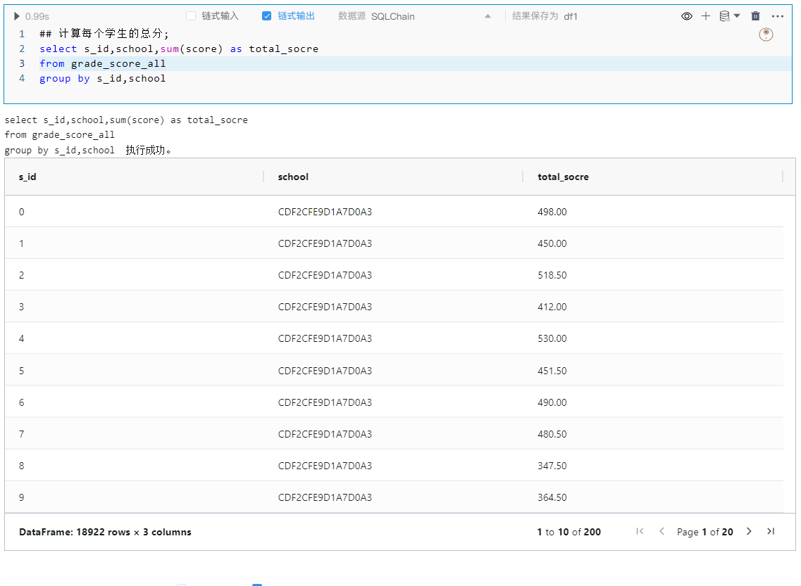  

<!-- 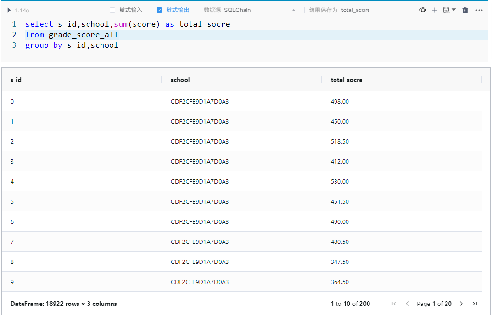   -->

步骤②：

<!-- 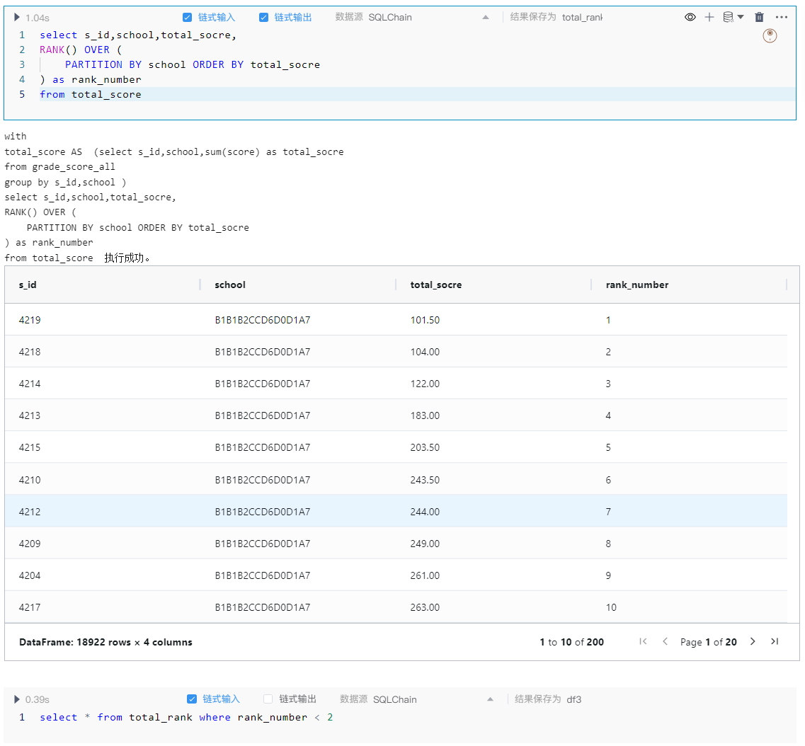   -->
<!-- 
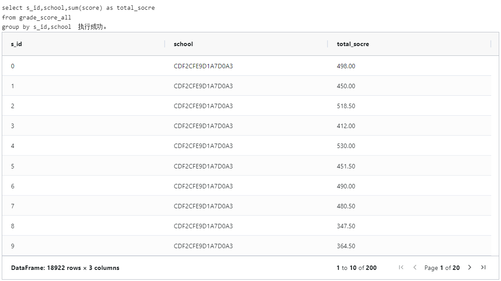   -->
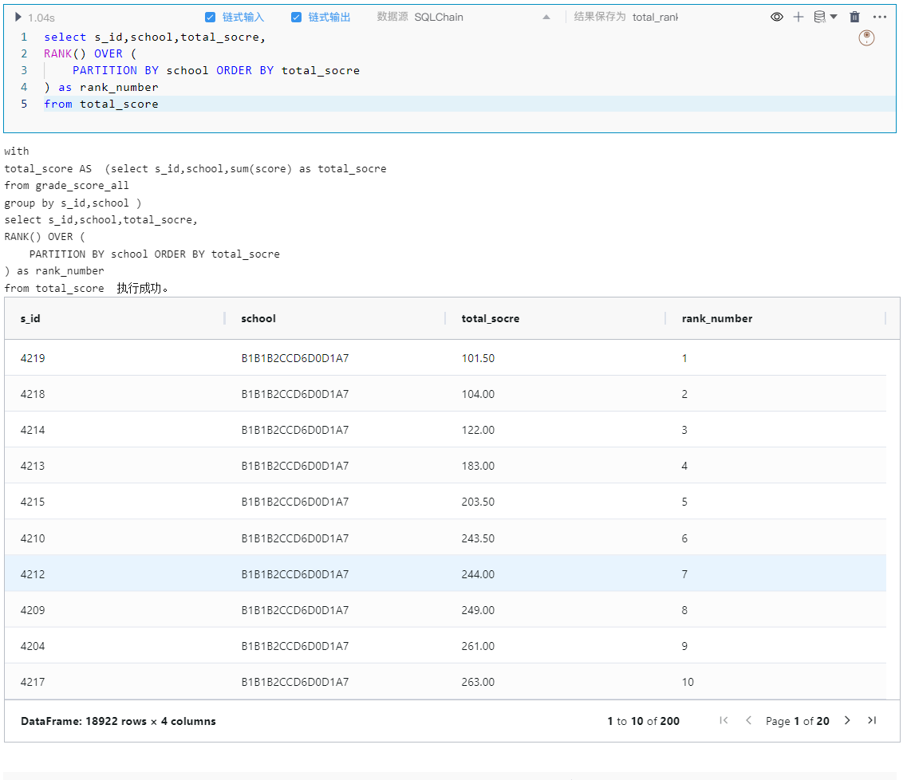  

步骤③：

<!-- 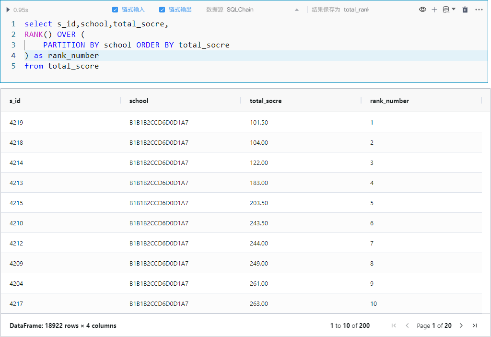   -->
<!-- 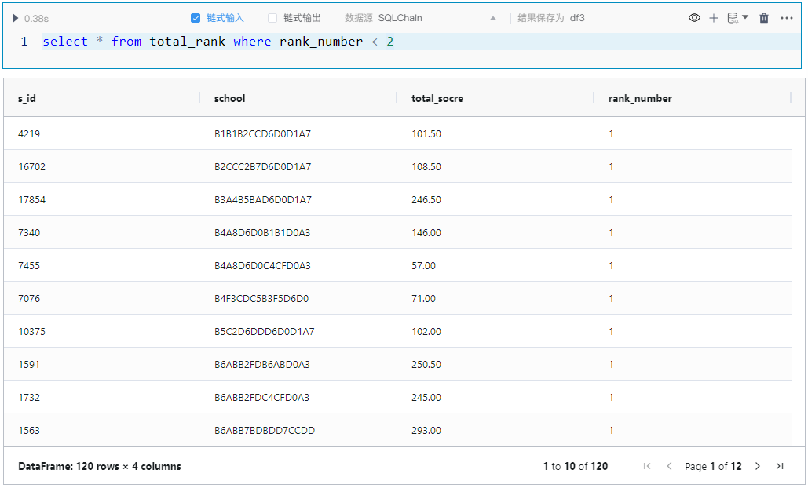   -->
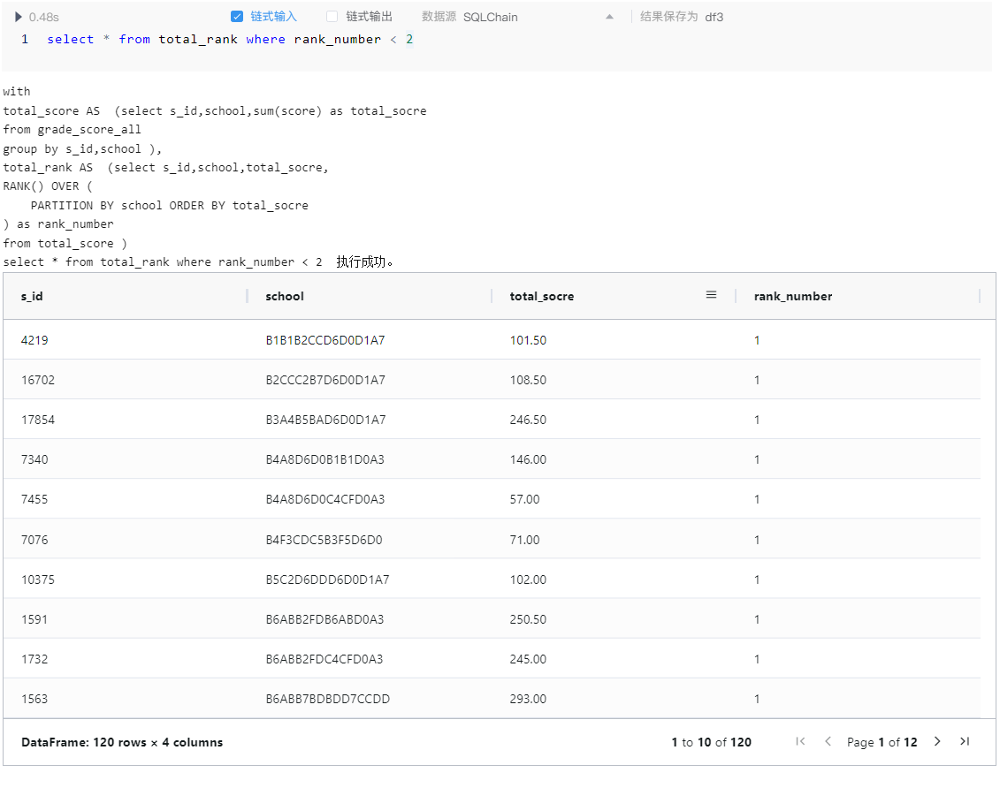  


> [!TIP]
> 我们在`变量预览`中能够查看链式SQL执行过程中产生的变量、变量类型和变量的值来清晰的感知整个过程：

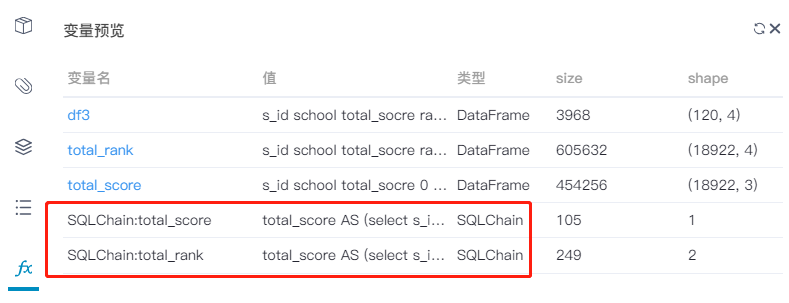  

## 注释

<!-- 注释用于解释SQL语​​句的各个部分，或用于防止执行SQL语句。 -->

在SNB中，SQL注释用`##` 双井号开始，末尾用分号`;`结束：

<!--    -->
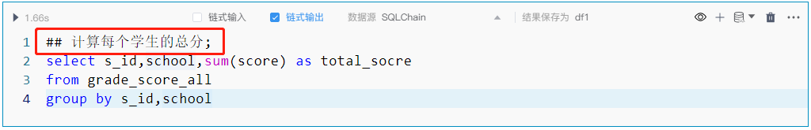  


## 支持T-SQL和PL/SQL


- T-SQL是Transact-Structured Query Language的缩写，是微软公司用于SQL Server数据库管理系统的扩展版本。它基于ANSI SQL标准，提供了更多的扩展和特性，如存储过程、触发器、表变量和用户定义函数等。使用T-SQL语言可以对数据库中的数据进行查询、更新、插入和删除操作。T-SQL还可以用来创建、修改和管理数据库对象，如表、视图、索引等。

- PL/SQL全称为Procedural Language/SQL，是Oracle公司用于其Oracle数据库管理系统的一种专用编程语言。PL/SQL是一种基于SQL语言的高级编程语言。它具有结构化编程能力，支持面向过程编程，包括循环、条件语句、变量、常量、过程和函数等。

### 使用T-SQL

当我们连接好了SQL Sever的数据源，在执行T-SQL代码时可能会遇到报错或输出提示`非标准的DDL语句`，此时我们可以通过以下步骤来实现支持所有的T-SQL代码：

1.  添加`Python单元格`
2.  侧边栏的`数据资源`下复制所用SQL Sever数据源的连接信息
     
3.  将连接信息复制到`Python单元格`里
4.  在连接信息下方增加T-SQL语句和执行代码：

```
  # 数据源的连接信息
  from snb_plugin.sql.execute_sql import __smartnotebook_getengine_by_conn_id as snb_conn  
  engine=snb_conn("0242ac110004-11ed7b8d-9d8364a0-81eb", context=globals())

  # T-SQL语句

  SQL="""
  DECLARE @Number INT;
  SET @Number = 100;
  IF @Number > 100
    PRINT 'The number is large.';
  ELSE
    BEGIN
      IF @Number < 10
        PRINT 'The number is small.'
      ELSE
        PRINT 'The number is medium.';
    END ;
  """

  # 执行T-SQL语句
  conn = engine.raw_connection()
  with conn.cursor() as cursor:
    cursor.execute(SQL)
  conn.close()
```

### 使用PL/SQL

与执行T-SQL代码类似的，当我们连接好了Oracle的数据源，在执行PL/SQL代码时可能会遇到报错或输出提示`非标准的DDL语句`，此时我们可以通过以下步骤来实现支持所有的PL/SQL代码：

1.  添加`Python单元格`
2.  侧边栏的`数据资源`下复制所用Oracle数据源的连接信息
     

3.  将连接信息复制到`Python单元格`里
4.  在连接信息下方增加PL/SQL语句和执行代码：
   
```
  # 数据源的连接信息
  from snb_plugin.sql.execute_sql import __smartnotebook_getengine_by_conn_id as snb_conn  
  engine=snb_conn("0242ac110004-11ed7c2a-8a556732-8e72", context=globals())


  # PLSQL语句
  SQL = """
  declare
    i number(2) := 12 ;
    s varchar2(10) := 'end' ;
  begin
    IF i < 10
    THEN
    dbms_output.put_line('小于10');
    ELSIF i > 10
    THEN
    dbms_output.put_line('大于10');
    ELSE
    dbms_output.put_line('等于10');
    END IF;
    dbms_output.put_line(s);
  end;
  """

  # 执行PLSQL语句
  conn = engine.raw_connection()
  with conn.cursor() as cursor:
    cursor.execute(SQL)
    conn.commit()
```
