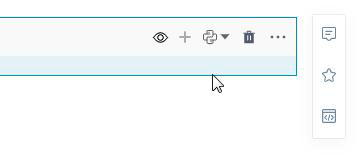

# 分享

<!-- 7101752 -->
---
NoteBook有很好的代码展示性，可作为“项目报告”承载研究成果，并能够以网页的形式进行分享。

在分享的内容方面，既可以整体分享NoteBook（包含所有Cell代码块的输入输出），也可单独分享某个Cell代码块的输出。

## 分享整个NoteBook

- 第一种方式：点击NoteBook右上角的分享按钮

<!--    -->

  

复制分享链接：

  

将分享链接贴入浏览器中查看分享报告：

  

- 第二种方式：点击`文件`菜单下的`分享`按钮：

<!--    -->

  

<!-- 在弹出的页面中用户可以复制分享链接，并将链接贴入浏览器中查看分享报告：

   -->

<!-- | 操作 | 解释 | 备注 |
| :-----| :---- | :---- | 
| 预览notebook| 不打开NoteBook文档的情况下预览文档内容 | |
| 分享链接| 整个NoteBook文档的报告分享链接| |
| 嵌入NoteBook | 整个NoteBook文档的报告分享链接作为iframe可嵌入至其他页面 |  | -->

### 分享报告时隐藏输入/输出

- 控制单个单元格输入/输出的显隐：

<!--    -->

  

- 批量隐藏（适用于生成报告时批量隐藏代码输入）：

  

## 分享单元格的输出

用户只需要分享某个单元格的输出时，可以点击单元格右侧的 按钮。

  

获得分享链接：

  

打开链接查看分享的内容：

  

