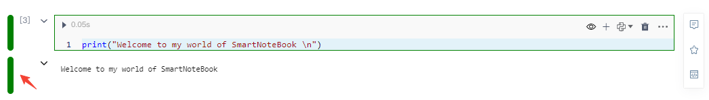
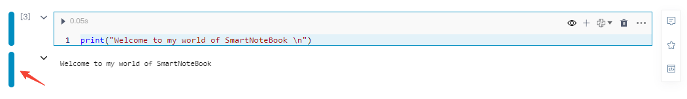

# 快捷键

<!-- 7101752 -->
---
为配合用户使用习惯，SmartNoteBook参考了很多Jupyter的快捷键。

此外，SmartNoteBook为改进用户体验，也增加了很多自定义的快捷键，满足全局模式下以及不同模式不同单元格状态下的快捷操作。

## 编辑模式和命令模式

- **编辑状态**：单元格左侧显示绿色。此时焦点处于代码输入框中，输入框处于编辑状态。用于书写代码或配置低代码组件参数。

  

- **命令状态**：单元格左侧显示蓝色。当前单元格处于选定状态，但焦点不位于输入框。用于单元格间的操作，比如利用快捷键快速插入新单元格。

  

 ## 状态的切换

 当使用鼠标点击单元格输入框的代码编辑区域时，单元格的选中状态变为`编辑状态`，除此之外，当点击单元格的其他区域单元格的选中状态都为`命令状态`。
 
 除使用鼠标点击来切换单元格的选中状态，也可以使用快捷键进行切换：

* `Enter 回车`：命令状态 --> 编辑状态
* `ESC   取消`：编辑状态 --> 命令状态

## 全局快捷键

##### 文档级
  * `Ctrl+S | ⌘S`：版本保存
  
##### 代码单元格状态
  * `Enter`：命令状态 --转化为--&gt;编辑状态
  * `ESC`：编辑状态--转化为--&gt;命令状态
  
  
##### 代码单元格运行
  * `Ctrl+Enter | ⌘Enter`：运行当前单元格
  * `Shift+Enter | ⇧Enter`：运行当前单元格，并选定下面一个单元格 
  * `Alt+Enter | ⌥Enter`：运行当前单元格，并下面插入一个code类型单元格(code cell) 
  
> [!NOTE]
> 全局快捷键即无论处于命令模式还是编辑模式下都可正常使用。

## 命令模式下支持的快捷键

* 代码单元格操作`注："命令状态" 才有效`
  * `D`+`D`：删除当前单元格
  * `A`：在当前单元格前插入单元格
  * `B`：在当前单元格后插入单元格
  * `C`：复制选中单元格
  * `X`: 剪切选中单元格
  * `V`: 粘贴单元格


## 编辑模式下支持的快捷键
#### 代码单元格（编辑器）的快捷键
**macOS版本** 

| 快捷键 | 功能说明 |
| --- | --- |
| ⌘X | 剪切所选内容，若无选中区域，则剪切光标所在行 |
| ⌘C | 复制所选内容，若无选中区域，则复制光标所在行 |
| ⌘V | 粘贴剪切板内容|
| ⌘A | 全选当前单元格中的内容|
| ⌘Z | 撤销上一步操作|
| ⌘⇧Z | 恢复上一次撤销的操作|
| ⇧⌥↓ / ⇧⌥↑ | 在下面/在下面复制当前行 |
| ⇧⌘K | 删除当前行 |
| ⇧⌘Enter | 在上面插入一个新的空白行 |
| ⌘] / ⌘[ | 缩进/取消缩进当前行 |
| Fn← / Fn→ | 定位到这一行的开头/末尾 |
| ⌘↑ / ⌘↓ | 定位到单元格的开头/末尾 |
| ⌘Fn↓ / ⌘Fn↑ | 在单元格中向下/向上滚动（以便查看单元格中的内容） |
| 先⌘K 后⌘[ / 先⌘K 后⌘] | 折叠/展开代码的所有子区域 |
| 先⌘K 后⌘0 / 先⌘K 后⌘J | 折叠/展开代码的所有区域 |
| 先⌘K 后⌘C | 添加行注释 |
| 先⌘K 后⌘U | 取消行注释 |
| ⌘/ | 添加/取消行注释（切换行注释） |
| ⇧⌥A | 添加/取消块注释（在python语言的单元格中，则是添加三引号""" """） |
| ⌥⌘↑ | 在上面一行添加光标 |
| ⌥⌘↓ | 在下面一行添加光标 |
| ⌘U | 撤销上一步的光标操作 |
| ⇧⌥I | 光标插入到选中区域的末尾 |
| ⌥↑ / ⌥↓ | 将当前行向上/向下移动 |
| ⌥← / ⌥→ | 向左/向右移动光标（以单词为单位） |
| ⌘L | 选择当前行 |
| ⇧⌘L | 选择当前所选内容的所有引用 |
| ⌘F2 | 选择当前词的所有引用 |
| ⌃⇧⌘→ / ⌃⇧⌘← | 扩大/缩小选择范围 |
| ⌘F | 查找 |
| ⌥⌘F | 替换 |
| ⌘G / ⇧⌘G | 向后/向前查找 |
| ⌘D| 将所选内容添加到下一个“查找匹配项”，并插入光标 |
| 先⌘K 后⌘D | 将上一个的选择内容移动到下一个“查找匹配项” |
| 先⌘K 后⌘X | 去掉行末尾的空格 |
| ⌘I | 触发语法提示 |
| ⇧Tab | 打开当前函数/变量的使用帮助 |
| ⌃G | 定位到指定行 |

**Windows版本** 

| 快捷键 | 功能说明 |
| --- | --- |
| Ctrl+X | 剪切所选内容，若无选中区域，则剪切光标所在行 |
| Ctrl+C | 复制所选内容，若无选中区域，则复制光标所在行 |
| Ctrl+V | 粘贴剪切板内容|
| Ctrl+A | 全选当前单元格中的内容|
| Ctrl+Z | 撤销上一步操作|
| Ctrl+Shift+Z | 恢复上一次撤销的操作|
| Shift+Alt+↓ / Shift+Alt+↑ | 在下面/在下面复制当前行 |
| Ctrl+Shift+K | 删除当前行 |
| Ctrl+Shift+Enter | 在上面插入一个新的空白行 |
| Ctrl+] / Ctrl+[ | 缩进/取消缩进当前行 |
| Home / End | 定位到这一行的开头/末尾 |
| Ctrl+Home / Ctrl+End | 定位到单元格的开头/末尾 |
| Ctrl+PgUp / Ctrl+PgDn | 在单元格中向下/向上滚动（以便查看单元格中的内容） |
| 先Ctrl+K，后Ctrl+[ / 先Ctrl+K，后Ctrl+] | 折叠/展开代码的所有子区域 |
| 先Ctrl+K，后Ctrl+0 / 先Ctrl+K，后Ctrl+J | 折叠/展开代码的所有区域 |
| 先Ctrl+K，后Ctrl+C | 添加行注释 |
| 先Ctrl+K，后Ctrl+U | 取消行注释 |
| Ctrl+/ | 添加/取消行注释（切换行注释） |
| Shift+Alt+A | 添加/取消块注释（在python语言的单元格中，则是添加三引号""" """）|
| Alt+Ctrl+↑ | 在上面一行添加光标 |
| Alt+Ctrl+↓ | 在下面一行添加光标 |
| Ctrl+U | 撤销上一步的光标操作 |
| Shift+Alt+I | 光标插入到选中区域的末尾 |
| Alt+↑ / Alt+↓ | 将当前行向上/向下移动 |
| Alt+← / Alt+→ | 向左/向右移动光标（以单词为单位） |
| Ctrl+L | 选择当前行 |
| Shift+Ctrl+L | 选择当前所选内容的所有引用 |
| Ctrl+F2 | 选择当前词的所有引用 |
| Shift+Alt+→ / Shift+Alt+← | 扩大/缩小选择范围 |
| Ctrl+F | 查找 |
| Ctrl+H | 替换 |
| F3 / Shift+F3 | 向后/向前查找 |
| Ctrl+D | 将所选内容添加到下一个“查找匹配项”，并插入光标 |
| 先Ctrl+K，后Ctrl+D | 将上一个的选择内容移动到下一个“查找匹配项” |
| 先Ctrl+K，后Ctrl+X | 去掉行末尾的空格 |
| Ctrl+I | 触发语法提示 |
| Shift+Tab | 打开当前函数/变量的使用帮助 |
| Ctrl+G | 定位到指定行 |

#### MarkDown单元格支持的快捷键

**macOS版本**

| 快捷键 | 功能说明 |
| --- | --- |
| ⌘Z | 撤销 |
| ⌘Y | 重做 |
| ⌘X | 剪切|
| ⌘C | 复制|
| ⌘V | 粘贴|
| ⌘A | 全选|
| ⌘← | 跳转到句首|
| ⌘→ | 跳转到句尾|
| ⌘↑ | 跳转到文档开头|
| ⌘↓ | 跳转到文档末尾|
| ⌘1/⌘2/⌘3/⌘4/⌘5/⌘6 | 一级/二级/三级/四级/五级/六级标题|
| Tab | 缩进|
| ⇧Tab | 取消缩进|
| ⌘D | 删除选中行|
| ⌘+delete | 清空所有内容|
| ⌘B | **加粗**|
| ⌘I | *斜体*|
| ⌘H | # 标题|
| ⌘U | ++下划线++|
| ⌘M | ==标记==|
| ⌘L | [链接标题](链接地址)|
| ⌘⌥S | ^上角标^|
| ⌘O | 有序列表|
| ⌘⌥U | - 无序列表|
| ⌘⌥C | ``` 代码块|
| ⌘⌥L | 插入图片|
| ⌘⌥T | 表格|
| ⌘⇧S | 下角标|
| ⌘⇧D | ~~中划线~~|
| ⌘⇧C | 居中对齐|
| ⌘⇧L | 居左对齐|
| ⌘⇧R | 居右对齐|

**Windows版本**

| 快捷键 | 功能说明 |
| --- | --- |
| Ctrl+Z | 撤销 |
| Ctrl+Y | 重做 |
| Ctrl+X | 剪切|
| Ctrl+C | 复制|
| Ctrl+V | 粘贴|
| Ctrl+A | 全选|
| Home | 跳转到句首|
| Ctrl+Home | 跳转到文档开头|
| End | 跳转到句尾|
| Ctrl+End | 跳转到文档末尾|
| Ctrl+1/2/3/4/5/6 | 对应六级标题|
| Tab | 缩进|
| Shift + Tab | 取消缩进|
| Ctrl+D | 删除选中行|
| Ctrl+BreakSpace | 清空所有内容|
| Ctrl+B | **加粗**|
| Ctrl+I | *斜体*|
| Ctrl+H | # 标题|
| Ctrl+U | ++下划线++|
| Ctrl+M | ==标记==|
| Ctrl+Q | > 引用|
| Ctrl+L | [链接标题](链接地址)|
| Ctrl+Alt+S | ^上角标^|
| Ctrl+O | 有序列表|
| Ctrl+Alt+U | - 无序列表|
| Ctrl+Alt+C | ``` 代码块|
| Ctrl+Alt+L | 插入图片|
| Ctrl+Alt+T | 表格|
| Ctrl+Shift+S | 下角标|
| Ctrl+Shift+D | ~~中划线~~|
| Ctrl+Shift+C | 居中对齐|
| Ctrl+Shift+L | 居左对齐|
| Ctrl+Shift+R | 居右对齐|


