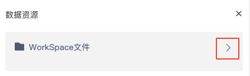

# 侧边栏

<!-- 7101752 -->
---
侧边栏为NoteBook提供一系列扩展功能。

## 功能概览

| 图标 | 功能 | 解释 | 
| :----- | :-----| :---- | 
|   | 数据资源 | 文件和数据库管理 | 
|   | 计算环境 | 查看和管理当前NoteBook的计算资源和调度器 | 
|   | 导航目录 | NoteBook根据Markdown单元格中使用的标题显示文档结构 | 
|   | 变量预览 | 浏览NoteBook中使用的变量、值和值的一些属性 | 
|   | 版本列表 | 保存NoteBook版本并可还原至历史记录的状态 | 
|   | 软件包 | NoteBook的包管理 | 
|   | 代码片段库 | 包含`公有库`（NoteBook提供的常用代码片段）和`我的收藏`（用户收藏的代码片段）。 | 
|   | 快捷键 | 快捷键包含notebook编辑模式、命令模式、文档级别（全局Global） | 

## Packages

默认情况下，NoteBook的运行环境已经为用户安装了常用的数据分析、机器学习以及可视化的包。

<!--    -->
  

### 搜索并查看包版本

  

### 安装/升级包

* 在`安装`的Tab页搜索要安装的包名称
* 点击放大镜或敲击回车进行搜索
* 在结果列表找到需要安装/升级的包和版本号，点击右侧的下载图标开始安装

  

### 删除包

* 在`已安装`的Tab页搜索要删除的包名称
* 在结果列表找到需要删除的包和版本号，点击右侧的删除图标

   

## 数据资源

集成和管理用户的数据资产，显示包括已建立的数据连接（数据库）和已上传的数据文件（csv/excel/txt/json等）。

<!--在SmartNoteBook中，非结构的文件资源存储机制分为两级：

* 通过Workspace文件管理上传后，会将文件传输到MinIO分布式存储的公共区域。该操作详见<a href="../WorkSpace/Files.md" title="上传文件">上传文件</a>

* 通过NoteBook的数据资源同步，可以根据需要将MinIO公共区域的资源文件同步至Node节点使用

-->

### 数据连接

#### 复制连接

已建立的数据库连接将显示在数据资源板块中，可点击`复制数据连接`按钮，将数据连接代码拷贝至单元格使用。（新建数据连接以及当前支持的数据源类型请参考前面的教程<a href="../WorkSpace/DataSource.md" title="数据源">数据源</a>）

  

#### 浏览元数据

点击数据库右侧按钮查看库表元数据。

  

#### 元数据浏览（如元数据有更新，可点击上方刷新按钮重新获取）

  

#### 复制数据源到MindsDB

复制代码至SQL单元格执行，能够快捷无缝的将数据源引入到MindsDB。

MindsDB结合NoteBook的使用教程可以参考<a href="../Tutorial/Mindsdb_demo.md" title="MindsDB(SQL+ML)实战案例">MindsDB(SQL+ML)实战案例</a>

  

### WorkSpace文件

- 查看和同步文件

点击右侧小箭头查看已上传至WorkSpace的文件

  

- 批量同步至Node环境：点击`文件一键同步到Node`按钮可将文件批量同步至环境文件

- 单个文件同步至Node环境：如需同步单个文件，则点击该文件右侧的操作按钮，单击`同步到Node`即可

  

<!-- - 复制文件路径

点击复制按钮拷贝文件路径

   -->

- 下载文件

点击文件列表右侧下载按钮可将文件下载至本地

  

### 环境文件

- 查看文件：点击右侧小箭头查看当前环境下的文件

  

- 文件上传：直接上传文件至环境下

- 刷新：刷新文件列表

- 复制路径：点击复制按钮可拷贝文件路径

  

- 下载文件：点击文件列表右侧下载按钮可将文件下载至本地

<!--    -->
  

- 删除文件：将文件从环境下删除

- 文件预览（可编辑内容并保存）

点击环境文件下的csv数据文件（蓝色），可以像操作Excel表格一样对数据进行预览和编辑（编辑内容后记得点击保存）。

<!--    -->

<!--    -->

  

> [!WARNING]
> 目前NoteBook仅支持csv数据文件的预览，且文件大小不超过10M

## 目录

目录是一种工具，它根据MarkDown单元格中当前使用的标题显示NoteBook的结构。

MarkDown使用"#"表示不同级别的标题，例如：
- "#  一级标题"
- "##  二级标题"
- "###  三级标题"

NoteBook采集MarkDown的标题层级配合层次缩进自动生成目录

同时，目录是交互式的：单击标题可导航到NoteBook中的相应部分

  

## 环境

### 查看配置/负载情况

  

### 切换环境

当用户购买和构建了多个环境资源，可根据需要切换NoteBook的运行环境

  

### 当前环境信息

<!--    -->

在NoteBook的底部状态栏中，您可以看到当前环境的基本配置以及实时的使用状态。

  

> [!NOTE|style:flat]
> 环境名称旁边的小圆点通过颜色来直观表示环境的运行状况：蓝色表示环境状态正常，而红色则表示出现异常。

### 创建调度器

创建调度器的方法详见<a href="../WorkSpace/Schedule.md" title="Workspace调度器">WorkSpace调度器</a>

## 变量浏览

浏览NoteBook中使用的变量、值和值的一些属性。

单元格的代码执行后，变量将出现在左侧的`变量浏览`列表中，其中包含有关其类型和内容的信息，如变量名、变量的值、变量类型、占用大小等。

  

### 变量预览和编辑

点击变量列表中的DataFrame数据变量（蓝色），可以像操作Excel表格一样对变量进行预览和编辑（编辑内容后记得点击保存）。

> [!WARNING]
> 该手动编辑变量的操作不会被SNB记录，因此重新执行NoteBook该手动操作无法重现。

  

  

> [!warning|style:flat]
> 重启Kernel的操作将会清除所有已存储的变量值。如果用户在某些变量中保存了非常重要的数据，请在重启Kernel前将重要变量的数据保留下来。

## 版本列表

<!-- 用户可以通过保存版本，记录各阶段的工作成果。并可拿历史版本与当前内容进行比对，NoteBook会自动标注两个版本间的文件差异。用户可根据需要替换成某历史版本。

- 版本名称
- 版本提交人
- 版本提交时间
- 回退到该版本

   -->

### 保存版本

NoteBook文档在我们编写期间会每隔30秒保存一次内容，但如果需要永久保存NoteBook某一个时点的内容和状态，用户需要自行保存成版本。初始状态下版本列表是空的：

  

按下`Ctrl + S`，输入`版本名称`和`版本信息`后点击确定按钮，提示版本保存成功。

如用户在WorkSpace设置里配置了代码仓库GitLab或GitHub，保存版本可选择推送至代码仓库。

  

版本列表会增加`已推送至代码仓库`标识：

  

保存新版本时查看最近保存版本的信息：

  

### 版本对比

单击列表中某个版本，可打开该历史版本与当前NoteBook内容进行对比。

下图左侧为历史版本内容，右侧为当前NoteBook文档的内容

### 回退版本

点击版本列表右侧的回退按钮，可以将当前NoteBook文档内容恢复至历史版本

  

## 代码片段

### 公有库

SmartNoteBook帮用户内置了一些常用的代码片段，用户根据需要复制使用

鼠标移动到代码片段右侧会显示预览框，点击代码名称右侧的复制按钮可复制整块代码

  

### 我的收藏

个人收藏的代码片段，用户根据需要复制使用

同样的，鼠标移动到代码片段右侧会显示预览框

代码名称右侧两个按钮分别为`删除`代码块和`复制`整块代码

  

收藏代码的操作详见<a href="./Collections.md" title="代码收藏">代码收藏</a>

