# 可视化组件

<!-- 7101752 -->
---

## Chart组件

Chart组件帮助用户以可视化交互方式浏览和处理数据，无需编写代码即可创建丰富的图表用于展示和分享。

利用Chart组件我们可以构建以下图表：

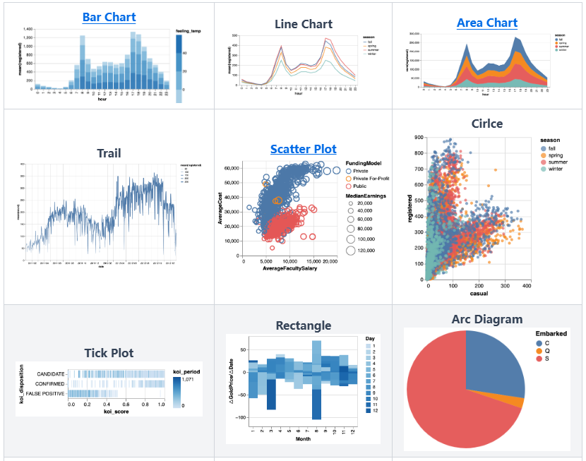  


<!-- 
<table>
  <tr>
    <td style="width: 260px; height: 250px;">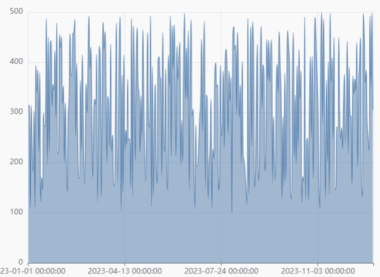</td>
    <td style="width: 260px; height: 200px;">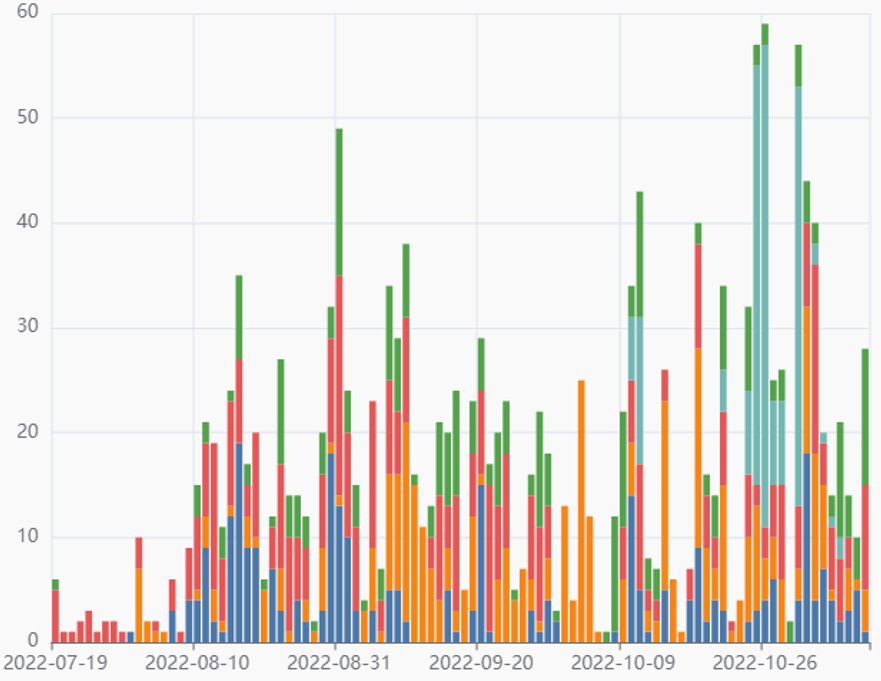</td>
  </tr>
  <tr>
    <td style="width: 260px; height: 250px;">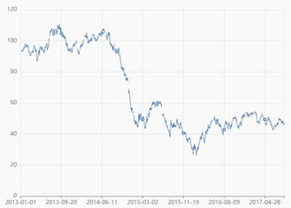</td>
    <td style="width: 260px; height: 250px;">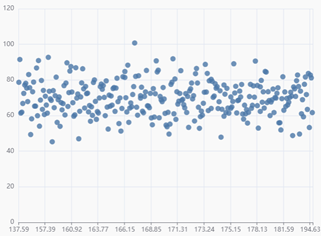</td>
  </tr>
</table> -->

Chart组件支持的图标类型包括：

* 标准Chart类型: 如柱状
* 图（bar）、折线图（line）、散点图（point）、面积图（area）
* 组合图表：如Grid组合、overlap等（开发中）
* 其他图表：如地图、箱线图（盒须图）、词云图（WordCloud）、漏斗图等（开发中）


### 创建Chart

鼠标移动至单元格的下边界，当显示悬浮操作框时，单击`更多类型`，然后选择`Chart`。

<!-- 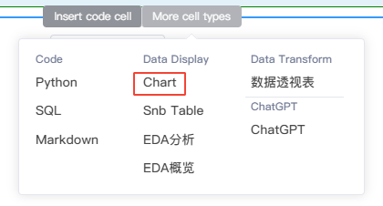   -->
  
 

<!-- 
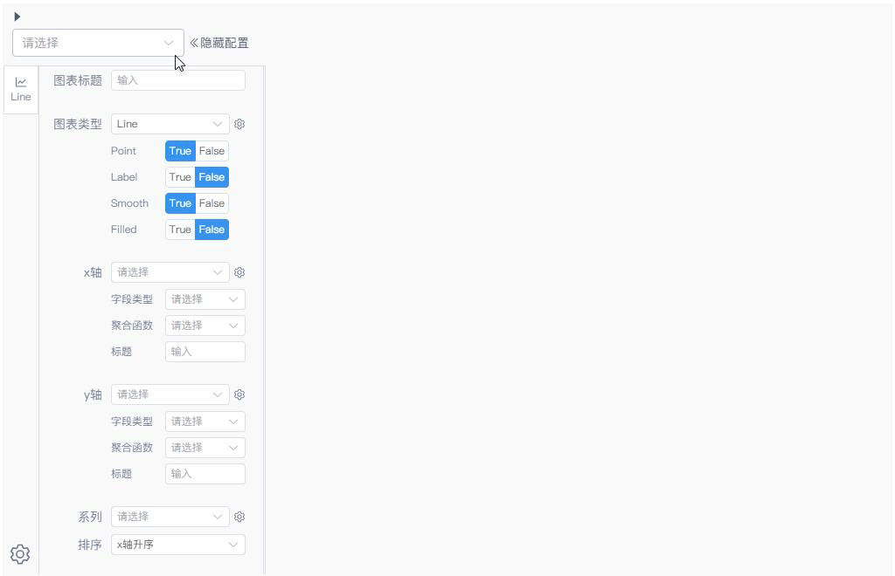   -->

### 基础操作

为了学习Chart的基本操作，我们创建一个简单的柱状图，分析泰坦尼克数据中`亲戚个数`与`生还数量`的情况。

<!--   -->

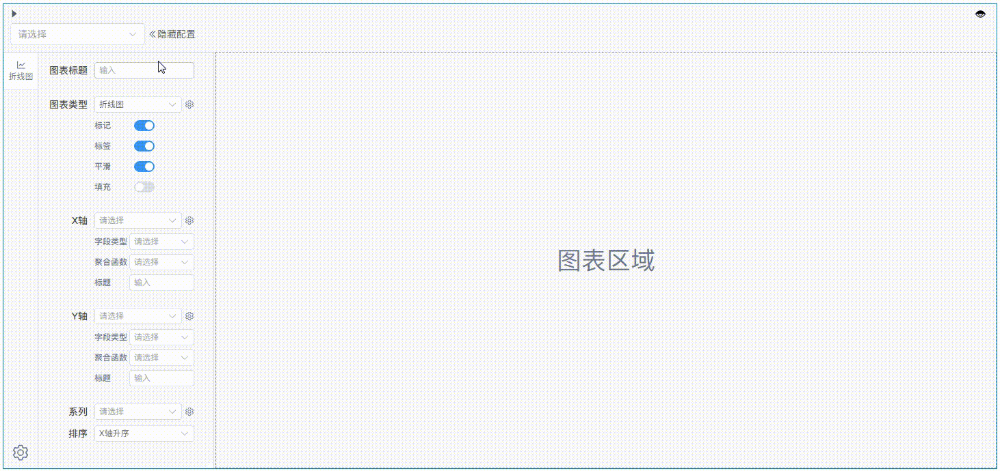  

通过上面例子，Chart组件大致操作流程如下：

1. 选择要分析的DataFrame
2. 输入标题（可选）、选择图表类型并配置图表参数
3. 选择X、Y轴字段并设置聚合函数、字段类型和格式等
4. 设置多系列和排序方式
5. 运行单元格

<!--    -->
<!-- 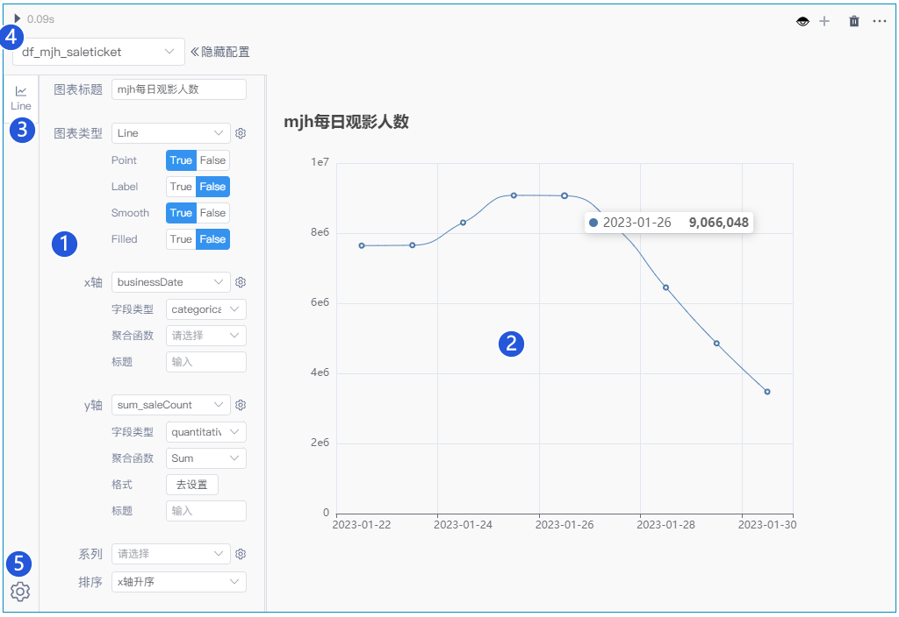   -->

<!-- 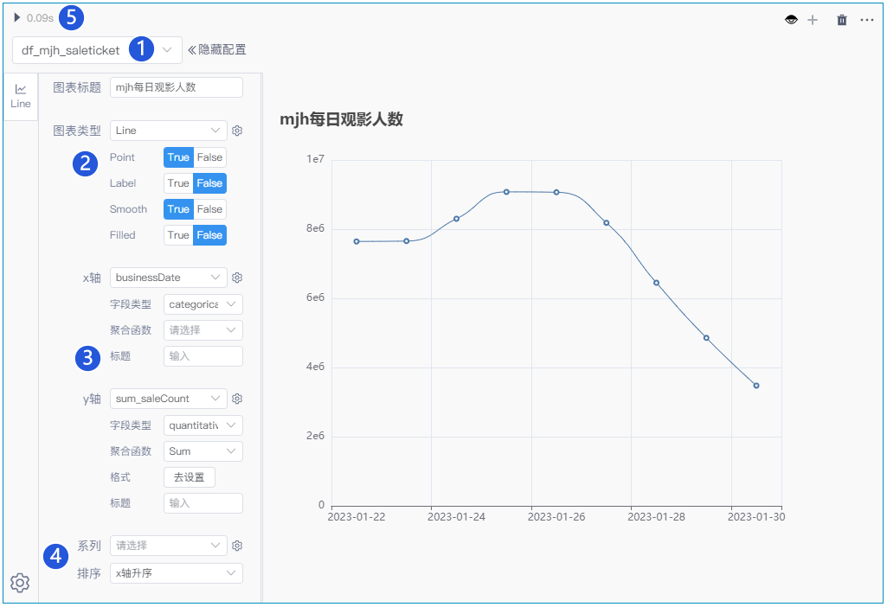   -->

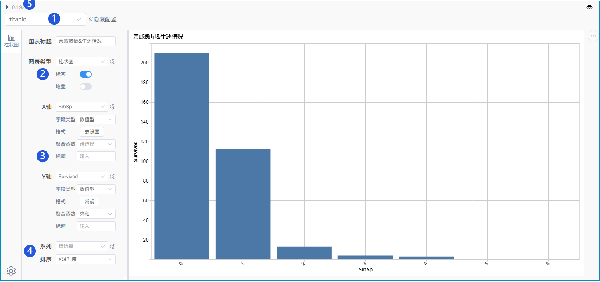  


以下我们对Chart的一些功能点做简要介绍：

### 图表类型参数

#### 柱状图

| 配置项  | 作用| 取值 | 备注 |
| :-----| :-----| :---- | :---- | 
|  标签 | 开关项：设置数据系列中是否显示标签| 开启/关闭 | 默认：开启|
|  堆叠 | 开关项：设置数据系列中是否堆叠显示| 开启/关闭 | 默认：关闭|

#### 折线图

| 配置项  | 作用| 取值 | 备注 |
| :-----| :-----| :---- | :---- | 
|  标记 | 开关项：设置数据系列中的数据点是否显示圆点标记| 开启/关闭 | 默认：开启|
|  标签 | 开关项：设置数据系列中是否显示标签| 开启/关闭 | 默认：开启|
|  平滑 | 开关项：设置折线是否平滑| 开启/关闭 | 默认：开启|
|  填充 | 设置是否填充折线下方区域| 开启/关闭 | 默认：关闭|

#### 散点图

| 配置项  | 作用| 取值 | 备注 |
| :-----| :-----| :---- | :---- | 
|  标签 | 开关项：设置数据系列中是否显示标签| 开启/关闭 | 默认：开启|
|  形状 | 设置散点的形状| 圆/正方形/菱形/三角形/上三角/下三角/右三角/左三角/楔子/十字 | 默认：圆|
|  大小 | 设置散点大小| 正整数| 默认：120|

#### 面积图

| 配置项  | 作用| 取值 | 备注 |
| :-----| :-----| :---- | :---- | 
|  标记 | 开关项：设置数据系列中的数据点是否显示圆点标记| 开启/关闭 | 默认：开启|
|  标签 | 开关项：设置数据系列中是否显示标签| 开启/关闭 | 默认：开启|
|  平滑 | 开关项：设置折线是否平滑| 开启/关闭 | 默认：开启|

### X/Y 轴字段选择

字段选择列表左边显示字段名称，右侧显示系统默认识别的字段类型。

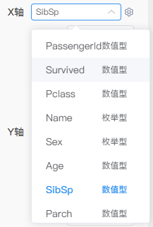  

### 更改字段类型

支持以下字段类型：

1. **数值型 (Numeric)**：
    - 描述：这种类型的字段用于存储数字，这些数字可以是整数或小数。
    - 用途：用于存储需要进行数学计算的数据，例如价格、数量、分数、百分比等。
    - 例子：商品的价格为100.50元，这个100.50就是数值型数据。

2. **枚举型 (Enumeration)**：
    - 描述：枚举型字段由一组预定义的值组成，通常用于表示一组固定的选项或类别。
    - 用途：用于限制某个字段的值只能选择预定义的几个选项。
    - 例子：订单状态可以是“未支付”、“已支付”、“已发货”、“已完成”等，这些状态就可以定义为枚举型数据。

3. **序列型 (Sequential)**：
    - 描述：序列型字段表示按照某种规律或顺序生成的数据序列。
    - 用途：常用于生成唯一的标识符，如订单编号、用户ID等。
    - 例子：每当有新订单时，订单编号可能会按照某种规律递增，如从001到002再到003，这样的编号就是序列型数据。

4. **时间型 (Datetime)**：
    - 描述：时间型字段用于存储日期和/或时间信息。
    - 用途：记录事件发生的日期和时间，如订单的下单时间、用户的注册日期等。
    - 例子：2023-08-07 15:30:00 表示某个事件在2023年8月7日的下午3点30分发生，这就是一个时间型数据。

不同的数据类型下可以设定相应的格式显示，更改数据类型将影响数据的处理和呈现方式。

<!-- 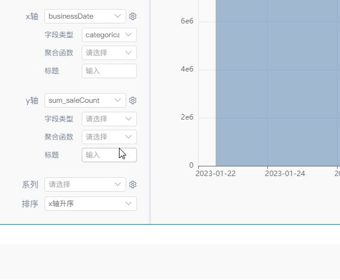   -->
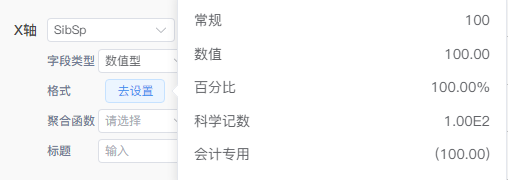  

### 聚合数据

支持对行/列数据使用以下聚合函数：

1. **计数 (Count)**
    - 描述：计算特定字段中的项目数量。
    - 示例：如果我们有一个订单列表，计数函数可以告诉我们共有多少个订单。

2. **求和 (Sum)**
    - 描述：将特定字段中的所有数字加起来。
    - 示例：在销售数据中，求和函数可以用来计算所有订单的总销售额。

3. **平均值 (Average)**
    - 描述：计算特定字段中所有数字的平均值。
    - 示例：在学生成绩列表中，平均值函数可以告诉我们学生的平均分数是多少。

4. **中位数 (Median)**
    - 描述：找到特定字段中所有数字的中间值。当数字按升序排列时，中位数是位于中间的数字。
    - 示例：在一个包含员工工资的列表中，中位数函数可以告诉我们中间员工的工资是多少，这有助于识别工资分布。

5. **最小值 (Min)**
    - 描述：确定特定字段中的最小数字。
    - 示例：在商品销售价格列表中，最小值函数可以告诉我们哪个商品的价格最低。

6. **最大值 (Max)**
    - 描述：确定特定字段中的最大数字。
    - 示例：在一组记录跑步时间的数据中，最大值函数可以告诉我们最慢的跑步时间是多少。

7. **标准差 (Standard Deviation)**
    - 描述：衡量数据点偏离平均值的程度。高标准差意味着数据点离平均值差距较大，而低标准差意味着数据点接近平均值。
    - 示例：在学生成绩数据中，标准差可以告诉我们学生成绩的分散程度或稳定性。

8. **方差 (Variance)**
    - 描述：衡量数据点偏离其平均值的程度的平方。它是标准差的平方。
    - 示例：在股票价格数据中，方差可以帮助我们了解价格的波动程度。

这些聚合函数为数据分析提供了强大的工具，使我们能够从大量数据中提取有意义的信息和洞察。


<!-- 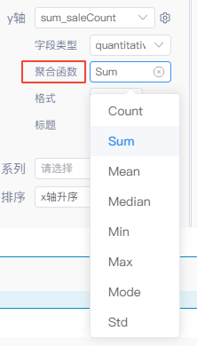   -->

  


### 添加系列

当需要在一张图表上绘制多列，如果数据满足不同类型的标签共享相同的度量单位，此时可以通过添加系列来实现。这不仅使你能够在同一张图表上比较不同数据系列的趋势，而且还可以更直观地看到它们之间的关系。例如：

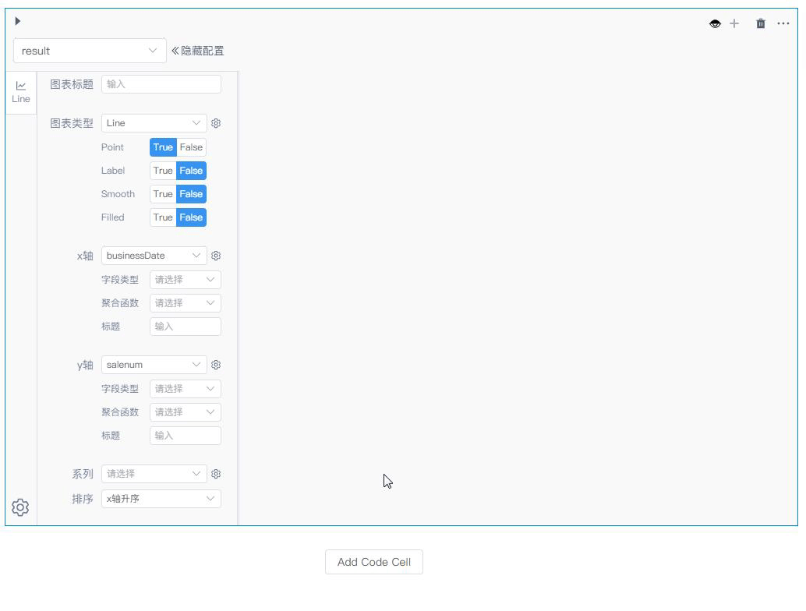  

注意事项：

- 当你在图表上添加多个系列时，确保它们的度量单位是相同的，这样才能确保数据的比较是有意义的。

- 为了避免混淆，系统会自动为每个系列选择一个独特且与其他系列区分开的颜色。

- 如果图表中有太多的系列，可能会使图表变得混乱且难以解读。在这种情况下，考虑是否可以将一些系列合并，或者使用不同的图表类型，如堆叠柱状图。

#### 分箱

通常使用"分箱"（也称为"分桶"）将一系列的数据值划分为几个不同的范围或类别。

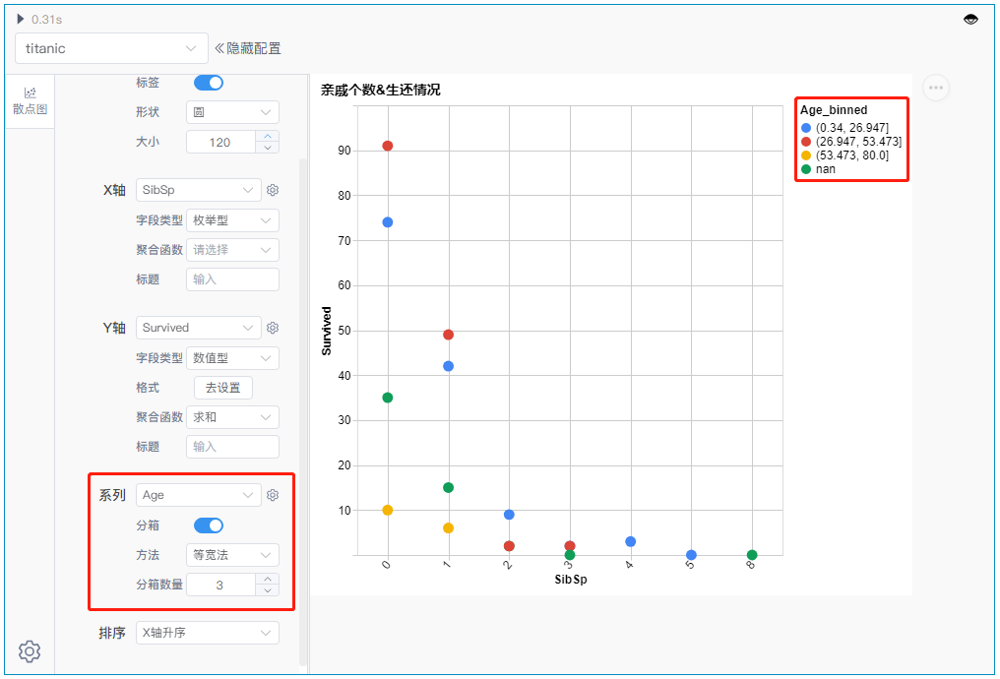  

**如何使用系列分箱功能：**

1. **开启分箱开关**

2. **选择分箱方法**：开启分箱功能后，您将有两种分箱方法可供选择：

   - **等宽法**：这种方法会将整个数据范围分为具有相同宽度的“箱子”或区间。例如，如果数据范围是0-100，您选择了5个箱子，那么数据会被分为0-20, 20-40, 40-60, 60-80, 80-100这五个区间。

   - **等频法**：这种方法会根据数据的分布，确保每个“箱子”里有大致相同数量的数据点。例如，对于一组有100个数据点的数据，如果您选择了5个箱子，那么每个箱子里都会有大约20个数据点。

3. **选择分箱数量**：确定了分箱方法后，您还需要指定要创建的“箱子”或区间的数量。输入合适的数字，系统将根据您的选择自动为数据进行分箱。

### 排序

Chart提供了多种用于对数据排序的选项：

<!-- 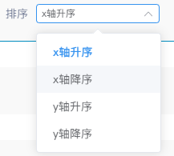   -->
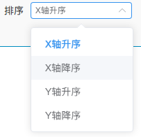  


<!-- ### 显示/隐藏图例

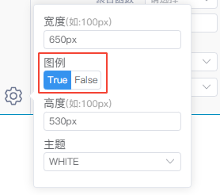   -->

### 图表设置

点击Chart组件左下角的设置按钮   可以看到一些图表的设置选项。

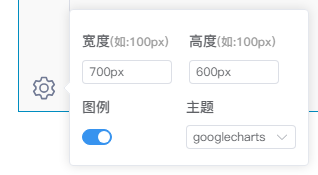  

#### 宽度/高度

允许用户自定义Chart的宽度和高度，宽度和高度值都应该是以像素（px）为单位的整数。

#### 主题设置

设置图表的主题样式：

- **dark**: 为深色背景设计的主题，具有亮色的文本和元素，以确保对比度和可读性。
- **excel**: 仿照 Microsoft Excel 默认图表的样式设计。
- **fivethirtyeight**: 受到 FiveThirtyEight 数据新闻网站的图表样式启发。
- **ggplot2**: 模仿 R 语言的 ggplot2 包的默认样式。
- **googlecharts**: 受到 Google Charts 工具的样式启发。
- **latimes**: 受到《洛杉矶时报》的数据可视化风格启发，提供了一种在报纸的数字出版物中常见的清晰和专业的外观。
- **powerbi**: 仿照 Microsoft Power BI 的默认图表样式。
- **quartz**: 受到 Quartz 新闻网站图表样式的启发。
- **urbaninstitute**: 受到 Urban Institute 的数据可视化风格启发。
-  **VOX**: 受到 Vox 新闻网站的图表样式启发。

<!-- 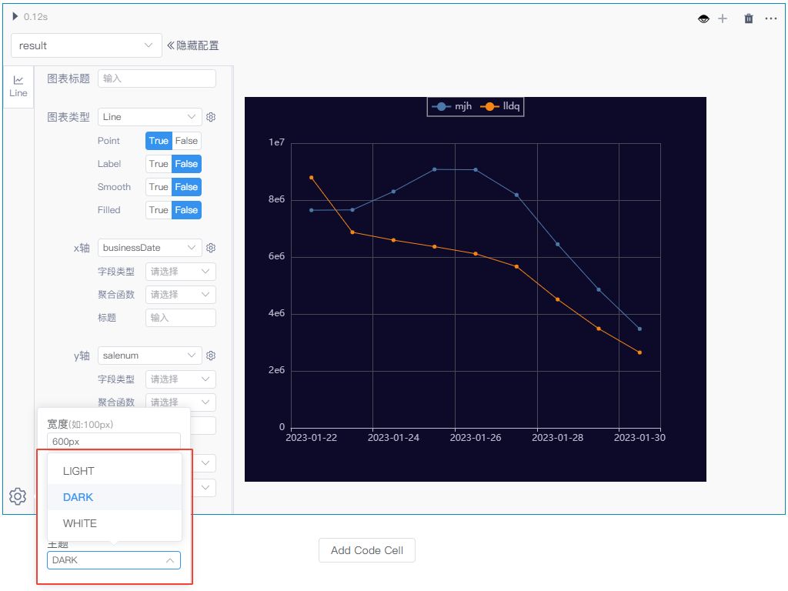   -->
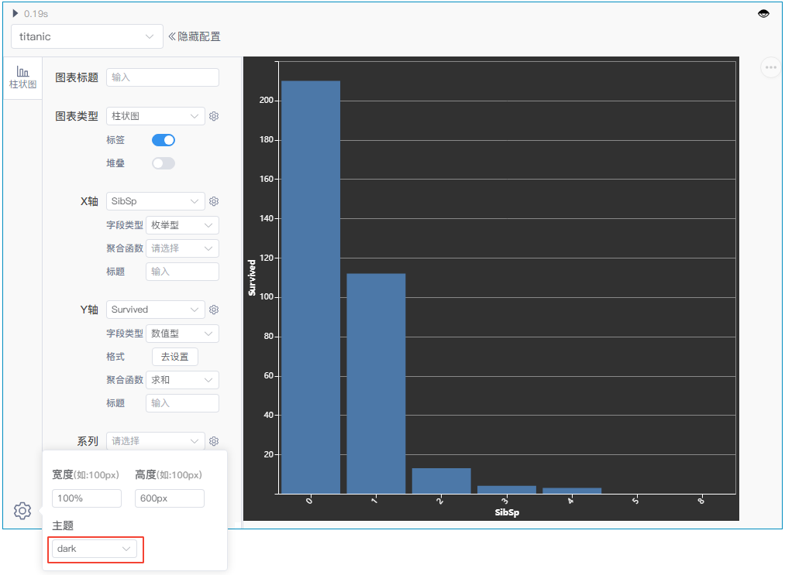  


#### 图例

允许用户通过开关项配置图例的显隐。

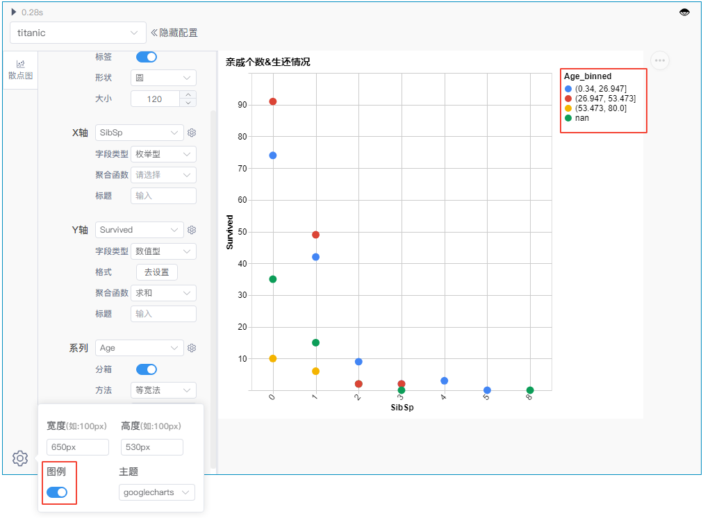  


### 隐藏/显示配置

允许用户根据需要显示或隐藏图表的配置区域。当配置区域被隐藏时，图表的图形区域将被最大化显示，使得图表更为清晰并占据更多的屏幕空间。

<!--    -->
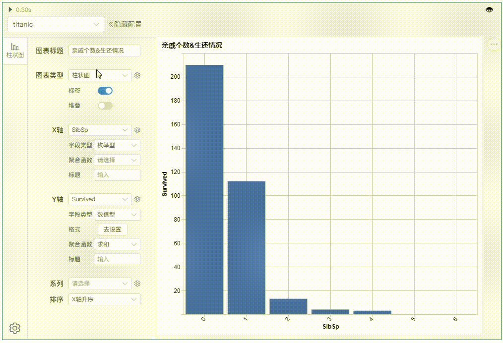  


### 代码拷贝

允许用户直接从Chart组件中复制图表的代码，并将其粘贴到Python单元格中。用户可以在Python环境中更加灵活地自定义和修改图表。

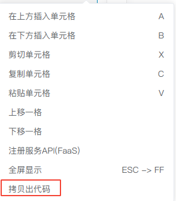  

<!-- 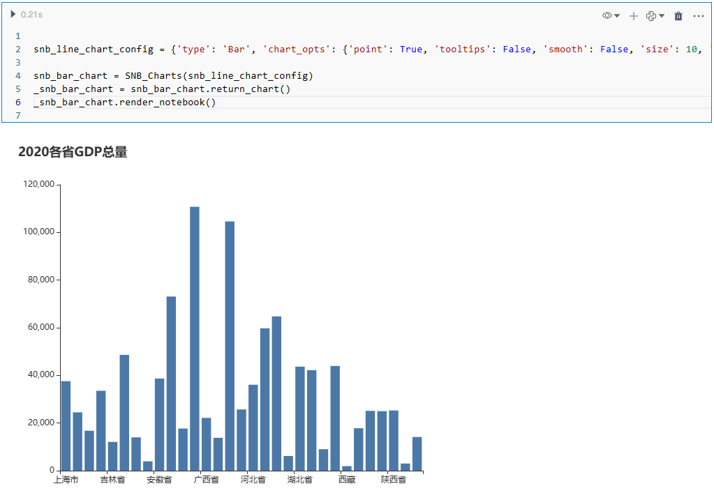   -->

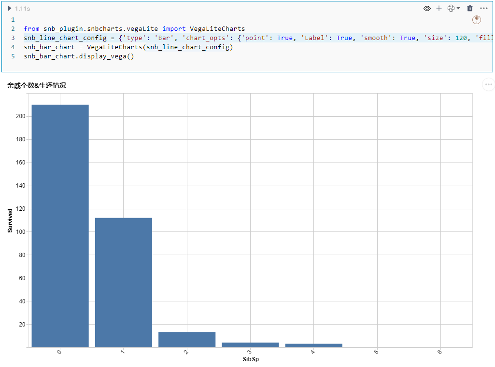  


## Chart开放API

Chart API 为您提供了一个以编程方式自定义显示图表的方式。

**样例** 

### 河流图themeRiver

```
from snb_plugin.snbcharts.SnbCharts import themeRiver

themeRiver(df, date, series, value, title='', height='550px', width='960px')
```
接口说明：
- df：数据集，类型：`pandas.DataFrame`
- date：日期参数，格式为字符串类型'2022-07-09'
- series：按照选定的维度进行展现
- value：统计数据，选择需展现的数值
- title：图表的标题
- height：高度，格式：`px` 或`百分比`
- width：宽度，格式：`px`或`百分比`

样例：

```
from snb_plugin.snbcharts.SnbCharts import themeRiver

themeRiver(temp,'day','project','count_day',height='550px', width='960px')
```

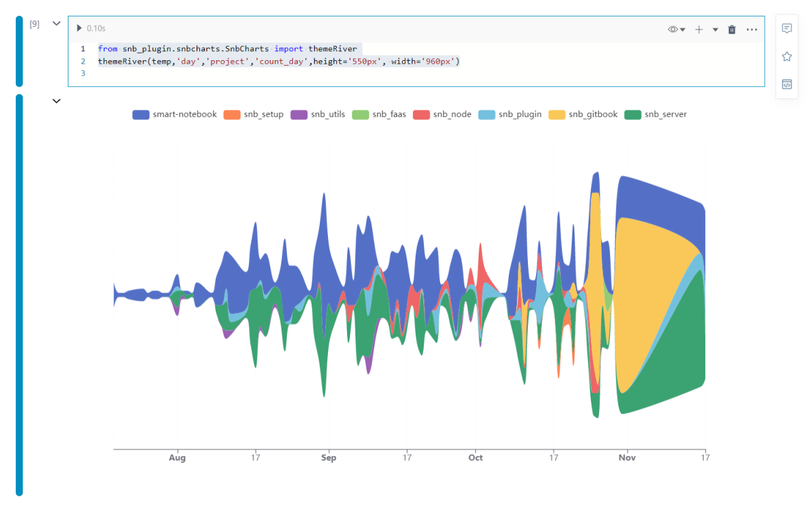  

### 散点图scatterChart

```
from snb_plugin.snbcharts.SnbCharts import scatterChart

scatterChart(df, x_col, y_col, size_col, series=None, title='', height='550px', width='960px')
```
接口说明：
- df：数据集，类型：`pandas.DataFrame`
- x_col：x轴显示列
- y_col：y轴显示列
- size_col：统计数据，选择需展现的数值
- series：按照选定的维度进行展现
- title：图表名称
- height：高度，格式：`px` 或`百分比`
- width：宽度，格式：`px`或`百分比`

样例：
```
from snb_plugin.snbcharts.SnbCharts import scatterChart

scatterChart(df,'hour','week_cn','count_hour',series=None, title='SmartNotebook', height='550px', width='960px')
```

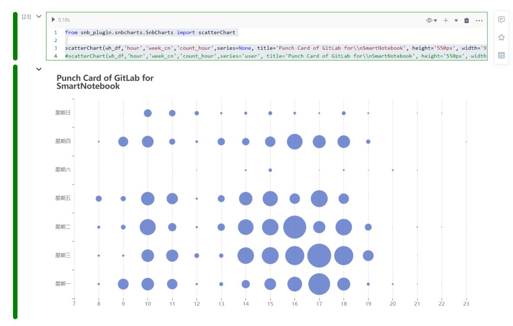  

### 散点图极坐标scatterPolarChart

```
from snb_plugin.snbcharts.SnbCharts import scatterPolarChart

scatterPolarChart(df, x_col, y_col, size_col, series=None, title='', height='550px', width='960px')
```
接口说明：
- df：数据集，类型：`pandas.DataFrame`
- x_col：x轴显示列
- y_col：y轴显示列
- size_col：统计数据，选择需展现的数值
- series：按照选定的维度进行展现
- title：图表名称
- height：高度，格式：`px` 或`百分比`
- width：宽度，格式：`px`或`百分比`

样例：

```
from snb_plugin.snbcharts.SnbCharts import scatterPolarChart

scatterPolarChart(df,'hour','week_cn','count_hour',series=None, title='SmartNotebook', height='550px', width='960px')
```

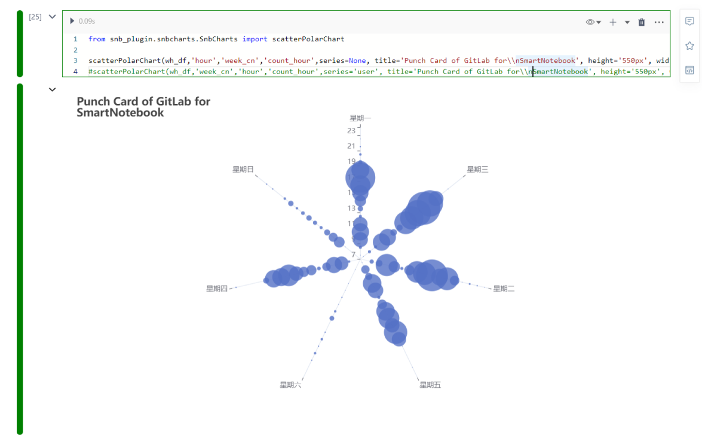  

### 热力图 heatmapChart

```
from snb_plugin.snbcharts.SnbCharts import heatmapChart

heatmapChart(df, x_col, y_col, size_col, title='', height='550px', width='960px')
```
接口说明：
- df：数据集，类型：`pandas.DataFrame`
- x_col：x轴显示列
- y_col：y轴显示列
- size_col：统计数据，选择需展现的数值
- title：图表名称
- height：高度，格式：`px` 或`百分比`
- width：宽度，格式：`px`或`百分比`

样例：
```
from snb_plugin.snbcharts.SnbCharts import heatmapChart

heatmapChart(df,'hour','week_cn','count_hour', title='SmartNotebook', height='550px', width='960px')
```

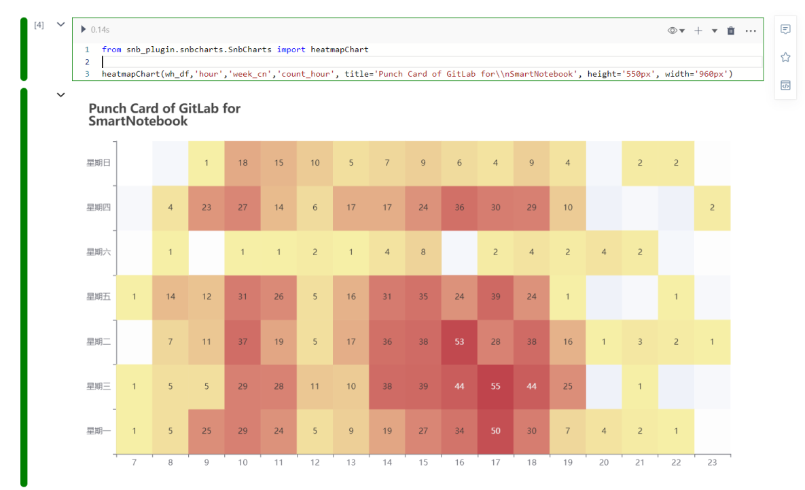  

### 雷达图radarChart

```
from snb_plugin.snbcharts.SnbCharts import radarChart

radarChart(df, column, series, value, title='', height='550px', width='960px')
```
接口说明：
- df：数据集，类型：`pandas.DataFrame`
- column：显示列
- series：按照选定的维度进行展现
- value：统计数据，选择需展现的数值
- title：图表名称
- height：高度，格式：`px` 或`百分比`
- width：宽度，格式：`px`或`百分比`

样例：
```
from snb_plugin.snbcharts.SnbCharts import radarChart

radarChart(df, "hour", "week_cn", "count_week_cn", title='SmartNotebook', height='550px', width='1600px')
```

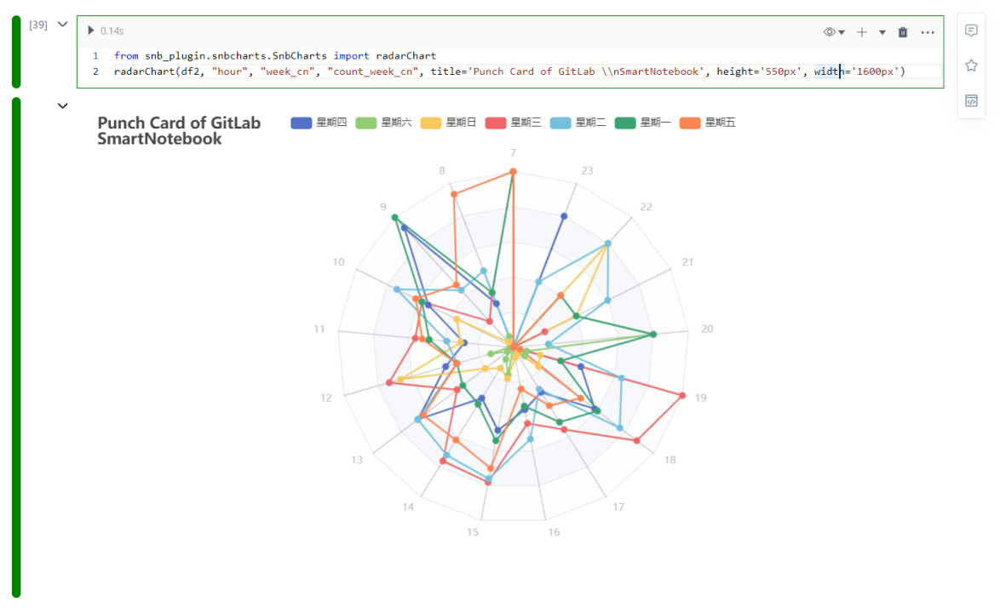  

### 盒须图boxPlot

```
from snb_plugin.snbcharts.SnbCharts import boxPlot

boxPlot(df, series, value, title='', height='550px', width='960px')
```
接口说明：
- df：数据集，类型：`pandas.DataFrame`
- series：按照选定的维度进行展现
- value：统计数据，选择需展现的数值
- title：图表名称
- height：高度，格式：`px` 或`百分比`
- width：宽度，格式：`px`或`百分比`

样例：
```
from snb_plugin.snbcharts.SnbCharts import boxPlot

boxPlot(df, 'Province', 'per_gdp', title='SmartNotebook', height='550px', width='980px')
```

  


### 桑基图(Sankey Diagram)

Sankey Diagram，用来展示数据的“流动”变化。

  - 左右两侧的矩形叫做“节点”，代表了不同的对象
  - 节点与节点之间的流线叫做“边”，代表数据的流动
  - 边的粗细与流量（流动数据的具体数值叫做“流量”）成比例，流量越大，边的线条越粗。

```
from snb_plugin.snbcharts.SnbCharts import  sankeyChart

sankeyChart(node_df,link_df,node_config={"name_col":"","value_col":"","info_col":""},
                link_config={"src_col":"","dst_col":"",
                "value_col":"","info_col":"","degree_col":""},
                title="",height="1080px",width="100%")
```
接口说明：
- node_df,link_df：数据集，类型：`pandas.DataFrame`
- node_config：节点相关配置项
  - "name_col"：设置节点对应的数据列
  - "value_col"：设置节点对应的数值（数值越大，节点的柱子越宽）
  - "info_col"：节点需显示的详细消息
- link_config：边的相关配合项
  - "src_col"：源节点的标识
  - "dst_col"：目标节点的标识
  - "value_col"：设置边对应的数值（数值越大，边的线条越粗）
  - "info_col"：边上需显示的详细消息
  - "degree_col"：控制边的透明度（数值越大，线条越明显）
- title：图表名称
- height：高度，格式：`px` 或`百分比`
- width：宽度，格式：`px`或`百分比`

样例：
```
from snb_plugin.snbcharts.SnbCharts import  sankeyChart

sankeyChart(df4,df2,node_config={"name_col":"ip","value_col":"msg_count","info_col":"info"},
                link_config={"src_col":"srcAddress","dst_col":"destAddress",
                "value_col":"s_msg_count","info_col":"info","degree_col":"opacity"},
                title="",height="1080px",width="100%")
```
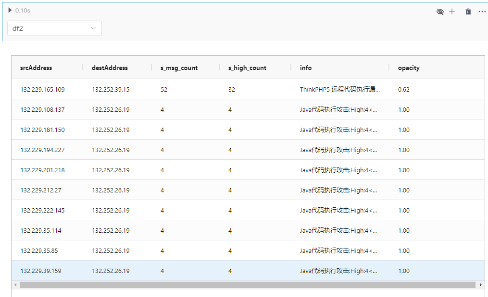  
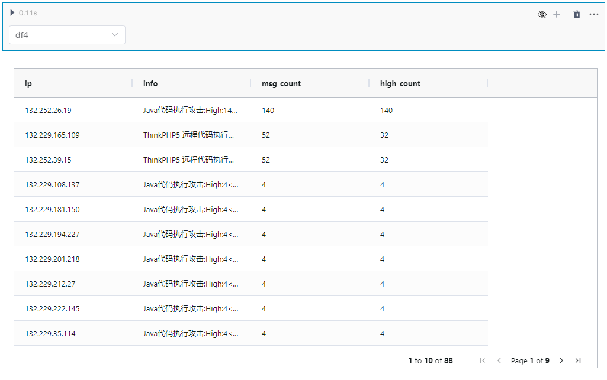  
  

## Table组件

Table组件除用作展示数据集，同时也具备一定的可视化交互能力，如对特征值进行条件筛选和排序。

### 创建

鼠标移动至单元格的下边界，当显示悬浮操作框时，单击`更多类型`，然后选择`Table`。

<!-- 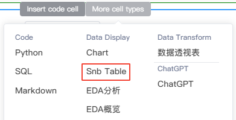   -->
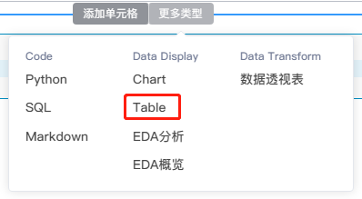  


### Table使用

* 选择数据集
* 可自定义显示的行数（默认200行）
* 可自定义数值的小数位数（默认保留2位小数）
* 单击字段标题可进行排序（初始状态、升序、降序）
* 点击字段标题右侧筛选按钮可进行逻辑条件筛选

<!-- 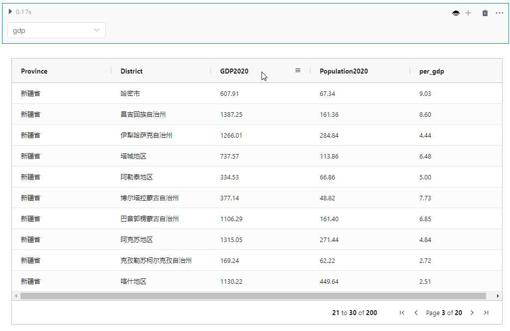   -->
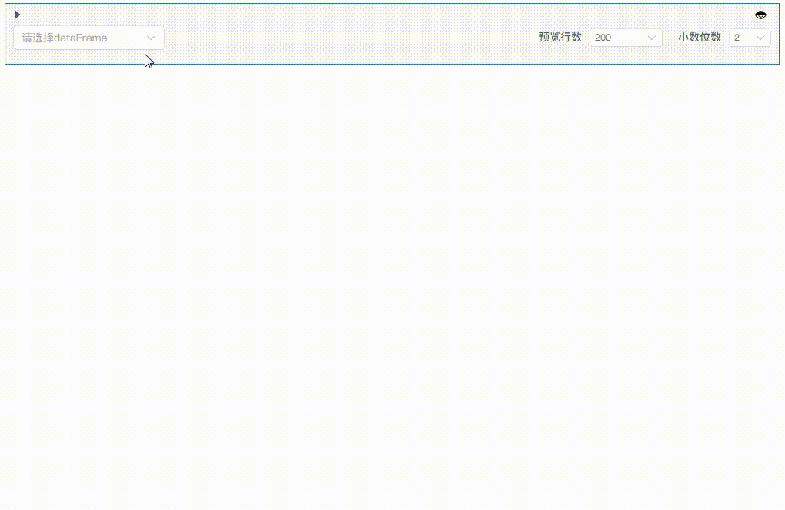  


### 通过接口自定义Table

除使用Table组件外，SNB也提供了Table的开放接口。用户也可通过Python调用__SNB_DisplayTable接口自定义显示Table

```
__SNB_DisplayTable(df,rownum=200,height="520px", width="100%",PageSize=10,nd=2)
```
接口说明：
- df：数据集，格式：`pandas.DataFrame`
- rownum：显示行数，格式：`int`
- height：高度，格式：`px` 或`百分比`
- width：宽度，格式：`px`或`百分比`
- PageSize：单页显示数量，格式：`int`
- nd：用于控制数据集中数值类型小数点后保留几位小数，格式：`int`。默认保留两位小数

