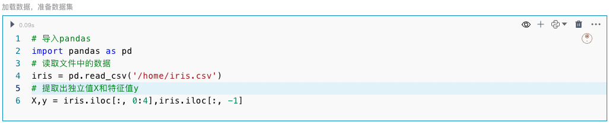

<!-- 分类 -->
## 界面介绍
左侧为数据集的字段列表，中间为算法的主要操作区域，右侧为评价指标展示区域，展示模型的评估结果。

## 相关算法说明
分类算法通过对已知类别训练集的计算和分析，从中发现类别规则并预测新数据的类别。 

| 算法名称 | 概念 | 优点 | 缺点 |适用场景 |
| --- | --- | --- | --- |--- |
| 逻辑回归（Logistic Regression） | 逻辑回归是一种线性模型，广泛用于二分类问题。它通过逻辑函数（Sigmoid函数）将线性回归的输出值映射到0到1之间，从而输出预测概率。| 易于实现和解释； 计算效率高。| 对非线性数据效果较差； 容易受异常值影响。 | 医学诊断（如疾病预测）、 市场营销（如客户分类）|
| 决策树（Decision Tree）| 决策树是一种树状结构，每个节点表示一个特征，每个分支表示该特征的可能取值，每个叶节点表示一个类别。通过对特征进行条件判断，决策树可以进行分类。 | 简单直观，易于解释； 不需要标准化数据| 容易过拟合； 对噪声数据敏感。 | 客户流失预测、 风险评估|
| 随机森林（Random Forest）| 随机森林是由多棵决策树组成的集成算法，通过对多个决策树的预测结果进行投票来决定最终分类结果。它利用了Bagging技术（Bootstrap Aggregating）和随机特征选择，增强了模型的泛化能力。 | 减少过拟合问题； 对噪声数据鲁棒；  具有较高的准确性。| 计算开销较大； 模型解释性较差。 | 图像识别、 金融风险预测 |
| 支持向量机（Support Vector Machine, SVM）| 支持向量机通过找到最佳决策边界（超平面）将数据点分开，以最大化决策边界到最近数据点（支持向量）的距离。它可以通过核函数处理非线性分类问题。| 能处理高维数据； 适用于线性和非线性数据；  对小样本数据集效果好。| 对大规模数据集计算开销大； 模型参数调节较复杂。 | 文本分类、 图像分类 |
| K近邻（K-Nearest Neighbors, KNN）| K近邻算法是一种基于实例的学习算法，通过计算新数据点与训练数据集中每个点的距离，选择距离最近的K个点，并根据这些点的类别进行分类。 | 实现简单，无需训练过程；  适用于多分类问题； 可处理非线性数。| 预测时计算开销大； 对噪声敏感。 | 推荐系统、 模式识别 |
| 朴素贝叶斯（Naive Bayes）| 朴素贝叶斯是一种基于贝叶斯定理的概率分类算法，假设特征之间相互独立。尽管这种假设在实际中并不总是成立，但朴素贝叶斯在很多应用中表现良好。 | 实现简单，计算效率高；  对高维数据表现良好； 能处理缺失数据。| 假设特征独立，可能不符合实际情况； 对连续数据的处理较为简单。 | 垃圾邮件过滤、 文本分类 |

## 操作步骤
### 1.加载数据  
你可以使用pandas库从csv、json、txt等格式的文件中加载数据，也可以直接从数据库中加载数据。这里以文件加载的方式进行介绍： 

### 2.添加分类组件  
将鼠标光标移动至单元格的下边界，点击“更多类型”按钮，选择ML/AI类型下的“分类”，点击后即可添加完成。
  
### 3.选择数据集     
在组件的左上角单击下拉框，选择你需要处理的数据集。选择完成后，左侧的字段列表区域将展示该数据集的所有字段，包括字段名称和字段类型（123表示数值，Abc表示文本），此外，如果字段比较多，这里也支持字段搜索。

### 4.选择算法类型    
点击算法类型下拉框，选择合适的分类算法。例如选择“支持向量机”算法进行分类。   
### 5.选择特征（列）和目标列
* 默认情况下，“所有列”选项是开启的。如果您不希望使用排除列，可以关闭“所有列”选项。    
* 在“包含列”框中，从字段类表区域拖动所需的列。例如，将“Sepal_Length”和“Sepal_Width”拖动到“包含列”框中。    
* 在“排除列”框中，拖动要排除的列，将不需要的列拖动到“排除列”框中。
* 在“标签列”下拉框中选择目标列。

### 6.调整参数配置    

**例如支持向量机可以设置如下参数**：  
 * **随机种子**：在机器学习和数据分析中，设置随机种子可以确保每次运行代码时得到的随机结果是一致的。  
 * **测试集比例**：控制数据集划分为训练集和测试集的比例，这个比例是一个介于0和1之间的浮点数，表示测试集的占比，例如比例为0.3表示将30%的数据用作测试集，70%的数据用作训练集。
 * **正则强度导数**：该参数控制模型的正则化强度，以防止过拟合。“C”是一个正数，控制着正则化项的权重。较小的“C”值会增加正则化强度，限制模型复杂度，从而防止过拟合。较大的“C”值会降低正则化强度，使模型更关注训练数据的分类准确性。  
 * **核函数**：核函数用于将数据映射到更高维度，以解决线性不可分问题。核函数是支持向量机算法中很重要的部分，决定了模型如何在高维空间中找到最佳分割超平面。常用的核函数有线性核、多项式核、径向基核、Sigmoid核。  

| 核函数 | 说明 |    
| --- | --- |   
| 线性核（linear） | 适用于线性可分数据。 |  
| 多项式核（poly） | 适用于非线性数据，通过调整多项式的度数来控制映射到高维空间的复杂度。 |  
| 径向基核（RBF，也称高斯核） | 适用于非线性数据，能够将数据映射到无限维空间。|  
| Sigmoid核（sigmoid，也称双曲正切核） | 类似于神经网络中的激活函数，因此在某些情况下可以将支持向量机理解为一种特殊形式的多层感知器（MLP），但不如 RBF 核常用。 |  

 以测试集比例为0.3，使用核函数“rbf”、正则强度导数为1举例，选择Sepal_Length和Sepal_Width字段为特征列，Species为目标列进行分类操作。  

### 7.执行分类
定义保存模型和保存操作后数据结果的变量（添加组件时系统也会给出默认变量，可根据需要自行修改），执行后可得到分类模型的评估指标和混淆矩阵。

**从评估指标表中可以看出：**  
Accuracy(准确率)为0.78，这表示模型预测正确的比例是78%。  
Mean Squared Error（均方误差）为0.22，反映预测值与实际值之间的平均平方误差。数值越小，误差越小。   
ROC Area under Curve（ROC曲线下面积）是评价分类模型性能的一个指标，值越接近1，表示模型性能越好。这里的ROC曲线下面积为0.92 ，表示模型有很高的区分能力。  
Cohen's Kappa是一个衡量分类一致性的重要指标，0.67 表示模型预测与实际分类之间有较好的一致性。  
F1 Score（F1分数）是模型精确度和召回率的调和平均数，0.78表示该模型在平衡精确度和召回率方面表现良好。  
**从混淆矩阵可以看出：**  
第一行（True Label为0）：有15个样本被正确分类成了0类，0个样本被错误分成了1类，0个样本被错误分成了2类；  
第二行（True Label为1）：有0个样本被错误分类成了0类，有11个样本被正确分成了1类，有4个样本被错误分成了2类；  
第三行（True Label为2）：有0个样本被错误分成了0类，有6个样本被错误分成了1类，有9个样本被正确分成了2类；  
类别0的分类效果最好，没有任何错误的分类；类别1和类别2的分类效果相对较差。  
**总结：**  
整体来看，这个分类模型的性能不错，尤其是在区分类别 0 上表现很好。然而，在区分类别 1 和类别 2 时，模型表现有待提高。建议进一步优化模型参数，或者尝试其他分类算法，以提高对类别 1 和类别 2 的分类性能。

### 8.预测

可看出预测结果为1类
## 常见问题和解决方法  
### 数据缺失
数据集中有缺失值可能会导致训练和预测过程出错，如果数据中存在缺失值，考虑预处理填充缺失值或者删除。
### 标签列数据类型
标签列需为数值型，可以将目标列先处理成数值型，再进行分类。
### 数据不平衡
分类数据中某些类别的数据量明显少于其他类别，导致模型偏向于多数类。可以考虑重采样方法，或使用适合处理不平衡数据的算法，如调整类权重。
### 训练集和测试集划分
训练集和测试集划分不合理，可能导致模型过拟合或欠拟合。请确保使用适当的比例（如70/30或80/20）划分训练集和测试集，并考虑使用交叉验证来评估模型。
### 过拟合和欠拟合
模型在训练集上表现良好，但在测试集上表现不佳，说明模型过拟合或欠拟合。如果是过拟合，可以使用正则化技术、减少模型复杂度、增加训练数据；如果是欠拟合，可以考虑增加模型复杂度、添加更多特征。
### 参数配置
对参数配置不当，影响模型性能。可以先理解每个参数的意义和作用，根据具体任务合理配置参数。
### 模型选择不理想
不同的分类任务可能需要不同的模型，选择不合适的模型会导致性能不佳。可以考虑尝试多种模型并比较它们的性能，选择最适合具体任务的模型。
### 模型更新
模型在训练环境中表现良好，但在实际应用中表现不佳。所以在实际环境中测试模型时，需要监控模型的表现，并根据需要更新模型。调整类权重。