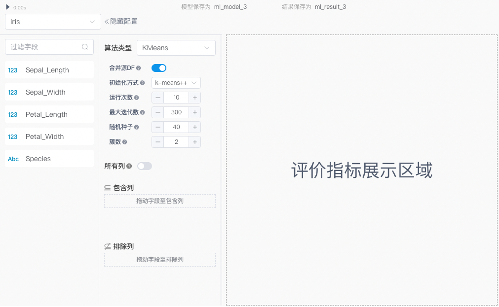
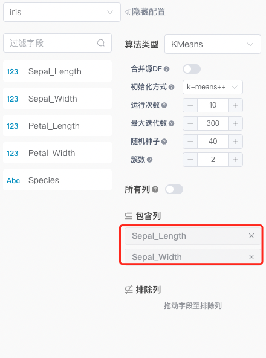
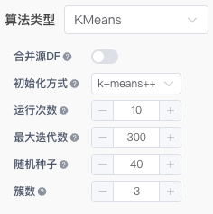
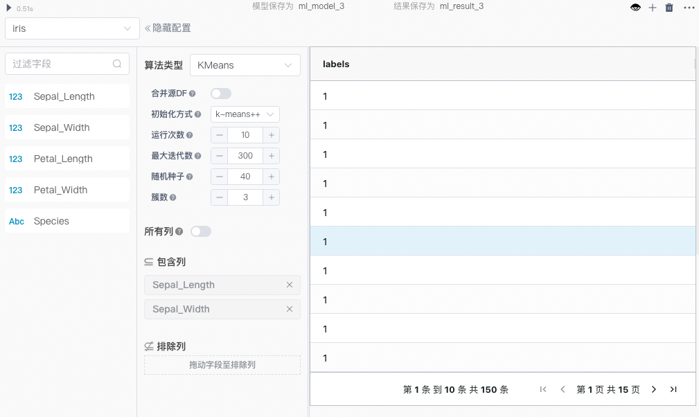
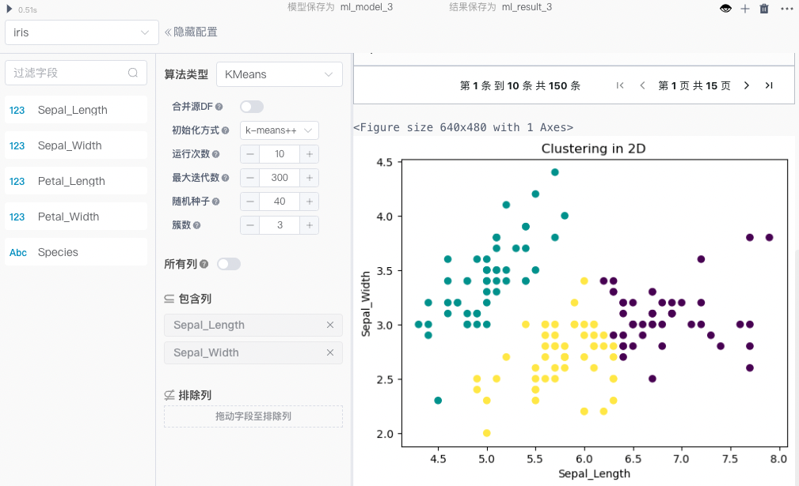
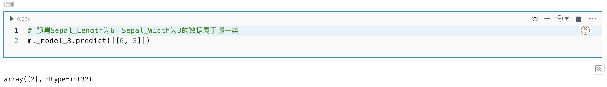

<!-- 聚类 -->
## 界面介绍
左侧为数据集的字段列表，中间为算法的主要操作区域，右侧为评价指标展示区域，展示数据结果。

## 相关算法说明
聚类是数据挖掘中的一种技术，旨在将数据对象分成若干个组，使得同一组中的对象彼此之间相似度高，而不同组之间的对象相似度低。以下介绍三种常用的聚类算法，并做出对比。 

| 算法名称 | 概念 | 优点 | 缺点 |适用场景 |
| --- | --- | --- | --- |--- |
| 均值漂移（Mean Shift） | 均值漂移是一种基于密度的聚类算法。它通过平滑密度估计将数据点移动到高密度区域的模式，即均值。算法不断迭代计算点的均值，并将每个点移动到该均值，直到所有点的移动幅度小于某个阈值。| 不需要指定簇的数量； 能够检测任意形状的簇。| 计算复杂度高，尤其是高维数据； 对于稀疏数据效果不佳。 | 图像分割、 目标跟踪 |
| KMeans | KMeans是一种基于划分的聚类算法，通过迭代优化将数据点分配到K个簇中。算法的目标是最小化簇内点到簇中心的距离平方和（即簇内误差平方和）。 | 算法简单易懂，计算速度快； 对于大规模数据集效果较好| 需要预先指定簇的数量K； 对初始中心点敏感，可能导致局部最优解； 只能检测球形簇。 | 图像压缩、  市场细分|
| 层次聚类（Hierarchical Clustering） | 层次聚类是一种基于树状结构的聚类方法，通过逐步合并或拆分簇，生成一个聚类树（树状图）。根据聚类树，可以任意选择层次进行聚类。 | 不需要预先指定簇的数量；  生成的树状结构可以提供聚类的多层次信息。| 计算复杂度高，尤其是大规模数据集； 对噪声和离群点敏感。 | 基因表达数据分析、 社交网络分析 |

## 操作步骤
### 1.加载数据  
你可以使用pandas库从csv、json、txt等格式的文件中加载数据，也可以直接从数据库中加载数据。这里以文件加载的方式进行介绍： 

### 2.添加聚类组件  
将鼠标光标移动至单元格的下边界，点击“更多类型”按钮，选择ML/AI类型下的“聚类”，点击后即可添加完成。   
  
### 3.选择数据集     
在组件的左上角单击下拉框，选择你需要处理的数据集。选择完成后，左侧的字段列表区域将展示该数据集的所有字段，包括字段名称和字段类型（123表示数值，Abc表示文本），此外，如果字段比较多，这里也支持字段搜索。

### 4.选择算法类型    
点击算法类型下拉框，选择合适的聚类算法。例如选择“KMeans”算法进行聚合。   
### 5.选择特征（列）
* 默认情况下，“所有列”选项是开启的。如果您不希望使用排除列，可以关闭“所有列”选项。    
* 在“包含列”框中，从字段类表区域拖动所需的列。例如，将“Sepal_Length”和“Sepal_Width”拖动到“包含列”框中。    
* 在“排除列”框中，拖动要排除的列，将不需要的列拖动到“排除列”框中。

### 6.调整参数配置 
通过合理设置这些参数，算法的性能和聚类结果的质量。根据具体的数据集和应用场景，调整参数以获得最佳的聚类效果。 
**例如KMeans算法可以设置如下参数**：       
 * **合并源DF**：表示降维后得到的结果数据是否要包含源数据集中的列。
 * **初始化方式**：初始化方式决定了初始簇中心的选择方式，不同的初始化方法可能导致不同的聚类结果，尤其是在数据点分布较为复杂的情况下。这里提供了k-means++和随机两种初始化方式，其中k-means++使用一种智能的方式初始化中心，能够加速收敛；random则是随机选择数据集中的点作为初始中心。
 * **运行次数**：运行次数是指KMeans算法运行的独立实验次数。每次运行从不同的初始簇中心开始，最终选择聚类结果最优的一次。这有助于避免局部最优解，增加得到全局最优解的概率。
 * **最大迭代数**：最大迭代数是指在单次运行中，算法允许的最大迭代次数。算法在每次迭代中更新簇中心，直到中心不再变化或达到最大迭代次数。设置过小的迭代次数可能导致算法未能完全收敛，设置过大则可能导致不必要的计算。
 * **随机种子**：不同的随机种子可能导致不同的初始簇中心，从而影响聚类结果。在机器学习和数据分析中，设置随机种子可以确保每次运行代码时得到的随机结果是一致的。在调试代码、结果复现等情况下比较适用。
 * **簇数**：簇数是指要将数据分成的簇的数量，是KMeans算法的核心参数。选择适当的簇数对于得到有意义的聚类结果非常重要。簇数可以通过经验、业务需求或使用如肘部法、轮廓系数等方法来确定。  
 这里以“k-means++”的初始化方式、运行次数设为10，最大迭代数设为300，簇数为3为例，对Sepal_Length和Sepal_Width字段数据进行聚类。  

### 7.执行聚类
定义保存模型和保存操作后数据结果的变量（添加组件时系统也会给出默认变量，可根据需要自行修改），执行后可得到以下聚类结果，可以查看结果数据，同时也通过散点图对数据进行了可视化展示。

可以看出这次聚类操作将数据分成了1、2、3三类，同一组中的对象（同一种颜色的数据点）彼此之间相似度高，而不同组（不同颜色的数据点）之间的对象相似度低。

### 8. 预测
我们可以使用上面的模型来进行预测一下[6,3]属于那种花,使用predict方法：

可以看出这个模型给出的预测值为2类。

## 常见问题和解决方法   
#### 数据类型不匹配
确保所选择的列数据类型与算法要求相匹配，比如主成分分析需要的数据类型是数值型。
#### 参数设置错误
检查运行次数、最大迭代数、簇数等参数是否设置正确。
#### 数据缺失
如果数据中存在缺失值，考虑预处理填充缺失值或者删除。
#### 聚类结果不理想
调整簇数，运行多次实验，以找到最佳的聚类数量。  
进行特征选择或标准化处理，以改善聚类效果。
