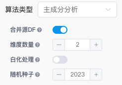

<!-- 降维 -->
## 界面介绍
左侧为数据集的字段列表，中间为算法的主要操作区域，右侧为评价指标展示区域，展示数据结果。

## 相关算法说明

| 算法名称 | 概念 | 优点 | 适用场景 |
| --- | --- | --- | --- |
| 主成分分析（PCA） | 主成分分析（PCA）是一种统计方法，用于将高维数据投影到低维空间。它通过线性变换将原始数据转换到一个新的坐标系中，使得最大的方差（即数据的最大变化）投影到新的坐标系的第一轴，第二大的方差投影到第二轴，依此类推。 | 降低数据维度的同时，尽可能保留数据的方差。| 数据预处理、 图像压缩、 特征提取  |
| 多维尺度法（MDS） | 多维尺度法（MDS）是一种降维技术，旨在将高维数据点嵌入到低维空间中，保留原始数据点之间的距离关系。MDS通过优化方法最小化高维数据点之间的距离与低维嵌入点之间距离的差异。 | 能够处理非线性数据关系。 | 心理学和社会学中的相似性分析、 市场研究中的消费者偏好分析 |
| 独立成分分析（ICA） | 独立成分分析（ICA）是一种统计和计算技术，用于将多变量信号分解为彼此统计独立的非高斯信号。ICA假设观测数据是由若干个独立信号线性混合而成，通过分离这些信号，可以发现隐藏在数据中的独立成分。 | 能够揭示数据中的独立信号源。 | 生物医学数据分析，如脑电图（EEG）分析 |
| 截断奇异值分解（Truncated SVD） | 截断奇异值分解（Truncated SVD）是奇异值分解（SVD）的一种形式，通过保留最大的奇异值及其对应的奇异向量来降低数据的维度。SVD将一个矩阵分解为三个矩阵的乘积，截断SVD则在分解后仅保留前k个奇异值及其对应的奇异向量。 | 有效减少数据维度，保留主要信息。| 文本分析中的潜在语义分析（LSA）、 图像压缩|
| t-SNE（t-Distributed Stochastic Neighbor Embedding） | t-SNE是一种降维技术，特别适合高维数据的可视化。它通过将高维数据点嵌入到低维空间中，最大程度地保留数据点在高维空间中的邻近关系。t-SNE通过构建数据点间的条件概率分布，最小化高维和低维分布之间的KL散度来实现降维。 | 在低维空间中保持数据点的局部结构。| 高维数据的可视化，如图像和文本数据|
| 流形近似和投影（UMAP）| 流形近似和投影（UMAP）是一种非线性降维方法，通过近似高维数据的流形结构，将数据嵌入到低维空间。UMAP利用拓扑数据分析和高效的数值优化技术来实现数据的降维。| 1. 计算效率高，适合大规模数据集。 2. 能够很好地保留数据的局部和全局结构。| 数据可视化、 聚类和分类的预处理|

## 操作步骤
### 1.加载数据  
你可以使用pandas库从csv、json、txt等格式的文件中加载数据，也可以直接从数据库中加载数据。这里以文件加载的方式进行介绍： 

### 2.添加降维组件  
将鼠标光标移动至单元格的下边界，点击“更多类型”按钮，选择ML/AI类型下的“降维”，点击后即可添加完成。   
  
### 3.选择数据集     
在组件的左上角单击下拉框，选择你需要处理的数据集。选择完成后，左侧的字段列表区域将展示该数据集的所有字段，包括字段名称和字段类型（123表示数值，Abc表示文本），此外，如果字段比较多，这里也支持字段搜索。

### 4.选择算法类型    
点击算法类型下拉框，选择合适的降维算法。例如选择“主成分分析”进行PCA降维。   
### 5.选择特征（列）
根据具体的需求选择需要进行降维的特征（列），例如这里选择 Sepal_Length、Sepal_Width、 Petal_Length、Petal_Width四列作为特征，只需要将这四个字段拖入“包含列”区域即可，或者在字段上单击左键，在弹出的功能菜单中选择“添加到包含列”或“添加排除列”。其中“所有列”开关可控制“排除列”是否有效，可以根据需要开启或关闭。

### 6.调整参数配置  
**例如主成分分析算法可以设置如下参数**：       
 * **合并源DF**：表示降维后得到的结果数据是否要包含源数据集中的列。
 * **维度数量**：表示要将数据降到多少个维度。
 * **白化处理**：将数据进行标准化，使得每个特征（列）的均值都为0，标准差都为1（即具有零均值和单位方差）。这样处理可以消除不同特征间量纲的影响，使得特征值在相同的尺度下进行比较和处理，有助于提升某些机器学习算法的性能。
 * **随机种子**：在机器学习和数据分析中，设置随机种子可以确保每次运行代码时得到的随机结果是一致的。在调试代码、结果复现等情况下比较适用。
 

### 7.执行降维
定义保存模型和保存操作后数据结果的变量（添加组件时系统也会给出默认变量，可根据需要自行修改）。

你可以将降维后的结果数据进行可视化，观察数据之间规律，例如绘制散点图。

## 常见问题和解决方法   
### 数据类型不匹配
确保所选择的列数据类型与算法要求相匹配，比如主成分分析需要的数据类型是数值型。
### 参数设置错误
检查维度数量、白化处理等参数是否正确。
### 数据缺失
如果数据中存在缺失值，考虑预处理填充缺失值或者删除。
