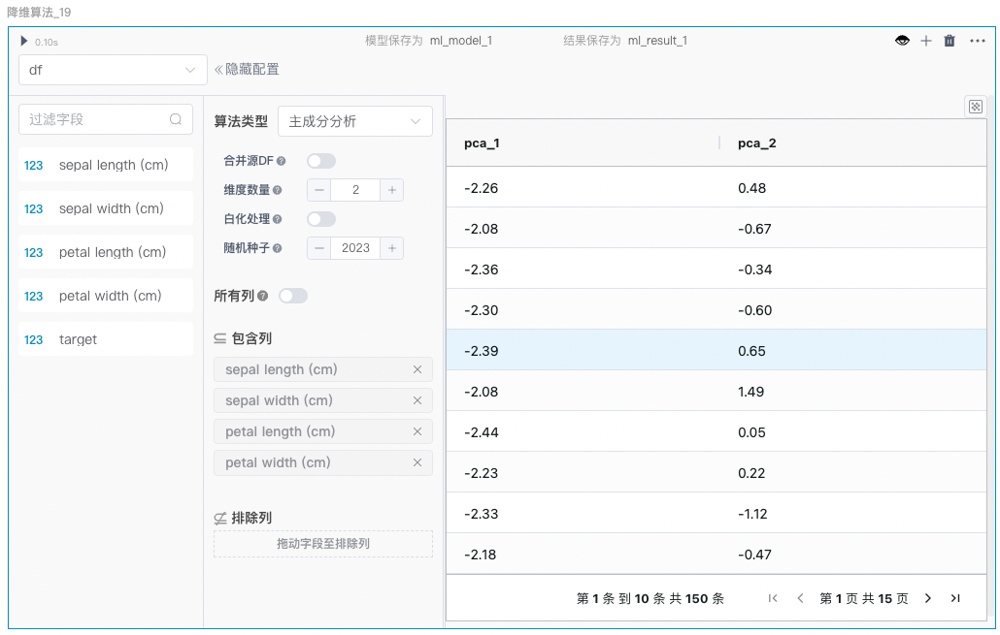

# 机器学习（Machine Learning）
&emsp;&emsp;机器学习（Machine Learning）是人工智能(AI)的核心，是使计算机具有智能的根本途径，其目标是让计算机系统通过学习数据和经验来改善其性能。简单的来说，机器学习算法能够从数据中学习模式，并用这些学习到的模式来做出预测和决策，而无需显式的编程。  
&emsp;&emsp;SmartNotebook中的机器学习组件是基于scikit-learn(sklearn)库封装的用于降维、聚类、分类、回归任务的低代码组件，这些低代码组件具有以下显著优点：
* **简单易上手**  
&emsp;&emsp;通过低代码的形式，用户可以轻松调用复杂的机器学习算法，无需深入了解底层实现细节。极大地降低了机器学习的使用门槛，适合各类用户从初学者到专家。
* **集成数据处理功能**  
&emsp;&emsp;组件内置了数据预处理功能，包括数据清洗、特征缩放、特征选择等步骤，使得用户可以在一个统一的平台上完成从数据预处理到模型训练和评估的全过程。  
* **功能全面**  
&emsp;&emsp;组件涵盖了广泛的机器学习任务，包括降维、聚类、分类、回归等，其中降维组件支持的算法有主成分分析（PCA）、多维尺度法、独立成分分析、截断奇异值分解、t-SNE以及流形近似和投影；聚类组件支持的算法有KMeans、均值漂移以及层次聚类；分类组件支持逻辑回归、决策树、随机森林、支持向量机（SVM）、K近邻以及朴素贝叶斯算法；回归组件支持线性回归、K近邻回归以及决策树回归算法。每种算法能设置对应的参数，可以根据需要进行调整，满足各种应用场景的需求。  
* **灵活性和可扩展性**  
&emsp;&emsp;用户可以通过调整组件的参数，灵活地配置和优化机器学习模型。支持多种模型和参数调优方法，确保模型性能达到最佳状态。  
 

