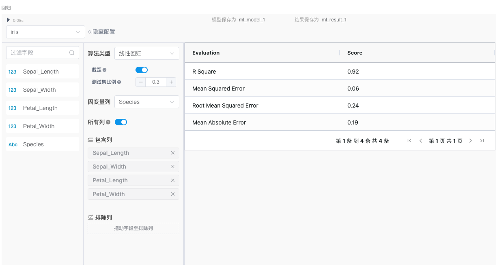
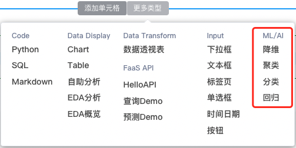

<!-- 回归 -->
## 界面介绍
左侧为数据集的字段列表，中间为算法的主要操作区域，右侧为评价指标展示区域，展示模型的评估结果。

## 相关算法说明
分类算法通过对已知类别训练集的计算和分析，从中发现类别规则并预测新数据的类别。 

| 算法名称 | 概念 | 优点 | 缺点 |适用场景 |
| --- | --- | --- | --- |--- |
| 线性回归（Linear Regression）| 线性回归是最简单的回归算法，假设因变量与自变量之间存在线性关系。通过最小化误差平方和来找到最佳拟合线。 | 简单且容易实现； 对线性关系的数据有很好的表现； 计算速度快，适合大规模数据集。| 无法处理非线性关系的数据； 对异常值较为敏感； 对多重共线性（特征之间高度相关）敏感 | 适用于因变量和自变量之间关系为线性且数据集不含大量异常值的情况|
| 决策树回归（Decision Tree Regression）| 决策树回归使用树结构进行回归预测。每个内部节点代表一个特征的决策，叶节点代表预测结果。它通过递归地将数据集划分为更小的子集来建立树结构。| 简单直观，易于理解和可视化； 能够处理非线性的数据分布； 不需要大量的数据预处理； 能够处理多种数据类型（数值型和分类型）。| 容易过拟合，特别是当树的深度很大时； 对数据的微小变化较为敏感； 预测时的分段不连续，可能导致精度不如其他模型。 | 适用于数据结构复杂且特征之间存在强非线性关系的情况|
| K近邻回归（K-Nearest Neighbors Regression）| K近邻回归通过寻找输入样本的 K 个最近邻居，使用这些邻居的平均值或加权平均值作为预测值。 | 简单且无需假设数据分布； 能够处理非线性数据；  对特征选择和特征缩放较为敏感。| 计算成本高（特别是大数据集）； 存储成本高； 对噪声数据和局部异常值较为敏感； 难以处理高维数据（即“维度灾难”）。 | 特征空间较低且数据分布相对平滑 |

## 操作步骤
### 1.加载数据  
你可以使用pandas库从csv、json、txt等格式的文件中加载数据，也可以直接从数据库中加载数据。这里以文件加载的方式进行介绍： 

### 2.添加分类组件  
将鼠标光标移动至单元格的下边界，点击“更多类型”按钮，选择ML/AI类型下的“回归”，点击后即可添加完成。
  
### 3.选择数据集     
在组件的左上角单击下拉框，选择你需要处理的数据集。选择完成后，左侧的字段列表区域将展示该数据集的所有字段，包括字段名称和字段类型（123表示数值，Abc表示文本），此外，如果字段比较多，这里也支持字段搜索。

### 4.选择算法类型    
点击算法类型下拉框，选择合适的分类算法。例如选择“线性回归”算法进行分类。   
### 5.选择特征（列）和因变量列
* 默认情况下，“所有列”选项是开启的。如果您不希望使用排除列，可以关闭“所有列”选项。    
* 在“包含列”框中，从字段类表区域拖动所需的列。例如，将“Sepal_Length”、“Sepal_Width”、“Petal_Length”和“Petal_Width”拖动到“包含列（即回归模型$$ y = b_0+b_1x_1+b_2x_2+b_nx_n $$中的$$ x_1,x_2,...,x_n $$）”框中。    
* 在“排除列”框中，拖动要排除的列，将不需要的列拖动到“排除列”框中。
* 在“因变量列”下拉框中选择要观察的因变量（即回归模型$$ y = b_0+b_1x_1+b_2x_2+b_nx_n $$中的y）。

### 6.调整参数配置    
**例如线性回归算法中可以设置如下参数**：  
 * **截距**：在线性回归模型 $$ y = b_0+b_1x_1+b_2x_2+b_nx_n $$中，$$ b_0 $$是截距，$$ b_1,b_2,...,b_n $$是回归系数，而截距项$$ b_0 $$使得模型能够在x取值为零时也能给出一个预测值。
 * **测试集比例**：控制数据集划分为训练集和测试集的比例，这个比例是一个介于0和1之间的浮点数，表示测试集的占比，例如比例为0.3表示将30%的数据用作测试集，70%的数据用作训练集。

以开启截距项，测试集比例为0.3进行线性回归举例。  

### 7.执行回归
定义保存模型和保存操作后数据结果的变量（添加组件时系统也会给出默认变量，可根据需要自行修改），执行后可得到回归模型的评估结果。

**从评估结果中可以看出：**  
R Square($$ R^2 $$)为0.89，这表示模型能够解释89%的数据变异，这是一个较高的值，说明模型具有较好的拟合效果。  
Mean Squared Error（均方误差MSE）反映预测值与真实值之间的平均平方误差。数值越小，预测精度越高，同时预测误差越小，这里0.07是一个较小的值，说明预测误差很小。   
Root Mean Squared Error (均方根误差RMSE)，是误差的标准差，也是用来评估模型的预测误差。这里的RMSE为0.26 ，表示模型的预测误差在0.26左右。  
Mean Absolute Error (平均绝对误差MAE)反映预测值与真实值之间的平均绝对差，值为0.21表示模型的预测误差较小。  
**总结：**  
该模型的的拟合度为0.89，说明模型能很好的解释数据的变异，模型拟合度较高；同时和预测精度相关的MSE、RMSE、MAE指标都较小，说明模型的预测误差较低，预测精度较高。但建议通过进一步的验证和分析，确保模型在各种条件下的稳健性和可靠性。
## 常见问题和解决方法  
### 数据缺失
数据集中有缺失值可能会导致训练和预测过程出错，如果数据中存在缺失值，考虑预处理填充缺失值或者删除。
### 特征和因变量列数据类型
均需为数值型，可以将其先处理成数值型，再进行回归。
### 训练集和测试集划分
训练集和测试集划分不合理，可能导致模型过拟合或欠拟合。请确保使用适当的比例划分训练集和测试集，并考虑使用交叉验证来评估模型。
### 多重共线性（Multicollinearity）
自相关是指残差之间存在相关性，常见于时间序列，影响回归系数的估计。可以考虑添加滞后变量，捕捉时间序列的依赖性，或者针对时间序列数据，采用更复杂的时间序列模型。
### 自相关（Autocorrelation）
自变量之间存在高度相关性，导致回归系数的不稳定和解释困难。可以考虑去除高相关自变量，或将高度相关的自变量转换为独立的主成分，也可以添加正则化项来减少回归系数的方差。
### 模型欠拟合（Underfitting）
指模型过于简单，不能捕捉数据中的复杂关系，导致预测性能差。可以添加更多的特征或使用更复杂的模型，也可以考虑特征工程。
### 模型过拟合（Overfitting）
模型过于复杂，过于依赖训练数据中的噪声，导致对新数据的预测性能差。考虑移除不重要的特征来简化模型，或使用交叉验证选择合适的模型和参数。
### 参数配置
对参数配置不当，影响模型性能。可以先理解每个参数的意义和作用，根据具体任务合理配置参数。

