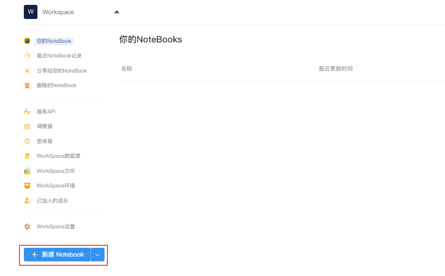
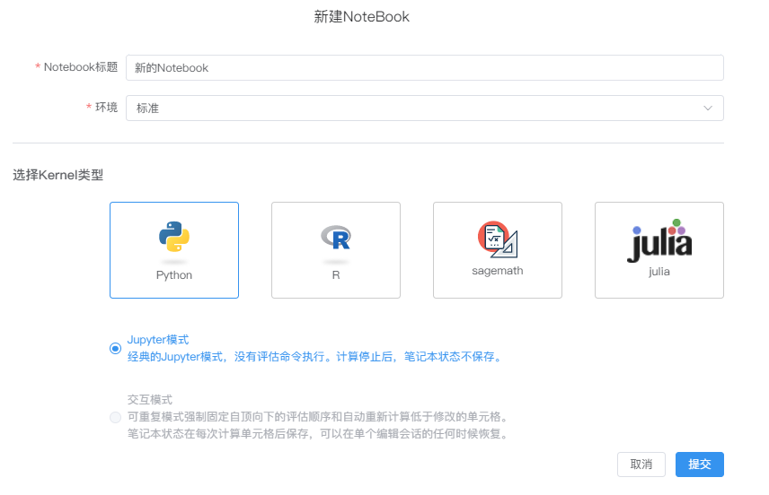
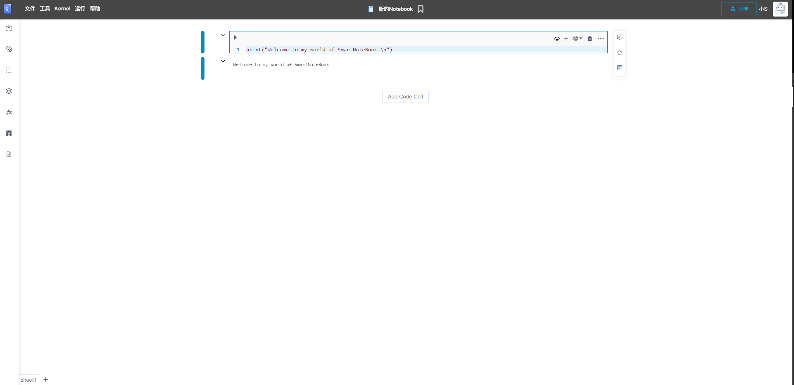
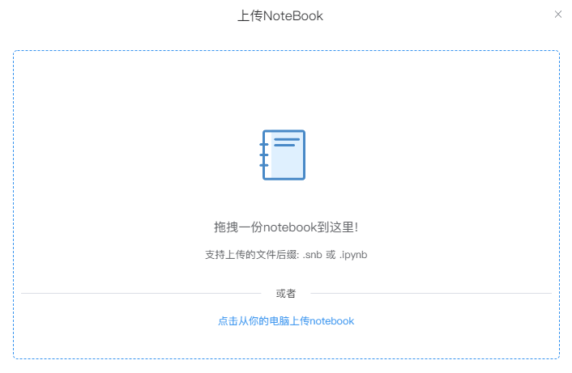
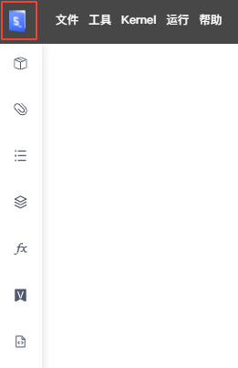
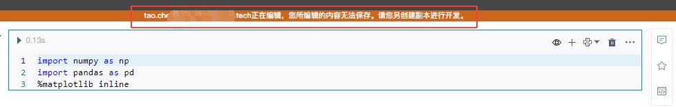
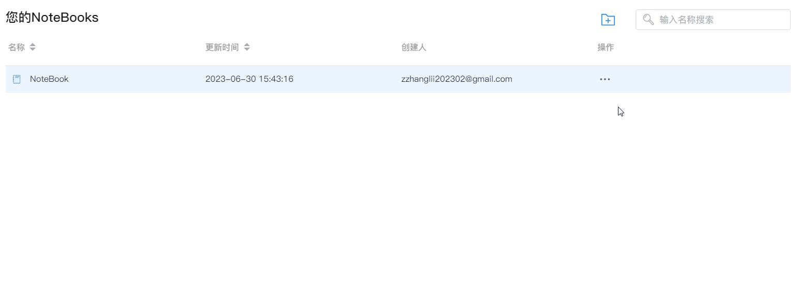

# NoteBook
<!-- 7101752 -->
---
<!-- NoteBook是一个可以在浏览器中使用的交互式笔记本文档，它的核心任务是通过将文字、代码、图表、公式、结论都整合在一个文档中，能够将整个分析过程完整清晰地表述，并能够以网页的形式进行分享。

Notebook可以实现将代码、文字完美结合起来，因此非常适合从事机器学习、数据分析等数据科学工作的人员使用。

逻辑视图的主界面由单元组成，包括“代码”单元、“标记和文本”单元、输入参数以及“显示”单元（如“表格显示”单元）。
然而，Hex在一些关键方面扩展了笔记本电脑模型： -->

NoteBook是一个可以在浏览器中使用的交互式笔记本文档。它提供了一个集成的环境，允许用户在同一个文档中编写和运行代码、添加注释、文本说明和公式、插入图表和可视化结果，并实时查看代码执行的输出。

SNB的NoteBook主界面由单元格组成，主要包括code单元格、可视化组件单元格、数据处理组件单元格。此外SNB在NoteBook的交互体验、资源管理、交流分享及团队协作等方面做了很多关键的扩展。

  

## 功能概览

| 功能 | 解释 | 
| :-----| :---- | 
| 工具栏 | 工具栏提供对文件、Kernel和终端等的一系列扩展操作。详见<a href="./Toolbar.md" title="工具栏">工具栏</a>  | 
| 侧边栏 | 侧边栏为NoteBook提供一系列扩展功能。详见<a href="./Sidebar.md" title="侧边栏">侧边栏</a>   | 
| 单元格（Cell） | 编写、运行、分享代码或组件的最小单元，也是最核心的单元。详见<a href="./Cell.md" title="单元格（Cell）">单元格（Cell）</a>   | 
| Python单元格 | 编写、运行、分享Python代码。详见<a href="./Python.md" title="Python单元格">Python单元格</a>   | 
| SQL单元格 | 编写、运行、分享SQL代码。详见<a href="./SQL.md" title="SQL单元格">SQL单元格</a>   | 
| MarkDown单元格 | 编写、运行、分享MarkDown代码。详见<a href="./Markdown.md" title="Markdown单元格">Markdown单元格</a>   | 
| EDA功能 | EDA分析组件快速探索数据集特征的分布情况。详见<a href="./EDA.md" title="EDA">EDA</a> | 
| 可视化分析 | 帮助用户以交互方式处理和分析数据，创建丰富的可视化效果并可用于分享和展示。详见<a href="./Visualization.md" title="可视化组件">可视化分析组件</a> | 
| 数据透视表 | 用可视化交互方式聚合和透视数据。详见<a href="./DataTransform.md" title="数据透视表">数据透视表</a> | 
| 评论 | 团队成员可以在单元格开展评论交流。详见<a href="./Comments.md" title="评论">评论</a> |
| 代码收藏 | 收藏代码存放在代码片段仓库。详见<a href="./Collections.md" title="代码收藏">代码收藏</a> |  
| 分享功能 | 分享单元格或整份NoteBook报告。详见<a href="./Share.md" title="分享">分享</a> | 
| 协作 | 当团队成员打开同一份NoteBook...详见<a href="../WorkSpace/Groups.md/#teamw" title="实时协作">实时协作</a> | 
| R支持 | 编写、运行、分享R代码。详见<a href="./R.md" title="R单元格">R语言支持</a>   | 
| SageMath支持 | 编写、运行、分享SageMath代码。详见<a href="./SageMath.md" title="SageMath单元格">SageMath支持</a>   | 
| Julia支持 | 编写、运行、分享Julia代码。详见<a href="./Julia.md" title="Julia单元格">Julia语言支持</a>   | 
| 环境状态栏 | 显示当前环境的状态信息，如镜像名称、镜像类型、CPU使用情况、内存使用情况等 | 
| 快捷键 | 键盘快捷键支持。详见<a href="./Shortcuts.md" title="快捷键">快捷键</a> | 

## 相关操作

### 新建NoteBook

WorkSpace管理界面下，点击左下角的`新建 NoteBook`按钮，弹出新页面。

<!--    -->

  

依次输入标题、选择可用环境、Kernel类型并选择模式后点击提交：

<!--    -->
  

> [!WARNING]
> NoteBook标题不能含有以下特殊字符：`| / : * ? < > "`

#### 目前支持的Kernel类型

  * Python
  * R
  * SageMath
  * Julia

> [!NOTE]
> 即将支持更多的Kernel类型——如果您有需要优先支持的类型，可联系我们 <feedback@smartnotebook.tech>。

#### 模式选择

  * Jupyter模式：经典的Jupyter模式，没有执行顺序的强制要求。在Kernel停止后，NoteBook状态不会被保存。
  * 交互模式：交互模式（Reactive Mode），强制执行固定的自上而下的依赖顺序，即按照单元格在NoteBook中的排列顺序执行，当修改了一个单元格后，位于其下方的所有单元格将自动重新计算。
  
<!-- ### Notebook界面（空）

   -->

### 导入NoteBook

WorkSpace管理界面下，点击左下角的`新建NoteBook`按钮右侧的小箭头，点击`上传文件`。

<!--    -->
  

拖拽或点击从电脑选择上传支持的文件类型（.snb或.ipynb）。

  

支持导入的文件类型说明：

- snb文件： SNB导出的专用格式类型
- ipynb文件：Jupyter NoteBook导出的文件类型

导入成功的NoteBook文件将和新建的NoteBook一起显示在`您的NoteBooks`文件列表。  

### 修改NoteBook名称

方式一：在NoteBook列表页，鼠标移至名称一栏，点击编辑图标  对名称进行修改,最后点击`√`提交修改。

<!--    -->
  

方式二：在NoteBook界面，双击顶部中间的标题进行修改，修改完成后鼠标移动到任意其他位置提交修改。  

  

### 添加/删除Sheet

默认情况下，每个NoteBook的内容都可以显示在一个Sheet上，您可以在一个可滚动的页面上看到你所有的工作。但如果您的NoteBook非常大并且有大量数据，您可能需要将其内容组织到多个Sheet中。

在NoteBook文档左下角的`+`可以增加新的Sheet，方便用户组织NoteBook结构和内容。

多个Sheet共同组成一份NoteBook文档，当`运行全部单元格`或`分享NoteBook`时SNB会按Sheet的位置顺序依次执行和显示。

一个NoteBook中所有的Sheet共享相同的文件和资源，并且新创建的Sheet会继承先前Sheet的环境。

点击右侧的`×`可删除Sheet（一个NoteBook中至少存在一个Sheet，因此您无法删除NoteBook中所有的Sheet）。

  
<!--    -->
> [!WARNING]
> 注意删除Sheet的操作不可逆，已删除Sheet的内容无法恢复，请谨慎操作！

### 返回WorkSpace

单击NoteBook左上角的LOGO可快速返回至WorkSpace管理界面。

<!--  -->
<!--    -->
<!--    -->

<!-- ## 成员同时打开一份NoteBook

当多名团队成员同时编辑同一份NoteBook文档，后打开NoteBook的成员会在NoteBook页面上方收到提示，无法保存修改的内容（同时编辑内容会产生冲突）：

   -->

### 收藏NoteBook（置顶显示）

收藏后的NoteBook会在`您的NoteBooks`列表置顶显示，并显示收藏标记
以作区别。

方式一：在NoteBook界面点击标题右侧收藏标记收藏，提示您收藏成功（再次点击后取消收藏）。

<!--    -->
  

方式二：在`您的NoteBooks`列表界面，点击`...`弹出操作菜单，点击`收藏`，提示您收藏成功（取消收藏亦然）。

  

