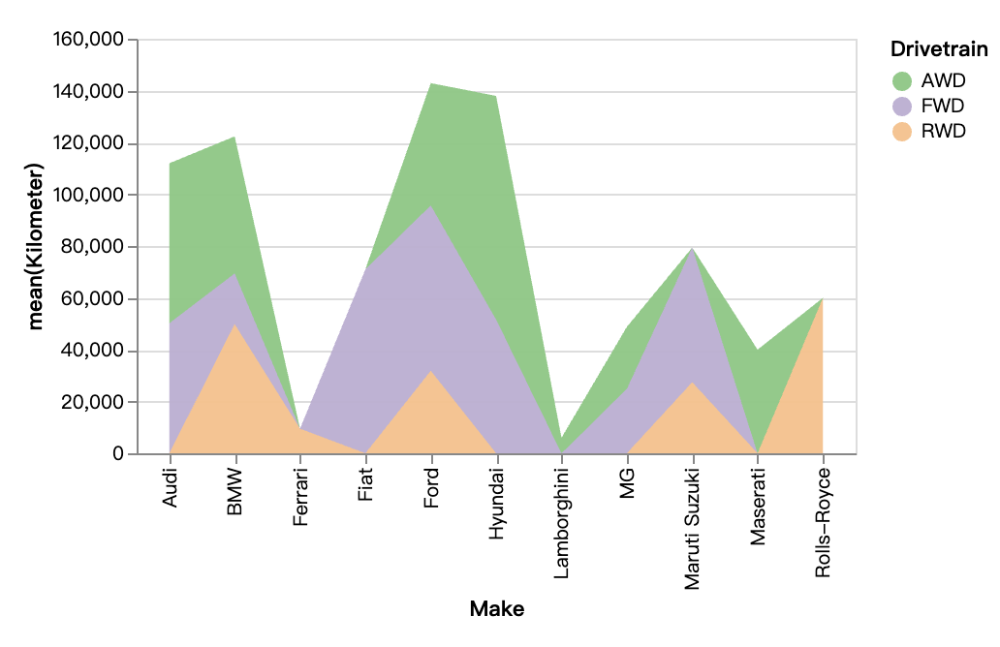
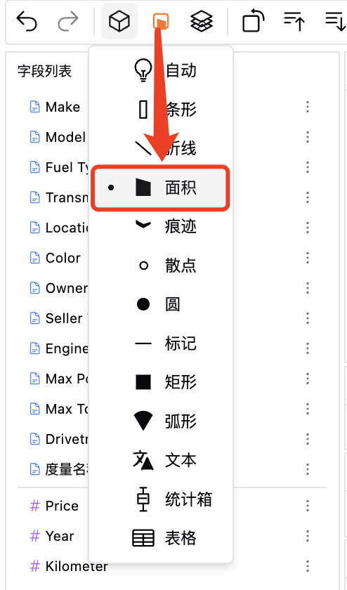
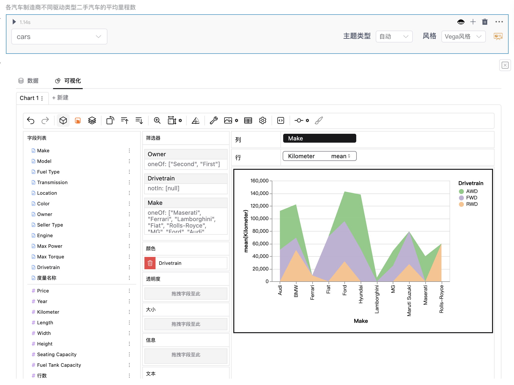

### 面积图
面积图又称区域图，强调数量随时间而变化的程度，是数据可视化中一种重要的图表类型，类似于折线图，但是其下方会有一个填充区域，也可以显示部分和整体的关系，还可用于引起使用者对总值趋势的注意。

### 创建面积图
你可以通过以下步骤来创建重叠或堆叠面积图：  
1. 在数据资源中导入你的数据，或者连接到你的在线数据库。  
2. 选择你的数据集，得到自助数据分析界面。  
3. 在可视化区域中，点击工具栏的“标记类型”图标，选择“面积”图表类型。    

  
4. 通过拖拉维度/度量到相应的通道位置，来创建面积图。  
5. 进行必要的调整，确保图表能有效传达你的数据洞察力。

### 面积图应用场景
面积图非常适合将随时间变化的数据进行可视化展示，或者比较多个系列以及识别趋势的情况，例如表示随时间而变化的的利润数据可以绘制在面积图中以强调总利润。