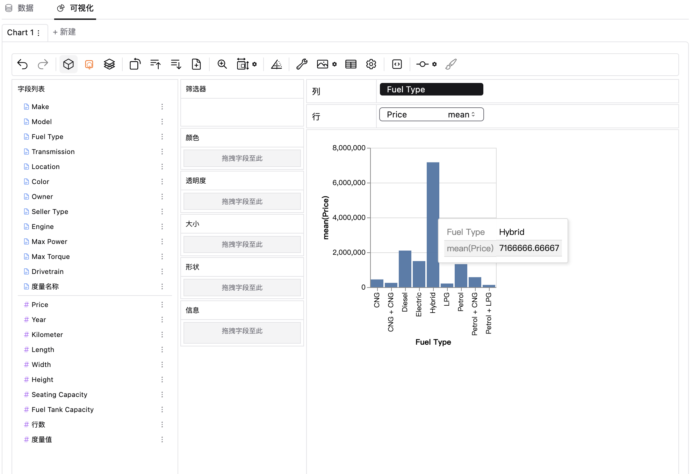
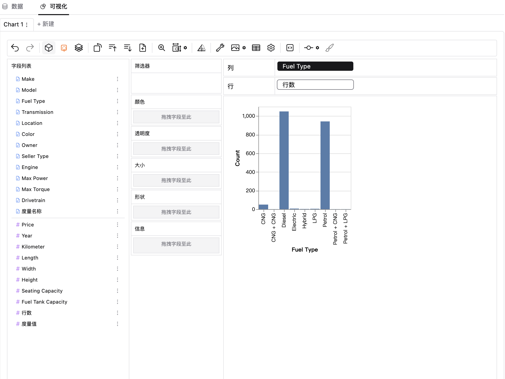
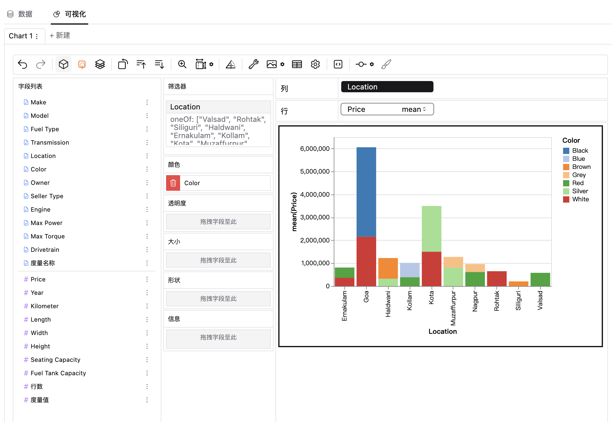
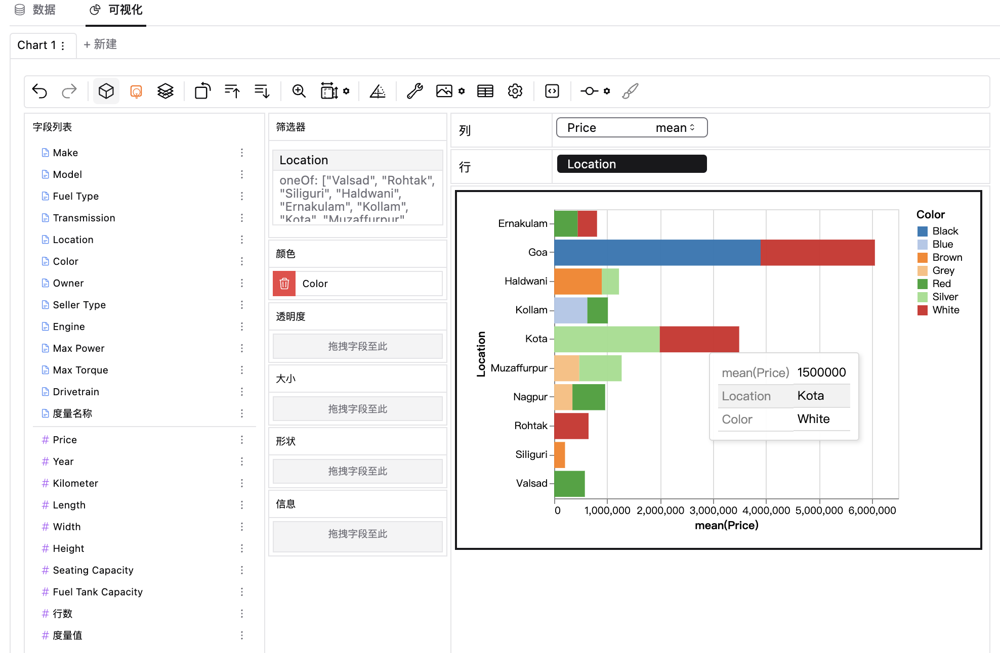
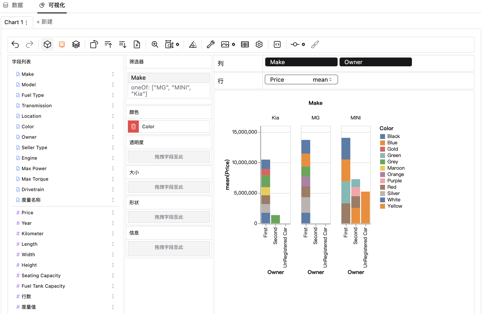

### 柱状图
柱状图是一种易于理解的数据呈现方式，非常适合展示不同类别或组别之间的数据和分布情况。
### 制作柱状图
在SmartNotebook平台中创建柱状图很简单，轻松几步就能绘制完成。下面将描述如何创建柱状图。
### 准备数据集  
1. 在SmartNotebook中新建一个Notebook页面。  
2. 上传你的数据到数据环境文件中。在工具侧边栏中找到"数据资源"界面，依次点击"环境文件"-"文件上传"，你可以选择csv、json、txt等格式的文件。  
3. 复制你刚上传的文件的路径，你可以通过pandas将数据读取进来并且赋值给一个新DataFrame变量。
<video controls class="video-stream html5-main-video" controlslist="nodownload" style="width: 832px; height: 468px; left: 0px; top: 0px;">
  <source src="../../assets/selfAnalysis/dataset.mp4" type="video/mp4">
  Your browser does not support the video tag.
</video>

### 绘制柱状图
1. 添加自助组件，选择数据集。  
2. 在"可视化"选项卡下，你能看到一个类似商务智能软件的一个用户界面。  
3. 通过拖拉维度/度量来轻松创建柱状图。  
<video tabindex="0" controls class="video-stream html5-main-video" webkit-playsinline="" playsinline="" controlslist="nodownload" style="width: 832px; height: 468px; left: 0px; top: 0px;">
  <source src="../../assets/selfAnalysis/bar01.mp4" type="video/mp4">
  Your browser does not support the video tag.
</video>

### 柱状图和直方图
虽然直方图和柱状图看起来很相似，但他们是不一样的含义，其用途不一样。直方图是显示连续数据的分布，Y轴体现频次（出现的次数），而柱状图显示分类的数据，Y轴一般是类别对应的数值。  
**柱状图**

**直方图**

### 分段条形图
分段条形图，也称堆积柱形图，非常适合展示不同类别中数据的组成，每一条代表一个类别，条内的段代表构成该类别的不同部分。它可以清晰地展示不同类别数据之间的数量或比例关系，帮助人们更直观地比较数据。  

### 水平柱状图
水平柱状图是一种用来比较不同类别数据之间差异的图表类型。它与垂直柱状图类似，但是数据条是水平放置的，而不是垂直放置的。它通常用于显示类别较多或类别标签较长的数据，因为这种布局可以更好地展示长标签而不会重叠。  
 
### 双重柱形图
双重柱形图，也称为分组柱形图，通过在同一组数据上绘制两个相邻的柱形图来比较两组数据，并且能够显示两组数据的差异和趋势。一般情况下，双重柱形图用于比较两个相关的数据集，比如不同时间段或不同条件下的数据情况。

### 总结
柱状图的主要优点是直观易懂，能够清晰地展示数据的相对大小和趋势，适用于较小的数据集和少量的类别，也可以用于比较不同时间点的数据或者比较不同组的数据，帮助观察变化和趋势。然而，柱状图也有其局限性，例如在展示大量数据或者连续变量时，并不是最佳选择，需要根据具体的场景选择合适的可视化方式。