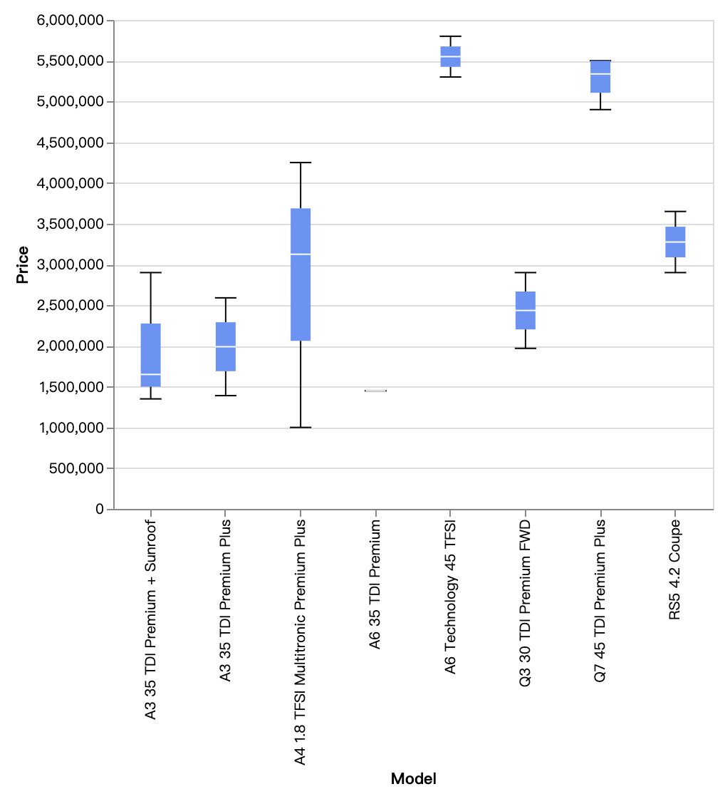
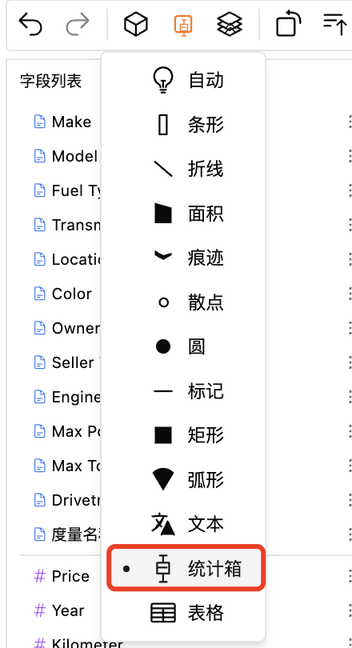
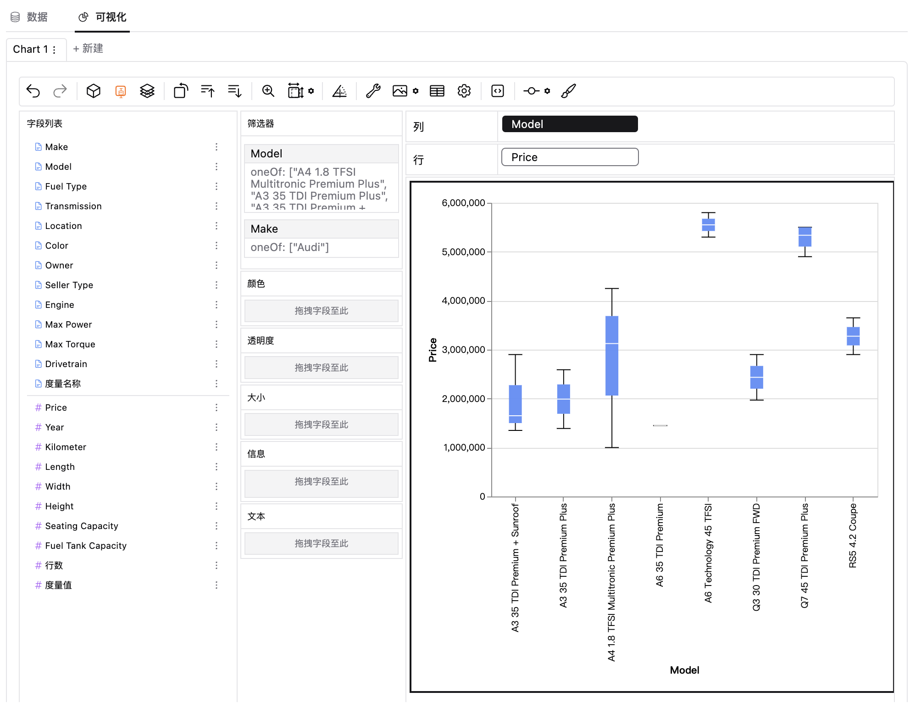

### 箱线图
箱线图，又称盒须图或箱型图，因形状如箱子而得名，是数据科学中一种很重要的图表类型，常用来展示数据的分布情况和异常值的存在。在箱线图中，有数据的最大值、最小值、中位数以及上下四分位数，可以帮助我们更好地理解数据的分布情况、比较不同组别的数据、发现异常值和监测数据变化。

### 创建箱线图
你可以通过以下步骤来创建箱线图：  
1. 在数据资源中导入你的数据，或者连接到你的在线数据库。  
2. 选择你的数据集，得到自助数据分析界面。  
3. 在可视化区域中，点击工具栏的“标记类型”图标，选择“统计箱”图表类型。   

  
4. 通过拖拉维度/度量到相应的通道位置，来创建箱线图。  

### 箱线图的适用场景
箱线图适用于许多不同领域的数据分析和决策场景，通过观察数据的离散程度、集中趋势和异常值情况，揭示出关键的洞察和趋势。一些实际应用包括：  
**品质管理：**比较产品的质量数据情况。    
**金融领域：**用于比较不同投资组合的收益分布情况，帮助分析投资风险和回报。  
**医学研究：**用于比较不同治疗方案的疗效，观察不同组别患者的生存期分布情况。  
**生产制造：**用于监测生产线上产品的质量分布情况，发现异常值或设备故障。  
**教育领域：**用于比较不同班级或学校学生成绩的分布情况，发现优秀生源或需要关注的学生群体。  
**市场营销：**用于比较不同市场区域产品销售额的分布情况，了解市场需求差异。  
**人力资源管理：**用于比较不同部门或团队的绩效评分分布情况，发现优秀员工或问题部门。  

