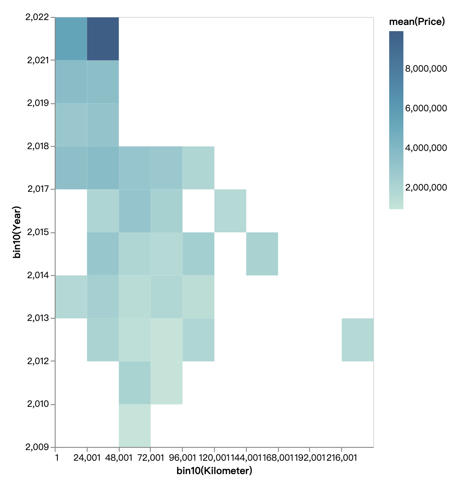
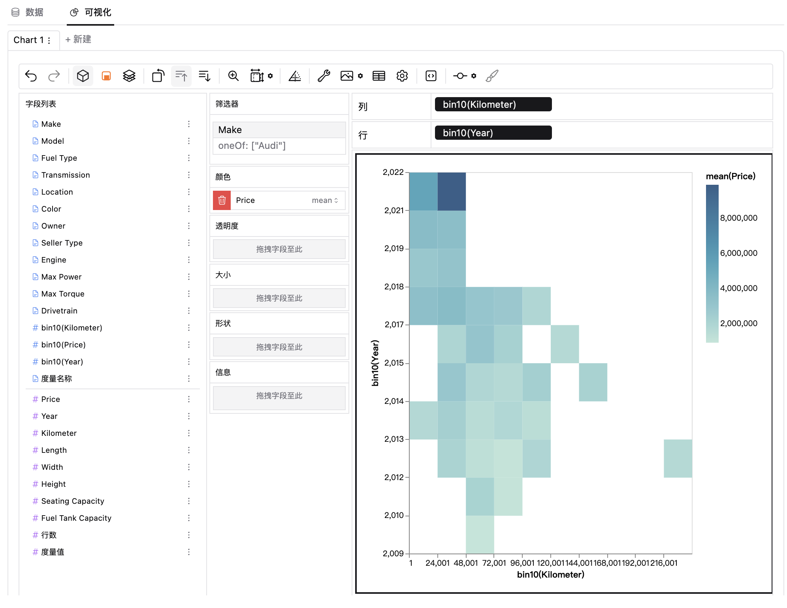

### 热力图
热力图是数据可视化中的一种图表类型，它用来展示两个变量之间的关系，矩形的着色与指标或者第三个变量相对应，例如分析一个区域不同店铺位置的每月订单情况。

### 创建热力图
你可以通过以下步骤来创建热力图：  
1. 在数据资源中导入你的数据，或者连接到你的在线数据库。  
2. 选择你的数据集，得到自助数据分析界面。  
3. 在可视化区域中，点击工具栏的“标记类型”图标，选择“矩形”图表类型。   

  
4. 通过拖拉维度/度量到相应的通道位置，来创建热力图。  

### 热力图的适用场景
热力图通常用来显示数据的相关性，适用于任何需要通过空间或位置信息来展示数据分布情况的场景，它可以帮助人们更直观、更易理解地了解数据背后的信息，一些主要的应用场景包括：  
**网站分析：**分析网页上的点击、浏览和交互数据，从而了解用户的行为模式和偏好，帮助网站进行优化设计。      
**商业分析：**在零售和商业环境中，热力图可用来分析顾客活动、购买行为和人流量，从而指导商业策略和决策。    
**地图应用：**在地图应用中显示人口的密集区、交通情况、犯罪率等位置相关的数据。    
**生物医学研究：** 展示基因表达模式、药物活性和疾病分布等生物信息数据，帮助研究者发现潜在的关联和规律

