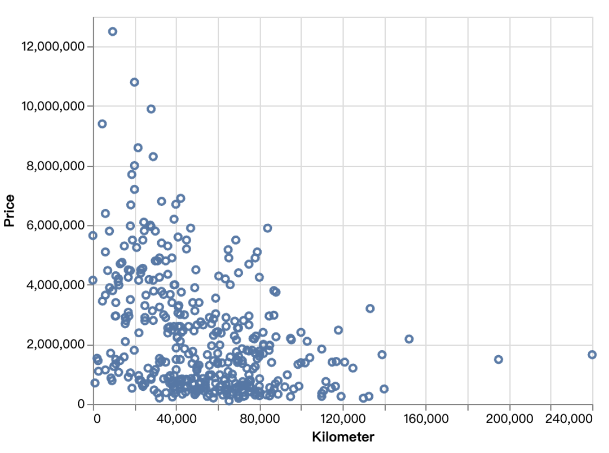
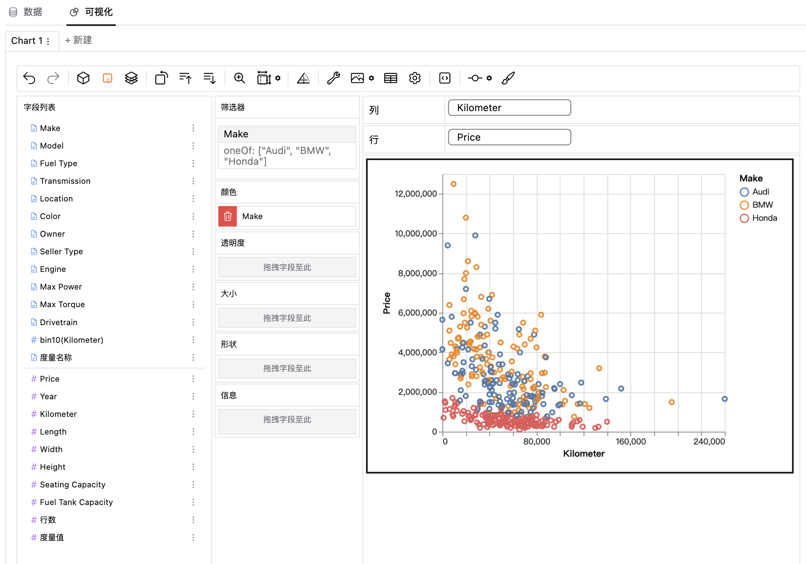

### 散点图
散点图是数据可视化中的一种图表类型，它的横轴和纵轴分别表示两个变量，每个数据点则代表了这两个变量的取值，展示为图表上的一个个的点。

### 创建散点图
你可以通过以下步骤来创建散点图：  
1. 在数据资源中导入你的数据，或者连接到你的在线数据库。  
2. 选择你的数据集，得到自助数据分析界面。  
3. 在可视化区域中，点击工具栏的“标记类型”图标，选择“散点”图表类型。  

  
4. 通过拖拉维度/度量到相应的通道位置，来创建散点图。  

### 散点图的适用场景
散点图通常是用来探索和识别变量间的相关关系，一些主要的应用场景包括：  
**关联分析：**观察两个变量之间的相关性，看是否存在某种趋势或者联系。        
**异常值检测：**能快速识别出数据中的异常值。      
**趋势预测：**预测销售量、价格变化等。      
**实验分析：** 评估实验数据的有效性，例如比较两组测试的实验结果数据。  

### 结论
总之，散点图是一种非常直观、实用的数据可视化方法，适用于分析和展示多种不同类型的数据关系。