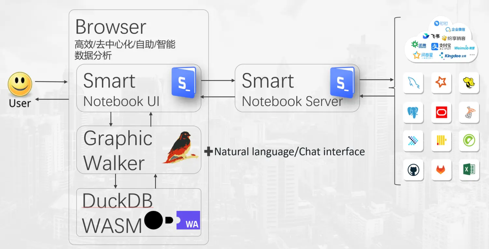
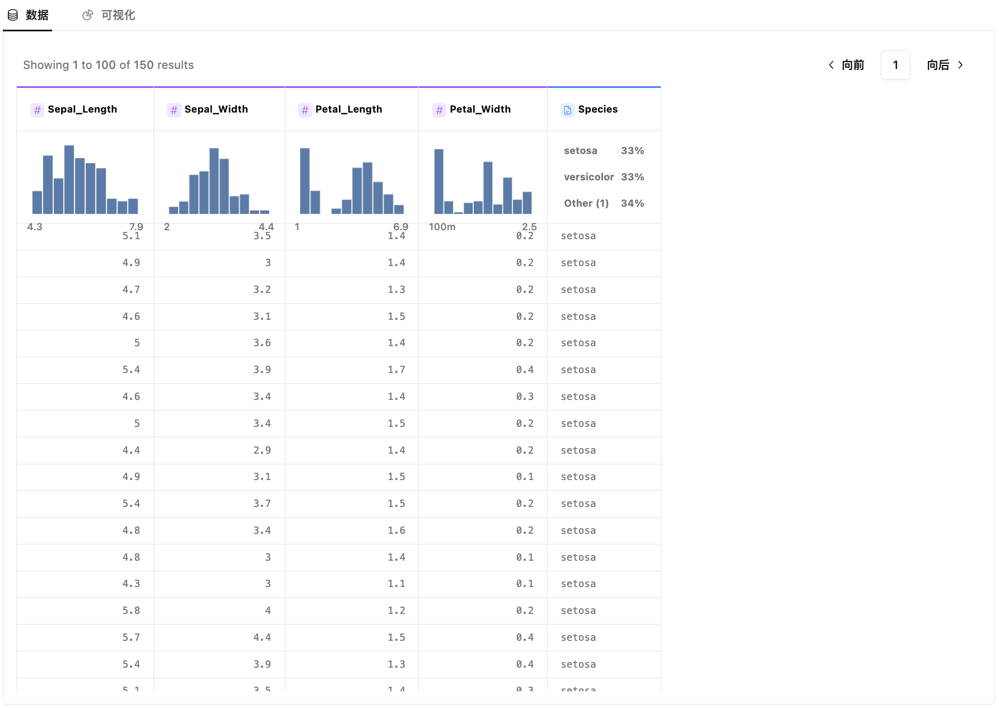
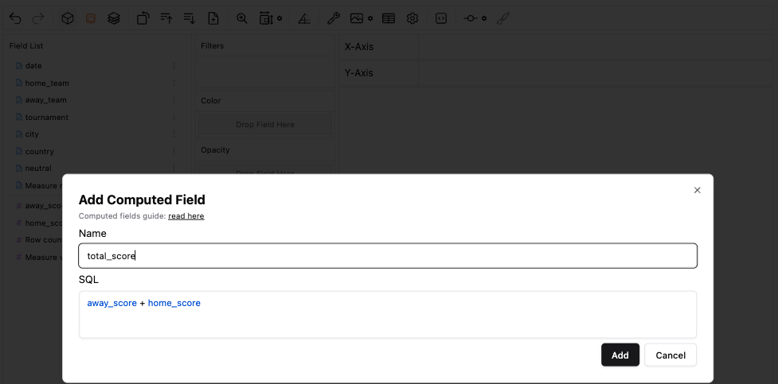
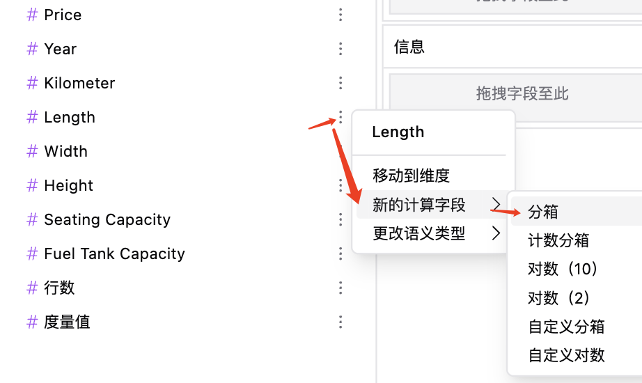

# SNB_自助数据分析
## 为什么
数据分析往往受到中心化架构的限制，需要大量的计算资源和时间，传统的商务智能（BI）也比较重型，有一定的使用门槛，同时数据分析过程中存在数据隐私和安全性问题。于是数据分析的去中心化是我们亟待需要解决的问题，打造一款去中心化、轻量级的、能保护用户隐私安全的数据分析工具显得极为重要。而SmartNotebook平台中的SNB_自助分析组件正是具有这样的特性。
## 是什么
SNB_自助分析组件结合了DuckDB-Wasm、Graphic Walker和Notebook的相关特性，形成了一个高效的、去中心化、自助工具组件，用户在浏览器中使用SmartNotebook平台，通过notebook生成Graphic Walker用户数据可视化界面，在本地轻松便捷地进行数据探索和分析，然后将分析结果保存到SmartNotebook的服务端或者云端，供决策者洞察其中的数据价值，做出对应的决策。具体原理如下图所示：

SNB_自助数据分析工具采用类似Tableau和PowerBI的展现方式，提供了一个拖拽式、交互式的可视化探索分析界面，能够充分利用客户端的算力，对大数据量进行高效支持。它简化了数据探索的操作，使分析师能够轻松应对多种分析场景，展现出强大的适应性。

## 如何用
### 创建自助数据分析组件
鼠标移动至单元格的下边界，当显示悬浮操作框时，单击`更多类型`，然后选择`自助分析`。  
**操作步骤：**  
1.准备数据：创建一个DataFrame变量，存放你的数据（也支持数据文件上传）；  
2.选择你要分析的数据源（若无，则先去创建一个DataFrame变量）；  
3.你可以通过下拉“主题类型”或“风格”选项来调整分析界面的视觉效果；  
4.点击单元格左上方的“执行”图标按钮，即可得到一个数据/可视化探索界面，如下图所示：

### 专题分析管理
#### 1. 保存专题分析

点击单元格右边的图标，在弹出的对话框中输入“专题名称”,点击“提交”，即可保存该专题。

在专题分析管理页面可以查看到已保存的专题，你可以点击进入查看或分析。

#### 2. 配置权限
在这里配置该专题分析的查看权限，设置谁可以看，只有勾选过的用户才可以查看。

### 开始分析
分析界面设有“数据”和“可视化”两个选项卡，默认是展示“可视化”部分，数据探索分析主要是在“可视化”界面进行。
#### 1. 数据部分
内容区域展示的是数据字段的概要情况，你可以粗略地查看数据的分布情况、缺失值或者异常值等,如下图所示：

#### 2. 可视化部分
工具栏位于顶部

每个图标按钮的功能如下所述：

| 图标 | 功能名称 | 说明 |
| --- | --- | --- |
|  | 撤销/重做 | 进行撤销/重做操作。 |
|  | 聚合度量 | 使用“求和”、“平均值”和“计数”等方法对数据进行聚合。 |
|  | 标记类型 | 在不同的图表类型之间切换，支持条形图、折线图、面积图、痕迹图、散点图、表格等，默认是‘自动’类型。 |
|  | 堆叠模式  | 创建堆叠图表或规范化图表，默认是“堆叠”图表。 |
|  | 转置  | 将图表中的行和列进行交换，即原先的列变为行，将原先的行变为列。 |
|  | 升序/降序排序 | 按照数据的大小顺序对图表中的内容进行升序/降序排列。 |
|  | 添加计算字段（度量值） | 若已有的数据源中缺少分析所需的数据，需要对数据进行计算，则可以添加一个计算值。 |
|  | 坐标系缩放 | 对坐标轴进行伸缩，以改变坐标轴的显示范围和分辨率。 |
|  | 尺寸模式 | 对图表的大小进行设置的方式。它包括固定尺寸、自适应尺寸和适应容器大小三种模式。 |
|  | 坐标系模式 | 默认通用坐标系，还可以设置地理模式。 |
|  | 图表调试 | 默认关闭，若打开，则图表右上方会出现一个图标按钮，可以进行调试操作，如图所示： |
|  | 导出 | 将图表以图片的形式导出，支持png、svg和base64三种格式。 |
|  | 导出csv | 将结果数据以csv的形式导出。 |
|  | 配置 | 图表配置相关的一些设置，比如图表颜色、坐标轴最大值/最小值、数据格式等,如图所示： |
|  | 代码 | 可以查看该组件的代码形式，也可以将该代码插入到一个新的单元格，还支持将生成的图表上传到图表库（后面会再提及该功能）。 |
|  | 设置上限 | 设置能展示的最大数据量，比如最终绘制图表的数据有100条数据，而设置了上限为50，那么图表中只会展示前50条数据。 |
|  | 打开数据绘板 | 打开一个类似绘板的界面和工具，用于数据清洗、数据建模和数据探索，你可以通过画笔和橡皮来随意探索。 注：创建绘制字段前需要在x和y轴上分别放置一个字段来创建绘制字段，同时必须先关闭聚合。 |

在分析界面的左侧，字段列表中列出来所有的可选字段类型，这些字段都来源于数据源中的列。你可以通过简单的拖拉拽将字段拖放至你想放置的通道中（如列、行、筛选器、颜色、透明度、大小、形状和信息通道），然后就可以通过可视化的方式来分析这些数据。

对于度量，你可自由的选择合适的聚合类型（平均、求和、标准差等）

你可以通过调整不同的标记类型来展现不同的图表形式，如散点图等。

你也可以比对多个不同的度量，只需将他们都拖到行或列中来创建拼接视图，行和列都支持多个字段。

当完成自助探索，你可以选择将结果导出到文件，当下次分析时，便可快速导入之前分析的结果。

### 添加计算字段
功能用途：在多种场景下可以使用计算字段，比如对数据进行分箱、转换字段的数据类型、对已有字段进行聚合操作、计算比率等。  

1.点击工具栏中的图标按钮；

2.输入计算字段的名称。在此示例中，该字段称为总分数；      
3.输入计算该字段的SQL表达式，在此示例中，书写以下表达式：home_score + away_score,该表达式将home_score和away_score相加，返回两数之和；  
4.点击添加按钮，即可添加，由于它返回一个数字，所以新字段被添加到度量字段中。

### 分箱
分箱是指将数据分成不同的
组或类别。在统计学和数据分析中，分箱常常用于将连续数据分成离散的区间，例如年龄分组、收入水平分组、分数分组等。在编程中，分箱也常用于数据预处理和特征工程，以便进行机器学习和数据分析。自助分析组件支持对字段的分箱，在可视化区域的度量通道中，可以做以下步骤进行分箱：

由于分箱是讲数据离散成组或者类别，所以分箱得到的字段属于维度，所以这时在维度通道就能看到分箱后的新字段bin10(Length),默认是分10箱（组），如图所示：

### 语义类型
在可视化或数据分析工具中数据编码很重要，因为不同的通道对不同语义的数据具有不同的操作。如果指定了字段，就应该描述它所代表的数据编码类型。SNB自助分析工具中支持的数据类型有定量（quantitative）、名义（nominal）、序列（ordinal）和时间（temporal）四种。  
**quantitative：**定量类型表示可以进行数学测量和操作的数据，例如身高、人数、销售额等。  
**nominal：** 名义类型表示一种没有任何固定顺序的类别或标签，例如颜色、产品型号、各厂商名称等。  
**ordinal：** 序列类型表示具有明确顺序或排名，但它们之间的差异不是一个恒定的值。例如从“非常差”到“非常优秀”的业绩好坏程度、“很满意”到“非常满意”的服务评级等。  
**temporal：**时间类型表示时间或者日期。它能以多种格式存在，例如时间戳、年月日、时间间隔等。
### 数据绘板
数据绘板工具提供了一种在不中断可视化探索工作流的情况下转换、清理、标记区分数据的新方式。
### 图表库管理
#### 1. 图表上传

点击工具栏中的图标按钮；

在弹出的对话框中，点击“上传”按钮，输入“图表名称”和选择“开放状态”，完成后点击“提交”，即可将图表上传至图表库中。

**说明：** 
开放状态包括自己访问、WorkSpace内访问和开放访问三种。  
<u>自己访问</u>：表示该图表是私密的，只能由你访问；  
<u>WorkSpace内访问</u>：是指同一个WorkSpace的成员都能访问；  
<u>开放访问</u>：是指任何人都能访问。

#### 2. 图表查看/修改
上传的图表可以从图表管理页面中查看，可以进入接着探索数据。

可以在这里修改图表的名称和开放状态。

 
# 数据分析名词解释
##### 数据分析
数据分析包括收集、处理和解释大量数据的过程，旨在从中提取有用信息并形成结论，以支持决策制定和策略规划。
##### 商业智能(BI)
商业智能又称商业智慧或商务智能，指用现代数据仓库技术、线上分析处理技术、数据挖掘和数据展现技术进行数据分析以实现商业价值。
##### 绝对数和相对数
绝对数是反应客观现象总体在一定时间、一定地点下的总规模、总水平的综合性指标，也是数据分析中常用的指标，比如地区总人口。
相对数是指两个有联系的指标计算而得出的数值，它反映客观现象之间的数量联系紧密程度的综合指标。相对数一般以百分比、倍数等表示。
##### 百分比和百分点
百分比，也叫做百分率或百分数，是表示一个数是另一个数的百分之几，百分比的分母是100，也就是1%作为度量单位。
百分点，是指不同时期以百分数的形式表示的相对指标的变动幅度，1%是一个（百分）点。
##### 频数和频率
频数是指一个数据在整体中出现的的次数；频率是某一事件发生的次数和总的事件数之比，频率通常用比例或百分比表示。
##### 倍数和番数
倍数：用一个数据除以另一个数据获得，倍数一般用来表示上升、增长幅度，一般不表示减少幅度。
番数：指原来数量的2的n次方。
##### 同比和环比
同比：指的是与历史同时期的数据相比较而获得的比值，反应事物发展的相对性。
环比：指与上一个统计时期的值进行对比获得的比值，主要反映事物的逐期发展的情况。
##### 数据集
大量数据的集合。
##### 变量
变量来源于数学，是计算机语言中储存计算机结果或者表示值抽象概念。变量可以通过变量名来访问。
##### 连续变量
在统计学中，变量按变量值是否连续可分为连续变量和离散变量两种。在一定区间内可以任意取值的变量叫连续变量，其数值是连续不断的，相邻两个数值可以做无限分割，如身高、体重等变量。
##### 离散变量
离散变量的各变量值之间都是以整数断开的，如何个数、件数等，都只能按整数计算。离散变量的数值只能通过计数所得。
##### 定性变量
定性变量又叫做分类变量，观测的个体只能归属集中互不相容类别中的一种，一般用飞数字来表达其类别，这样的观测数据称为定性变量，例如性别、学历等。
##### 度量和维度
在BI中，度量（Measure）是数字字段的数字值，例如分数；  
而维度(Dimension)是数据字段的定性值，比如学校名称或者科目名称。
 
**快开始你的探索之旅吧！**  