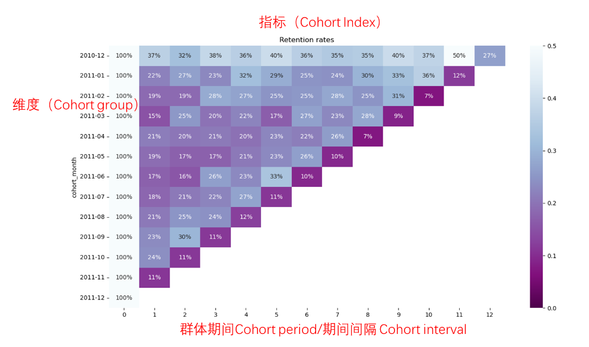
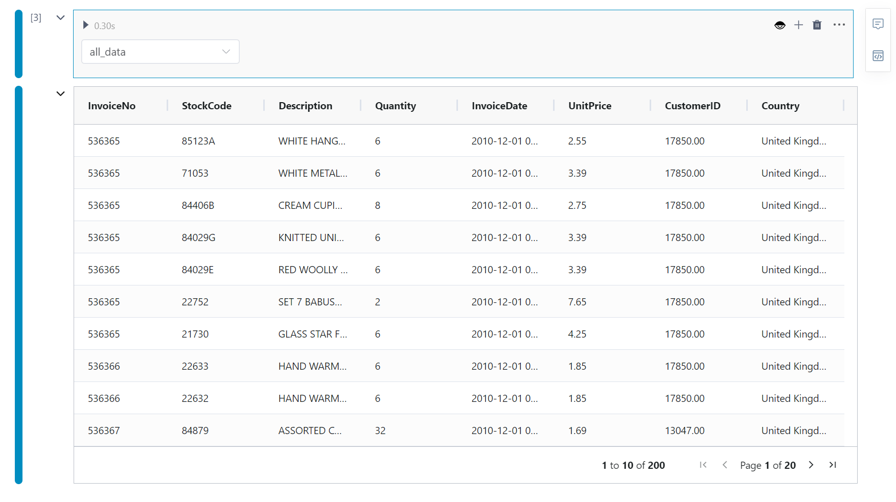
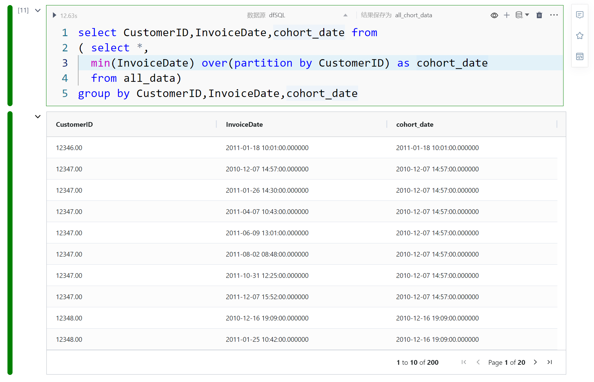
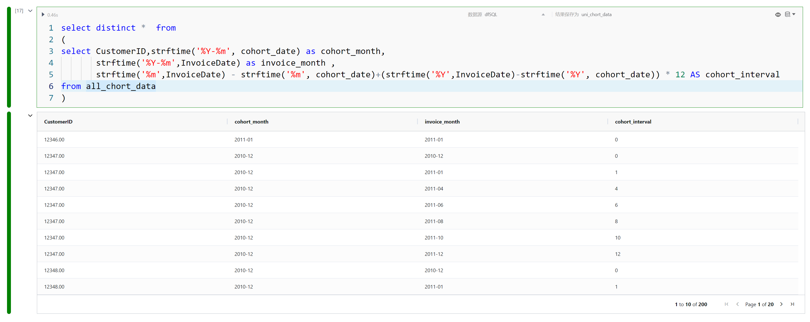
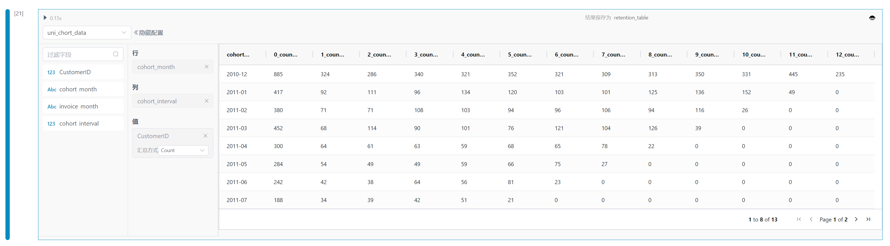
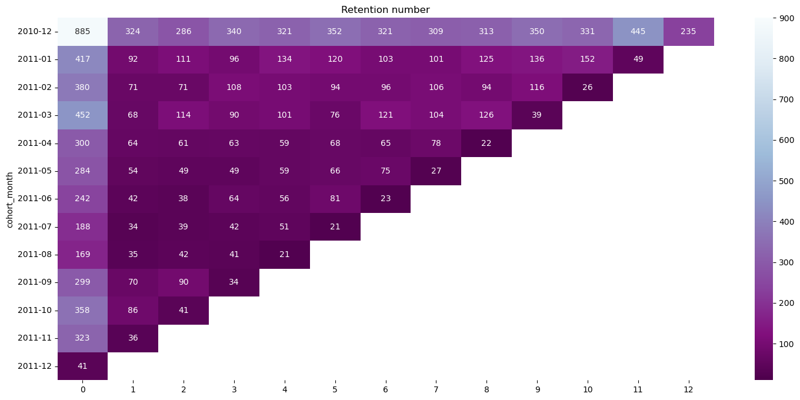
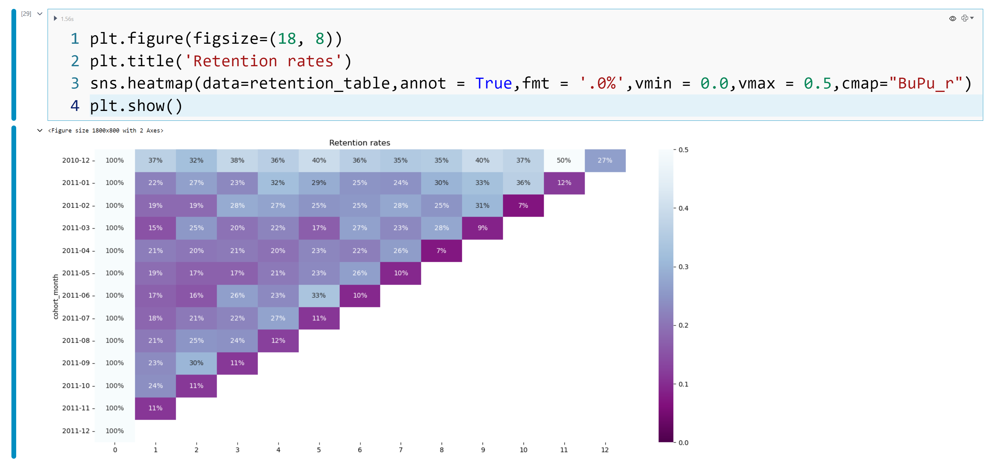
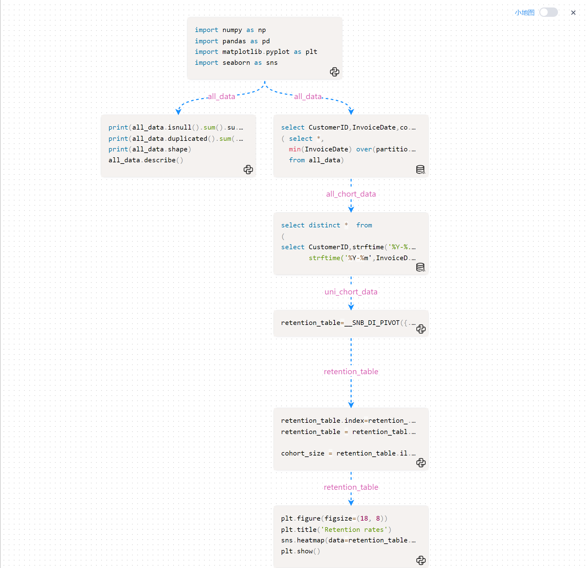

# 群组分析案例（cohort analysis）
---
## 什么是cohort analysis

&emsp;&emsp;"Cohort"是指一组群体或组织的意思，而"Cohort Analysis"可以翻译为"分组分析"或"同期分析"。Cohort分析通过比较具有相同属性的可比较群体的留存情况，来发现影响短期、中期和长期留存的因素。Cohort分析的受欢迎之处还在于其简单直观的方法。相较于繁琐的损失分析、RFM或用户聚类等方法，Cohort分析只需要一个简单的图表，甚至不需要进行复杂的运算，就能直观地描述用户在一段时间周期内的留存（或流失）变化情况。

&emsp;&emsp;"Cohort"可以被理解为具有共同特征的用户群体，例如共同的注册时间段或购买偏好。我们可以分析一个群组随着时间的推移而表现，并将其与其他群组进行比较。

- **时间群组**是在特定时间段内注册某产品或服务的客户集合。分析这些群组可以展示客户行为与他们开始使用公司产品或服务的时间之间的关系。这个时间段可以是每月、每季甚至每天。
- **行为群组**是过去购买产品或订阅服务的客户，按照他们所注册的产品或服务类型进行分组。基本级别服务的客户与高级服务的客户可能有不同的需求。了解不同群组的需求可以帮助公司为特定细分市场设计定制的服务或产品。
- **规模群组**指的是根据购买公司产品或服务的规模对客户进行分组。这种分类可以基于客户在一段时间后的消费金额进行分组。

&emsp;&emsp;Cohort Analysis可以通过分析以下问题来提供洞察：

- 用户随着时间推移的行为如何变化？
- 不同群组之间的行为差异是什么？
- 自推出新产品/新功能以来，用户行为有何变化？
- 随着时间推移，留存率如何变化？
- 用户对新功能的采用速度有多快？
- 不同用户群组的客户终身价值（Customer Lifetime Value, CLV）是多少？
- 用户未来的行为可能是什么？

## 如何进行cohort analysis

让我们先来理解一下三个概念：**维度**、**粒度**、**指标**。

- 维度（Cohort group）：用户分组的方式，例如：如按用户的新增日期进行分组，时间就是维度；如按新用户的来源渠道进行分组，渠道就是维度。维度是cohort analysis 分析图Y轴的分类。
- 粒度（群体期间Cohort period/期间间隔 Cohort interval）：时间周期的颗粒度，时间切片的大小，比如天、周、月等；时间颗粒度是cohort analysis 分析图X轴的切分粒度。
- 指标（Cohort Index）：指群组间在时间周期内比对的分析指标数值，比如留存率、ARPU等。


  


&emsp;&emsp;理解了维度、粒度、指标后，根据要分析的业务场景合理定义维度、粒度和指标，然后根据数据情况进行计算出cohort 二维表，然后进行展现。下面的例子展现基本的cohort 分析过程。

## cohort analysis在SNB的实践

&emsp;&emsp;为展示cohort 分析过程，我们引入kaggle 上一个数据集（https://www.kaggle.com/datasets/jihyeseo/online-retail-data-set-from-uci-ml-repo），数据集的格式如下（参见 图：原始数据）：
- InvoiceNo发票编号
- StockCode库存代码
- Description描述
- Quantity数量
- InvoiceDate发票日期/交易日期
- UnitPrice单价
- CustomerID客户编号
- Country国家

对于群体分析（cohort analysis），我们需要创建一些标签：

- 群体期间（Cohort period）/期间间隔（Cohort interval）：单笔交易的发票的年份、月份的字符串表示。该数字表示自首次购买以来经过的月份数量为期间间隔（Cohort interval）。
- 群体组（Cohort group）：客户首次购买的年份和月份的字符串表示。该标签在特定客户的所有发票中都是相同的。本例：在同一月份首次购买的用户为一组。
- 群体指数（Cohort Index）：指群组间在时间周期内比对的分析指标数值，比如留存率、ARPU等，本例：计算留存率

### 引入数据

引入python包和加载数据、清洗数据。


```
import numpy as np 
import pandas as pd 
import matplotlib.pyplot as plt
import seaborn as sns

all_data = pd.read_excel('/home/data/Online_Retail.xlsx')

all_data= all_data.dropna(subset=['CustomerID'])
all_data = all_data.drop_duplicates()
all_data=all_data[(all_data['Quantity']>0) & (all_data['UnitPrice']>0)]
```


  


### 应用SQL 开窗函数，

&emsp;&emsp;SmartNoteBook 内置dfSQL引擎，可以通过SQL 方式操作Pandas DataFrame ，大大降低数据集转换难度，充分发挥SQL能力，内置dfSQL引擎主流操作方式、支持绝大部分主流函数、支持开窗函数。


```
select CustomerID,InvoiceDate,cohort_date from 
( select *,
  min(InvoiceDate) over(partition by CustomerID) as cohort_date
  from all_data)
group by CustomerID,InvoiceDate,cohort_date
```

  

### 计算期间间隔

计算cohort_month、期间间隔（interval）、去除同一月份同一客户的重复记录。

```
select distinct *  from 
(
select CustomerID,strftime('%Y-%m', cohort_date) as cohort_month,
       strftime('%Y-%m',InvoiceDate) as invoice_month ,
       strftime('%m',InvoiceDate) - strftime('%m', cohort_date)+(strftime('%Y',InvoiceDate)-strftime('%Y', cohort_date)) * 12 AS cohort_interval
from all_chort_data
)
```

  


### 透视图进行二维矩阵生成

&emsp;&emsp;SmartNoteBook作为数据分析/数据科学平台，为便捷数据转换操作，开发低代码数据转换组件，比如透视图（pivot）方便进行数据转换。

&emsp;&emsp;数据透视表将DataFrame作为输入，根据您的配置对其进行聚合，并返回输出一个DataFrame的数据对象，该数据对象可以在应用中预览和显示或在NoteBook后续单元格中使用。

将字段从选取列表中拖动到对应的配置中
- 行：作为聚合依据的字段，垂直呈现
- 列：作为聚合依据的字段，水平呈现
- 值：选择需要聚合和计算的字段，并设置计算方式

  


  

### 计算留存率并输出

&emsp;&emsp;重复列用python 便捷计算方式计算留存率，并利用python 可视化能力展现留存图。

```
retention_table.index=retention_table['cohort_month']
retention_table = retention_table.drop('cohort_month',axis=1,inplace=False) 

cohort_size = retention_table.iloc[:,0]
retention_table = retention_table.divide(cohort_size,axis=0)

retention_table = retention_table.replace(0, np.nan)
retention_table.columns=[i.split('_')[0] for i in retention_table.columns]
```


```
plt.figure(figsize=(15, 8))
plt.title('Retention rates')
sns.heatmap(data=retention_table,annot = True,fmt = '.0%',vmin = 0.0,vmax = 0.5,cmap="BuPu_r")
plt.show()
```

  


### 留存分析模型视图(流程图)

&emsp;&emsp;SmartNoteBook模型视图(Graph)是用于展现NoteBook中单元格之间的逻辑依赖关系关系。在模型视图中，每个单元格被表示为一个节点，而单元格之间的引用关系则表示为边。通过模型视图，可以更直观地理解和分析NoteBook的逻辑依赖关系，从而提升代码执行效率。

  

&emsp;&emsp;上述整个过程是使用SmartNoteBook 实现的，通过 SQL 和 Python 的结合，大大降低cohort analysis群组分析难度，充分发挥 SQL 与 Python 各自特点，完美组合。
