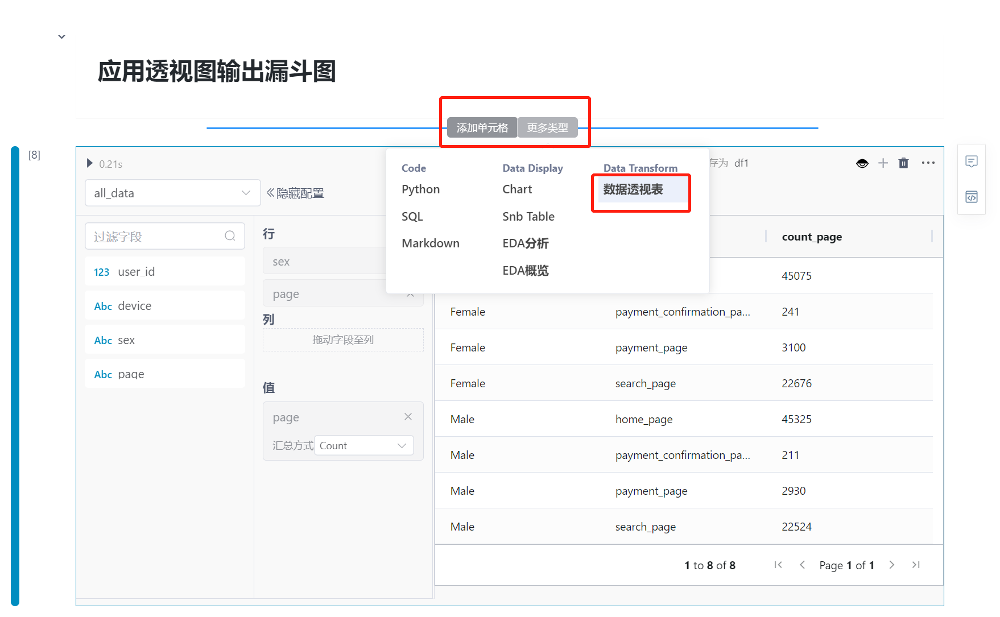

# 漏斗分析案例
---
&emsp;&emsp;漏斗分析是一种在电子商务网站分析中常用的技术，SmartNoteBook是一个基于NoteBook的低代码工具，通过结合SQL和Python的优势，以低代码的方式提供了数据转换、分析和可视化的功能，降低了分析难度，充分发挥了SQL和Python的特点，使分析过程更加高效、灵活和可维护。本文带您使用SmartNoteBook进行漏斗分析(Funnel Analysis)。

  


## 什么是漏斗分析(Funnel analysis)

&emsp;&emsp;漏斗分析(Funnel analysis)是一种在电子商务网站分析中常用的技术，用于了解用户在网站上的转化过程和行为流程。该分析方法以"漏斗"的形式描述了用户从访问网站开始到最终完成某种目标（如购买产品）的整个转化过程。

&emsp;&emsp;在电子商务网站分析中，漏斗通常由一系列关键步骤或阶段组成，例如：访问网站、浏览产品、将产品添加到购物车、进行结账、最终完成购买等。每个阶段的用户数量可能会逐渐减少，就像漏斗一样，因此得名"漏斗分析"。

&emsp;&emsp;通过漏斗分析，运营人员可以识别出在转化过程中的瓶颈或流失点，分析哪些步骤导致了用户的流失，进而采取措施改进用户体验、优化转化率。这种分析方法有助于发现网站/APP存在的问题，并制定针对性的优化策略，以提高整体的转化效果。

### AIDA模型

&emsp;&emsp;AIDA模型是漏斗分析的理论基础，AIDA模型是一种营销的理论框架，漏斗分析基于AIDA模型提供了一种数据分析的方法。
    
&emsp;&emsp;AIDA模型是一种市场营销模型，旨在描述消费者在购买过程中经历的心理阶段，包括认知（Awareness）、兴趣（Interest）、渴望（Desire）和行动（Action）。该模型强调在推销产品或服务时，通过引起消费者的注意、建立兴趣和渴望，最终促使他们采取行动。它主要关注的是消费者心理状态和推销策略。

&emsp;&emsp;AIDA模型通过 Awareness、Interest、Desire 和 Action 追踪客户,是一个购买漏斗，买家在每个阶段来回走动，以支持他们进行最终购买。

  

AIDA模型在电子商务转化漏斗过程中可能的映射：

- 认知（Awareness）--> 网站访问：用户了解我们的产品并且我们引起了他们的注意。
- 兴趣（Interest）--> 浏览商品：用户开始以有意义的方式与我们的产品进行交互。
- 渴望（Desire）--> 加入购物车：用户体验到我们的产品的价值并且有动力进行转化。
- 行动（Action）--> 购买产品 ：用户进行转化。

## 漏斗分析

为了便于漏斗分析，我们引用kaggle (https://www.kaggle.com/datasets/aerodinamicc/ecommerce-website-funnel-analysis) 上的一组数据集，包含五个数据集，分别为：`home_page_table`、`search_page_table`、`payment_page_table`、`payment_confirmation_table`、`user_table`，他们数据示例和关系如下：

  

### 创建漏斗(全渠道的漏斗分析)

加载包和引入数据：


```
import pandas as pd
import matplotlib.pyplot as plt
import seaborn as sns
import plotly.express as px

home_page = pd.read_csv('/home/home_page_table.csv')
search = pd.read_csv('/home/search_page_table.csv')
payment_page = pd.read_csv('/home/payment_page_table.csv')
payment_confirm = pd.read_csv('/home/payment_confirmation_table.csv')
user = pd.read_csv('/home/user_table.csv')
```

合并数据：
  
```
SELECT user.user_id,device,sex, home_page.page as page 
  FROM user ,home_page  where  user.user_id=home_page.user_id 
union all
  SELECT user.user_id,device,sex, search.page as page 
  FROM user , search where user.user_id=search.user_id
union all 
  SELECT user.user_id,device,sex, payment_page.page as page 
  FROM user ,payment_page where user.user_id=payment_page.user_id
union all 
  SELECT user.user_id,device,sex, payment_confirm.page as  payment_confirm 
  FROM user , payment_confirm where  user.user_id=payment_confirm.user_id
;  
```
  


转换数据：

```
select page , count(*) as page_count 
from all_data group by page 
order by page_count desc
```

  

生成全渠道漏斗图：

```
a_fig = px.funnel(over_all_funnel, y='page', 
                x='page_count',
                width=800, height=400)
a_fig.show()
```

  


### 终端类型漏斗

按照终端类型进行漏斗分析，首先汇总数据：


```
select page,device , count(*) as page_count 
from all_data group by page ,device
order by page_count desc
```
  


输出漏斗图：

```
d_fig = px.funnel(device_funnel, y='page', x='page_count', color='device',
                width=800, height=400)
d_fig.show()
```
  


### 性别分类的漏斗分析

按照性别进行漏斗分析，首先汇总数据：


```
select page,sex , count(*) as page_count from all_data 
group by page ,sex
order by page_count desc
```

输出漏斗图：

  


### 应用数据透视图输出漏斗分析
    
&emsp;&emsp;SmartNoteBook在notebook基础上开发低代码的组件完成数据转换、分析和可视化工作，在保持高灵活性、高适应性基础，降低使用门槛。

  

  


## 分析过程的模型视图(Graph图)

&emsp;&emsp;SmartNoteBook模型视图(Graph)是用于展现NoteBook中单元格之间的逻辑依赖关系关系。在模型视图中，每个单元格被表示为一个节点，而单元格之间的引用关系则表示为边。通过模型视图，可以更直观地理解和分析NoteBook的逻辑依赖关系，从而提升代码执行效率。

&emsp;&emsp;模型视图类似于脑图，它能够辅助数据建模人员更好地梳理和优化模型。通过观察模型视图，可以更清晰地了解各个单元格之间的关联，帮助优化代码结构和流程，提高建模过程的效率和可维护性。此外，模型视图也方便了模型的分享，可以通过可视化的方式展示NoteBook的结构和逻辑，便于与他人交流和合作。

  

上述整个过程是使用SmartNoteBook 实现的，通过 SQL 和 Python 的结合，大大降低分析难度，充分发挥 SQL 与 Python 各自特点，完美组合。

