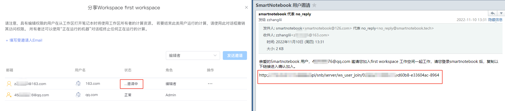
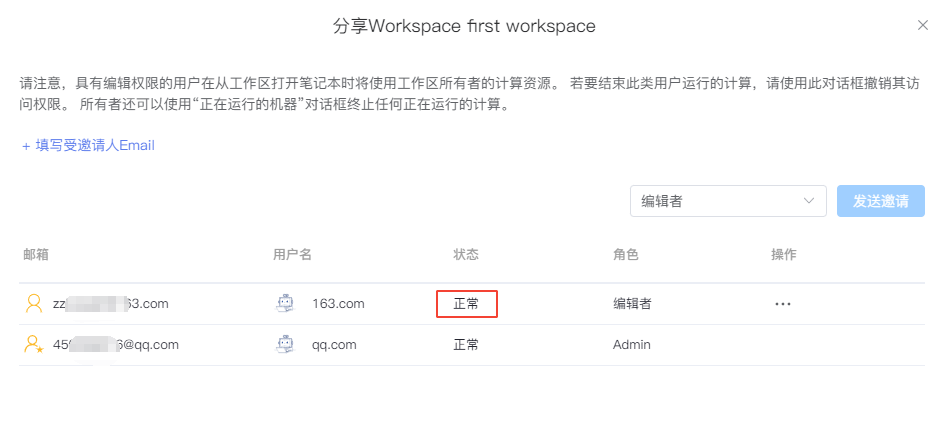

# 邀请团队成员
---
>共享和协作是SmartNoteBook中团队合作关键部分。包含WorkSpace工作空间的团队协作、cell和notebook 分享、评论。
>- 共享工作空间：让团队用户在您创建的工作空间上协调工作。
>- 共享报告/cell：邀请其他用户实时从默认的主工作区在笔记本上进行协作。随时、多终端分享数据成果。
>- 评论:在notebook和报告内对单元格进行评论互动，通过互动快速改进和优化模型。

## 邀请小伙伴加入工作空间

让我们去向小伙伴们发送邀请吧！

在WorkSpace的管理页，我们点击右上角的`邀请工作伙伴`。

  

然后填写受邀人的Email邮箱并设置`角色`，点击`发送邀请`

  

* `角色类型` 编辑者：可协同开发，编辑NoteBook
* `角色类型` 查看者：只拥有查看权限

被邀请的小伙伴会收到我们的邀请邮件，小伙伴的状态暂时会被标记为`邀请中`。

  

当小伙伴成功访问邀请链接后，便成功加入到我们的WorkSpace，状态被标记为`正常`，此时小伙伴便可与我们一起编辑NoteBook内容了。

  

> [!NOTE]
> 邀请的小伙伴需要先注册SmartNoteBook的账号，否则会收到该邮箱未注册的提示哟。

  

