# KNN模型预测案例
---
## 导入包和数据

```
import numpy as np
import pandas as pd
import seaborn as sns
sns.set_palette('husl')
import matplotlib.pyplot as plt
%matplotlib inline

from sklearn import metrics
from sklearn.neighbors import KNeighborsClassifier
from sklearn.linear_model import LogisticRegression
from sklearn.model_selection import train_test_split
import warnings
warnings.filterwarnings('ignore')

# 该数据文件已上传至用户默认的WorkSpace，文件路径可直接读取使用
data = pd.read_csv('/home/Iris.csv')  
```

## 数据预览
- 共有150个观测值，每个观测值有4个特征（花萼长度、花萼宽度、花瓣长度、花瓣宽度）。
- 没有缺失值，所以我们不需要担心这个问题。
- 每个物种（山鸢尾、变色鸢尾、维吉尼亚鸢尾）有50个观测值。

```
data.head()
```

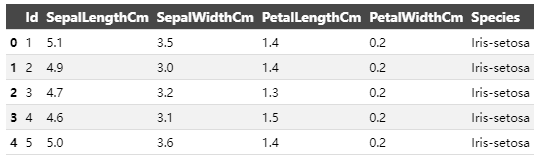  

```
data.info()
```

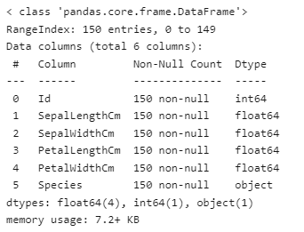  

```
data.describe()
```

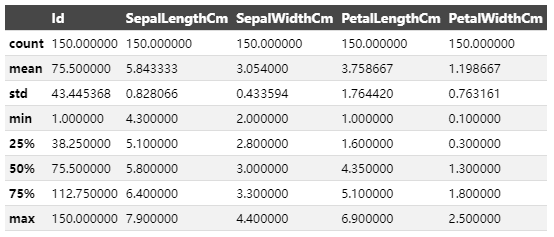  

```
data['Species'].value_counts()
```

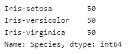  

## 数据可视化

- 在绘制特征的成对图后，可以清楚地看出山鸢尾（粉色）的特征之间的关系与其他两个物种明显不同。
- 另外两个物种，变色鸢尾（棕色）和维吉尼亚鸢尾（绿色），它们之间的成对关系存在一些重叠。

```
tmp = data.drop('Id', axis=1)
g = sns.pairplot(tmp, hue='Species', markers='+')
plt.show()
```

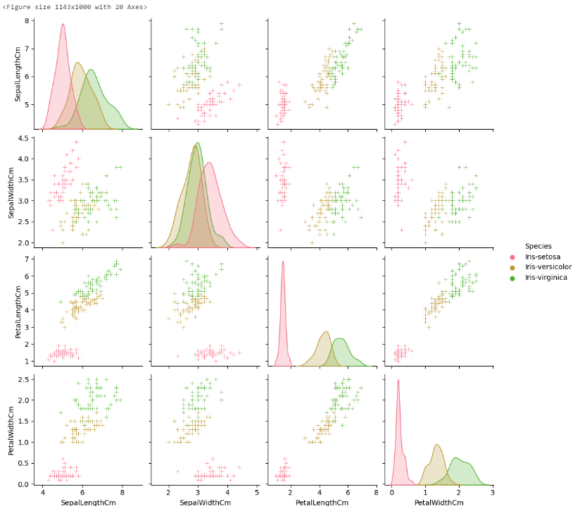  

```
g = sns.violinplot(y='Species', x='SepalLengthCm', data=data, inner='quartile')
plt.show()
g = sns.violinplot(y='Species', x='SepalWidthCm', data=data, inner='quartile')
plt.show()
g = sns.violinplot(y='Species', x='PetalLengthCm', data=data, inner='quartile')
plt.show()
g = sns.violinplot(y='Species', x='PetalWidthCm', data=data, inner='quartile')
plt.show()
```

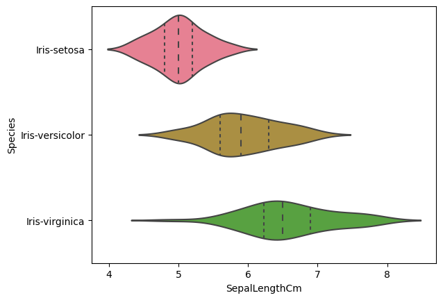  
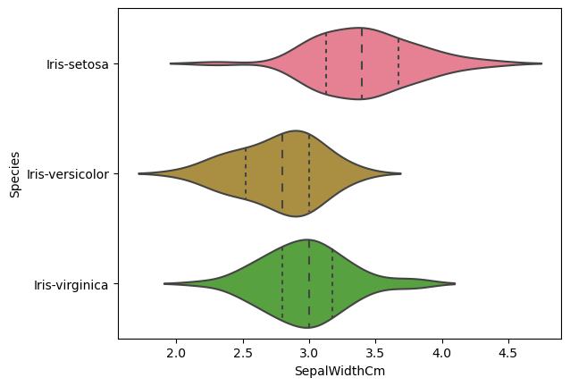  
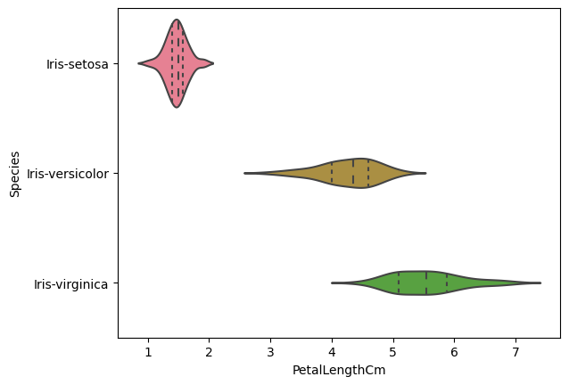  
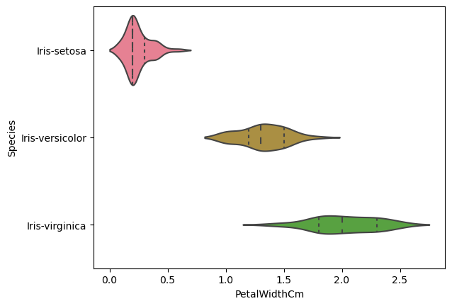  


## 使用scikit-learn进行建模

```
X = data.drop(['Id', 'Species'], axis=1)
y = data['Species']
# print(X.head())
print(X.shape)
# print(y.head())
print(y.shape)
```

## 在相同数据集上进行训练和测试

- 不建议使用这种方法，因为最终目标是使用模型未曾见过的数据集来预测鸢尾花的物种。
- 这种方法还存在过拟合训练数据的风险。

```
# experimenting with different n values
k_range = list(range(1,26))
scores = []
for k in k_range:
    knn = KNeighborsClassifier(n_neighbors=k)
    knn.fit(X, y)
    y_pred = knn.predict(X)
    scores.append(metrics.accuracy_score(y, y_pred))
    
plt.plot(k_range, scores)
plt.xlabel('Value of k for KNN')
plt.ylabel('Accuracy Score')
plt.title('Accuracy Scores for Values of k of k-Nearest-Neighbors')
plt.show()
```

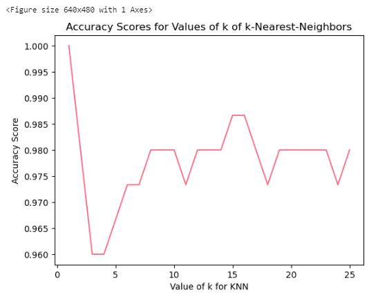  

```
logreg = LogisticRegression()
logreg.fit(X, y)
y_pred = logreg.predict(X)
print(metrics.accuracy_score(y, y_pred))
```

## 将数据集分为训练集和测试集

### 优势
- 通过将数据集伪随机地分为两个独立的集合，我们可以使用一个集合进行训练，使用另一个集合进行测试。
- 这样可以确保我们不会在两个集合中使用相同的观测值。
- 比使用整个数据集进行训练更灵活且更快速。

### 缺点
- 测试集的准确率可能会因为其中包含的观测值不同而有所变化。
- 可以通过使用k折交叉验证来弥补这个缺点。

### 注意事项
- 模型的准确率取决于测试集中的观测值，这由伪随机数生成器的种子（random_state参数）确定。
- 随着模型复杂度的增加，训练准确率（在相同数据上训练和测试时获得的准确率）也会增加。
- 如果模型过于复杂或不够复杂，测试准确率会降低。
- 对于KNN模型，k的值决定了模型的复杂度。较低的k值意味着模型更复杂。

```
X_train, X_test, y_train, y_test = train_test_split(X, y, test_size=0.4, random_state=5)
print(X_train.shape)
print(y_train.shape)
print(X_test.shape)
print(y_test.shape)


# experimenting with different n values
k_range = list(range(1,26))
scores = []
for k in k_range:
    knn = KNeighborsClassifier(n_neighbors=k)
    knn.fit(X_train, y_train)
    y_pred = knn.predict(X_test)
    scores.append(metrics.accuracy_score(y_test, y_pred))
    
plt.plot(k_range, scores)
plt.xlabel('Value of k for KNN')
plt.ylabel('Accuracy Score')
plt.title('Accuracy Scores for Values of k of k-Nearest-Neighbors')
plt.show()
```

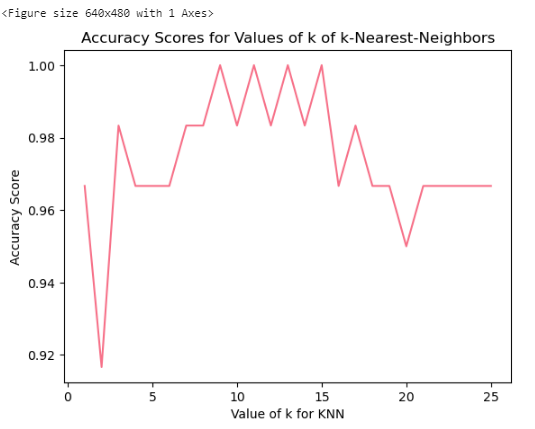  


```
logreg = LogisticRegression()
logreg.fit(X_train, y_train)
y_pred = logreg.predict(X_test)
print(metrics.accuracy_score(y_test, y_pred))
```

## 选择KNN模型进行鸢尾花物种预测，使用k = 12

在发现k = 12是一个相对较好的邻居数量后，我使用它来对整个数据集进行模型拟合，而不仅仅是训练集。

```
knn = KNeighborsClassifier(n_neighbors=12)
knn.fit(X, y)

# make a prediction for an example of an out-of-sample observation
knn.predict([[6, 3, 4, 2]])
```
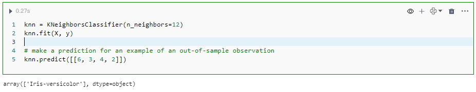  
