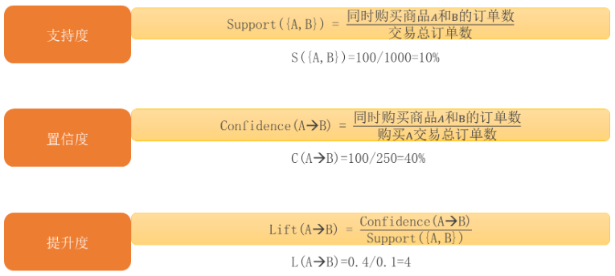
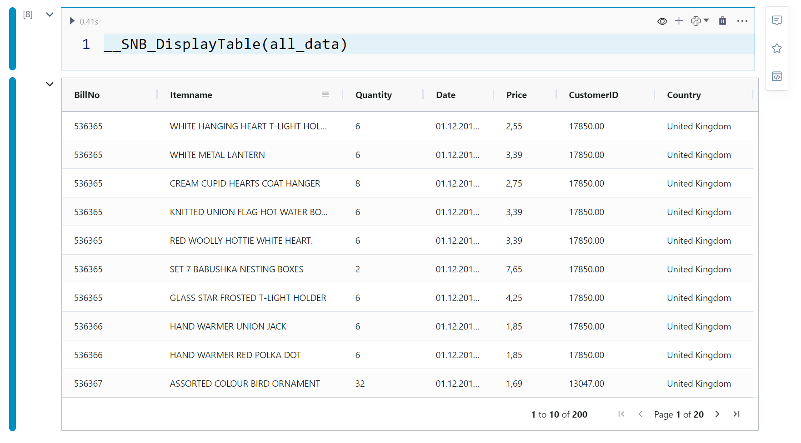
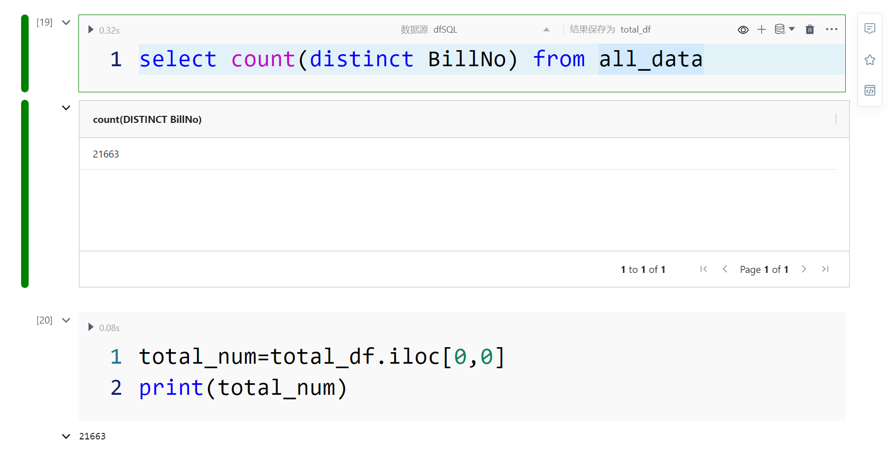
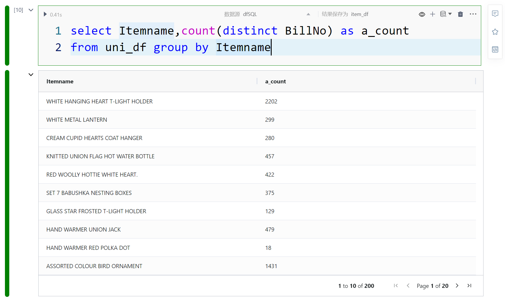
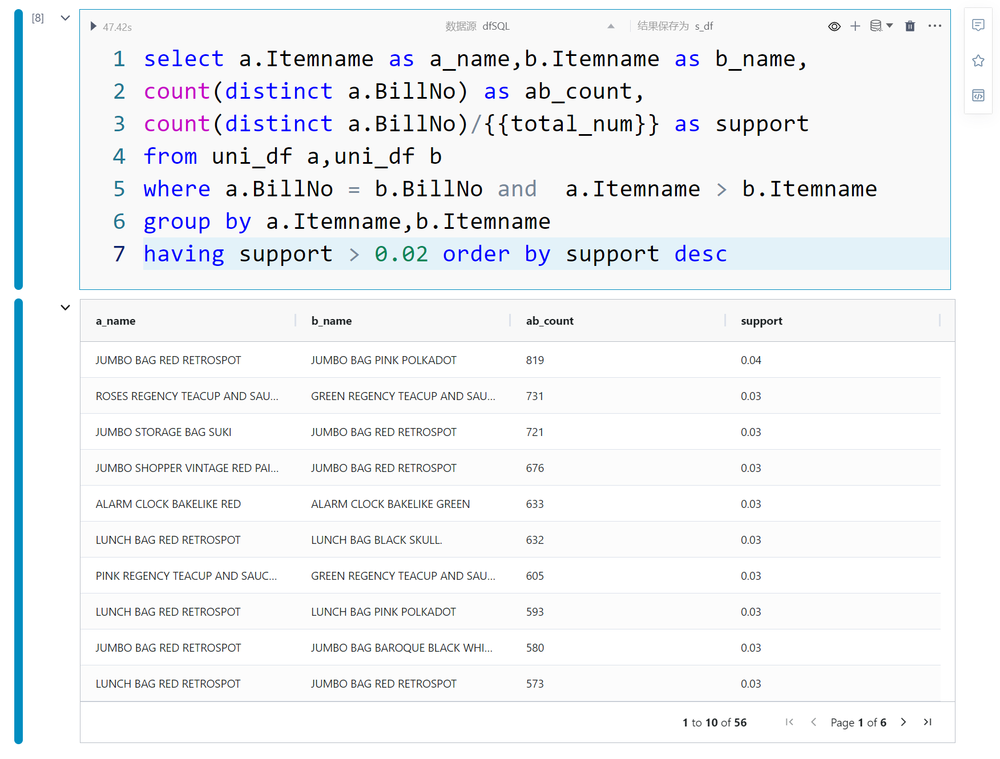
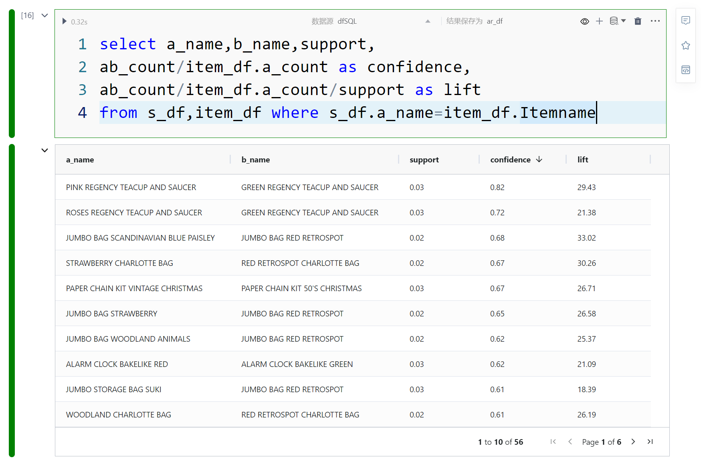
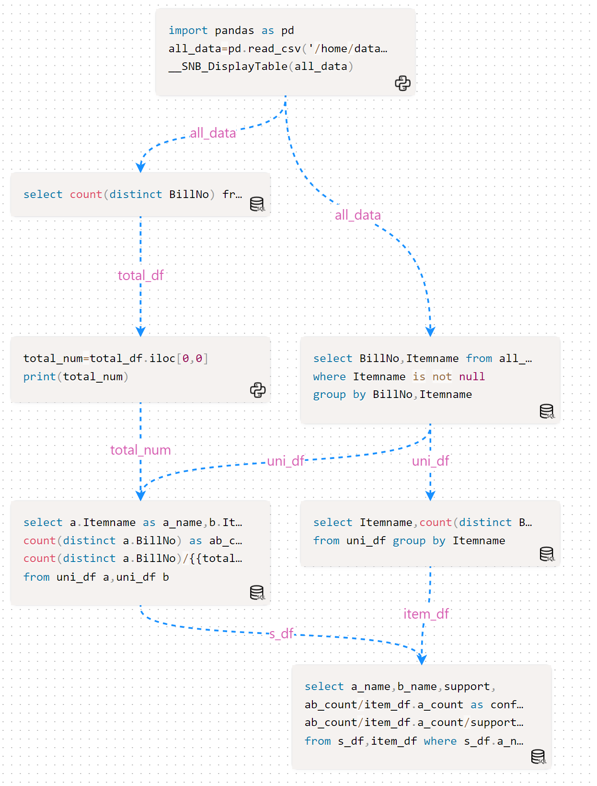

# 购物篮分析案例
---
&emsp;&emsp;当谈及购物篮分析和关联规则算法时，一则经典故事《啤酒与尿布》(它的真实性存在争议,有人认为是商业传奇，也有人认为是虚构的)常常被提及。这个故事以一家大型零售连锁店的数据分析为背景，引人入胜地揭示了消费者购物行为中的意外关联。故事中，分析师发现在某个城市的分店中，啤酒和尿布的销售量竟然时常同时增长。这个奇怪的现象引发了深入探究，从而揭示了隐藏在数据背后的宝贵信息。让我们一同探索这个引人入胜的故事，了解购物篮分析的精髓和应用。

  

## 什么购物篮分析

&emsp;&emsp;购物篮分析是一种数据挖掘技术，用于揭示消费者购买行为中的相关性和关联规律。当顾客在购物篮中同时购买多个商品时，我们可以通过分析这些购买组合的频率，找出那些经常一起出现的商品组合，这些被称为频繁项集。

&emsp;&emsp;频繁项集是指在交易数据集中经常同时出现的商品组合。它通过计算支持度来衡量，支持度指的是某个商品组合在所有交易中出现的频率。通过识别频繁项集，我们可以了解到哪些商品经常同时被购买，从而为商家提供宝贵的市场洞察。而关联规则是从频繁项集中提取出的有意义的关联关系。关联规则通常以“A → B”的形式表示，表示当顾客购买商品A时，他们很可能也会购买商品B。关联规则可以通过计算置信度和提升度来衡量其关联强度和实际意义。置信度表示当商品A被购买时，同时购买商品B的概率。提升度则衡量了商品A的购买对商品B购买的影响程度。

&emsp;&emsp;购物篮分析的应用广泛，涵盖了零售业、市场营销、推荐系统等领域。它帮助企业深入了解消费者行为，提供个性化的购物体验和精准的营销策略，从而在竞争激烈的市场中脱颖而出。

&emsp;&emsp;在购物篮分析中，支持度、置信度和提升度是三个重要的指标，用于衡量商品之间的相关性和关联强度。

- 支持度(Support)

&emsp;&emsp;支持度是指某个商品组合在所有交易中出现的频率。它可以帮助我们确定哪些商品组合是频繁出现的，从而识别出潜在的关联规则。支持度的计算公式为：支持度(A) = (包含A的交易数) / (总交易数)。通过设置支持度的阈值，我们可以筛选出具有足够重要性的商品组合。

> 今天共有1000笔订单，商品A为可乐，商品B为薯片，其中同时购买可乐和薯片的次数是100次，那么可乐+薯片组合的支持度就是100/1000=10%。

- 置信度(Confidence)

&emsp;&emsp;置信度衡量了当顾客购买了商品A时，他们同时购买商品B的概率。它可以帮助我们判断商品之间的关联强度。置信度的计算公式为：置信度(A → B) = (同时购买A和B的交易数) / (购买A的交易数)。通过设置置信度的阈值，我们可以筛选出具有较强关联的商品组合。

> 上述订单中，购买可乐的订单为250，则其置信度是100/250=40%

- 提升度(Lift)

&emsp;&emsp;提升度是用来衡量商品B的出现是否受到商品A的购买的影响程度。提升度大于1表示商品A的购买会对商品B的购买产生正向影响，提升度等于1表示两者之间没有关联，提升度小于1表示商品A的购买会对商品B的购买产生负向影响。提升度的计算公式为：提升度(A → B) = 置信度(A → B) / 支持度(B)。通过设置提升度的阈值，我们可以筛选出具有实际意义和价值的关联规则。

> 购买A（可乐）对购买B（薯片）的提升作用，Lift(A→B)=0.4/0.1 =4 ,所以可乐对薯片的提升效果很不错的。

  

&emsp;&emsp;这些指标的应用使我们能够从大量的交易数据中挖掘出有意义的关联规则，为企业决策提供重要参考。

## 使用SNB进行购物篮分析             

&emsp;&emsp;为展示购物篮分析过程，引入kaggle 上一个数据集(https://www.kaggle.com/datasets/aslanahmedov/market-basket-analysis),这个数据集主要字段为:
- BillNo:订单号
- Itemname：商品名称
- Quantity：数量
- Date：日期
- Price ：单价
- CustomerID：客户ID
- Country：国家

&emsp;&emsp;数据样例如下：

  


&emsp;&emsp;为了展示关联规则的分析过程，按照最为简化的方式进行分析，选取BillNo、Itemname,一个BillNo 为一个事务，其他因素忽略。为了便于理解支持度(Support)、置信度(Confidence)、提升度(Lift)的计算过程，全程主要就计算过程使用dfSQL 实现。

### 引入数据

&emsp;&emsp;kaggle 下载数据，上传到计算环境中，引入包加载数据，同时做一下去重和去空操作。定义结果数据集(DataFrame):uni_df

```
import pandas as pd
all_data=pd.read_csv('/home/data/Assignment-1_Data.csv', sep=';')
__SNB_DisplayTable(all_data)
```

```
select BillNo,Itemname from all_data 
where Itemname is not null 
group by BillNo,Itemname
```

  


### 计算总订单数据

&emsp;&emsp;利用SmartNoteBook 内置的SQL单元格和dfSQL引擎，在数据集上进行计算总订单数，并将保存python变量里：total_num。

&emsp;&emsp;后面的绝大计算方式都是SQL，都是dfSQL。dfSQL引擎是SmartNoteBook内置引擎，可以通过SQL 方式操作Pandas DataFrame ，大大降低数据集转换难度，充分发挥SQL能力，内置dfSQL引擎主流操作方式、支持绝大部分主流函数、支持开窗函数，性能卓越，比pandas 转换性能提升一倍。

```
select count(distinct BillNo) from all_data
```

```
total_num=total_df.iloc[0,0]
print(total_num)
```

  


### 计算商品的订单数

&emsp;&emsp;这里SQL统计商品的订单数，定义结果数据集(DataFrame):item_df

```
select Itemname,count(distinct BillNo) as a_count 
from uni_df group by Itemname
```

  


### 计算支持度(Support)

&emsp;&emsp;这里使用uni_df的数据集进行join 合并，也就说在同一订单内的商品(item)进行的卡尔积形成两两商品(item)组合，这里引用python里面订单总数的变量{{total_num}}。然后过滤汇总统计操作，为了演示方便，这里纯属自己随意定义support > 0.02 筛选规则。定义结果数据集(DataFrame):s_df

```
select a.Itemname as a_name,b.Itemname as b_name,
count(distinct a.BillNo) as ab_count,
count(distinct a.BillNo)/{{total_num}} as support
from uni_df a,uni_df b 
where a.BillNo = b.BillNo and  a.Itemname > b.Itemname
group by a.Itemname,b.Itemname 
having support > 0.02 order by support desc
```

  


### 计算置信度(confidence、lift)

&emsp;&emsp;合并数据集(DataFrame)s_df、item_df 得到关联规则集：ar_df.

```
select a_name,b_name,support,
ab_count/item_df.a_count as confidence,
ab_count/item_df.a_count/support as lift
from s_df,item_df where s_df.a_name=item_df.Itemname
```

  


## 购物篮分析的模型视图(流程图)

&emsp;&emsp;SmartNoteBook模型视图(Graph)是用于展现NoteBook中单元格之间的逻辑依赖关系关系。在模型视图中，每个单元格被表示为一个节点，而单元格之间的引用关系则表示为边。通过模型视图，可以更直观地理解和分析NoteBook的逻辑依赖关系，从而提升代码执行效率。

  


&emsp;&emsp;上述整个过程是使用SmartNoteBook 实现的，利用SQL和Python 分布计算/挖掘商品的频繁项集和关联规则，简单实现了购物篮分析过程，希望对大家有所借鉴。