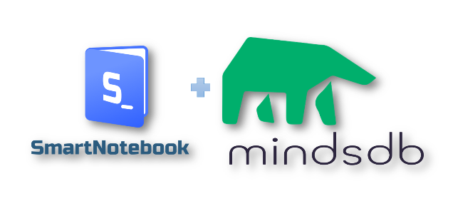
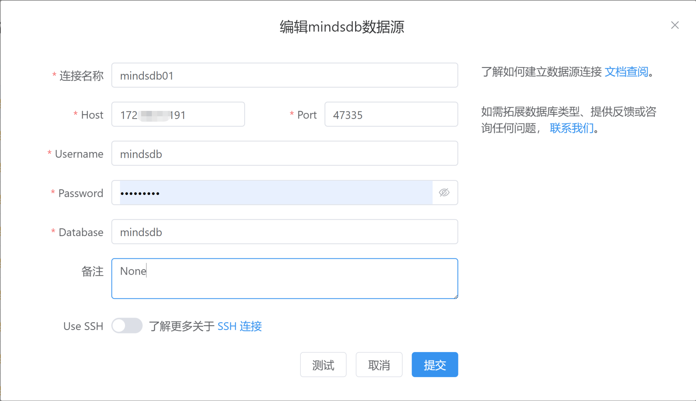
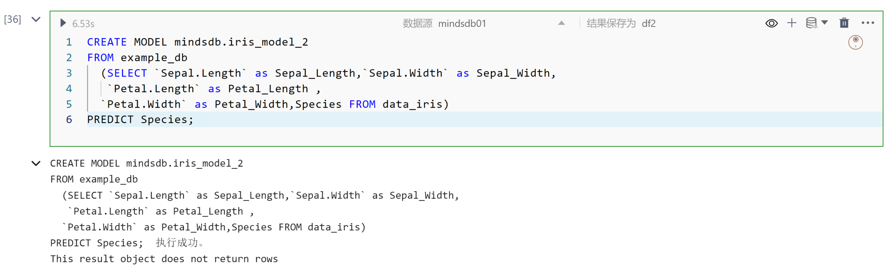
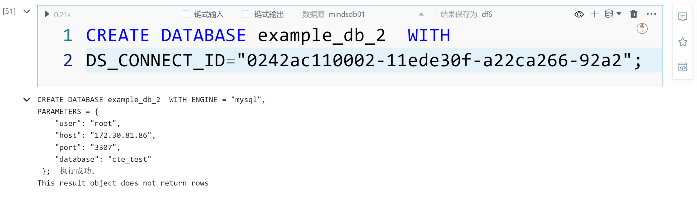
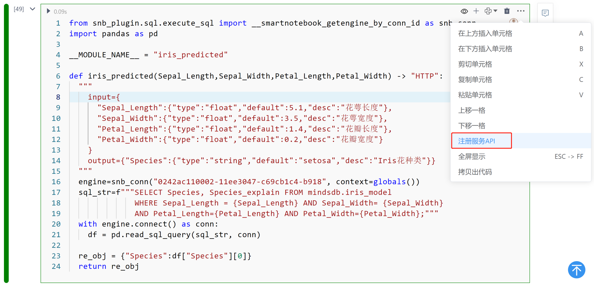
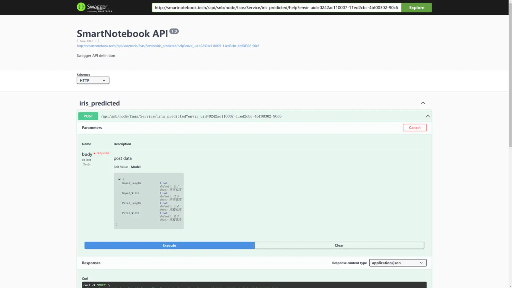
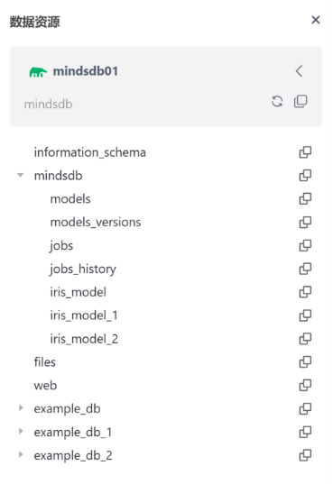

# MindsDB(SQL+ML)实战案例
---
&emsp;&emsp;MindsDB(SQL+ML)为智能决策开启了新的大门。从初学者到资深数据科学家，都可以通过学习和使用这些技术，将数据转化为有意义的见解，从而做出更明智的决策。

&emsp;&emsp;在探索MindsDB(SQL+ML)的基础时，我们将发现数据的魅力和潜力。这些技术的结合使得数据分析变得更加高效和直观。通过简单的SQL查询，我们可以训练机器学习模型，实现数据的智能化处理，并从中挖掘出有价值的信息。

&emsp;&emsp;本篇教程我们来学习MindsDB在Notebook内的使用过程和方式，SmartNotebook 更加简化MindsDB使用。

<!--  -->

  

## MindsDB与notebook 融合

&emsp;&emsp;SmartNoteBook是协作的、集成的、一站式数据科学/分析环境。SmartNoteBook是参考Jupyter Notebook思想实现数据科学与分析的强大环境，深度融合Python(编程能力、AI能力)与SQL(数据处理)、可视化于一体，更高效编辑、执行和共享数据应用模型，进行数据采集、探索、机器学习、深度学习和交互可视化。开箱即用的数据科学、机器学习工具包；高效编辑器辅助和团队协作跟踪功能；通过Notebook结构化逻辑关系配合自然语言可以很好表现数据分析过程、阐述数据故事，形成数据报告，深层次的挖掘数据、释放数据价值。

&emsp;&emsp;SmartNotebook与MindsDB融合上主要以下特征：
- **免安装，支持Minds配置与管理**

<!--  -->

  

- **SQL单元格支持MindsDB SQL 调试和执行，动态SQL、与Python 的交互**

<!--  -->

  

- **快捷无缝的数据源引入到MindsDB**

<!--  -->
  

- **快速生成API服务**

<!--  -->
  

  

<!--  -->

- **元数据的支持**

<!--  -->
  

## 操作示例演示

<video controls="controls" width="100%">
  <source src="../images/MindsDB.mp4" type="video/mp4">
</video>

## 关于SNB

&emsp;&emsp;SmartNoteBook（简称：SNB）是一款现代化的Notebook工具，它是一个开箱即用、云原生、协作式的在线数据科学与分析平台。SNB具有以下特点：

1. 数据连接：SNB可以连接到各种数据形式，包括数据文件、数据库/仓库、数据湖、图数据库、数据开放平台API等。您可以轻松地获取所需的数据，无论数据存储在哪里。

2. 数据分析与探索：通过SNB可以进行探索性数据分析，内置探索性数据分析的组件、SQL原生支持，支持数据清洗、转换、聚合等操作，深入了解数据的特征和模式。同时也可以使用Python 生态体系内各种强大的工具和库。

3. 建立预测模型与服务API：SNB提供了机器学习和预测建模的功能。支持Scikit-learn、TensorFlow等库，建立预测模型，并将其创建为服务API，供其他应用程序调用和使用。

4. 支持知识图谱挖掘：SNB支持连接图数据库进行关系数据的分析、计算和挖掘，将数据之间的关系和连接进行可视化，有助于发现数据之间的隐藏模式和洞察。

5. 数据可视化与报告生成：SNB提供了丰富的数据可视化功能，敏捷可视化分析和输出，用于展示和传达数据的见解和故事。

6. 仪表盘与报告共享：通过SNB创建交互式的数据仪表盘和报告。可以将数据的洞察和分析结果以直观和易于理解的方式与团队或其他利益相关者共享。

7. 数据智灵(人工智能AI伴侣):用户可以通过自然语言描述数据分析需求生成、编辑、bug修复和文档注释Python或SQL 代码，这种方式可以帮助用户更加轻松地处理和分析数据，尤其是对于那些不熟悉编程的人员来说，使用自然语言描述数据分析需求会更加直观和方便。

&emsp;&emsp;SmartNoteBook致力于实现从数据接入到数据价值的全流程，使数据处理和分析变得更加简单、高效和可协作。通过SNB，您可以轻松地进行数据处理、分析和可视化，并通过共享报告和仪表盘将数据的洞察传达给相关人员。