# 客户价值分析案例
---
&emsp;&emsp;RFM模型是客户价值划分的重要工具和手段，用于评估客户的价值和利益创造能力。通过考量客户的最近购买时间(Recency)、购买频率(Frequency)和购买金额(Monetary)，将客户分成不同群体，如忠诚客户、高价值客户和流失客户。这有助于制定个性化的营销策略，提高市场营销效果，同时也能及时识别潜在流失客户并采取挽留措施，提升客户保持率。RFM提供了简单而有效的客户行为评估方法，作为众多客户关系管理（CRM）分析模式之一，对营销决策和客户关系管理具有重要意义，RFM模型得到广泛应用和提及。

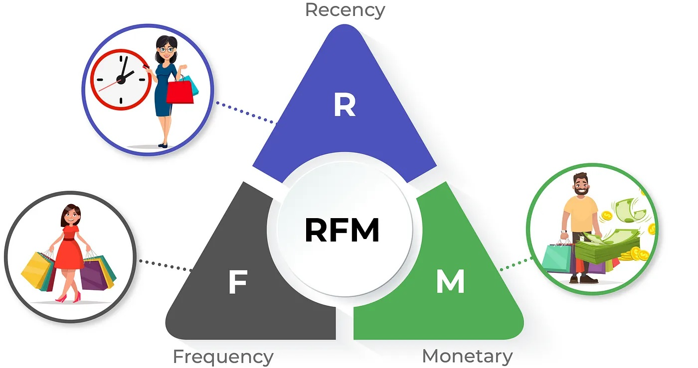  


## 什么是RFM
- RFM是"Recency（最近）、Frequency（频率）和Monetary（金额）"的缩写。Recency指的是客户最后一次购买的时间，也就是距离客户最后一次购买的天数。如果是针对网站或应用的情况，可以解释为客户最后一次访问的日期或最后一次登录的时间。

- Frequency表示在一定时期内购买的次数。这个时期可以是3个月、6个月或1年。因此，我们可以理解这个值代表了客户使用公司产品的频率或数量。数值越大，客户的参与度就越高。我们可以把这些客户称为VIP吗？不一定。因为我们还必须考虑到他们每次购买实际支付的金额，也就是货币价值。

- Monetary指的是客户在给定时期内花费的总金额。因此，大额消费者将与其他客户（如MVP或VIP）区分开来。

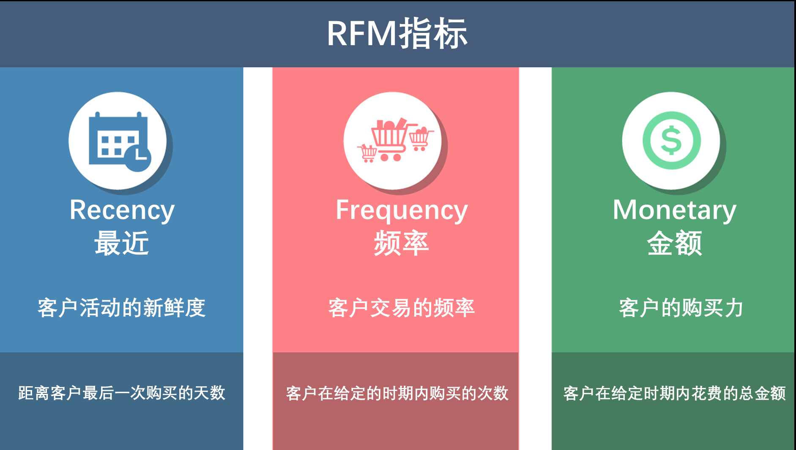  


## 使用SNB进行RFM分析

&emsp;&emsp;为展示RFM 分析过程，引入kaggle 上一个数据集（https://www.kaggle.com/datasets/jihyeseo/online-retail-data-set-from-uci-ml-repo），数据集的格式如下（参见下图）：
- InvoiceNo发票编号
- StockCode库存代码
- Description描述
- Quantity数量
- InvoiceDate发票日期/交易日期
- UnitPrice单价
- CustomerID客户编号
- Country国家

主要分析步骤如下：

a. 引入数据，利用dfSQL计算每个客户的Recency、Frequency、MonetaryValue

b. 利用分位数（四分位数）分别对Recency、Frequency、MonetaryValue 分桶操作，分别将Recency、Frequency、MonetaryValue分成4个等级并对应为定义分数值(1-4分），并计算每个客户的RFM总分（3-12分)。并统计分数下对应客户数量、平均Recency、平均Frequency、平均MonetaryValue等。

c. 按照rfm分数段将用户划分三个等级:黄金用户(10-12分)、白银用户(6-9分)、青铜用户(3-5分) 三个级别，并统计分析每个用户群组下分布情况，包括客户数量、平均Recency、平均Frequency、平均MonetaryValue。

d. 按照rfm分钟进行k-means聚类：标准化、最佳聚类簇数(分组数)的筛选、聚类、统计分析每个簇（群组)的用户分布和FRM值的统计情况。

e. 对比分析分段分类和算法聚类的每群组下分布对比，包括蛇形图和RFM分位数热图(Heatmap of  RFM quantile),对比二者的合理性。

### 引入数据和处理数据

引入python包和加载数据、清洗数据。


```
import numpy as np 
import pandas as pd 
import matplotlib.pyplot as plt
import seaborn as sns
import datetime as dt
all_data = pd.read_excel('/home/data/Online_Retail.xlsx')
all_data= all_data.dropna(subset=['CustomerID'])
all_data = all_data.drop_duplicates()
all_data=all_data[(all_data['Quantity']>0) & (all_data['UnitPrice']>0)]
snapshot_date = all_data['InvoiceDate'].max() + dt.timedelta(days=1)
__SNB_DisplayTable(all_data)
```

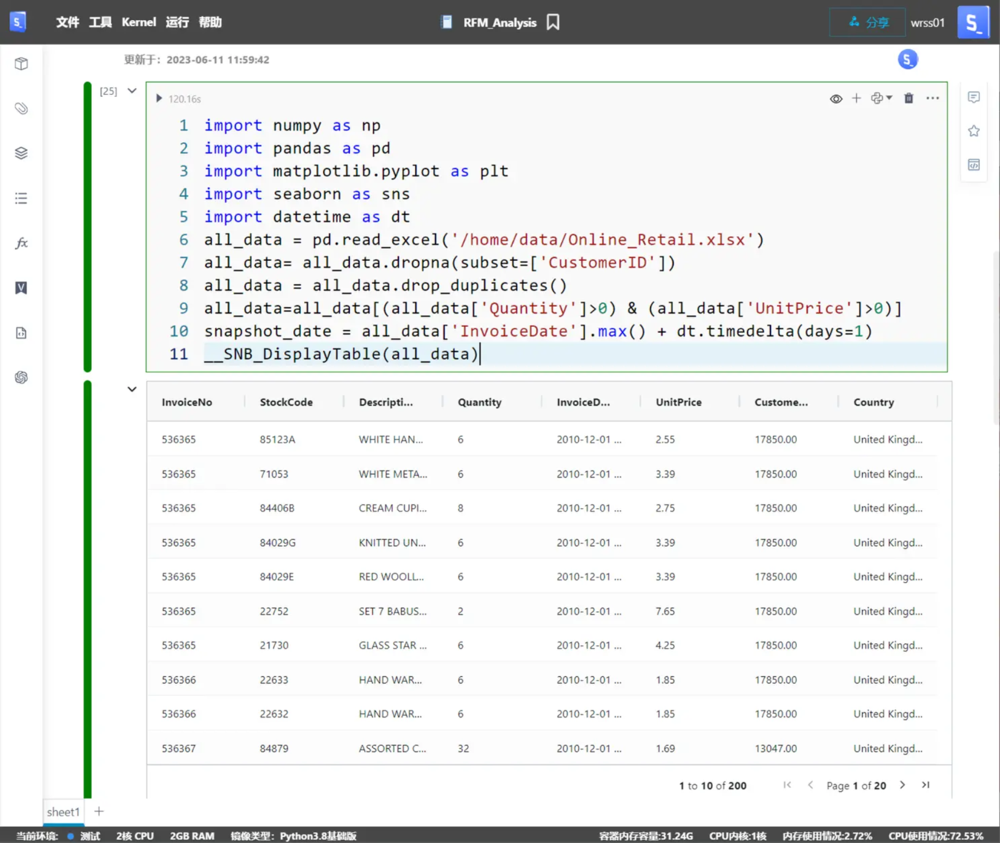  


### 计算Recency、Frequency、MonetaryValue

&emsp;&emsp;SmartNoteBook 内置dfSQL引擎，可以通过SQL 方式操作Pandas DataFrame ，大大降低数据集转换难度，充分发挥SQL能力，内置dfSQL引擎主流操作方式、支持绝大部分主流函数、支持开窗函数。

&emsp;&emsp;利用dfSQL计算Recency、Frequency、MonetaryValue 值。

```
select CustomerID,
    floor(julianday('{{snapshot_date}}')-julianday(max(InvoiceDate))) as Recency,
    count(*) as Frequency ,
    floor(sum(UnitPrice*Quantity)) as MonetaryValue
from all_data group by CustomerID
```

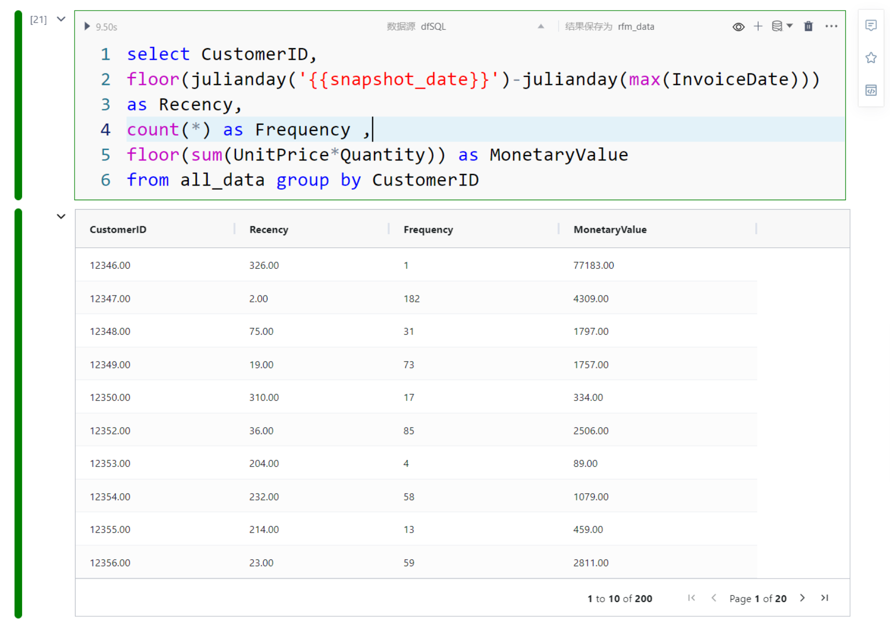  

### 分箱RFM值和RFM 评分

&emsp;&emsp;对Recency、Frequency、MonetaryValue 分别进行分箱操作，不同箱进行评分，计算总分，最高跟12分，最低分为3分，这个分数代表用户的价值。

```
#对Recency、Frequency、MonetaryValue 分别进行分箱操作，不同箱进行评分，计算总分
r_labels =range(4,0,-1)
f_labels=range(1,5)
m_labels=range(1,5)
r_quartiles = pd.qcut(rfm_data['Recency'], q=4, labels = r_labels)
f_quartiles = pd.qcut(rfm_data['Frequency'],q=4, labels = f_labels)
m_quartiles = pd.qcut(rfm_data['MonetaryValue'],q=4,labels = m_labels)
rfm_data = rfm_data.assign(R=r_quartiles,F=f_quartiles,M=m_quartiles)
def add_rfm(x) : return str(int(x['R'])) + str(int(x['F'])) + str(int(x['M']))
rfm_data['RFM_Segment'] = rfm_data.apply(add_rfm,axis=1 )
rfm_data['RFM_Score'] = rfm_data[['R','F','M']].sum(axis=1)
__SNB_DisplayTable(rfm_data)
```

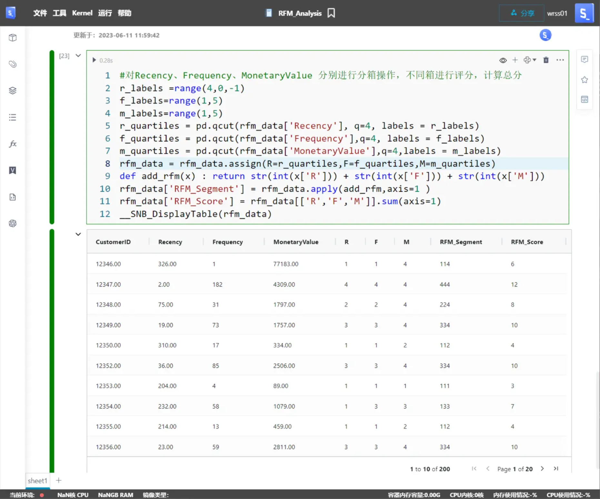  


### 分析用户RFM细分群组的用户情况

&emsp;&emsp;统计分数下对应客户数量、平均Recency、平均Frequency、平均MonetaryValue等。即用户RFM细分群组的用户情况。

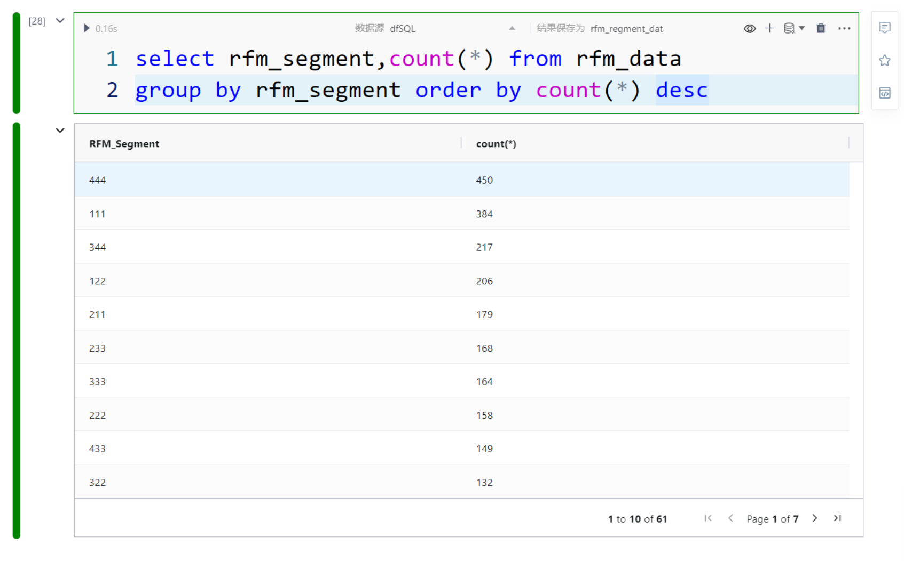  


利用SmartNoteBook内置透视图低代码插件分析每个RFM分数的汇总指标情况。

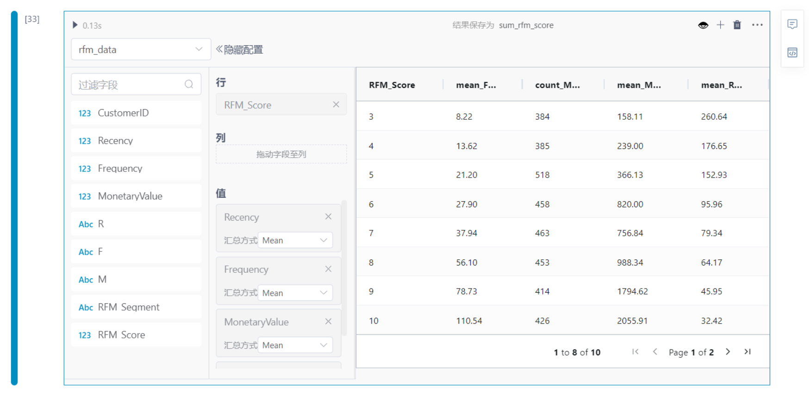  


### 使用RFM评分将客户分为黄金、白银和青铜细分市场

```
def segments(df):
    if df['RFM_Score'] > 9 :
        return '黄金'
    elif (df['RFM_Score'] > 5) and (df['RFM_Score'] <= 9 ):
        return '白银'
    else:  
        return '青铜'
rfm_data['General_Segment'] = rfm_data.apply(segments,axis=1)
__SNB_DisplayTable(rfm_data)
```

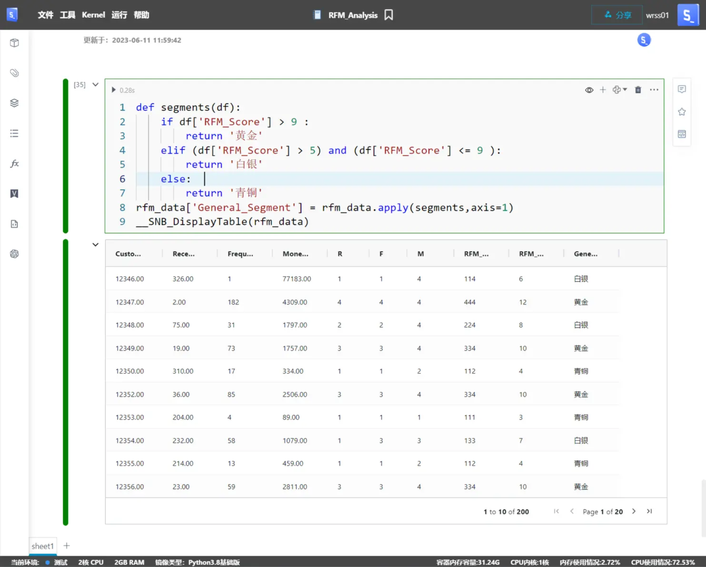  


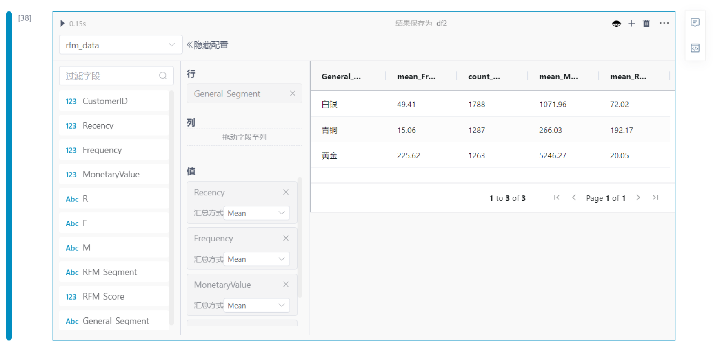  


### Kmeans聚类

上述是利用分段的方式计算分数进行分组的方法，接下来利用聚类算法对用户进行分组，首先分析Recency、Frequency、MonetaryValue的值分布情况是否适合Kmeans聚类（或进行变换操作）、选择最佳簇数(聚类数目)、聚类。

在实现Kmeans聚类之前，必须检查特征Recency、Frequency、MonetaryValue是否符合k-means假设：

- 变量的对称分布（不偏斜）
- 平均值相同的变量
- 具有相同方差的变量

#### 检查是否符合k-means假设及变换处理

```
f,ax = plt.subplots(figsize=(10, 12))
plt.subplot(3, 1, 1); sns.distplot(rfm_data.Recency, label = 'Recency')
plt.subplot(3, 1, 2); sns.distplot(rfm_data.Frequency, label = 'Frequency')
plt.subplot(3, 1, 3); sns.distplot(rfm_data.MonetaryValue, label = 'Monetary Value')
plt.style.use('fivethirtyeight')
plt.tight_layout()
plt.show()
```

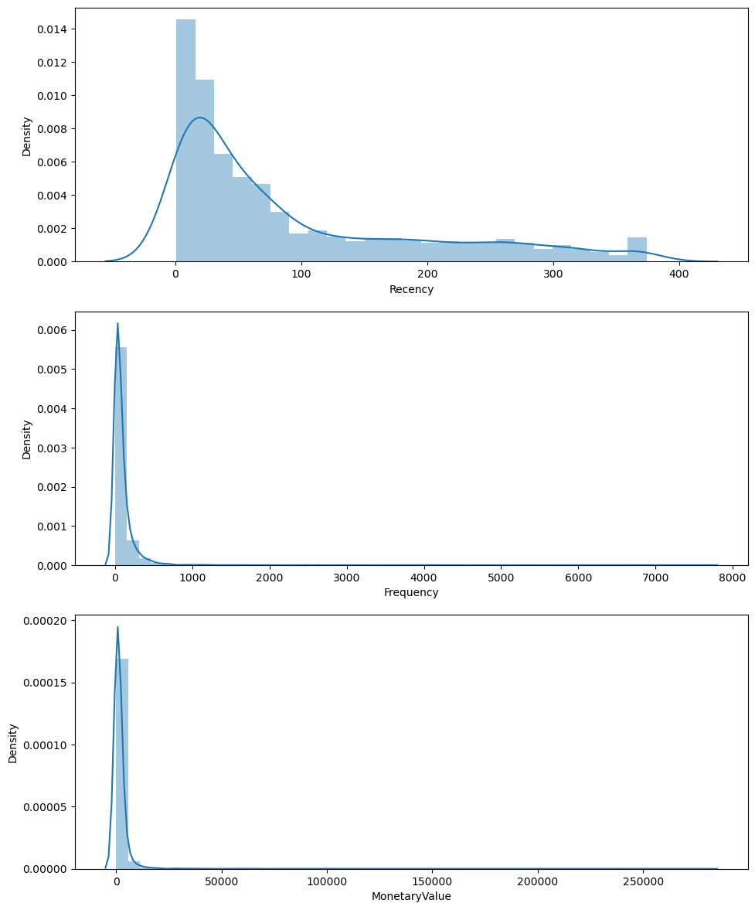  


```
rfm_log = rfm_data[['Recency', 'Frequency', 'MonetaryValue']].apply(np.log, axis = 1).round(3)

f,ax = plt.subplots(figsize=(10, 12))
plt.subplot(3, 1, 1); sns.distplot(rfm_log.Recency, label = 'Recency')
plt.subplot(3, 1, 2); sns.distplot(rfm_log.Frequency, label = 'Frequency')
plt.subplot(3, 1, 3); sns.distplot(rfm_log.MonetaryValue, label = 'Monetary Value')
plt.style.use('fivethirtyeight')
plt.tight_layout()
plt.show()
```

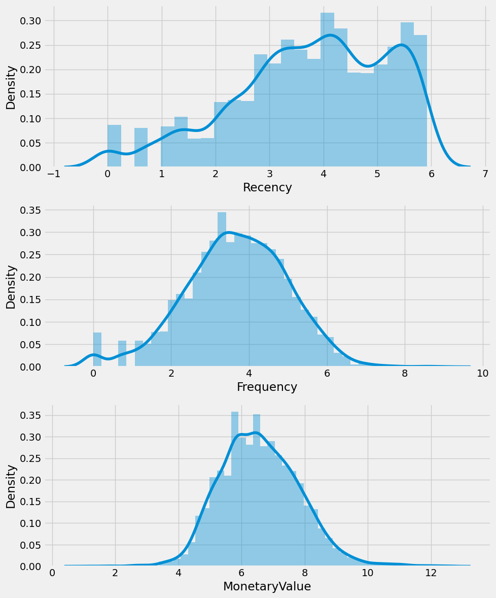  


#### K-Means聚类的实现

&emsp;&emsp;实现K-Means关键步骤如下：数据预处理(数据标准化)、选择聚类的最佳簇数(聚类数目)、进行k-均值聚类、分析每个集群的平均RFM值。

1. 数据预处理：数据标准化


```
from sklearn.preprocessing import StandardScaler
scaler = StandardScaler()
scaler.fit(rfm_log)
#Store it separately for clustering
rfm_normalized= scaler.transform(rfm_log)
rfm_normalized
```

```
array([[ 1.40998159, -2.77997064,  3.69639451],
       [-2.14657818,  1.16036535,  1.41192044],
       [ 0.38364809, -0.17983348,  0.72008734],
       ...,
       [-1.1788923 , -0.89839206, -1.11002495],
       [-1.66273524,  2.20299461,  0.8222    ],
       [-0.00454336,  0.43650655,  0.7375019 ]])
```
2. 选择聚类的最佳簇数(聚类数目)

定义聚类的最佳簇数(聚类数目)，主要有以下方法

- 可视化方法 - 弯曲点准则
- 数学方法 - 轮廓系数
- 实验和解释

弯曲点准则方法

- 绘制聚类数目与簇内平方误差之和（SSE）的关系图 - 即每个数据点到其簇中心的平方距离之和
- 在图中找到一个"弯曲点"
- 弯曲点 - 表示一个"最佳"簇数(聚类数目)的点

应用"弯曲点准则"找到最佳的簇数(聚类数目)：

```
from sklearn.cluster import KMeans

inertias=[]
for k in ks :
    kc = KMeans(n_clusters=k,random_state=1)
    kc.fit(rfm_normalized)
    inertias.append(kc.inertia_)

f, ax = plt.subplots(figsize=(15, 8))
plt.plot(ks, inertias, '-o')
plt.xlabel('Number of clusters, k')
plt.ylabel('Inertia')
plt.xticks(ks)
plt.style.use('ggplot')
plt.title('What is the Best Number for KMeans ?')
plt.show()
```

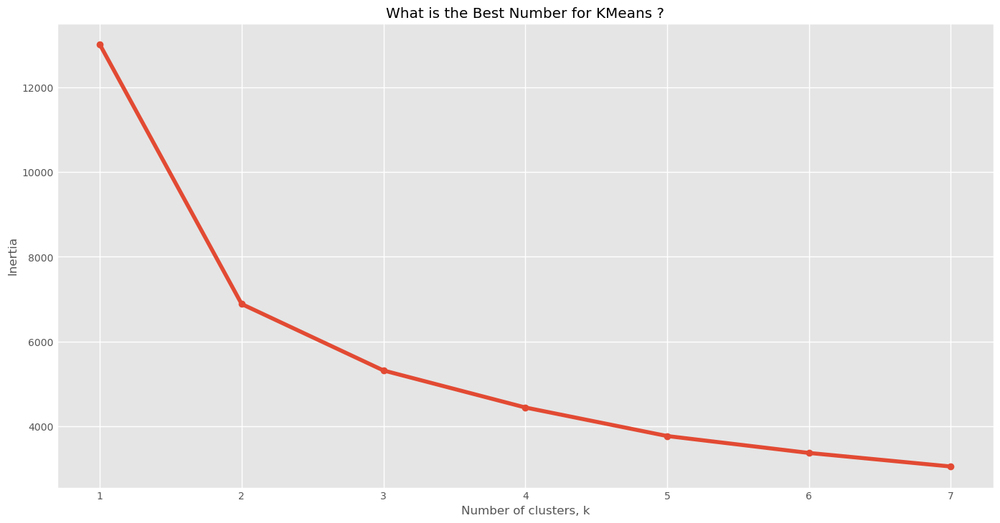  


3. 选择最佳簇数(聚类数目)为3，训练k-means聚类

```
kc = KMeans(n_clusters= 3, random_state=1)
kc.fit(rfm_normalized)

cluster_labels = kc.labels_
rfm_rfm_k3 = rfm_data.assign(K_Cluster = cluster_labels)
rfm_rfm_k3.groupby('K_Cluster').agg({'Recency': 'mean','Frequency': 'mean',
                           'MonetaryValue': ['mean', 'count'],}).round(0)
```

### 对比分析分段分类和算法聚类

&emsp;&emsp;对比分析分段分类和算法聚类的每群组下分布对比，包括蛇形图和RFM分位数热图(Heatmap of  RFM quantile),对比二者的合理性。

#### 分段分类和算法聚类蛇形图

```
rfm_normalized = pd.DataFrame(rfm_normalized,index=rfm_data.index,columns=['Recency', 'Frequency', 'MonetaryValue'])
rfm_normalized['K_Cluster'] = kc.labels_
rfm_normalized['General_Segment'] = rfm_data['General_Segment']
rfm_normalized['CustomerID'] = rfm_data['CustomerID']
rfm_normalized.reset_index(inplace = True)

#Melt the data into a long format so RFM values and metric names are stored in 1 column each
rfm_melt = pd.melt(rfm_normalized,id_vars=['CustomerID','General_Segment','K_Cluster'],value_vars=['Recency', 'Frequency', 'MonetaryValue'],
var_name='Metric',value_name='Value')
rfm_melt
```

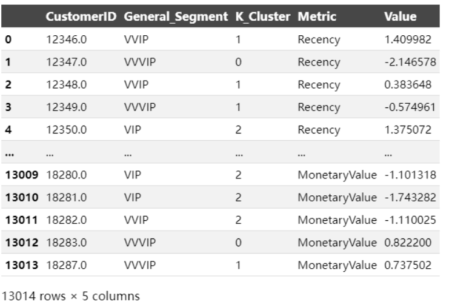  


```
f, (ax1, ax2) = plt.subplots(1,2, figsize=(15, 8))
sns.lineplot(x = 'Metric', y = 'Value', hue = 'General_Segment', data = rfm_melt,ax=ax1)

# a snake plot with K-Means
sns.lineplot(x = 'Metric', y = 'Value', hue = 'K_Cluster', data = rfm_melt,ax=ax2)

plt.suptitle("Snake Plot of RFM",fontsize=24) #make title fontsize subtitle 
plt.show()
```

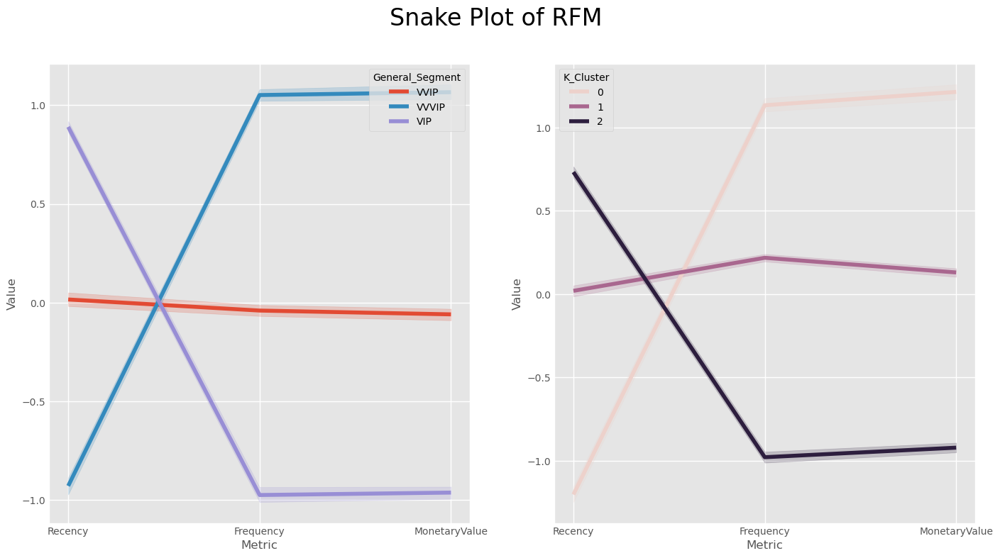  


#### 分段分类和算法聚类的统计对比

&emsp;&emsp;识别每个分段属性的相对重要性的有用技术
- 计算每个聚类的Recency、Frequency、MonetaryValue平均值
- 计算所有用户的Recency、Frequency、MonetaryValue平均值
- 通过除以它们并减去1来计算重要性得分（确保当集群平均值等于总体平均值时返回0）

&emsp;&emsp;用热图展现对比。热图是数据的图形表示，其中较大的值以较暗的比例着色，较小的值以较小的比例着色。我们可以通过颜色非常直观地比较各组之间的差异。


```
cluster_avg = rfm_rfm_k3[['K_Cluster','Recency',    'Frequency','MonetaryValue']].groupby(['K_Cluster']).mean()
population_avg = rfm_rfm_k3[['Recency',    'Frequency','MonetaryValue']].mean()
relative_imp = cluster_avg / population_avg - 1
relative_imp.round(2)

# the mean value in total 
total_avg = rfm_data[['Recency',    'Frequency','MonetaryValue']].mean()
# calculate the proportional gap with total mean
cluster_avg = rfm_data[['General_Segment','Recency',    'Frequency','MonetaryValue']].groupby('General_Segment').mean().iloc[:, 0:3]
prop_rfm = cluster_avg/total_avg - 1
prop_rfm.round(2)
```

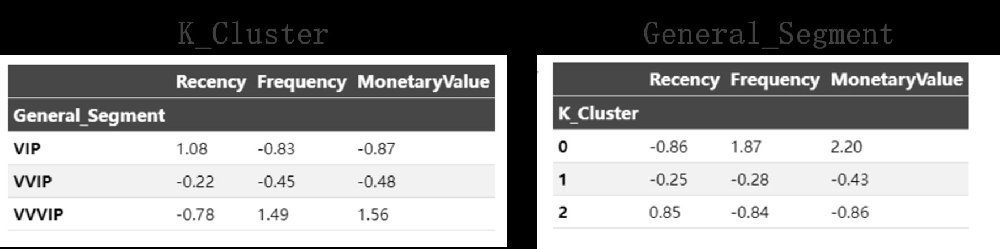  


热图展现：

```
f, (ax1, ax2) = plt.subplots(1,2, figsize=(15, 5))
sns.heatmap(data=relative_imp, annot=True, fmt='.2f', cmap='Blues',ax=ax1)
ax1.set(title = "Heatmap of K-Means")

# a snake plot with K-Means
sns.heatmap(prop_rfm, cmap= 'Oranges', fmt= '.2f', annot = True,ax=ax2)
ax2.set(title = "Heatmap of RFM quantile")

plt.suptitle("Heat Map of RFM",fontsize=20) #make title fontsize subtitle 

plt.show()
```

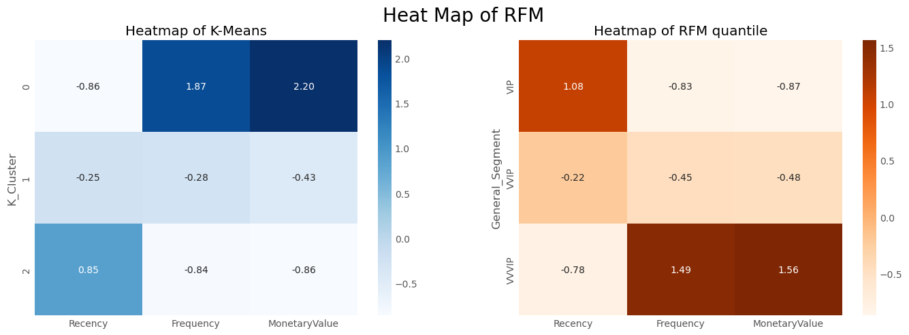  


&emsp;&emsp;通过以上数值比对分析，分段分组和聚类分组二者基本是一致的，二者的特征表现差距比较小，聚类分组是比较合理的。

### RFM分析的模型视图(流程图)

&emsp;&emsp;SmartNoteBook模型视图(Graph)是用于展现NoteBook中单元格之间的逻辑依赖关系关系。在模型视图中，每个单元格被表示为一个节点，而单元格之间的引用关系则表示为边。通过模型视图，可以更直观地理解和分析NoteBook的逻辑依赖关系，从而提升代码执行效率。

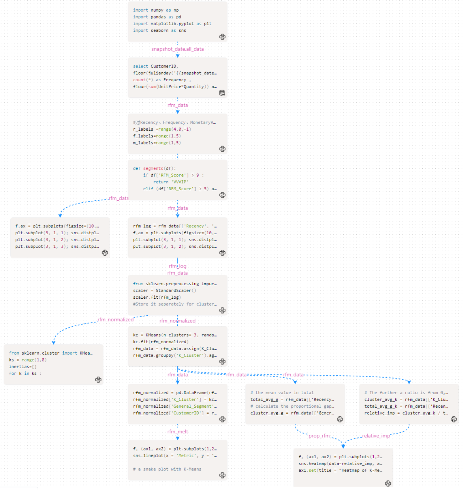  

&emsp;&emsp;上述整个过程是使用SmartNoteBook 实现的，利用SQL和Python 分布计算了用户的Recency、Frequency、MonetaryValue值并进行用户价值的评分、用户价值分组并进行每个用户群组的统计分析，同时利用算法进行聚类分组并进行比对分析，整个过程还是较为复杂的，充分利用了SQL与Python的融合、创建模型及可视化分析展现，充分展现用户价值的RFM挖掘过程。