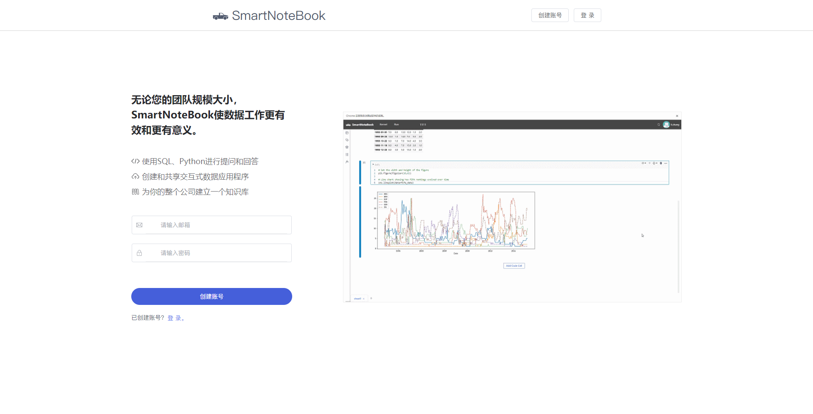
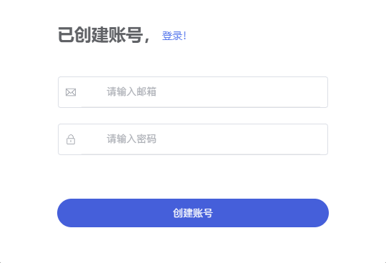
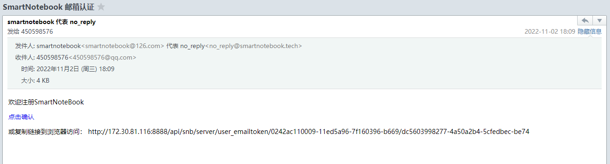
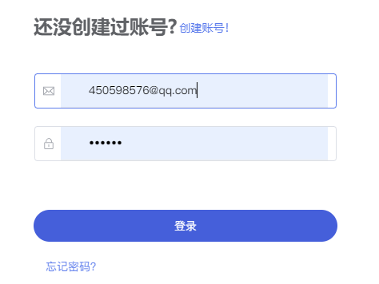
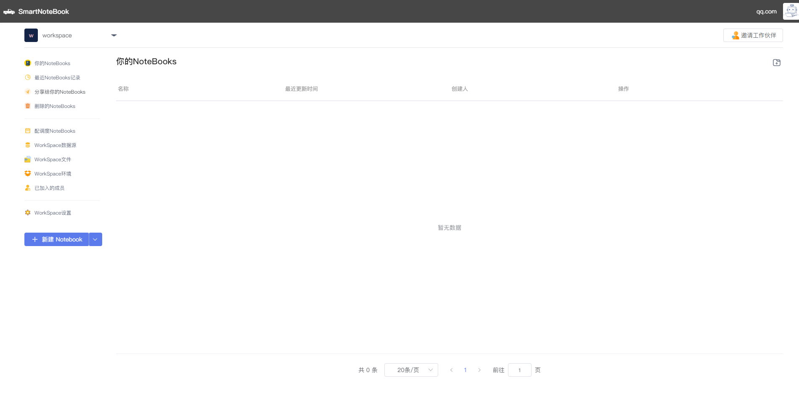

# 申请账号
---
我们首先访问[SmartNoteBook的地址](http://smartnotebook.tech/)

  

点击右上角的`创建账号`，填写我们的邮箱和登录密码。

  

账号申请成功后，后台会发送邮件至我们的邮箱，我们需要通过邮件内的链接来完成注册。

  

收到的邮件如下图所示：

  

然后我们回到SmartNoteBook的地址，输入刚刚申请的邮箱及密码，点击`登录`。

  

如果成功跳转到WorkSpace页面，表示账号申请成功，如未成功登录请联系管理员。

  
