# 数据分析案例
---
我们以我国2020年各个省市自治区的GDP数据为基础，使用SmartNoteBook开展数据分析。

## 数据导入和准备

### 引入全国地市GDP数据

```
import  pandas as pd
from  snb_plugin.sql.execute_dfsql import _smartnotebook_execute_dataframesql
gdp = pd.read_excel('/home/gdpData.xlsx')
gdp.sample(5)
```

字段包含:
* Provice：省/直辖市/自治区名称

* District：市/直辖县/自治州名称

* GDP2020: 2020年行政区全年GDP。单位：亿元

* Population2020：截止2020年底行政区常住人口数。单位：万人

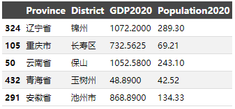  

由于我们在收集数据的同时已经做了数据清洗，因此不存在空值：

```
gdp.isnull().sum()
```

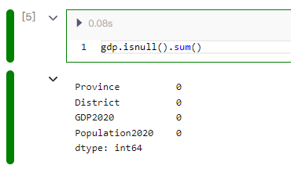  

简单看一下数据整体描述：

```
gdp.describe(include ='all')
```
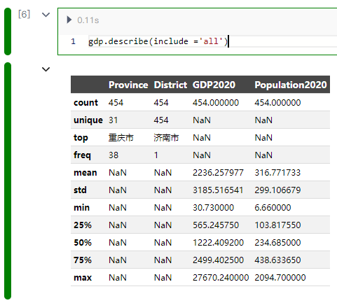  

先计算各行政区划的人均GDP情况

```
gdp['per_gdp']=gdp['GDP2020']/gdp['Population2020']
gdp.sample(5)
```

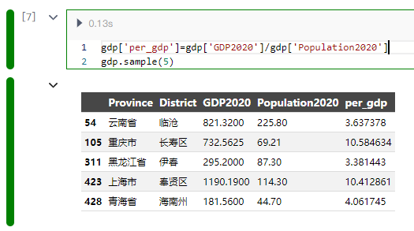  

## 数据分析

### 各省内地市人均GDP的厢线图展现

```
xlist=list(set(gdp['Province']))

y_data=[]
print()
for i in xlist:
    y_data.append(gdp[gdp['Province']==i ]['per_gdp'].tolist())

import pyecharts.options as opts
from pyecharts.charts import Grid, Boxplot, Scatter
from pyecharts.options.global_options import ThemeType
scatter_data = []

xlist_tmp=['\n'.join(list(x)) for x in xlist]

box_plot = Boxplot(init_opts=opts.InitOpts(theme=ThemeType.PURPLE_PASSION  )) #ThemeType.ESSOS


box_plot = (
    box_plot.add_xaxis(xaxis_data=xlist_tmp)
    .add_yaxis(series_name="", y_axis=box_plot.prepare_data(y_data))
    .set_global_opts(
        title_opts=opts.TitleOpts(pos_left="center", title="2020 各地市人均GDP 分布箱线图"),
        tooltip_opts=opts.TooltipOpts(trigger="item", axis_pointer_type="shadow"),
        xaxis_opts=opts.AxisOpts(
            type_="category",boundary_gap=True,
            splitarea_opts=opts.SplitAreaOpts(is_show=False),
            axislabel_opts=opts.LabelOpts(formatter="{value}",interval="0"),
            splitline_opts=opts.SplitLineOpts(is_show=False),
        ),
        yaxis_opts=opts.AxisOpts(
            type_="value",
            name="万元",
            splitarea_opts=opts.SplitAreaOpts(
                is_show=True, areastyle_opts=opts.AreaStyleOpts(opacity=1)
            ),
        ),
    )
    .set_series_opts(tooltip_opts=opts.TooltipOpts(formatter="{a}: {c}"))
)# {a}:系列名称，{b}:数据名称，{c}:数值数组，{d}:无

grid = (
    Grid(init_opts=opts.InitOpts(width="950px", height="550px"))
    .add(box_plot,grid_opts=opts.GridOpts(pos_left="5%", pos_right="5%", pos_bottom="15%"),
    )   
)
box_plot.render_notebook()
```
* 长三角（上海、江苏、浙江）和福建省的人均GDP中位数水平较高（箱子中间的线较高）

* 北京、上海、天津数据波动较大（箱子宽度较大）

* 北京、天津、上海、海南存在人均GDP特别高的行政单位（北京的西城区、上海的黄浦区、天津的滨海新区、海南的洋浦，注册企业多且人口相对比较少）

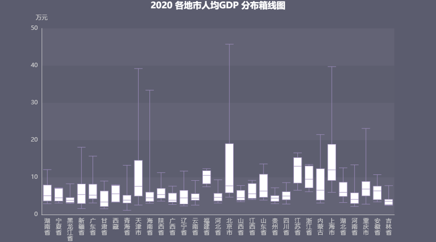  

接下来我们计算各省的地市之间的人均GDP标准差，反应省内均衡发展程度。
这里我们可以使用`dfSQL`的方式来简化我们的分析计算，方法是新建一个`SQL代码块`

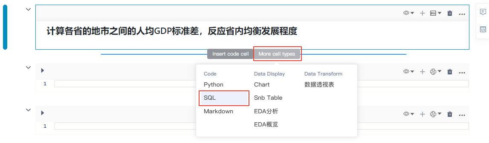  

接着在代码块的右上角选择`dfSQL`,代码块输出的结果集我们定义并填写为`df2`（`df2`的数据类型为pandas的DataFrame，后面我们可以直接用Python代码操作`df2`），代码块里我们输入以下SQL代码：

```
select Province,sum(GDP2020) as gdp_sum, 
sum(Population2020) as popu_sum,
sum(GDP2020) / sum(Population2020) as gdp_avg,
count(distinct District) as dist_count,stddev(per_gdp) as gdp_std 
from gdp  
group by Province
```
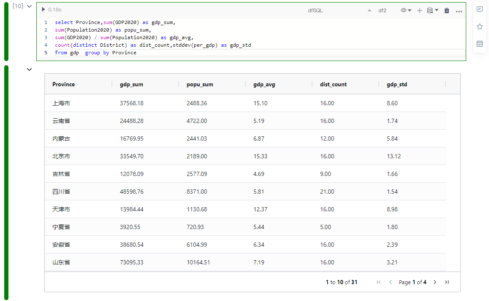  

### 计算新发展力指数

核心重点，计算新发展力指数，应用T-score 公式。

我们新建一个`MarkDown`代码块，然后在代码块中输入以下内容，帮助我们记忆T-score的计算公式：
```
## 核心重点，计算新发展力指数，应用T-score 公式

$$ t= \frac{ \overline{x} - \mu_{0} }{ \frac{\sigma}{\sqrt{n}}} $$


其中：

$\overline{x}$ 为样本均值，省内的人均GDP

$\mu_{0}$ 总体的均值，全国人均GDP

${\sigma}$ 样本的标准差，省内各个地市人均GDP 的标准差

${n}$  样本数量，省内地市的数量
```

> [!NOTE]
> `MarkDown`代码块无需执行，内容完成后将鼠标移至代码块之外鼠标点击一下即可。

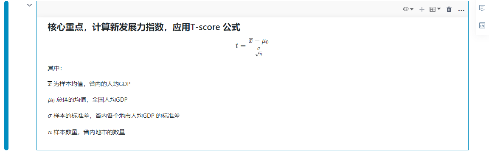  

然后创建`Python`代码块，执行以下代码计算我们的T-score：

```
import numpy as np

df2['gdp_all_avg']=sum(df2['gdp_sum'])/sum(df2['popu_sum'])
df2['t_score']=(df2['gdp_avg']-df2['gdp_all_avg'])/(df2['gdp_std']/np.sqrt(df2['dist_count']))
df2['A']='all'
for c in ['gdp_sum','popu_sum','gdp_avg','gdp_std','gdp_all_avg','t_score']:
    df2[c]=round(df2[c],2)
df2
```

  

### 应用开窗函数计算各种排名

这里使用dfSQL计算较为方便，因此我们创建`SQL代码块`,敲入以下SQL代码：

```
select Province,gdp_sum,popu_sum,gdp_avg,gdp_std,t_score as XL_Index,rank() over(partition by A order by gdp_sum desc) as gdp_rank ,
rank() over(partition by A order by popu_sum desc) as popu_rank ,rank() over(partition by A order by gdp_avg desc) as gdp_avg_rank ,
rank() over(partition by A order by t_score desc) as XL_Index_rank
from df2
```

* 新力指数排名（XL_Index_rank）

* 区划发展均衡排名（gdp_avg_rank）

* GDP总量排名（gdp_rank）

* 常住人口总量排名（popu_rank）

> [!NOTE]
> 使用`dfSQL`时不要忘记选右上角的dfSQL并定义和填写结果集的名称。


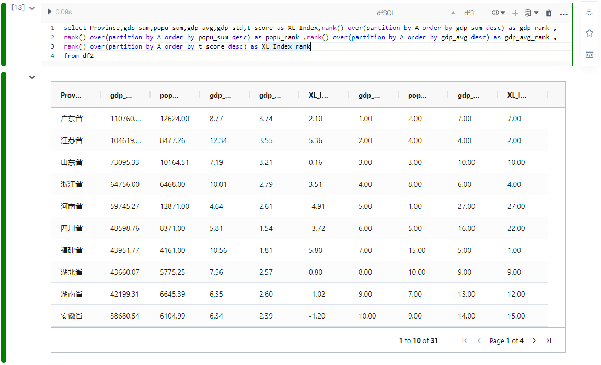  

我们简单罗列下排名靠前的省份：

* GDP总量：广东、江苏、山东排名前三

* 人均GDP：北京、上海、天津排名前三

* 常住人口总量：河南、广东、山东排名前三

* “新力指数”排名：福建、江苏、上海排名前三，浙江排名第四

“新力指数”的含义我们可以对应下图来对照和理解：

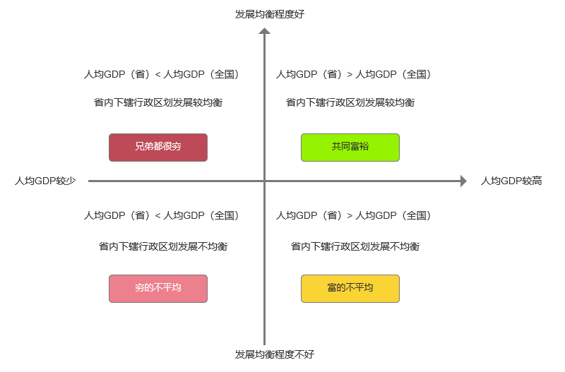  


### 应用GPS坐标进行地图展示

接下来我们引入各省坐标数据（坐标数据我们已经提前导入到MySQL数据库）

新建一个`SQL代码块`，右上角选择数据服务的链接，并定义和输入数据集的名称，然后输入以下代码查看坐标数据：

```
select * from privince_gps
```
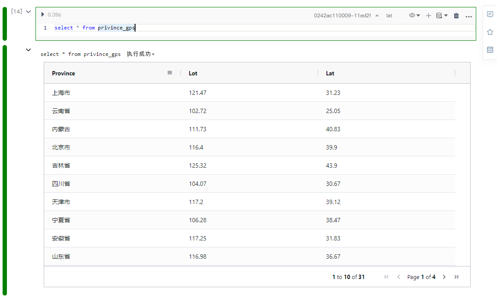  

然后将坐标数据通过行政区的名称和我们的新力指数数据关联join。

同样也是新建一个`SQL代码块`，右上角选择dfSQL，并定义和输入数据集的名称，然后输入以下代码进行关联：

```
select df3.*,lat.lat,lat.lot from df3,lat where df3.Province=lat.province
```
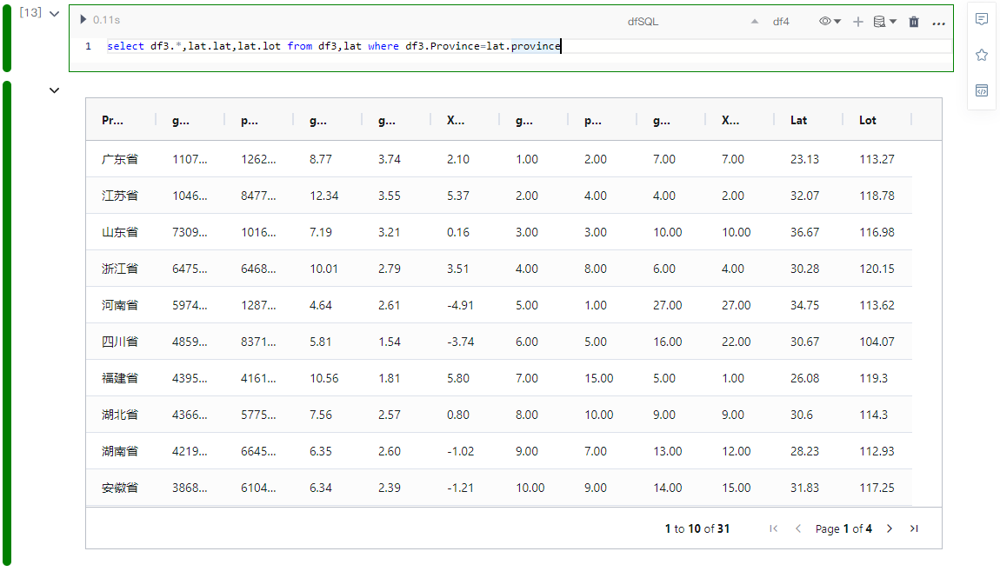  

接下来我们可以通过地图将数据直观展示：

```
from pyecharts.charts import Map  
from pyecharts import options as opts
import random

titlename = "新发展力指数"

data_city = [(p.replace('省','').replace('市',''),(i,r)) for (p,i,r) in zip(df4['Province'],df4['XL_Index'],df4['XL_Index_rank'])]
 
china_city = (
    Map(init_opts=opts.InitOpts(width="1300px", height="1000px"))
    .add(
        series_name=titlename,
        data_pair=data_city,
        maptype="china",
        is_map_symbol_show=True,                    #此处控制在地图上是否显示红点，data_city中有的市名才会在地图中显示红点呦
        label_opts=opts.LabelOpts(is_show=True,formatter="{b}: {c}"),    #此处控制在地图上是否显示名称  {b}: {c}
    )
    .set_global_opts(
        title_opts=opts.TitleOpts(title=titlename),
        visualmap_opts=opts.VisualMapOpts(
            min_=0,
            max_=15,
            is_piecewise=True                        #定义左下角图例为分段型，默认为连续的图例
        ),
    )
 )

china_city.render_notebook()
```
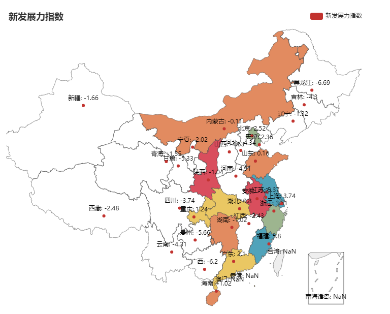  

> [!Tip]
> 在分析过程中，NoteBook会将我们写的Markdown标题按照层级显示为大纲目录，增加整个分析过程的可读性。另外，我们也可以通过点击大纲目录中的小节快速定位到代码块。所以，养成良好的数据分析报告书写习惯不仅提升数据分析师的效率，同时也会提高阅读者的阅读体验。

  


好的，以上我们使用NoteBook完整的体验了一个简单的数据分析实验。接下来如果我们想要将报告分享给别人怎么办？

点击NoteBook右上角的`分享`按钮，可快速生成分享链接，赶紧把你的分析成果分享给小伙伴吧！

  

> [!Tip]
> 在分析过程中，NoteBook提供了我们一些快速探索数据的组件，通过组件我们能够简单快速地进行探索性数据分析。详细的使用说明可以参考前面关于各个EDA组件的介绍。
