# 机器学习案例
---
我们以一个经典的`鸢尾花分类实验`带大家熟悉NoteBook的使用。

>Iris数据集是常用的分类实验数据集，由Fisher, 1936收集整理。Iris也称鸢尾花卉数据集，是一类多重变量分析的数据集。

>数据集包含150个数据样本，分为3类，每类50个数据，每个数据包含4个属性。可通过花萼长度，花萼宽度，花瓣长度，花瓣宽度4个属性预测鸢尾花卉属于（Setosa，Versicolour，Virginica）三个种类中的哪一类。

## 数据导入和准备

### 添加代码块
我们先添加一个Python代码块Cell。

  


### 导入数据
输入以下代码，引入我们所需的库，并读取数据文件。

```
import numpy as np
import pandas as pd
dataset = pd.read_csv('../Iris.csv')
```

  

### 数据集概览

先快速了解一下数据集包含多少记录（行）和多少属性（列）

```
dataset.shape
```
  

预览一下前五条记录

```
dataset.head(5)
```

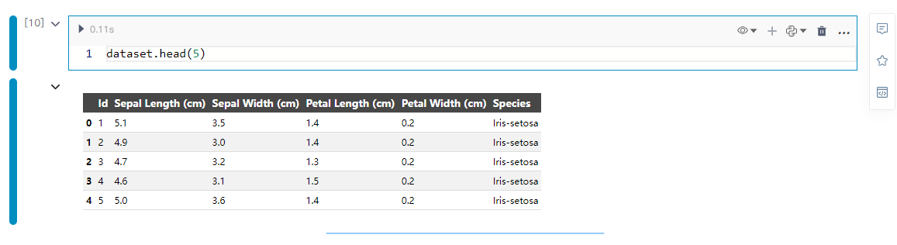  

数据集整体的描述

```
dataset.describe()
```
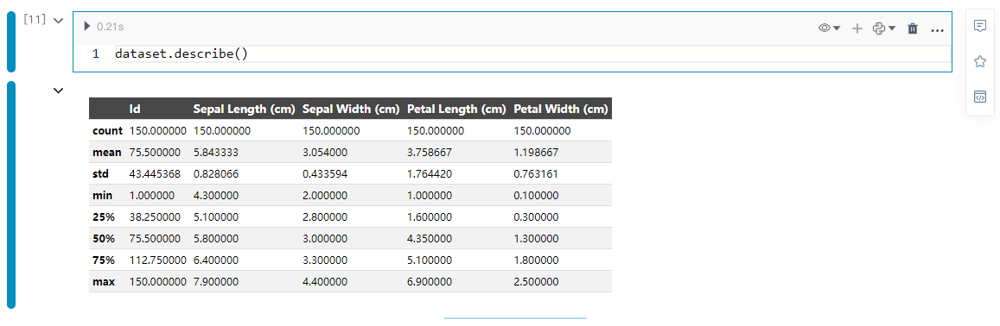  

属于每个种类的记录（行）数。

```
dataset.groupby('Species').size()
```
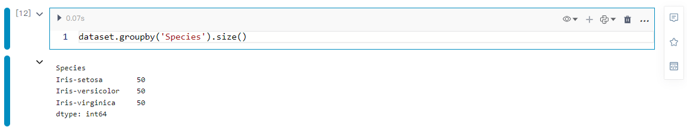  

### 划分数据集

如我们所见，数据集包含六列：

* Id  序号

* SepalLengthCm （花萼长度），单位：cm

* SepalWidthCm（花萼宽度），单位：cm

* PetalLengthCmd（花瓣长度），单位：cm

* PetalWidthCmd（花瓣宽度），单位：cm

* Species  种类

实际特征由第1-4列描述。最后一列包含样本标签。首先，我们需要将数据分成两个数组：X（特征）和y（标签）。

```
feature_columns = ['SepalLengthCm', 'SepalWidthCm', 'PetalLengthCm','PetalWidthCm']
X = dataset[feature_columns].values
y = dataset['Species'].values
```
  

### 标签转成编码

由于标签是文本类型。而KNeighborsClassifier不接受字符串标签。因此我们需要使用LabelEncoder将它们转换为数字。setosa鸢尾对应0，versicolor鸢尾对应1，virginica鸢尾对应2。
```
from sklearn.preprocessing import LabelEncoder
le = LabelEncoder()
y = le.fit_transform(y)
```
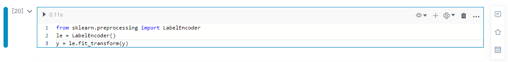  


### 数据集拆分

我们将数据集拆分为训练集和测试集，以便稍后检查分类器是否正确工作。

```
from sklearn.model_selection  import train_test_split
X_train, X_test, y_train, y_test = train_test_split(X, y, test_size = 0.2, random_state = 0)
```

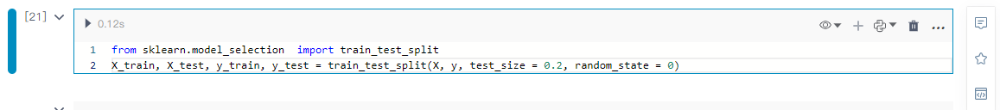  


## 数据可视化

引入所需的包

```
import matplotlib.pyplot as plt
import seaborn as sns
%matplotlib inline
```
  


### 平行坐标图

平行坐标图是可视化高维多元数据的一种常用方法，为了显示多维空间中的一组对象，绘制由多条平行且等距分布的轴，并将多维空间中的对象在平行坐标图中用一条折线表示，纵向是属性值，横向是属性类别，为了反映变化趋势和各个变量间相互关系，往往将描述不同变量的各点连接成折线。

```
from pandas.plotting import parallel_coordinates
plt.figure(figsize=(15,10))
parallel_coordinates(dataset.drop("Id", axis=1), "Species")
plt.title('Parallel Coordinates Plot', fontsize=20, fontweight='bold')
plt.xlabel('Features', fontsize=15)
plt.ylabel('Features values', fontsize=15)
plt.legend(loc=1, prop={'size': 15}, frameon=True,shadow=True, facecolor="white", edgecolor="black")
plt.show()
```
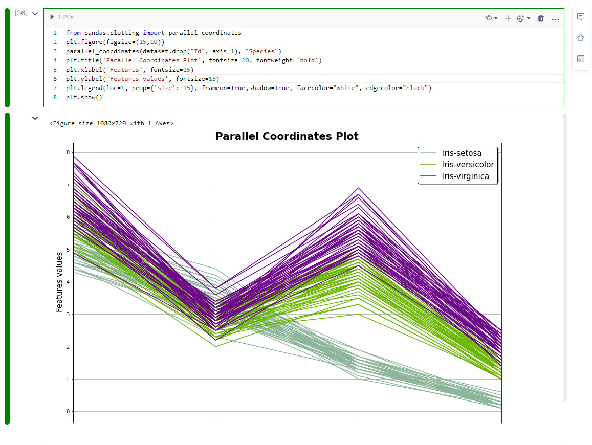  


### 安德鲁斯曲线

安德鲁斯曲线允许人们用大量的曲线来绘制多元数据 (multivariate data)，这些曲线使用样本属性作傅立叶级数的系数来创建，通过为每个群不同的曲线着色，可以可视化数据聚类。属于同一群样本的曲线通常会比较接近，形成较大的结构。

```
from pandas.plotting import andrews_curves
plt.figure(figsize=(15,10))
andrews_curves(dataset.drop("Id", axis=1), "Species")
plt.title('Andrews Curves Plot', fontsize=20, fontweight='bold')
plt.legend(loc=1, prop={'size': 15}, frameon=True,shadow=True, facecolor="white", edgecolor="black")
plt.show()
```

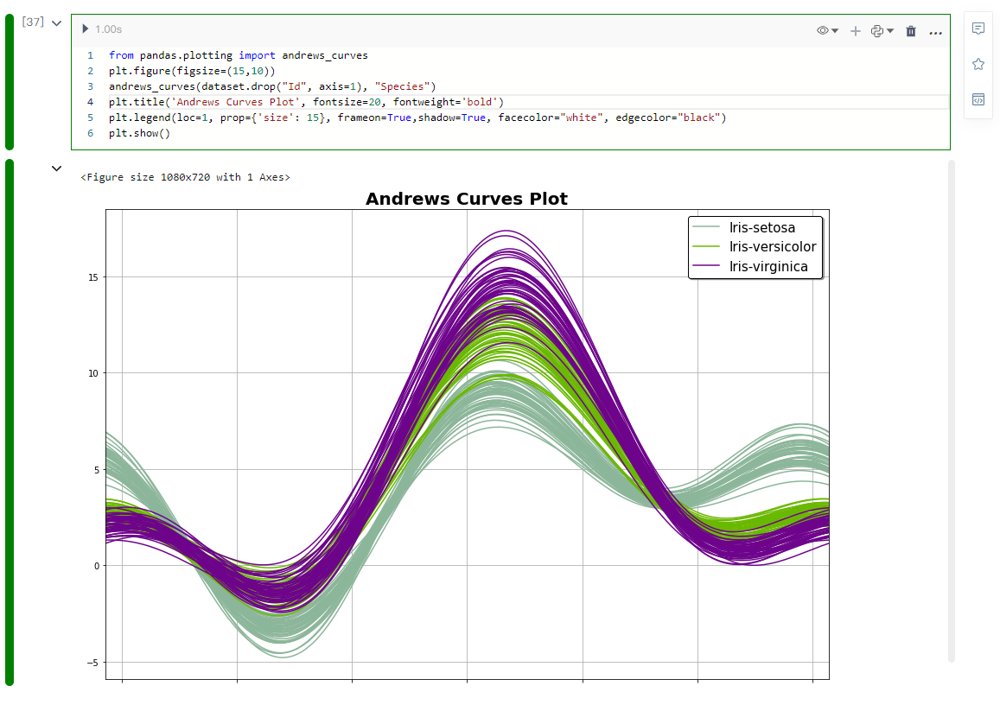  


### 两两关系图Pairplot

Pairplot主要展现的是变量两两之间的关系（线性或非线性，有无较为明显的相关关系）

```
plt.figure()
sns.pairplot(dataset.drop("Id", axis=1), hue = "Species", height=3, markers=["o", "s", "D"])
plt.show()
```

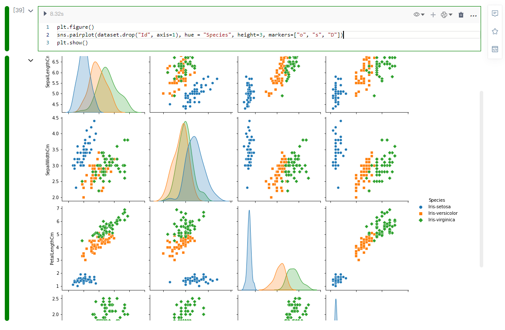  


### 可视化3D图

```
from mpl_toolkits.mplot3d import Axes3D
fig = plt.figure(1, figsize=(20, 15))
ax = Axes3D(fig, elev=48, azim=134)
ax.scatter(X[:, 0], X[:, 1], X[:, 2], c=y,
           cmap=plt.cm.Set1, edgecolor='k', s = X[:, 3]*50)
for name, label in [('Virginica', 0), ('Setosa', 1), ('Versicolour', 2)]:
    ax.text3D(X[y == label, 0].mean(),
              X[y == label, 1].mean(),
              X[y == label, 2].mean(), name,
              horizontalalignment='center',
              bbox=dict(alpha=.5, edgecolor='w', facecolor='w'),size=25)
ax.set_title("3D visualization", fontsize=40)
ax.set_xlabel("Sepal Length [cm]", fontsize=25)
ax.w_xaxis.set_ticklabels([])
ax.set_ylabel("Sepal Width [cm]", fontsize=25)
ax.w_yaxis.set_ticklabels([])
ax.set_zlabel("Petal Length [cm]", fontsize=25)
ax.w_zaxis.set_ticklabels([])
plt.show()
```

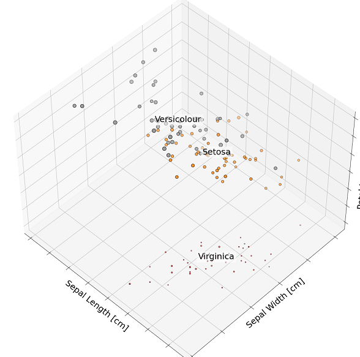  


## 使用KNN进行分类

### 预测

```
from sklearn.neighbors import KNeighborsClassifier
from sklearn.metrics import confusion_matrix, accuracy_score
from sklearn.model_selection import cross_val_score
classifier = KNeighborsClassifier(n_neighbors=3)
classifier.fit(X_train, y_train)
y_pred = classifier.predict(X_test)
y_pred
```
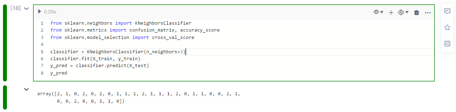  

### 评估

混淆矩阵

```
cm = confusion_matrix(y_test, y_pred)
cm​
```
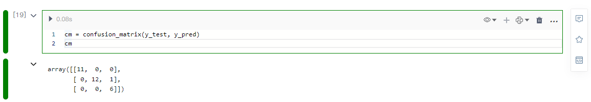  

评估模型预测的准确率

```
accuracy = accuracy_score(y_test, y_pred)*100
print('模型准确率： ' + str(round(accuracy, 2)) + ' %.')
```
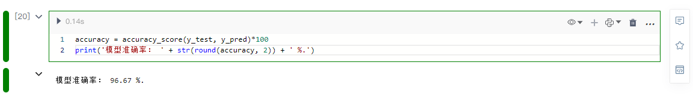  

### 使用交叉验证进行参数调整

```
k_list = list(range(1,50,2))
cv_scores = []
for k in k_list:
    knn = KNeighborsClassifier(n_neighbors=k)
    scores = cross_val_score(knn, X_train, y_train, cv=10, scoring='accuracy')
    cv_scores.append(scores.mean())
MSE = [1 - x for x in cv_scores]
```

```
xvalues=[str(x) for x in k_list]
line=Line()
line.add_xaxis(xvalues)
line.add_yaxis('', MSE,is_smooth=False,label_opts=opts.LabelOpts(is_show=True),symbol='none')
line.set_global_opts(title_opts=opts.TitleOpts(title="最佳邻居数"),
yaxis_opts=opts.AxisOpts( min_=0.040,name="分类错误",name_location = 'center',name_gap = 50,
name_textstyle_opts = opts.TextStyleOpts(
    font_size=16,
   ),
),
xaxis_opts=opts.AxisOpts(name="邻居数量 K值",name_location = 'center',name_gap = 35,
name_textstyle_opts = opts.TextStyleOpts(
    font_size=16,
   ),
),
)
line.set_series_opts(
  linestyle_opts=opts.LineStyleOpts( 
  color="#448CBB", 
  width=2, 
  ),
)
line.render_notebook()
```
  

找到最佳的K值为：

```
best_k = k_list[MSE.index(min(MSE))]
print("最佳邻居数： %d." % best_k)
```
  

以上我们就完整的用NoteBook做完一个KNN分类机器学习算法的小案例。