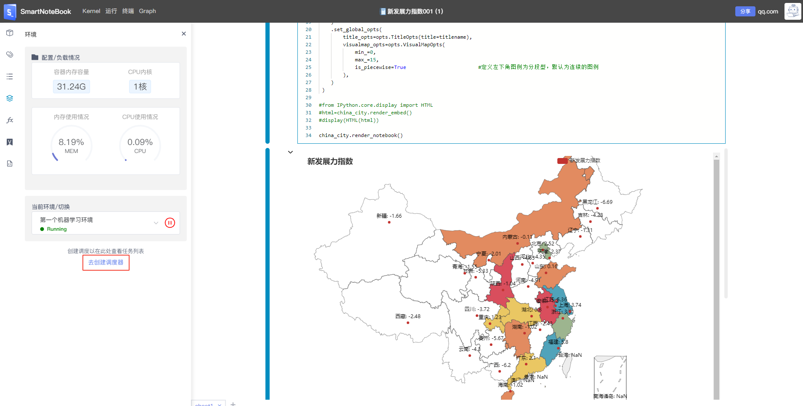
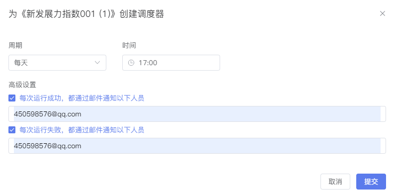
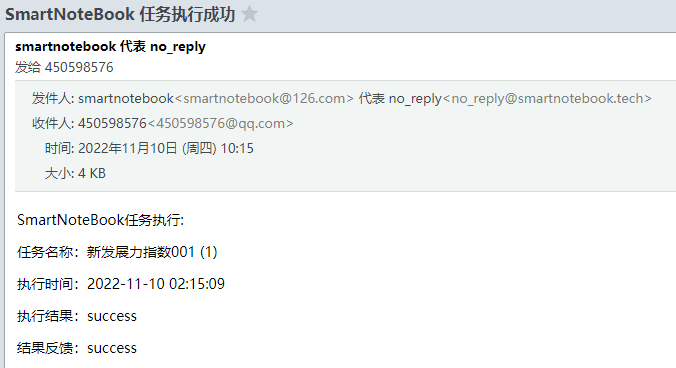
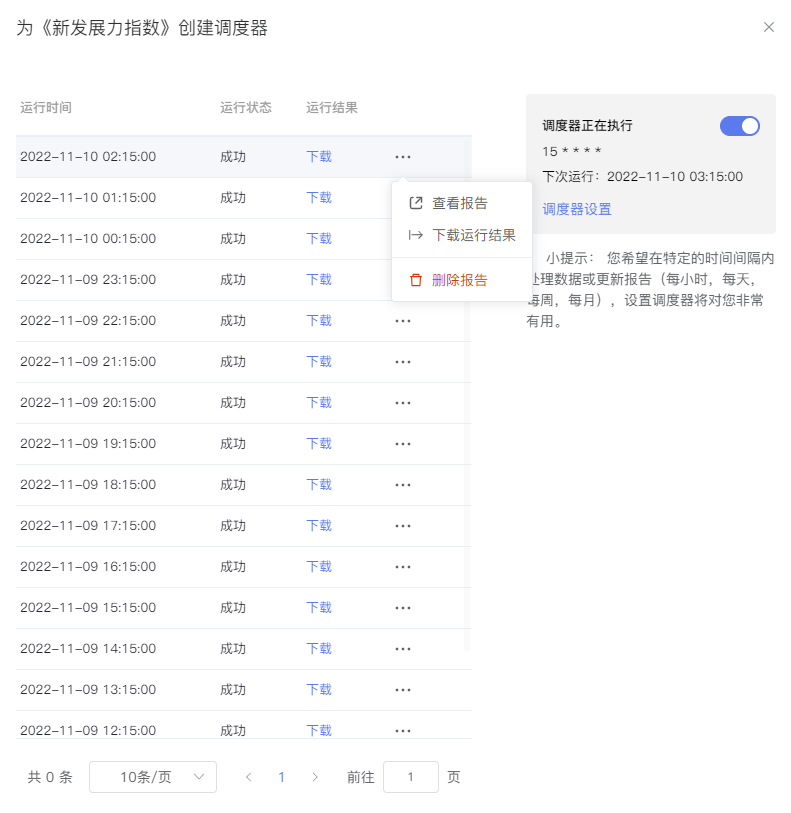
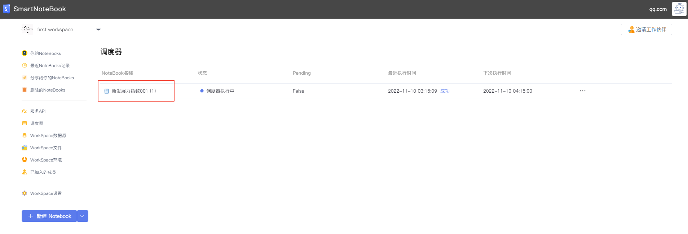

# 定时任务
---
当我们用NoteBook完成了一份数据分析报告或是一个机器学习的模型，我们需要定期来运行分析结果或是定期训练模型，此时，我们可以用SmartNoteBook的定时任务来解决。

用户可以使用定时任务托管运行NoteBook，在云端跑完整个NoteBook报告/模型（若代码可以全部跑通）。任务运行后，用户可以查看运行结果、输出结果文件，并根据你的配置通知相关人员。

## 创建一个调度任务

我们之前一起用NoteBook开展了关于“新发展力指数”的分析，接下来我们想要定期来运行该分析。

在NoteBook页面，依次点击侧边栏的`环境`-->`去创建调度器`。

  

根据我们的需要来设置执行周期和时间，并设置邮件通知人（可选），设置完成后点击提交。

比如我们设定`每天下午17:00`执行，无论运行成功或失败，均通知到某个责任人的邮箱。

  
 
任务执行完毕后自动发送执行信息到邮箱。

  

配置好后我们就可以在侧边栏的环境最下区域看到调度运行的配置情况，并且操作开关`打开/关闭`调度任务。

  

## 查看调度历史

当定时任务运行完后，我们去哪里查看运行的结果？这里我们提供了两个入口

* 第一种方式：在任务相应的NoteBook文档内，依次点击侧边栏的`环境`-->`调度器设置`，在弹出的页面就可以看到所有的历史执行记录和状态，并可以查看和下载详细运行结果。

  

历史运行记录

  

* 第二种方式：在`WorkSpace`的管理页面，点击左侧的`调度器`,在右侧的列表选择你要查看的NoteBook，单击行便可查看运行的历史记录。

  

历史运行记录

  