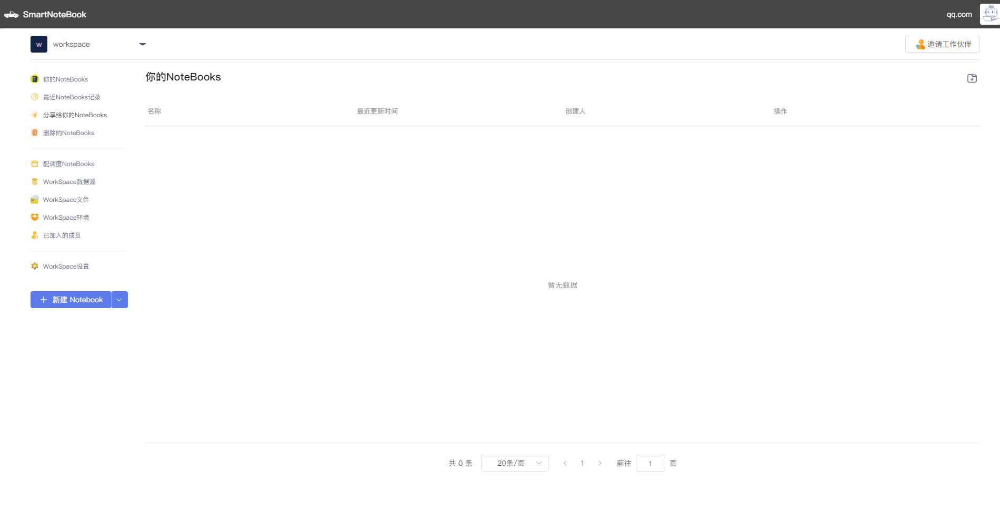

# WorkSpace
---
成功登录后，系统会自动为你创建一个默认的WorkSpace空间。

  

然后我们需要修改默认的WorkSpace名称，点击`WorkSpace设置`-->`编辑`。

  

通过修改WorkSpace的名称和描述，并上传喜欢的头像，点击`保存`，我们的第一个WorkSpace就创建和修改完成了。

  

如果我们想再创建另外一个新的WorkSpace，可以点击左上角WorkSpace处的下拉箭头，点击`新建`

  

然后输入新的WorkSpace的相关信息和配置，点击`提交`，一个新的WorkSpace就创建好了。

 

左上角可根据需求切换WorkSpace

  
