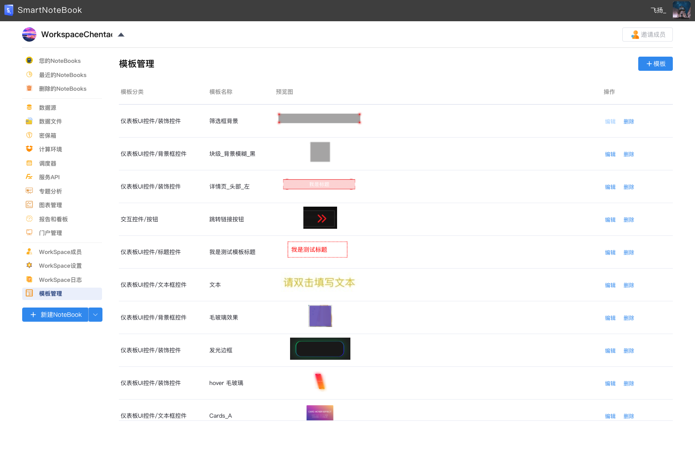
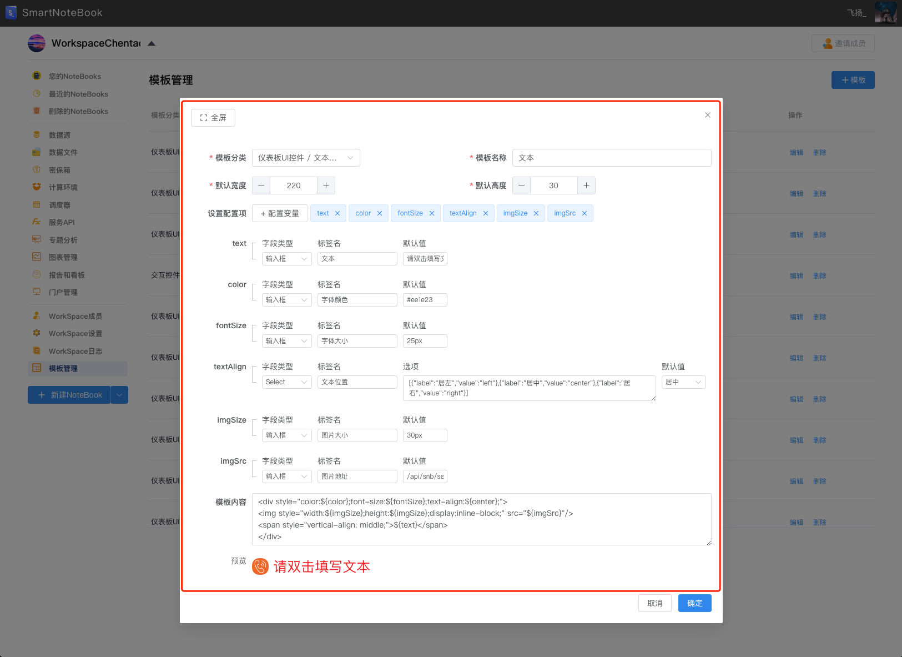
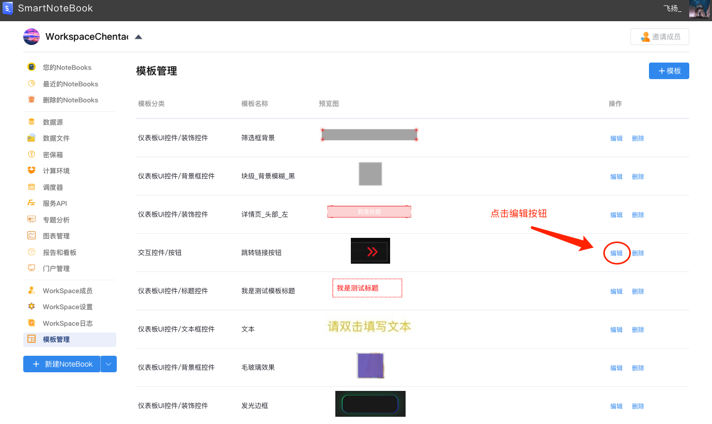
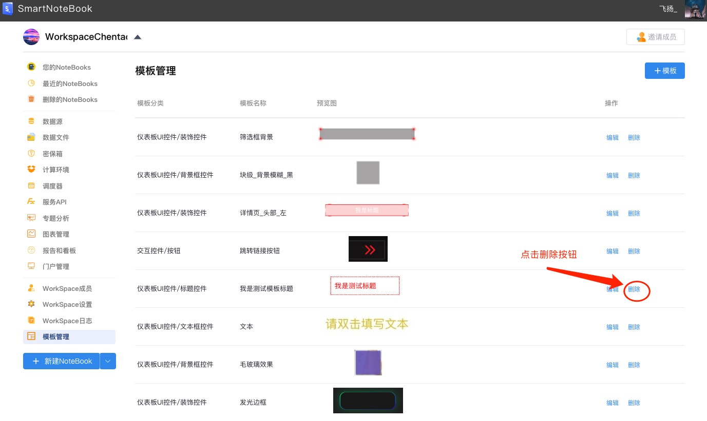
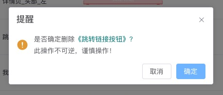

# 模版管理
---

模版管理为了高效构建仪表盘，我们提供快捷的建立，编辑，和管理模版的功能！通过系统化的模版管理，可以大大提高工作效率，确保输出的一致性和专业性，满足组织的各项需求。以下是模版管理的页面：

  

## 新增模版


- 新增模版：点击屏幕右上角`+模版`按钮，如下图绿色按钮


- 弹出下图弹框

 
 
**字段设置**

| 字段设置 | 解释 | 是否必填项
| :-----| :---- | :----
| 模版分类 | 模版分类 **[示例1](#jump_1)** | 是
| 模版名称 | 模版名称 | 是
| 默认宽度 | 模版默认宽度 | 是
| 默认高度 | 模版默认高度 | 是
| 设置配置项 | 设置模版的各个自定义属性 **[示例2](#jump_2)** | 否
| 模版内容 | HTML模版和变量 **[示例3](#jump_3)** | 是
| 上传示例图表 | 上传模版图片以供查看 | 是
| 预览示例 | 模版默认样式 | 否

--------------------------------------------------------
**示例**
- 示例1 模版类型
<a id="jump_1"></a>

| 模版类型 | 模版子类 |
| :-----| :---- |
| 仪表板UI控件 | 标题控件、背景框控件、文本框控件、装饰控件 |
| 交互控件 | 输入框、下拉框、标签框、单选框、单选框、时间日期、按钮 |
| 仪表板主题 | 仪表板模版 |
| 模版页 | 模版页-登录页、模版页-Protal首页 |


--------------------------------------------------------

- 示例2 模版设置配置项
<a id="jump_2"></a>


--------------------------------------------------------

- 示例3 模版内容
<a id="jump_3"></a>

```
  // 仪表板UI控件
  <div style="position:relative;height:100%;height:100%">
    
      <span style="display:${isShowText};font-size:${textFontSize};color:${textColor};
        position:absolute;top:50%;right:50%;transform:translate(50%, -50%)">
      ${title}
      </span>
    </img>
  </div>

  // 交互控件
  {"fontSize":12,"isbold":0,"color":"#EE1E23","width":50,"height":30,
    "border":0,"borderColor":"#1B3A74","borderWidth":0,"borderRadius":2,
    "background":0,"backgroundColor":"#1B3A74","iconName":"arrow-right",
    "iconShown":2,"iconSize":24}


  // 模版页面
  <!DOCTYPE html>
  <html lang="en">
    <head>
      <link rel="icon" href="xx" />
      <meta charset="UTF-8" />
      <meta http-equiv="X-UA-Compatible" content="IE=edge" />
      <meta name="viewport" content="width=device-width, initial-scale=1.0" />
      <title>模板页</title>
      <style>
        .portal-containner {
              height: 100%;
              align-items: center;
        }
    </style>
    </head>
    <body>
      <div class="portal-containner">
          <div class="yee-portal-nav">
          </div>
      </div>
      <script>
      </script>
    </body>
  </html>
```
------------------------------------------------
## 编辑模版
> 
> 如果模版需要修改，那么点击对应列表的`编辑`按钮


## 删除模版
> 
> 删除模版，那么点击对应列表的`删除`按钮。
> 此操作不可逆，请谨慎操作。


第二次确认删除弹框，如果删除则点击确定，反之则点击取消。 确定删除数据不能恢复！请谨慎。。。
