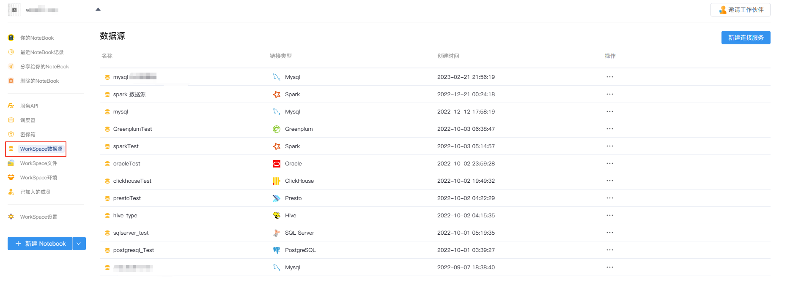
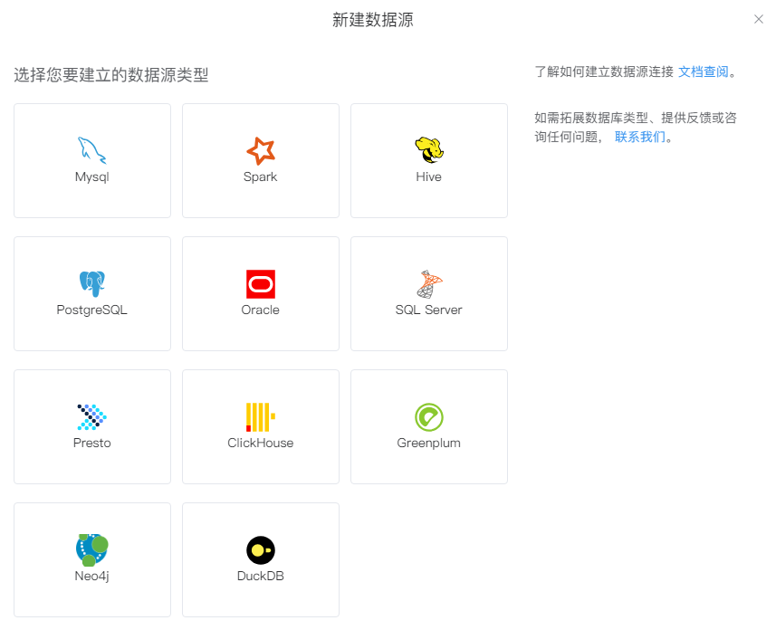
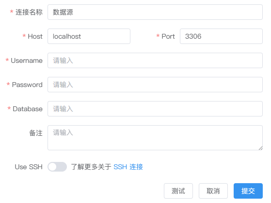
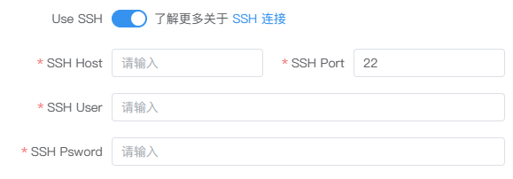
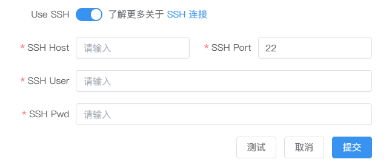

# 数据源
---
简单、高效、无代码的与数据源建立安全链接。

<!--    -->
<!--  -->

## 数据源类型

SmartNoteBook 目前已经过测试支持的数据源类型包括：

<!--    -->

  

* `MySQL`：关系型数据库管理系统，由瑞典MySQL AB 公司开发，属于 Oracle 旗下产品。MySQL 是最流行的关系型数据库管理系统之一。
* `Spark`：通用的大数据分析引擎,具有高性能、易用和普遍性等特点。
* `Hive`：基于Hadoop的一个数据仓库工具，用来进行数据提取、转化、加载，这是一种可以存储、查询和分析存储在Hadoop中的大规模数据的机制。
* `PostgreSQL`：一种特性非常齐全的自由软件的对象-关系型数据库管理系统（ORDBMS）
* `Oracle`：甲骨文公司的一款关系数据库管理系统。它是在数据库领域一直处于领先地位的产品。
* `SQL Server`：SQL Server是由Microsoft开发和推广的关系数据库管理系统（RDBMS）。
* `Presto`：Facebook开发的数据查询引擎，可对250PB以上的数据进行快速地交互式分析。
* `ClickHouse`：俄罗斯的 Yandex 于 2016 年开源的用于在线分析处理查询（OLAP :Online Analytical Processing）MPP架构的列式存储数据库
* `Greenplum`：业界最快最高性价比的关系型分布式数据库，它在开源的PG(PostgreSql)的基础上采用MPP架构（Massive Parallel Processing,海量并行处理），具有强大的大规模数据分析任务处理能力。
* `Neo4j`：Neo4j是一个开源的，高性能的NoSQL图形数据库。
* `DuckDB`：DuckDB是一个针对数据分析和查询任务进行优化的高性能列式存储数据库管理系统，它提供了快速的查询性能、低内存占用以及方便的SQL查询功能。
* `MindsDB`：MindsDB是一个开源的机器学习库，用于使数据科学家和开发人员能够轻松地将机器学习模型集成到其现有项目和工具中。通过MindsDB，用户无需深入了解机器学习的复杂细节就可以训练和部署模型。MindsDB结合NoteBook的使用教程可以参考<a href="../Tutorial/Mindsdb_demo.md" title="MindsDB(SQL+ML)实战案例">MindsDB(SQL+ML)实战案例</a>
* `MongoDB`：一种面向文档的NoSQL数据库，由MongoDB Inc. 开发和维护。MongoDB 以其高性能、高可用性和易扩展性著称，支持多种数据模型，包括键值、文档和图等。它特别适合需要快速开发和处理非结构化数据的应用程序。
* `TiDB`：PingCAP 开发的一款开源分布式数据库，兼具传统关系型数据库的特性和分布式数据库的优点。TiDB 支持标准的 MySQL 协议，并具有高可用性、水平扩展性和实时 HTAP（Hybrid Transactional/Analytical Processing）能力，非常适合大规模在线事务处理（OLTP）和在线分析处理（OLAP）场景。

> [!NOTE]
> 即将支持更多数据源类型 —— 目前，SNB正在积极进行国产数据库接入测试的工作。如果您有需要优先支持的数据源，可通过邮件联系我们 <feedback@smartnotebook.tech>。

## 新建数据源连接

选择左侧导航栏的`数据源`，然后点击页面右上角`新建连接服务`。

我们选择需要连接的数据源图标并填写相应的连接及密码验证信息：

 

当信息填写完毕后先点击`测试`，如连接信息有误，系统会返回相应的错误提示。如返回`连接测试成功`，表明数据库连接成功，此时点击`提交`，一个新的数据源连接就建好了。

  

<!-- ## 编辑连接

在数据源列表中选择所需修改的数据源，修改配置信息后单击`测试`，返回成功信息后点击`提交`。 -->

## 不同数据源的信息配置

<!-- 用户可以在选择不同类型的数据源后，通过正确配置对应类型的数据库信息、数据库凭证后，完成创建数据库连接。

不同的数据源对应填写的配置项也会存在差异。 -->

- 对于`MySQL`，`PostgreSQL`，`SQL Server`，`ClickHouse`、`Greenplum`、`Neo4j`、`MindsDB`、`MongoDB`
和`TiDB`，您需要配置：

  - 连接名称
  - 数据库主机网址地址（host）
  - 数据库端口（Port）
  - 数据库名称（Database）
  - 用户名和密码

- 对于`Spark`，`Hive`和`Presto`，您需要配置：

  - 连接名称
  - 数据库主机网址地址（host）
  - 数据库端口（Port）
  - 数据库名称（Database）
  - 鉴权方式：`用户名和密码`或`无需鉴权`
  - 用户名和密码

- 对于`Oracle`，您需要配置：

  - 连接名称
  - 数据库主机网址地址（host）
  - 数据库端口（Port）
  - 实例名（SID）
  - 驱动类型（driver）：`Thin`/`OCI`/`OCIB`
  - 用户名和密码

- 对于`DuckDB`，您需要配置：

  - 连接名称
  - 文件路径（无需鉴权）：db文件上传至SNB，并复制其在SNB的路径

<!-- 
备注：当数据库连接配置完成后，我们会为你生成一个数据标识，相当于该数据库的云端“唯一id”， 如 0242ac110004-11edacf8-81c84f68-a244。该数据标识你可在Notebook的侧边栏--数据资源复制获取，并可在代码中引用。参见侧边栏->数据资源 -->

## 使用数据连接查询数据库

当建立好数据连接后，可以在NoteBook中使用SQL单元格进行查询。详见<a href="../NoteBook/SQL.md" title="SQL单元格">SQL单元格</a>

## 配置SSH安全连接

<!-- 当需要增加跳板机

  

通过SSH，您可以配置数据连接以实现更安全的访问。SSH提供了加密和认证机制，以保护您的连接和数据安全。下面是一些SSH配置参数的说明：

- 主机地址（SSH Host）：这是您要连接的远程主机（堡垒机）的主机名或IP地址。它可以是您想要远程访问的服务器或网络设备。

- 端口号（SSH Port）：SSH协议通常使用22端口作为默认端口。当您连接到远程主机时，您可以指定要使用的端口号。在某些情况下，您可能需要更改默认端口以增加安全性。

- 用户名（SSH User）：您需要指定您在远程主机上的用户名。这是您在远程主机上拥有访问权限的帐户。

- 密码（SSH Password）：为了进行身份验证，您需要提供与所指定用户名相对应的密码。这是为了确保只有授权用户可以访问远程主机。 -->

当你无法直接访问内网的数据资源，或者需要从外部网络安全地访问内网的数据资源时，可以通过建立 SSH 隧道的方式连接跳板机（堡垒机），进而安全的访问内网资源。

<!--    -->
  

以下是SSH配置参数的说明：

- 主机地址（SSH Host）：这是您要连接的远程主机（堡垒机）的主机名或IP地址。它可以是您想要远程访问的服务器或网络设备。

- 端口号（SSH Port）：SSH协议通常使用22端口作为默认端口。当您连接到远程主机时，您可以指定要使用的端口号。在某些情况下，您可能需要更改默认端口以增加安全性。

- 用户名（SSH User）：您需要指定您在远程主机上的用户名。这是您在远程主机上拥有访问权限的帐户。

- 密码（SSH Password）：为了进行身份验证，您需要提供与所指定用户名相对应的密码。这是为了确保只有授权用户可以访问远程主机。

配置SSH信息后，如果你想访问内网的数据库，则需要配置内网数据库的 IP 地址。在配置连接参数时，你需要指定内网数据库的 IP 地址、端口号以及其他必要的凭据（如用户名和密码）。

> [!Tip]
> 在配置SSH连接参数之前，务必确保跳板机（堡垒机）能够无障碍地访问数据服务器。您可能需要与系统管理员或网络团队紧密合作，他们需要正确设置网络配置、防火墙规则和访问控制等，以确保正确配置并确保安全地访问内网数据库。

