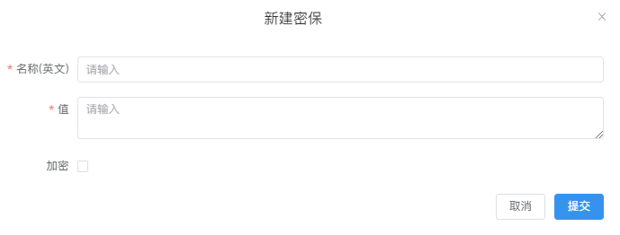
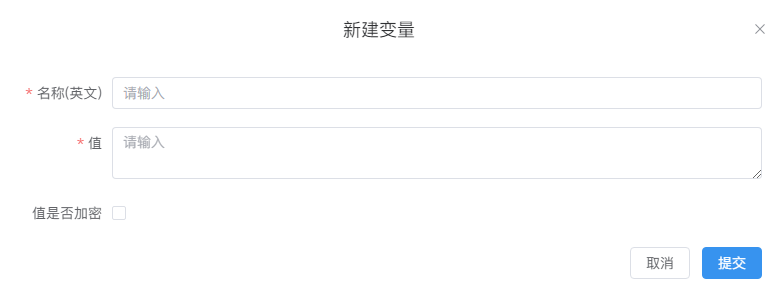
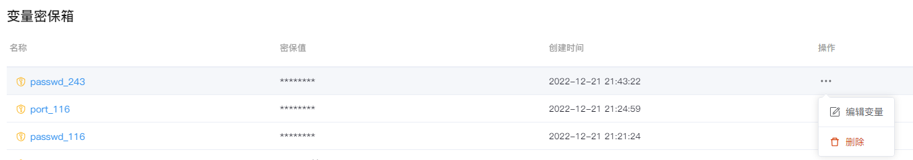
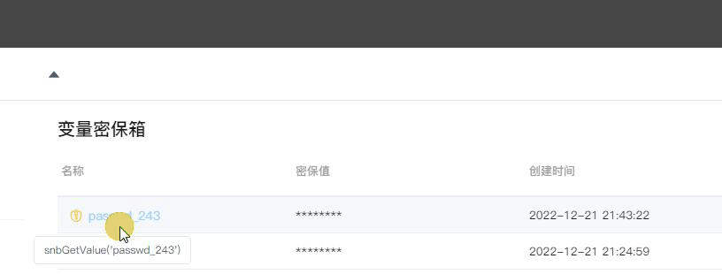
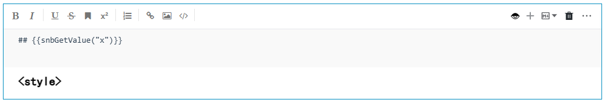

# 变量密保箱
---
变量密保箱的用处：

1. 将敏感值（如API令牌或重要密码）加密

2. 作为全局变量使用

建立密保/变量后，用户可以在NoteBook中通过名称访问密保/变量的值，而不是通过明文或者硬编码的方式进行调用。

  

## 新建密保/变量

点击右上角的`新建变量`,输入`名称（英文）`和`值`。

如需加密请勾选`加密`，配置完成后点击提交。

<!--    -->
  

 

## 密保/变量列表

在列表处对已有的密保/变量进行编辑或删除：

<!--    -->
 

## 密保/变量的使用

### 复制密保/变量

单击名称复制密保/变量

<!--    -->

  

### 使用密保/变量

- 在Python单元格中使用密保：

  

- 在MarkDown中使用变量：

  

- 作为CSS样式使用:

详见<a href="../NoteBook/Markdown.md/#mdsecret" title="设置MarkDown的标签样式（高级用法）">设置MarkDown的标签样式（高级用法）</a> 

