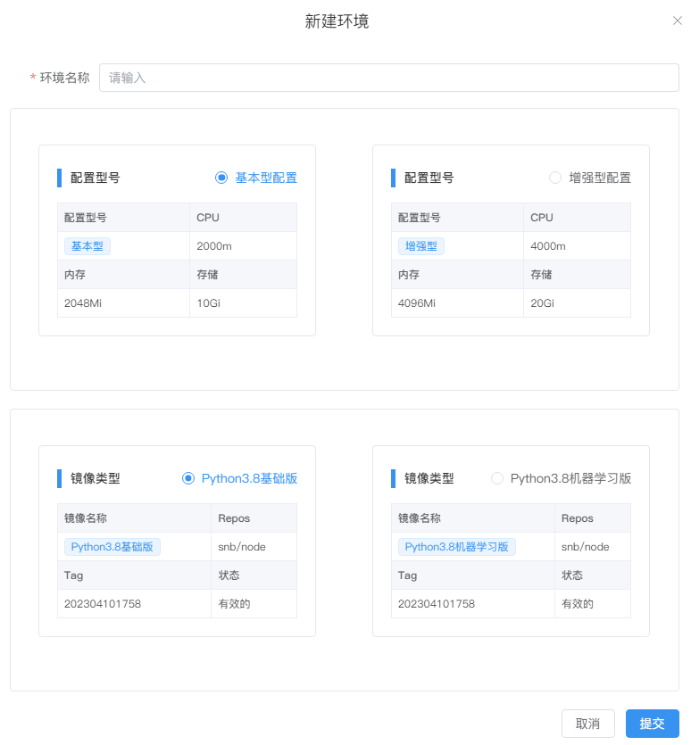
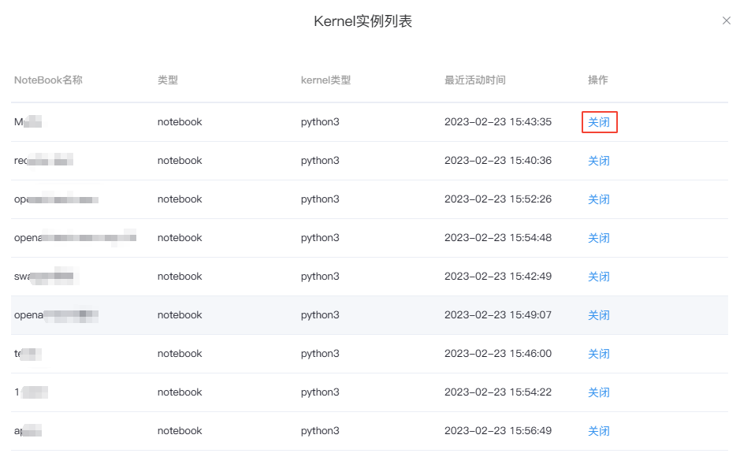
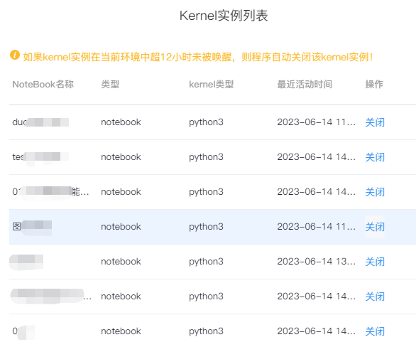

# 环境
---
<!-- 配置环境和镜像类型。 -->

## 概述

环境是NoteBook运行所需的计算资源和软件（包）配置的组合，包含了硬件配置以及我们所需的镜像类型。

<!-- 确保您的产品在特定的计算资源和软件设置下能够正常运行。通过定义环境，您可以规定产品所需的计算能力和软件环境，以便满足产品的要求。 -->

硬件配置决定了可用的计算资源，如CPU的处理能力、内存的容量和存储的大小，这些配置会对产品的性能和扩展能力产生影响。

而镜像类型则决定了NoteBook所使用的软件环境。镜像包含了预先安装的操作系统、软件库、依赖项和配置，以满足特定的开发或运行需求。

例如，Python基础版的镜像可能包含了Python解释器和一些常用的Python库，适用于一般的Python应用开发；而Python机器学习版的镜像额外预装了机器学习框架（如TensorFlow、PyTorch等）以及其他常用的数据科学库，以满足机器学习项目的需求。

<!-- 就像我们需要在电脑上安装操作系统和软件才能运行程序一样，NoteBook也需要在特定的环境支持下才能正常工作。 -->

> [!NOTE]
> SNB 使用了容器化技术（Docker）打包和部署每个微服务及其依赖项，可以根据需求自动调整Node节点的数量和规模，以适应模型运行时的负载变化。当客户开始进行模型训练时，SNB 可以监测到训练任务的资源需求，并根据需求动态地调整系统的资源配置。这样，客户无需手动管理和调整资源配置，只需专注于模型训练本身。

  

## 新建/编辑环境（专业版或企业版）

选择左侧导航栏的`环境`，单击`新建环境配置`，选择型号配置和镜像类型并填写环境名称提交。

  

如需修改环境配置，可单击`操作`列的`...`，然后点击`编辑环境`，修改完成后提交。

> [!NOTE|style:flat]
> 专业版或企业版的管理员拥有此功能权限，基础版无此功能。

## 查看和关闭Kernel实例

单击环境列表前的  可查看该环境下所有打开的Kernel实例。

<!--    -->
<!--    -->

  

如需关闭实例，可以选择相对应的NoteBook，点击右侧的`关闭`并确定。

<!--    -->
  

> [!NOTE|style:flat]
> 如果 kernel 实例在当前环境中超过 12 小时没有被使用，系统将会自动释放该 kernel 实例以节省资源。

## 环境状态

环境拥有两种状态：

- `正常`：环境按照预期的方式工作，没有出现任何错误或故障
- `异常`：环境发生了一些不寻常或不符合预期的情况，可能无法正常工作，功能可能受限或完全无法使用。

<!--    -->

## 查看环境的运行和使用状态

详见侧边栏的<a href="./Sidebar.md/#sv" title="切换环境">环境-查看配置/负载情况</a> 

## 切换环境

详见侧边栏的<a href="./Sidebar.md/#sv" title="切换环境">环境-切换环境</a> 

## 删除环境

在`WorkSpace环境`标签页，找到需要删除的环境，单击`操作`列的`...`，然后点击`删除`。

<!--    -->
  

> [!Warning]
> 注：如环境已被使用，需将此环境下所有的NoteBook删除后才可删掉环境。
