# 服务API
---
<!-- 需精简： -->

数据/模型服务是快速将SmartNoteBook建模后的数据或模型生成API服务，通过API为其他业务系统或第三方提供服务(通过数据API的方式，提供给上层数据应用、数据门户，可视化大屏等)，是释放数据价值的最为关键的步骤。

由于数据多样性和模型的复杂性，传统的定制开发API方式需要架构、开发、部署、运维等多步骤、多角色参与，整个过程复杂、成本高、运维/维护困难。近几年诞生较多的DataAPI服务平台，通过配置的方式生成API Service，提升效率、降低开发成本，但实际使用过程中也存在较多的问题，比如灵活性问题，很难应对复杂业务场景、很难应对算法模型的数据变换、处理的需要。

为此SmartNoteBook开发了FaaS服务模块，Snb FaaS是函数即服务(Function-as-a-Service)的框架，通过notebook 调试函数，调试完成直接发布到Snb FaaS Node 节点上直接生成Servcie API，根据负载情况弹性扩展Node 节点。通过FaaS 方式生成Service API 既保持灵活性，又降低复杂性，有极高的弹性，维持灵活性、复杂性和弹性的统一。

## 注册API

**注册样例：**

```
import requests
import json

__MODULE_NAME__ = "Translate"

def translate(word:str="word") -> "HTTP":
    """
    {
    "input":{"word":{"type":"string","default":"word"}},
    "output":{"type":{"type":"string", "default":"EN2ZH_CN"}, "errorCode":{"type":"integer", "default":0}, "elapsedTime":{"type":"integer", "default":1}, "translateResult":{"type":"array","items":"","default":{"src": "word", "tgt": "词"}}}
    }
    """

    url = f"https://fanyi.youdao.com/translate?&doctype=json&type=AUTO&i={word}"
    header = {
        "User-Agent":"Mozilla/5.0 (Windows NT 10.0; Win64; x64) AppleWebKit/537.36 (KHTML, like Gecko) Chrome/111.0.0.0 Safari/537.36",
    }
    response = requests.get(url=url, headers=header)
    output = json.loads(response.text)
    return output
```

格式约定：

* `__MODULE_NAME__`：Faas API名称。变量名固定，值由用户自定义（不允许重复）
* `def translate(word:str="word") -> "HTTP": `: 函数名和参数用户自定义
* 函数返回值为json数据类型
* 除上述约定外，函数内部代码用户自定义编写

函数在单元格中定义完成后，点击`...`-->`注册服务API`进行注册：

<!-- 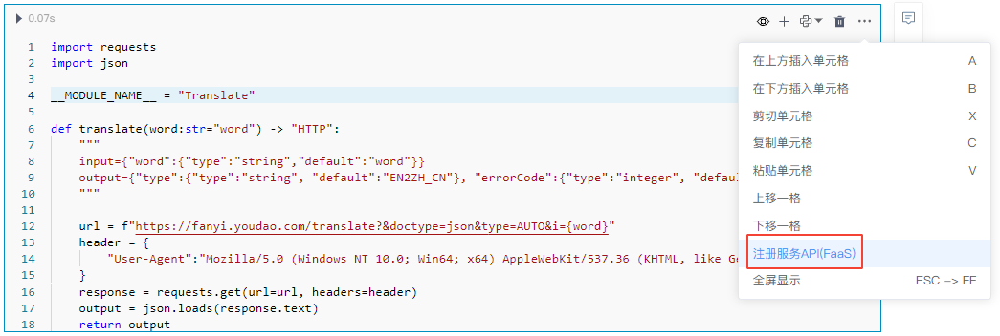   -->
<!-- 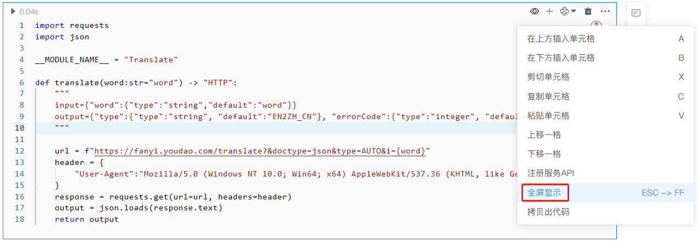   -->

<!-- 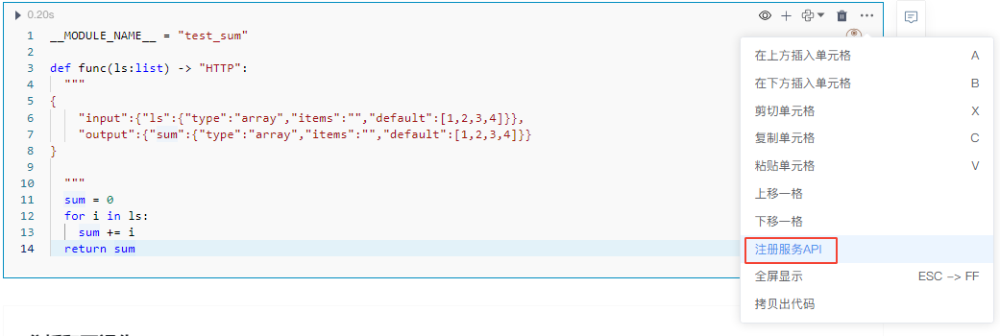   -->

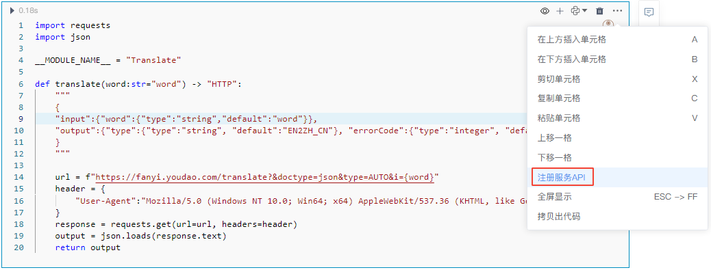  


注册成功：

<!-- 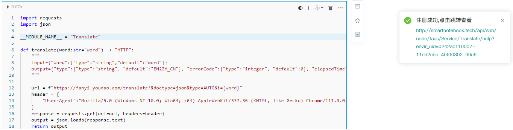   -->
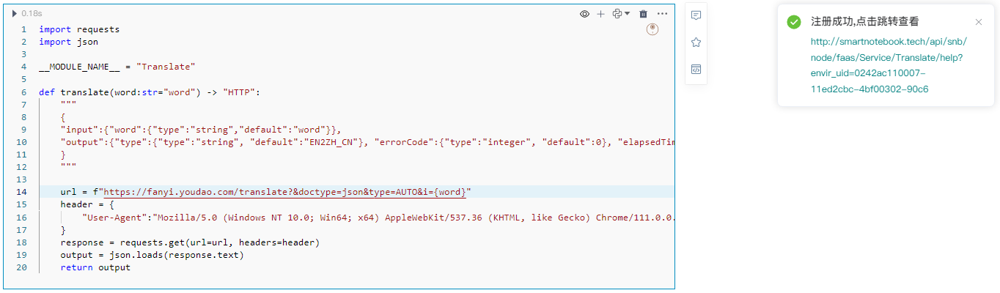  


> [!NOTE]
> 同一环境下服务API注册名称（__MODULE_NAME__）不可重复，不同环境下服务API注册名称（__MODULE_NAME__）可以相同。

## 管理API

点击WorkSpace下的`服务API`，可以看到已注册的API列表。

  

在此我们可以进行的操作有：

- `打开NoteBook`：打开服务API对应的NoteBook文档
- `帮助文档`：打开该API的帮助文档（支持接口测试）
- `删除服务`：删除该API
- ：复制API链接地址

## 切换查看不同环境下的API

点击列表右上角的环境标签可切换查看在不同环境下注册的服务API：
<!-- 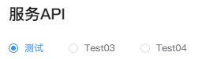   -->
  

## 使用API

我们点击API的帮助文档

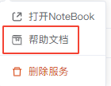  

跳转到API的帮助页面，接下来可以查看接口的地址、参数信息和调用方法等，并尝试修改参数来调试调用接口

请求参数：

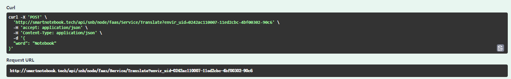  

出参格式：

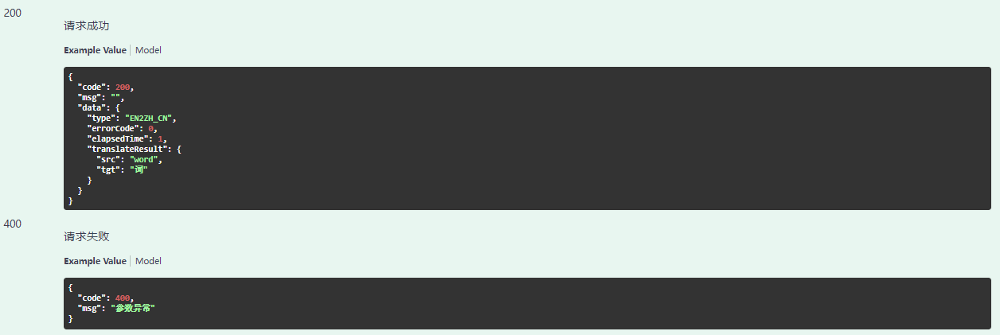  

调用测试：

1.点击按钮

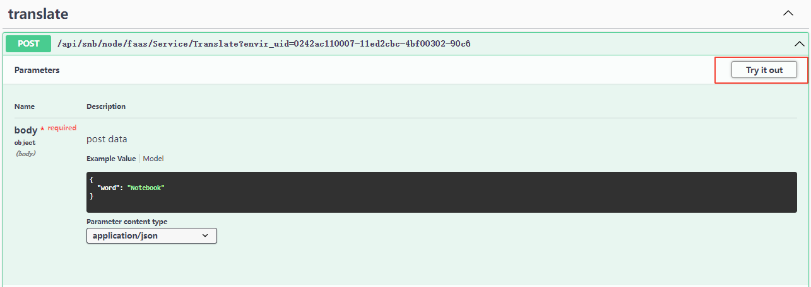  

2.修改参数内容，点击执行

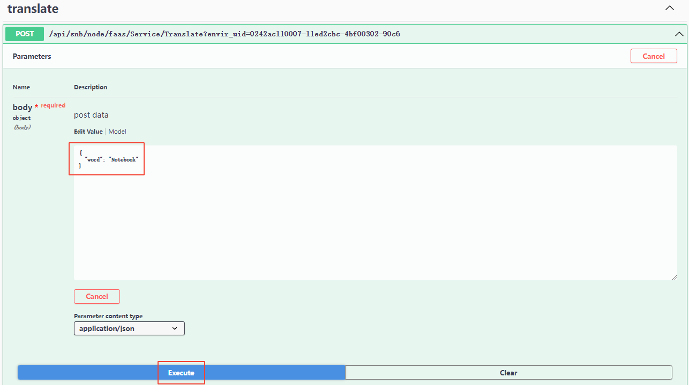  

3.接口实际返回结果

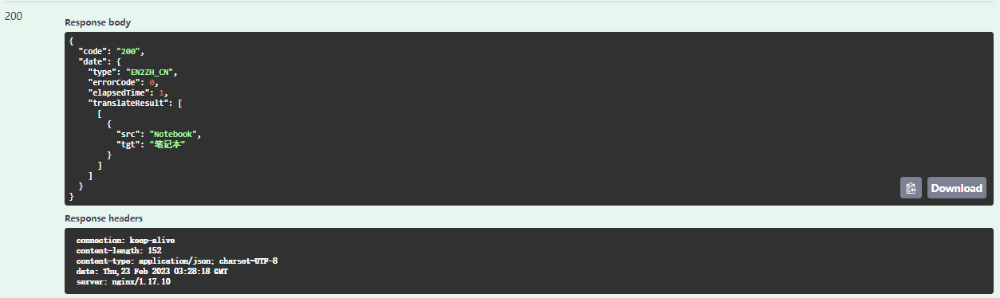  

接口测试没问题后，我们便可以来实际调用使用了。