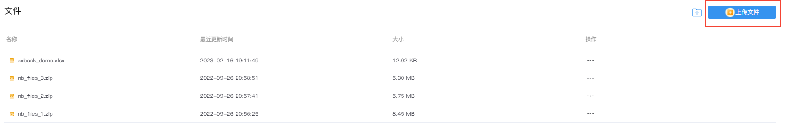
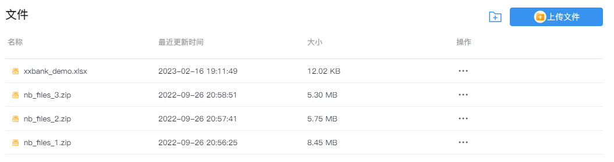
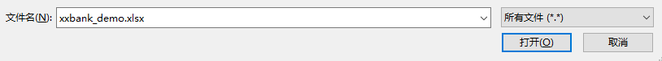
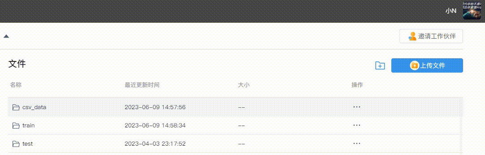

# WorkSpace文件
---

将本地（数据）文件上传至 SNB。

## 上传文件

选择左侧导航栏的`WorkSpace文件`，点击右上角`上传文件`按钮，弹出选择文件窗口。

<!--  -->
<!--    -->
  

选择要上传的文件（注意：单个文件大小不超过10M)，单击`打开`，即刻开始上传文件。

  
 

## 下载文件

在文件列表中找到需要下载的文件，单击`操作`列的`...`，然后点击`下载`，即刻开始文件下载。

  

## 新建文件夹

点击文件列表右上角的文件夹图标 创建新的文件夹。

## 重命名文件夹

方式一：选择需要重命名的文件夹，单击`操作`列的`...`，点击`重命名`，修改好文件夹名称后点击`√`提交修改。

<!--    -->
  

方式二：鼠标移动到需要重命名的文件夹名称处， 此时出现编辑按钮，点击编辑按钮对文件夹重命名后点击`√`提交.

<!--    -->
  

<!-- 
   -->

## 删除文件（夹）

选择需要删除的文件（夹），单击`操作`列的`...`，然后点击`删除`。

> [!warning|style:flat]
> 删除文件夹时需确保文件夹内容为空，否则无法删除。

## 同步文件

**文件一键同步到Node**

在`Workspace文件`页面上传，文件将会上传至公共区域，在`侧边栏-数据资源-WorkSpace文件`点击`文件一键同步到Node`，公共区域的资源文件会同步至Node节点使用。（同步至多个环境）

详见<a href="../NoteBook/Sidebar.md" title="侧边栏"> 侧边栏-数据资源-WorkSpace文件</a>

**直接上传文件至Node**

详见<a href="../NoteBook/Sidebar.md" title="侧边栏"> 侧边栏-数据资源-环境文件</a>

## 读取文件

**预览csv文件**

详见<a href="../NoteBook/Sidebar.md" title="侧边栏"> 侧边栏-数据资源-环境文件</a>

**单元格读取csv文件**

详见<a href="../NoteBook/SQL.md" title="SQL"> SQL代码块-dfSQL</a>

<!-- **备注**：

在SmartNoteBook中，非结构的文件资源存储机制分为两级：

* 在Workspace文件处上传，文件会上传到公共区域

* 通过NoteBook的数据资源同步，可以根据需要将MinIO公共区域的资源文件同步至Node节点使用

 -->

