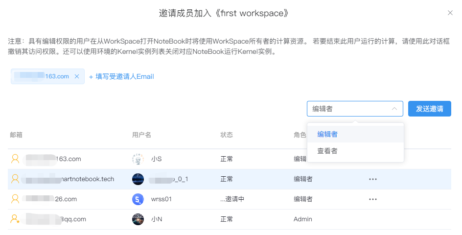
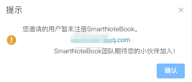
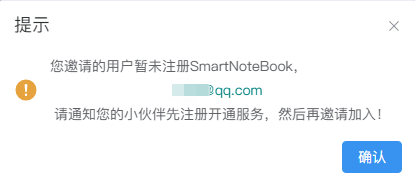
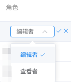
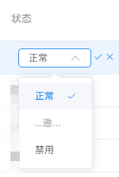
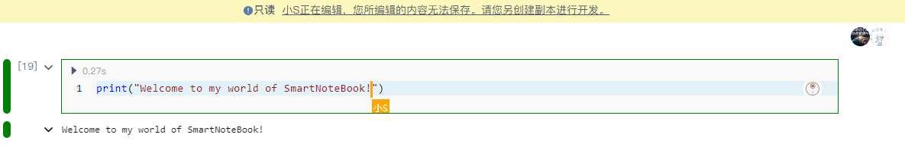

# WorkSpace成员
---
团队成员在相同的WorkSpace下开始协同工作。

  

## 邀请团队成员

单击页面右上角的按钮转到邀请页面，填写受邀请用户的Email并设置其角色（编辑者/查看者），点击`发送邀请`：

  

发送邀请后，被邀请的团队成员状态将显示为"邀请中..."：

  

被邀请成员点击邮件确认后状态切换为"正常"，此时被邀请人加入该WorkSpace并获得相应的权限参与到协同工作。

  

> [!NOTE|style:flat]
> 受邀请用户需要先成功注册SNB的账号，否则无法接收邀请：

<!--    -->
  

## 修改角色权限

- 编辑者：拥有除`WorkSpace设置`以及环境资源配置外，其他一切该WorkSpace拥有者的权限（查看、新建、编辑、删除）
- 查看者：看到的功能与编辑者一致，但只拥有查看权限

管理员可以对状态正常的成员修改角色权限：

<!--    -->
  

## 移除成员

管理员可以在成员列表中点击`操作`-`移除`将已加入的成员移除出团队。

被移除的成员将无法看到该WorkSpace，如需重新访问，需被重新邀请。

<!--    -->
  

## 禁用

管理员可以对成员的状态进行修改（禁用）。

被禁用的成员将无法看到该WorkSpace直到状态被修改为正常状态。

<!--    -->
  

## 实时协作

SNB支持实时协作模式，允许团队成员实时跟踪代码的编写进度。

在这个模式下，首位进入NoteBook的团队成员将获得编辑权，其他成员则可以即时查看其编码过程。这一设计特点不仅便于团队间的沟通协作，更使**教学过程变得直观易懂：学生可以清晰地看到老师的编程逻辑，从而更好地吸收知识。**

SNB的实时协作模式通过促进信息同步，极大地提升了用户的交互体验。

  

> [!TIP]
> 所有进入NoteBook的团队成员，头像将出现在NoteBook的右上角。
