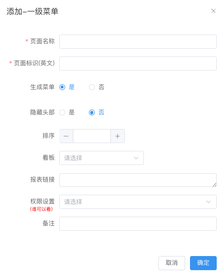
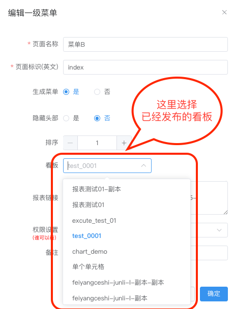
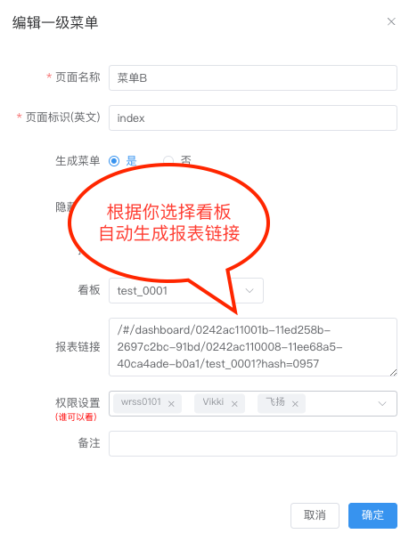
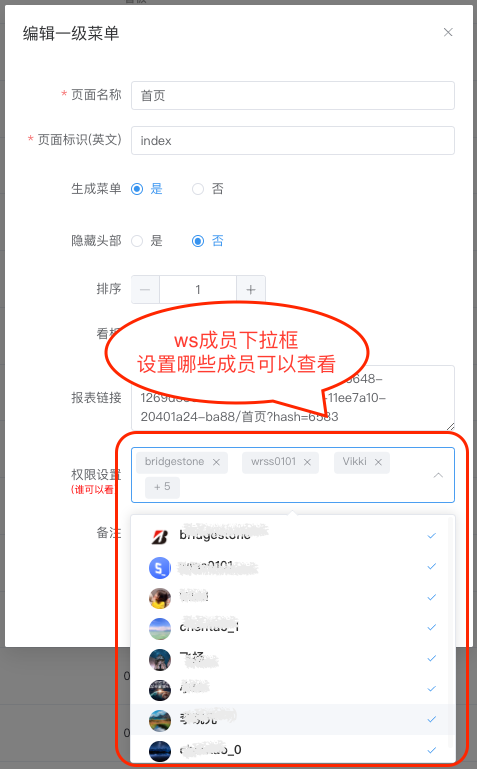

# 门户管理
---

门户管理指的是管理一个系统的门户应用程序。门户是用户进入报表系统主要入口点，
提供了访问各种信息、服务和功能的统一界面。以下是门户管理的页面：

  

## 新增菜单
> [!Warning]
> 
注：新增菜单有两个层级（一级菜单在菜单栏中显示，二级菜单为子菜单）。

> 

- 新增一级菜单：点击屏幕右上角`+菜单`按钮，如下图绿色按钮

- 新增子菜单：在列表中点击一级菜单操作中的`添加子菜单`按钮，如下图

  

- 弹出下图弹框

 
 
**字段设置**

| 字段设置 | 解释 | 是否必填项
| :-----| :---- | :----
| 页面名称 | 门户菜单显示的名称 **[示例1](#jump_1)** | 是
| 页面标识（英文） | 英文标识 | 是
| 生成菜单 | 是否在门户菜单中显示 | 是
| 隐藏头部 | 门户中打开页面是否显示菜单头部 | 是
| 排序 | 门户菜单中显示的顺序 **[示例2](#jump_2)**| 否
| 看板 | 选择已经发布的报表 **[示例3](#jump_3)**| 是
| 报表链接 | 选择看板之后自动生成报表链接 **[示例3](#jump_3)**| 是
| 权限设置 | 设置workspace成员可查看权限 **[示例4](#jump_4)**| 是
| 备注 | 备注 | 否

**示例**
- 示例1 名称展示

- 示例2 门户菜单中显示的顺序

- 示例3 选择已经发布的报表

- 示例4 权限

## 编辑菜单
> 
> 如果菜单需要修改，那么点击对应菜单列表的`编辑`按钮

## 删除菜单
> 
> 删除菜单，那么点击对应菜单列表的`删除`按钮， 删除菜单后，门户当中找不到此菜单页面，成员也不能通过链接访问。
> 此操作不可逆，请谨慎操作。

第二次确认删除弹框，如果删除则点击确定，反之则点击取消。 确定删除数据不能恢复！请谨慎。。。
